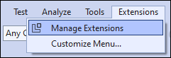
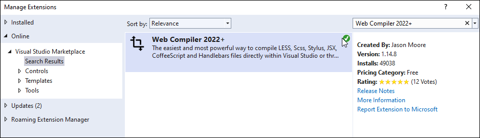
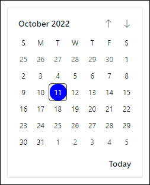
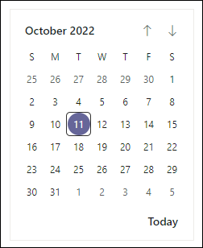
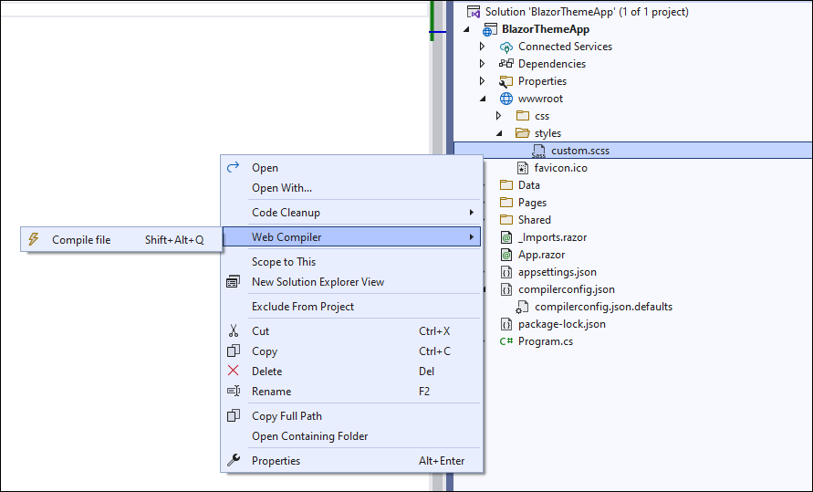

# Blazor Themes in Syncfusion Components 

The following list of themes are included in the Syncfusion Blazor components library.

|Theme	|Style Sheet Name| 
|--------|--------|
|Bootstrap 5	| bootstrap5.css | 
|Bootstrap 5 Dark	| bootstrap5-dark.css | 
|Bootstrap 4	| bootstrap4.css |
|Bootstrap 3	| bootstrap.css | 
|Bootstrap 3 Dark	| bootstrap-dark.css | 
|Google’s Material | material.css |
|Google’s Material-Dark | material-dark.css |
|Tailwind CSS | tailwind.css |
|Tailwind CSS Dark | tailwind-dark.css |
|Fluent | fluent.css |
|Fluent Dark | fluent-dark.css |
|Microsoft Office Fabric | fabric.css |
|Microsoft Office Fabric Dark | fabric-dark.css |
|High Contrast | highcontrast.css |

The Syncfusion Blazor Bootstrap Theme is designed based on Bootstrap v3, whereas the Bootsrap4 theme is designed based on Bootstrap v4.

## Reference themes in Blazor application

Syncfusion Blazor themes can be used in your Blazor application by referencing the style sheet. 

* For **Blazor WebAssembly application**, refer style sheet inside the `<head>` of **wwwroot/index.html** file.
* For **Blazor Server application**, refer style sheet inside the `<head>` of 
    * **~/Pages/_Host.cshtml** file for .NET 3, .NET 5 and .NET 7.
    * **~/Pages/_Layout.cshtml** for .NET 6.

Using the below approaches the themes can be referenced in the Blazor application,

1. [Static Web assets](#static-web-assets) - Used to reference complete css via static web assests. 
2. [CDN](#cdn-reference) - Used to reference complete css via static web assests. 
3. [CRG](https://blazor.syncfusion.com/documentation/common/custom-resource-generator) - Used to generate resources only for the selected (used) components. 
4. [Theme Studio](https://blazor.syncfusion.com/documentation/appearance/theme-studio) - Used to customize and generate themes only for the selected (used) components. 
5. [NPM packages](#npm-packages) - Used to customize the existing themes and bundle stylesheet's in an application.

Instead of using [Static Web assets](#static-web-assets) or a [CDN reference](#cdn-reference), you can reference the style sheet into your projects to customize the theme or bundle it with the other style sheets using [NPM packages](#npm-packages). 

## Static Web Assets

### Enable static web assets usage

To use static web assets, ensure [UseStaticFiles](https://docs.microsoft.com/en-us/dotnet/api/microsoft.aspnetcore.builder.staticfileextensions.usestaticfiles) method is called as follows,

* For **.NET 6 and .NET 7** app, open the **~/Program.cs** file and call `UseStaticFiles` method.
* For **.NET 5 and .NET 3.X** app, open the **~/Startup.cs** file and call `UseStaticFiles` method.

N> For **Blazor WASM App**, call `UseStaticFiles` method in **Server project** in the above mentioned file. 

### Refer theme style sheet from static web assets

Syncfusion Blazor themes are available as static web assets in the [Syncfusion.Blazor.Themes](https://www.nuget.org/packages/Syncfusion.Blazor.Themes/) and [Syncfusion.Blazor](https://www.nuget.org/packages/Syncfusion.Blazor/) NuGet Packages.

* For **Blazor WebAssembly application**, refer style sheet inside the `<head>` element of **wwwroot/index.html** file.
* For **Blazor Server application**, refer style sheet inside the `<head>` element of 
    * **~/Pages/_Host.cshtml** file for .NET 3, .NET 5 and .NET 7.
    * **~/Pages/_Layout.cshtml** for .NET 6.

When using individual NuGet packages in your application, add [Syncfusion.Blazor.Themes](https://www.nuget.org/packages/Syncfusion.Blazor.Themes/) NuGet Package and reference style sheet as below,

 ```html
<head>
    <link href="_content/Syncfusion.Blazor.Themes/bootstrap5.css" rel="stylesheet" />
</head>
```

When using [Syncfusion.Blazor](https://www.nuget.org/packages/Syncfusion.Blazor/) NuGet package,

 ```html
<head>
    <link href="_content/Syncfusion.Blazor/styles/bootstrap5.css" rel="stylesheet" />
</head>
```

## CDN reference

Instead of using a local resource on your server, you can use a cloud CDN to reference the theme style sheets. CDN Stands for "Content Delivery Network". A CDN is a group of servers distributed in different locations. While CDNs are often used to host websites, they are commonly used to provide other types of downloadable data as well. Examples include software programs, images, videos, and streaming media.

Syncfusion Blazor Themes are available in the CDN. Make sure that the version in the URLs matches the version of the Syncfusion Blazor Package you are using.

 ```html
<head>
    <link href="https://cdn.syncfusion.com/blazor/{{ site.blazorversion }}/styles/bootstrap5.css" rel="stylesheet"/>
</head>
```

| Theme Name | CDN Reference |
|--- | --- |
| Bootstrap 5 | https://cdn.syncfusion.com/blazor/{{ site.blazorversion }}/styles/bootstrap5.css |
| Bootstrap 5 Dark| https://cdn.syncfusion.com/blazor/{{ site.blazorversion }}/styles/bootstrap5-dark.css |
| Bootstrap 4 | https://cdn.syncfusion.com/blazor/{{ site.blazorversion }}/styles/bootstrap4.css |
| Bootstrap 3 | https://cdn.syncfusion.com/blazor/{{ site.blazorversion }}/styles/bootstrap.css |
| Bootstrap 3 Dark| https://cdn.syncfusion.com/blazor/{{ site.blazorversion }}/styles/bootstrap-dark.css |
| Google’s Material | https://cdn.syncfusion.com/blazor/{{ site.blazorversion }}/styles/material.css |
| Google’s Material Dark | https://cdn.syncfusion.com/blazor/{{ site.blazorversion }}/styles/material-dark.css |
| Tailwind CSS | https://cdn.syncfusion.com/blazor/{{ site.blazorversion }}/styles/tailwind.css |
| Tailwind CSS Dark | https://cdn.syncfusion.com/blazor/{{ site.blazorversion }}/styles/tailwind-dark.css |
| Fluent | https://cdn.syncfusion.com/blazor/{{ site.blazorversion }}/styles/fluent.css |
| Fluent Dark | https://cdn.syncfusion.com/blazor/{{ site.blazorversion }}/styles/fluent-dark.css |
| Microsoft Office Fabric  | https://cdn.syncfusion.com/blazor/{{ site.blazorversion }}/styles/fabric.css |
| Microsoft Office Fabric Dark | https://cdn.syncfusion.com/blazor/{{ site.blazorversion }}/styles/fabric-dark.css |
| High Contrast  | https://cdn.syncfusion.com/blazor/{{ site.blazorversion }}/styles/highcontrast.css |

## NPM package reference

The [Blazor Themes NPM package](https://www.npmjs.com/package/@syncfusion/blazor-themes) contains `SCSS` files for all themes supported by Syncfusion Blazor components. These SCSS files customize theme variables using a web compiler. The package includes component wise SCSS files and overall components SCSS files.

You can add the `SCSS theme` for Blazor applications through NPM package and compile it by using the [Web Compiler 2022+](https://marketplace.visualstudio.com/items?itemName=Failwyn.WebCompiler64) by following steps.

* Open Visual Studio 2022 and click the Extensions in the toolbar.

    

* Search the `Web Compiler 2022+` in search box and download the extension.

    

* Install the [Syncfusion Blazor Themes](https://www.npmjs.com/package/@syncfusion/blazor-themes) NPM package using the below command.

    ```
    npm install @syncfusion/blazor-themes
    ```

* Create a `SCSS` file in the Static Web Assets folder (e.g., ~/wwwroot/styles/custom.scss). Next, define the [theme variables](https://blazor.syncfusion.com/documentation/appearance/theme-studio#common-variables) to override and import the theme as shown in the following.

    In the following code, the primary theme variable color is changed. For all components:
    
    ```scss
    $primary: blue !default;

    /* @import 'blazor-themes/SCSS-Themes/<Theme name>.scss'; */
    @import 'blazor-themes/SCSS-Themes/fluent.scss';
    ```

    **Output:**

    

    For the Calendar (individual) component:

    ```scss
    $primary: #666699 !default;

    /* @import 'blazor-themes/SCSS-Themes/<Package name>/<Control name>/<Theme name>.scss'; */
    @import 'blazor-themes/SCSS-Themes/calendars/calendar/fluent.scss';
    ```

    **Output:**

    

* Then, Right-click the created `SCSS` file and click the `Web Compiler` option to compile the file.

    

* The `compilerconfig.json` file is created by default. Then, provide the location of the compiled CSS file and include a path in `compilerconfig.json` as shown in the following code snippet.

    ```json
    [
      {
        "outputFile": "wwwroot/styles/custom.css",
        "inputFile": "wwwroot/styles/custom.scss",
        "options": {
          "loadPaths": "node_modules/@syncfusion"
        }
      }
    ]
    ```

* The `SCSS` file has been compiled to the `CSS` file. Then, add the compiled CSS file to the `<head>` element of the Host page.

    ```html
    <head>
      ...
      ...
      <link href="~/styles/custom.css" rel="stylesheet" />
    </head>
    ```

* Run the application to see the customized Fluent theme applied.

N> If you are using Visual Studio 2019, please use the includePath property instead of loadPaths as the latter does not support the Web Compiler for VS 2019. However, we highly recommend using the Web Compiler 2022+ for Visual Studio 2022. For more information, please refer to the following discussion: [WebCompiler Issue #24](https://github.com/failwyn/WebCompiler/issues/24)

The following shows the importing theme path for the overall theme.

```css
@import 'blazor-themes/SCSS-Themes/{{THEME}}.scss'
```

Below table lists the importing theme path for the individual components.

<table>
    <tr>
        <th>Component</th>
        <th>Importing theme path</th>
    </tr>
    <tr>
        <td>Accordion</td>
        <td>@import 'blazor-themes/SCSS-Themes/navigations/accordion/{{THEME}}.scss'</td>
    </tr>
    <tr>
        <td>AppBar</td>
        <td>@import 'blazor-themes/SCSS-Themes/navigations/appbar/{{THEME}}.scss'</td>
    </tr>
    <tr>
        <td>AutoComplete</td>
        <td>@import 'blazor-themes/SCSS-Themes/dropdowns/auto-complete/{{THEME}}.scss'</td>
    </tr>
    <tr>
        <td>Avatar</td>
        <td>@import 'blazor-themes/SCSS-Themes/layouts/avatar/{{THEME}}.scss'</td>
    </tr>
    <tr>
        <td>Badge</td>
        <td>@import 'blazor-themes/SCSS-Themes/notifications/badge/{{THEME}}.scss'</td>
    </tr>
    <tr>
        <td>Barcode</td>
        <td>@import 'blazor-themes/SCSS-Themes/barcode-generator/barcode/{{THEME}}.scss'</td>
    </tr>
    <tr>
        <td>Breadcrumb</td>
        <td>@import 'blazor-themes/SCSS-Themes/navigations/breadcrumb/{{THEME}}.scss'</td>
    </tr>
    <tr>
        <td>Button</td>
        <td>@import 'blazor-themes/SCSS-Themes/buttons/button/{{THEME}}.scss'</td>
    </tr>
    <tr>
        <td>ButtonGroup</td>
        <td>@import 'blazor-themes/SCSS-Themes/buttons/button/{{THEME}}.scss'</td>
    </tr>
    <tr>
        <td>Calendar</td>
        <td>@import 'blazor-themes/SCSS-Themes/calendars/calendar/{{THEME}}.scss'</td>
    </tr>
    <tr>
        <td>Card</td>
        <td>@import 'blazor-themes/SCSS-Themes/layouts/card/{{THEME}}.scss'</td>
    </tr>
    <tr>
        <td>Carousel</td>
        <td>@import 'blazor-themes/SCSS-Themes/navigations/carousel/{{THEME}}.scss'</td>
    </tr>
    <tr>
        <td>CheckBox</td>
        <td>@import 'blazor-themes/SCSS-Themes/buttons/check-box/{{THEME}}.scss'</td>
    </tr>
    <tr>
        <td>Chip</td>
        <td>@import 'blazor-themes/SCSS-Themes/buttons/chips/{{THEME}}.scss'</td>
    </tr>
    <tr>
        <td>Color Picker</td>
        <td>@import 'blazor-themes/SCSS-Themes/inputs/color-picker/{{THEME}}.scss'</td>
    </tr>
    <tr>
        <td>ComboBox</td>
        <td>@import 'blazor-themes/SCSS-Themes/dropdowns/combo-box/{{THEME}}.scss'</td>
    </tr>
    <tr>
        <td>ContextMenu</td>
        <td>@import 'blazor-themes/SCSS-Themes/navigations/context-menu/{{THEME}}.scss'</td>
    </tr>
    <tr>
        <td>Dashboard Layout</td>
        <td>@import 'blazor-themes/SCSS-Themes/layouts/dashboard-layout/{{THEME}}.scss'</td>
    </tr>
    <tr>
        <td>DataGrid</td>
        <td>@import 'blazor-themes/SCSS-Themes/grids/grid/{{THEME}}.scss'</td>
    </tr>
    <tr>
        <td>DatePicker</td>
        <td>@import 'blazor-themes/SCSS-Themes/calendars/datepicker/{{THEME}}.scss'</td>
    </tr>
    <tr>
        <td>DateRange Picker</td>
        <td>@import 'blazor-themes/SCSS-Themes/calendars/daterangepicker/{{THEME}}.scss'</td>
    </tr>
    <tr>
        <td>DateTime Picker</td>
        <td>@import 'blazor-themes/SCSS-Themes/calendars/datetimepicker/{{THEME}}.scss'</td>
    </tr>
    <tr>
        <td>Diagram</td>
        <td>@import 'blazor-themes/SCSS-Themes/diagrams/diagram/{{THEME}}.scss'</td>
    </tr>
    <tr>
        <td>Dialog</td>
        <td>@import 'blazor-themes/SCSS-Themes/popups/dialog/{{THEME}}.scss'</td>
    </tr>
    <tr>
        <td>Predefined Dialogs</td>
        <td>@import 'blazor-themes/SCSS-Themes/popups/dialog/{{THEME}}.scss'</td>
    </tr>
    <tr>
        <td>DocumentEditor</td>
        <td>@import 'blazor-themes/SCSS-Themes/documenteditor/document-editor/{{THEME}}.scss'</td>
    </tr>
    <tr>
        <td>Dropdown Menu</td>
        <td>@import 'blazor-themes/SCSS-Themes/dropdowns/drop-down-list/{{THEME}}.scss'</td>
    </tr>
    <tr>
        <td>Dropdown List</td>
        <td>@import 'blazor-themes/SCSS-Themes/dropdowns/drop-down-list/{{THEME}}.scss'</td>
    </tr>
    <tr>
        <td>FileManager</td>
        <td>@import 'blazor-themes/SCSS-Themes/filemanager/file-manager/{{THEME}}.scss'</td>
    </tr>
    <tr>
        <td>File Upload</td>
        <td>@import 'blazor-themes/SCSS-Themes/inputs/uploader/{{THEME}}.scss'</td>
    </tr>
    <tr>
        <td>Floating Action Button</td>
        <td>@import 'blazor-themes/SCSS-Themes/buttons/floating-action-button/{{THEME}}.scss'</td>
    </tr>
    <tr>
        <td>Gantt Chart</td>
        <td>@import 'blazor-themes/SCSS-Themes/gantt/gantt/{{THEME}}.scss'</td>
    </tr>
    <tr>
        <td>In-place Editor</td>
        <td>@import 'blazor-themes/SCSS-Themes/inplace-editor/inplace-editor/{{THEME}}.scss'</td>
    </tr>
    <tr>
        <td>Input Mask</td>
        <td>@import 'blazor-themes/SCSS-Themes/inputs/input/{{THEME}}.scss'</td>
    </tr>
    <tr>
        <td>Kanban</td>
        <td>@import 'blazor-themes/SCSS-Themes/kanban/kanban/{{THEME}}.scss'</td>
    </tr>
    <tr>
        <td>ListBox</td>
        <td>@import 'blazor-themes/SCSS-Themes/dropdowns/list-box/{{THEME}}.scss'</td>
    </tr>
    <tr>
        <td>ListView</td>
        <td>@import 'blazor-themes/SCSS-Themes/lists/list-view/{{THEME}}.scss'</td>
    </tr>
    <tr>
        <td>Menu Bar</td>
        <td>@import 'blazor-themes/SCSS-Themes/navigations/menu/{{THEME}}.scss'</td>
    </tr>
    <tr>
        <td>Message</td>
        <td>@import 'blazor-themes/SCSS-Themes/notification/message/{{THEME}}.scss'</td>
    </tr>
    <tr>
        <td>MultiSelect Dropdown</td>
        <td>@import 'blazor-themes/SCSS-Themes/dropdowns/multi-select/{{THEME}}.scss'</td>
    </tr>
    <tr>
        <td>Numeric TextBox</td>
        <td>@import 'blazor-themes/SCSS-Themes/inputs/numerictextbox/{{THEME}}.scss'</td>
    </tr>
    <tr>
        <td>Pager</td>
        <td>@import 'blazor-themes/SCSS-Themes/navigations/pager/{{THEME}}.scss'</td>
    </tr>
    <tr>
        <td>PDF Viewer</td>
        <td>@import 'blazor-themes/SCSS-Themes/pdfviewer/pdfviewer/{{THEME}}.scss'</td>
    </tr>
    <tr>
        <td>Pivot Table</td>
        <td>@import 'blazor-themes/SCSS-Themes/pivotview/pivotview/{{THEME}}.scss'</td>
    </tr>
    <tr>
        <td>ProgressButton</td>
        <td>@import 'blazor-themes/SCSS-Themes/splitbuttons/progress-button/{{THEME}}.scss'</td>
    </tr>
    <tr>
        <td>QueryBuilder</td>
        <td>@import 'blazor-themes/SCSS-Themes/querybuilder/query-builder/{{THEME}}.scss'</td>
    </tr>
    <tr>
        <td>RadioButton</td>
        <td>@import 'blazor-themes/SCSS-Themes/buttons/radio-button/{{THEME}}.scss'</td>
    </tr>
    <tr>
        <td>Range Slider</td>
        <td>@import 'blazor-themes/SCSS-Themes/inputs/slider/{{THEME}}.scss'</td>
    </tr>
    <tr>
        <td>RichTextEditor</td>
        <td>@import 'blazor-themes/SCSS-Themes/richtexteditor/rich-text-editor/{{THEME}}.scss'</td>
    </tr>
    <tr>
        <td>Scheduler</td>
        <td>@import 'blazor-themes/SCSS-Themes/schedule/schedule/{{THEME}}.scss'</td>
    </tr>
    <tr>
        <td>Sidebar</td>
        <td>@import 'blazor-themes/SCSS-Themes/navigations/sidebar/{{THEME}}.scss'</td>
    </tr>
    <tr>
        <td>Signature</td>
        <td>@import 'blazor-themes/SCSS-Themes/inputs/signature/{{THEME}}.scss'</td>
    </tr>
    <tr>
        <td>Skeleton</td>
        <td>@import 'blazor-themes/SCSS-Themes/notification/skeleton/{{THEME}}.scss'</td>
    </tr>
    <tr>
        <td>Speed Dial</td>
        <td>@import 'blazor-themes/SCSS-Themes/buttons/speed-dial/{{THEME}}.scss'</td>
    </tr>
    <tr>
        <td>Spinner</td>
        <td>@import 'blazor-themes/SCSS-Themes/popups/spinner/{{THEME}}.scss'</td>
    </tr>
    <tr>
        <td>Tabs</td>
        <td>@import 'blazor-themes/SCSS-Themes/navigations/tab/{{THEME}}.scss'</td>
    </tr>
    <tr>
        <td>TextBox</td>
        <td>@import 'blazor-themes/SCSS-Themes/inputs/textbox/{{THEME}}.scss'</td>
    </tr>
    <tr>
        <td>TimePicker</td>
        <td>@import 'blazor-themes/SCSS-Themes/calendars\timepicker/{{THEME}}.scss'</td>
    </tr>
    <tr>
        <td>Toast</td>
        <td>@import 'blazor-themes/SCSS-Themes/popups/toast/{{THEME}}.scss'</td>
    </tr>
    <tr>
        <td>Toggle Switch Button</td>
        <td>@import 'blazor-themes/SCSS-Themes/buttons/button/{{THEME}}.scss'</td>
    </tr>
    <tr>
        <td>Toolbar</td>
        <td>@import 'blazor-themes/SCSS-Themes/navigations/toolbar/{{THEME}}.scss'</td>
    </tr>
    <tr>
        <td>Tooltip</td>
        <td>@import 'blazor-themes/SCSS-Themes/popups/tooltip/{{THEME}}.scss'</td>
    </tr>
    <tr>
        <td>TreeGrid</td>
        <td>@import 'blazor-themes/SCSS-Themes/treegrid/treegrid/{{THEME}}.scss'</td>
    </tr>
    <tr>
        <td>TreeView</td>
        <td>@import 'blazor-themes/SCSS-Themes/navigations/treeview/{{THEME}}.scss'</td>
    </tr>
    <tr>
        <td>Diagram(Classic)</td>
        <td>@import 'blazor-themes/SCSS-Themes/diagrams/diagram/{{THEME}}.scss'</td>
    </tr>
</table>

## Change theme dynamically

In the Blazor application, the application theme can be changed dynamically by changing its style sheet reference in code. 

### Change theme dynamically in Blazor server app

The following example demonstrates how to change a theme dynamically in Blazor Server application using Syncfusion Blazor themes using Syncfusion Dropdown component.

1.Below step shows how to reference style sheet in the way to change at dynamically.

* For **.NET6 Blazor Server Application**, In the **_Layout.cshtml** the theme is changed dynamically using `id` in `setTheme` method.
* For **.NET 3.1, .NET 5 and .NET 7 Blazor Server Application**, In **_Host.cshtml**, the theme is changed based on query string. 




<head>
... 
<link id="theme" href="_content/Syncfusion.Blazor.Themes/bootstrap4.css" rel="stylesheet" />
</head>
... 
<script>
    function setTheme(theme) {
        document.getElementsByTagName('body')[0].style.display = 'none';
        let synclink = document.getElementById('theme');
        synclink.href = '_content/Syncfusion.Blazor.Themes/' + theme + '.css';
        setTimeout(function () { document.getElementsByTagName('body')[0].style.display = 'block'; }, 200);
    }
</script>
...




@page "/"
@namespace BlazorThemeSwitcher.Pages
@addTagHelper *, Microsoft.AspNetCore.Mvc.TagHelpers
    
@{
    Layout = null;
    QueryHelpers.ParseQuery(Request.QueryString.Value).TryGetValue("theme", out var themeName);
    themeName = themeName.Count > 0 ? themeName.First() : "bootstrap4";
}

<!DOCTYPE html>
<html lang="en">
<head>
    <meta charset="utf-8" />
    <meta name="viewport" content="width=device-width, initial-scale=1.0" />
    <title>BlazorThemeSwitcher</title>
    <base href="~/" />
    <link rel="stylesheet" href="css/bootstrap/bootstrap.min.css" />
    <link href="css/site.css" rel="stylesheet" />
    <link href="BlazorThemeSwitcher.styles.css" rel="stylesheet" />
    <link href=@("_content/Syncfusion.Blazor.Themes/" + themeName + ".css")rel="stylesheet" />
</head>

<body>
    <script src="_framework/blazor.server.js"></script>
</ </body>
</html>




2.Below step shows changing style sheet dynamically.

* For **.NET5 Blazor Server Application**, in **MainLayout.razor** page add dropdown list with themes. In `ValueChange` event handler, the page is refreshed by changing query string to change the theme in application.

* For **.NET6 Blazor Server Application**, modify the **MainLayout.razor** page add dropdown list with themes. In `ValueChange` event handler, the theme is changed by calling `setTheme` method defined in step `. 




@inherits LayoutComponentBase
@inject NavigationManager UrlHelper;
@inject IJSRuntime JSRuntime;
@using Syncfusion.Blazor.DropDowns;
@using Syncfusion.Blazor.Buttons;
@using Microsoft.AspNetCore.WebUtilities;

<div class="page">
    <div class="main">
        <div class="top-row px-4">
            <div class="theme-switcher">
                @*Theme switcher*@
                <SfDropDownList TItem="ThemeDetails" TValue="string" @bind-Value="themeName" DataSource="@Themes">
                    <DropDownListFieldSettings Text="Text" Value="ID"></DropDownListFieldSettings>
                    <DropDownListEvents TItem="ThemeDetails" TValue="string" ValueChange="OnThemeChange"></DropDownListEvents>
                </SfDropDownList>
            </div>
            <a href="http://blazor.net" target="_blank" class="ml-md-auto">About</a>
        </div>

        <div class="content px-4">
            @Body
        </div>
    </div>
</div>

@code {
    private string themeName;

    public class ThemeDetails
    {
        public string ID { get; set; }
        public string Text { get; set; }
    }

    private List<ThemeDetails> Themes = new List<ThemeDetails>() {
        new ThemeDetails(){ ID = "material", Text = "Material" },
        new ThemeDetails(){ ID = "bootstrap", Text = "Bootstrap" },
        new ThemeDetails(){ ID = "fabric", Text = "Fabric" },
        new ThemeDetails(){ ID = "bootstrap4", Text = "Bootstrap 4" },
        new ThemeDetails(){ ID = "tailwind", Text = "TailWind"},
        new ThemeDetails(){ ID = "tailwind-dark", Text = "TailWind Dark" },
        new ThemeDetails(){ ID = "material-dark", Text = "Material Dark" },
        new ThemeDetails(){ ID = "bootstrap-dark", Text = "Bootstrap Dark" },
        new ThemeDetails(){ ID = "fabric-dark", Text = "Fabric Dark" },
        new ThemeDetails(){ ID = "highcontrast", Text = "High Contrast" }
    };
    

    public void OnThemeChange(Syncfusion.Blazor.DropDowns.ChangeEventArgs<string, ThemeDetails> args)
    {
        JSRuntime.InvokeAsync<object>("setTheme", args.ItemData.ID);                
    }
    
    private string GetThemeName()
    {
        var uri = UrlHelper.ToAbsoluteUri(UrlHelper.Uri);
        QueryHelpers.ParseQuery(uri.Query).TryGetValue("theme", out var theme);
        return theme.Count > 0 ? theme.First() : "bootstrap4";
    }

    protected override void OnInitialized()
    {
        var theme = GetThemeName();
        themeName = theme.Contains("bootstrap4") ? "bootstrap4" : theme;
    }

}




@inherits LayoutComponentBase
@inject NavigationManager UrlHelper;
@using Syncfusion.Blazor.DropDowns;
@using Syncfusion.Blazor.Buttons;
@using Microsoft.AspNetCore.WebUtilities

<div class="page">
    <div class="main">
        <div class="top-row px-4">
            <div class="theme-switcher">
                @*Theme switcher*@
                <SfDropDownList TItem="ThemeDetails" TValue="string" @bind-Value="themeName" DataSource="@Themes">
                    <DropDownListFieldSettings Text="Text" Value="ID"></DropDownListFieldSettings>
                    <DropDownListEvents TItem="ThemeDetails" TValue="string" ValueChange="OnThemeChange"></DropDownListEvents>
                </SfDropDownList>
            </div>
            <a href="http://blazor.net" target="_blank" class="ml-md-auto">About</a>
        </div>

        <div class="content px-4">
            @Body
        </div>
    </div>
</div>

@code {
    private string themeName;

    public class ThemeDetails
    {
        public string ID { get; set; }
        public string Text { get; set; }
    }
    
    private List<ThemeDetails> Themes = new List<ThemeDetails>() {
        new ThemeDetails(){ ID = "material", Text = "Material" },
        new ThemeDetails(){ ID = "bootstrap", Text = "Bootstrap" },
        new ThemeDetails(){ ID = "fabric", Text = "Fabric" },
        new ThemeDetails(){ ID = "bootstrap4", Text = "Bootstrap 4" },
        new ThemeDetails(){ ID = "tailwind", Text = "TailWind"},
        new ThemeDetails(){ ID = "tailwind-dark", Text = "TailWind Dark" },
        new ThemeDetails(){ ID = "material-dark", Text = "Material Dark" },
        new ThemeDetails(){ ID = "bootstrap-dark", Text = "Bootstrap Dark" },
        new ThemeDetails(){ ID = "fabric-dark", Text = "Fabric Dark" },
        new ThemeDetails(){ ID = "highcontrast", Text = "High Contrast" }
    };
    
    public void OnThemeChange(ChangeEventArgs<string, ThemeDetails> args)
    {
        var theme = GetThemeName();
        if (theme != args.ItemData.ID)
        {
            UrlHelper.NavigateTo(GetUri(args.ItemData.ID ), true);
        }
    }
    
    private string GetThemeName()
    {
        var uri = UrlHelper.ToAbsoluteUri(UrlHelper.Uri);
        QueryHelpers.ParseQuery(uri.Query).TryGetValue("theme", out var theme);
        return theme.Count > 0 ? theme.First() : "bootstrap4";
    }
    
    private string GetUri(string themeName)
    {
        var uri = UrlHelper.ToAbsoluteUri(UrlHelper.Uri);
        return uri.AbsolutePath + "?theme=" + themeName;
    }
    
    protected override void OnInitialized()
    {
        var theme = GetThemeName();
        themeName = theme.Contains("bootstrap4") ? "bootstrap4" : theme;
    }
}




    
    
   N> [View sample in GitHub](https://github.com/SyncfusionExamples/theme-switching-in-blazor-server-app) 

### Change theme dynamically in blazor WebAssembly (WASM) app

The following example demonstrates how to change a theme dynamically in Blazor WebAssembly using the application with the Syncfusion Blazor themes using Syncfusion Dropdown component.

1. Add the below function code in the  **index.html** file to set the theme as selected in dropdown by using its `id` value.
    
    ```html
    <head>
    ... 
    <link id="theme" href="_content/Syncfusion.Blazor.Themes/bootstrap4.css" rel="stylesheet" />
    </head>
    ... 
    <script>
        function setTheme(theme) {
            document.getElementsByTagName('body')[0].style.display = 'none';
            let synclink = document.getElementById('theme');
            synclink.href = '_content/Syncfusion.Blazor.Themes/' + theme + '.css';
            setTimeout(function () { document.getElementsByTagName('body')[0].style.display = 'block'; }, 200);
        }
    </script>
    ...
    ```

2. Modify the **MainLayout.razor** page with the below code to implement a theme change dynamically using the dropdown by its id value in javascript function in the application.
    
    ```cshtml
    @inherits LayoutComponentBase
    @inject NavigationManager UrlHelper;
    @inject IJSRuntime JSRuntime;
    @using Syncfusion.Blazor.DropDowns;
    @using Syncfusion.Blazor.Buttons;
    @using Microsoft.AspNetCore.WebUtilities;
    
    <div class="page">
        <div class="main">
            <div class="top-row px-4">
                <div class="theme-switcher">
                    @*Theme switcher*@
                    <SfDropDownList TItem="ThemeDetails" TValue="string" @bind-Value="themeName" DataSource="@Themes">
                        <DropDownListFieldSettings Text="Text" Value="ID"></DropDownListFieldSettings>
                        <DropDownListEvents TItem="ThemeDetails" TValue="string" ValueChange="OnThemeChange"></DropDownListEvents>
                    </SfDropDownList>
                </div>
                <a href="http://blazor.net" target="_blank" class="ml-md-auto">About</a>
            </div>
    
            <div class="content px-4">
                @Body
            </div>
        </div>
    </div>
    
    @code {
        private string themeName;
    
        public class ThemeDetails
        {
            public string ID { get; set; }
            public string Text { get; set; }
        }
    
        private List<ThemeDetails> Themes = new List<ThemeDetails>() {
            new ThemeDetails(){ ID = "material", Text = "Material" },
            new ThemeDetails(){ ID = "bootstrap", Text = "Bootstrap" },
            new ThemeDetails(){ ID = "fabric", Text = "Fabric" },
            new ThemeDetails(){ ID = "bootstrap4", Text = "Bootstrap 4" },
            new ThemeDetails(){ ID = "tailwind", Text = "TailWind"},
            new ThemeDetails(){ ID = "tailwind-dark", Text = "TailWind Dark" },
            new ThemeDetails(){ ID = "material-dark", Text = "Material Dark" },
            new ThemeDetails(){ ID = "bootstrap-dark", Text = "Bootstrap Dark" },
            new ThemeDetails(){ ID = "fabric-dark", Text = "Fabric Dark" },
            new ThemeDetails(){ ID = "highcontrast", Text = "High Contrast" }
        };
        
    
        public void OnThemeChange(Syncfusion.Blazor.DropDowns.ChangeEventArgs<string, ThemeDetails> args)
        {
            JSRuntime.InvokeAsync<object>("setTheme", args.ItemData.ID);                
        }
     
        private string GetThemeName()
        {
            var uri = UrlHelper.ToAbsoluteUri(UrlHelper.Uri);
            QueryHelpers.ParseQuery(uri.Query).TryGetValue("theme", out var theme);
            return theme.Count > 0 ? theme.First() : "bootstrap4";
        }
    
        protected override void OnInitialized()
        {
            var theme = GetThemeName();
            themeName = theme.Contains("bootstrap4") ? "bootstrap4" : theme;
        }
    
    }
    
    ```
     
    
    N> [View sample in GitHub](https://github.com/SyncfusionExamples/theme-switching-in-blazor-WASM-app)
  
## Render Syncfusion Components in offline with Material and Tailwind Themes

Material and Tailwind Themes uses online roboto font. If your app is designed to work in a local network without internet connection, follow the below steps to use offline fonts to work in offline scenarios.
   
1. Download the minified styles for the required components from [CRG](https://blazor.syncfusion.com/crg/) site. Learn more about CRG in [help documentation](https://blazor.syncfusion.com/documentation/common/custom-resource-generator).
2. Unzip the file and it contains the styles of the selected components and an `import.json` file, which stores the current settings.
   
3. The styles folder of material and tailwind theme contains css files and a **customized** folder. The CSS files under **customized** folder doesn't contain the online google font dependencies.
   
4. Open the **customized** folder which contains CSS files without online dependencies of google fonts.
   
5. Copy the files under the **customized** folder to Blazor application `~/wwwroot` folder.
6. Now, manually add the custom styles in the Blazor App to render the components without any issues on the machines that contains no internet access.
    * For **Blazor WASM App**, reference custom interop script in `~/wwwroot/index.html` file. 
    * For **Blazor Server App**, reference custom interop script in 
        * `~/Pages/_Layout.cshtml` file for `.NET 6` project
        * `~/Pages/_Host.cshtml` file for `.NET Core 3.X, .NET 5 and .NET 7` project.

    ```html
    <head>
        ....
        ....
        <link href="material.min.css" rel="stylesheet" />
    </head>
    ```
   
## See also

[How to change background of browser based on Syncfusion Theme in Blazor?](https://www.syncfusion.com/forums/171882/problems-with-implementing-dark-themes)
