# Apply Blazor Themes and Switch Themes Dynamically

The following themes are available in the [Blazor components](https://www.syncfusion.com/blazor-components) library.

## Latest themes (Recommended)

| Theme family | Variants | Style sheet names |
|---|---|---|
| Tailwind 3.4 | Light, Dark | `tailwind3.css`, `tailwind3-dark.css` |
| Bootstrap 5.3 | Light, Dark | `bootstrap5.3.css`, `bootstrap5.3-dark.css` |
| Fluent 2 | Light, Dark | `fluent2.css`, `fluent2-dark.css` |
| Material 3 | Light, Dark | `material3.css`, `material3-dark.css` |

## Legacy themes

| Theme family | Variants | Style sheet names |
|---|---|---|
| Bootstrap 5 | Light, Dark | `bootstrap5.css`, `bootstrap5-dark.css` |
| Bootstrap 4 | Light | `bootstrap4.css` |
| Bootstrap 3 | Light, Dark | `bootstrap.css`, `bootstrap-dark.css` |
| Google’s Material | Light, Dark | `material.css`, `material-dark.css` |
| Tailwind CSS | Light, Dark | `tailwind.css`, `tailwind-dark.css` |
| Fluent | Light, Dark | `fluent.css`, `fluent-dark.css` |
| Microsoft Office Fabric | Light, Dark | `fabric.css`, `fabric-dark.css` |

## Accessibility theme

| Theme | Style sheet name | Notes |
|---|---|---|
| High Contrast | `highcontrast.css` | Designed for accessibility-focused experiences |

The `Bootstrap 3` theme is based on Bootstrap v3.

N> The `Bootstrap 4` theme is based on Bootstrap v4, specifically v4.3. It is compatible with Bootstrap v4.6 applications, as there are no significant differences between v4.3 and v4.6 that affect Blazor components.

## Optimized CSS themes

Blazor themes are available in two variants to help optimize application performance.

### Standard theme files

The default theme files (for example, `<theme_name>.css`) include styling for both normal and bigger size modes. This provides full UI flexibility but results in a larger file size.

### Lite theme files

The optimized lite theme files (for example, `<theme_name>-lite.css`):

- Include styles only for normal size mode  
- Omit bigger size mode styles  
- Can reduce file size by about 30%, improving load times

### When to use lite themes

Use the lite theme variant when your application does not require bigger size mode. In those cases reference the `-lite.css` file instead of the standard theme file.

The following image compares the [Blazor Button](https://www.syncfusion.com/blazor-components/blazor-button) component in normal and bigger size modes:

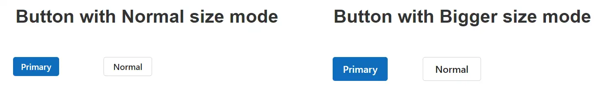

The following table maps theme display names to their corresponding standard and optimized (lite) CSS filenames:

| Theme (display) | Standard filename | Lite filename |
| --- | --- | --- |
| Fluent 2 | `fluent2.css` | `fluent2-lite.css` |
| Fluent 2 Dark | `fluent2-dark.css` | `fluent2-dark-lite.css` |
| Material 3 | `material3.css` | `material3-lite.css` |
| Material 3 Dark | `material3-dark.css` | `material3-dark-lite.css` |
| Bootstrap 5.3 | `bootstrap5.3.css` | `bootstrap5.3-lite.css` |
| Bootstrap 5.3 Dark | `bootstrap5.3-dark.css` | `bootstrap5.3-dark-lite.css` |
| Bootstrap 5 | `bootstrap5.css` | `bootstrap5-lite.css` |
| Bootstrap 5 Dark | `bootstrap5-dark.css` | `bootstrap5-dark-lite.css` |
| Bootstrap 4 | `bootstrap4.css` | `bootstrap4-lite.css` |
| Bootstrap | `bootstrap.css` | `bootstrap-lite.css` |
| Bootstrap Dark | `bootstrap-dark.css` | `bootstrap-dark-lite.css` |
| Google’s Material | `material.css` | `material-lite.css` |
| Google’s Material Dark | `material-dark.css` | `material-dark-lite.css` |
| Tailwind | `tailwind.css` | `tailwind-lite.css` |
| Tailwind Dark | `tailwind-dark.css` | `tailwind-dark-lite.css` |
| Fluent | `fluent.css` | `fluent-lite.css` |
| Fluent Dark | `fluent-dark.css` | `fluent-dark-lite.css` |
| Microsoft Office Fabric | `fabric.css` | `fabric-lite.css` |
| Microsoft Office Fabric Dark | `fabric-dark.css` | `fabric-dark-lite.css` |
| High Contrast | `highcontrast.css` | `highcontrast-lite.css` |

## Theme reference methods in a Blazor application

You can reference Blazor themes using the following approaches:

1. [Static web assets](#static-web-assets) - Reference CSS from local package assets.
2. [CDN](#cdn-reference) - Reference CSS from the Syncfusion CDN.
3. [CRG](https://blazor.syncfusion.com/documentation/common/custom-resource-generator) - Generate resources only for the components used in the application.
4. [Theme Studio](https://blazor.syncfusion.com/documentation/appearance/theme-studio) - Customize and generate themes for the components used in the application.
5. [NPM packages](#npm-package-reference) - Customize existing themes and bundle the styles with your application.

If you need to customize a theme or bundle it with other styles, use [Static web assets](#static-web-assets) or [NPM packages](#npm-package-reference) instead of a [CDN reference](#cdn-reference).

## Static web assets

### Enable static web assets usage

To use Blazor theme files from static web assets, ensure the app serves static files by calling [UseStaticFiles](https://learn.microsoft.com/en-us/dotnet/api/microsoft.aspnetcore.builder.staticfileextensions.usestaticfiles) in `~/Program.cs`.

N> For a **Blazor Web App** using **Server**, **WebAssembly**, or **Auto** interactive render modes, ensure that `UseStaticFiles()` is configured in the **server project**. For a **standalone Blazor WebAssembly app**, no server-side middleware configuration is required.

### Reference the theme stylesheet from static web assets

Blazor themes are provided as static web assets in the [Syncfusion.Blazor.Themes](https://www.nuget.org/packages/Syncfusion.Blazor.Themes/) and [Syncfusion.Blazor](https://www.nuget.org/packages/Syncfusion.Blazor/) NuGet Packages.

* For **Blazor Web App** projects using **Server, WebAssembly, or Auto** interactive render modes, add the stylesheet to the `<head>` section of **`~/Components/App.razor`**.

* For a **Blazor WebAssembly standalone app**, add the stylesheet to the `<head>` section of **`~/wwwroot/index.html`**.

When using individual NuGet packages in your application, install the [Syncfusion.Blazor.Themes](https://www.nuget.org/packages/Syncfusion.Blazor.Themes/) NuGet package and reference the theme stylesheet as shown below:

```html
<head>
    <link href="_content/Syncfusion.Blazor.Themes/fluent2.css" rel="stylesheet" />
</head>
```

To use the optimized (lite) variant that excludes bigger-size mode styles, reference the `-lite` file:

```html
<head>
    <link href="_content/Syncfusion.Blazor.Themes/fluent2-lite.css" rel="stylesheet" />
</head>
```

When using [Syncfusion.Blazor](https://www.nuget.org/packages/Syncfusion.Blazor/) package, reference it from the styles path:

```html
<head>
    <link href="_content/Syncfusion.Blazor/styles/fluent2.css" rel="stylesheet" />
</head>
```

To reference the optimized (lite) CSS files from the [Syncfusion.Blazor](https://www.nuget.org/packages/Syncfusion.Blazor/) NuGet package, use the following:

```html
<head>
    <link href="_content/Syncfusion.Blazor/styles/fluent2-lite.css" rel="stylesheet" />
</head>
```

## CDN reference

Instead of using a local resource on your server, you can reference the theme style sheets from a cloud CDN. CDN stands for **[Content Delivery Network](https://learn.microsoft.com/en-us/microsoft-365/enterprise/content-delivery-networks?view=o365-worldwide)**. It is a network of servers distributed across different locations. CDNs are commonly used to deliver downloadable content such as software, images, videos, and streaming media.

Blazor Themes are available through the CDN. Ensure that the version in the URL matches the version of the Blazor package you are using.

```html
<head>
    <link href="https://cdn.syncfusion.com/blazor/{{ site.blazorversion }}/styles/fluent2.css" rel="stylesheet" />
</head>
```

To reference an optimized CSS file, use the following syntax:

```html
<head>
    <link href="https://cdn.syncfusion.com/blazor/{{ site.blazorversion }}/styles/<theme_name>-lite.css" rel="stylesheet" />
</head>
```

<table style="width:100%">
<tr>
<th style="width:30%">Theme Name</th>
<th style="width:70%">CDN Reference</th>
</tr>
<tr>
<td>Tailwind 3.4</td>
<td>


https://cdn.syncfusion.com/blazor/{{ site.blazorversion }}/styles/tailwind3.css


</td>
</tr>
<tr>
<td>Tailwind 3.4 Dark</td>
<td>


https://cdn.syncfusion.com/blazor/{{ site.blazorversion }}/styles/tailwind3-dark.css


</td>
</tr>
<tr>
<td>Bootstrap 5.3</td>
<td>


https://cdn.syncfusion.com/blazor/{{ site.blazorversion }}/styles/bootstrap5.3.css


</td>
</tr>
<tr>
<td>Bootstrap 5.3 Dark</td>
<td>


https://cdn.syncfusion.com/blazor/{{ site.blazorversion }}/styles/bootstrap5.3-dark.css


</td>
</tr>
<tr>
<td>Fluent 2</td>
<td>


https://cdn.syncfusion.com/blazor/{{ site.blazorversion }}/styles/fluent2.css


</td>
</tr>
<tr>
<td>Fluent 2 Dark</td>
<td>


https://cdn.syncfusion.com/blazor/{{ site.blazorversion }}/styles/fluent2-dark.css


</td>
</tr>
<tr>
<td>Material 3</td>
<td>


https://cdn.syncfusion.com/blazor/{{ site.blazorversion }}/styles/material3.css


</td>
</tr>
<tr>
<td>Material 3 Lite</td>
<td>


https://cdn.syncfusion.com/blazor/{{ site.blazorversion }}/styles/material3-lite.css


</td>
</tr>
<tr>
<td>Material 3 Dark</td>
<td>


https://cdn.syncfusion.com/blazor/{{ site.blazorversion }}/styles/material3-dark.css


</td>
</tr>
<tr>
<td>Material 3 Dark Lite</td>
<td>


https://cdn.syncfusion.com/blazor/{{ site.blazorversion }}/styles/material3-dark-lite.css


</td>
</tr>
<tr>
<td>Bootstrap 5</td>
<td>


https://cdn.syncfusion.com/blazor/{{ site.blazorversion }}/styles/bootstrap5.css


</td>
</tr>
<tr>
<td>Bootstrap 5 Lite</td>
<td>


https://cdn.syncfusion.com/blazor/{{ site.blazorversion }}/styles/bootstrap5-lite.css


</td>
</tr>
<tr>
<td>Bootstrap 5 Dark</td>
<td>


https://cdn.syncfusion.com/blazor/{{ site.blazorversion }}/styles/bootstrap5-dark.css


</td>
</tr>
<tr>
<td>Bootstrap 5 Dark Lite</td>
<td>


https://cdn.syncfusion.com/blazor/{{ site.blazorversion }}/styles/bootstrap5-dark-lite.css


</td>
</tr>
<tr>
<td>Bootstrap 4</td>
<td>


https://cdn.syncfusion.com/blazor/{{ site.blazorversion }}/styles/bootstrap4.css


</td>
</tr>
<tr>
<td>Bootstrap 4 Lite</td>
<td>


https://cdn.syncfusion.com/blazor/{{ site.blazorversion }}/styles/bootstrap4-lite.css


</td>
</tr>
<tr>
<td>Bootstrap 3</td>
<td>


https://cdn.syncfusion.com/blazor/{{ site.blazorversion }}/styles/bootstrap.css


</td>
</tr>
<tr>
<td>Bootstrap 3 Lite</td>
<td>


https://cdn.syncfusion.com/blazor/{{ site.blazorversion }}/styles/bootstrap-lite.css


</td>
</tr>
<tr>
<td>Bootstrap 3 Dark</td>
<td>


https://cdn.syncfusion.com/blazor/{{ site.blazorversion }}/styles/bootstrap-dark.css


</td>
</tr>
<tr>
<td>Bootstrap 3 Dark Lite</td>
<td>


https://cdn.syncfusion.com/blazor/{{ site.blazorversion }}/styles/bootstrap-dark-lite.css


</td>
</tr>
<tr>
<td>Google's Material</td>
<td>


https://cdn.syncfusion.com/blazor/{{ site.blazorversion }}/styles/material.css


</td>
</tr>
<tr>
<td>Google's Material Lite</td>
<td>


https://cdn.syncfusion.com/blazor/{{ site.blazorversion }}/styles/material-lite.css


</td>
</tr>
<tr>
<td>Google’s Material Dark</td>
<td>


https://cdn.syncfusion.com/blazor/{{ site.blazorversion }}/styles/material-dark.css


</td>
</tr>
<tr>
<td>Google’s Material Dark Lite</td>
<td>


https://cdn.syncfusion.com/blazor/{{ site.blazorversion }}/styles/material-dark-lite.css


</td>
</tr>
<tr>
<td>Tailwind CSS</td>
<td>


https://cdn.syncfusion.com/blazor/{{ site.blazorversion }}/styles/tailwind.css


</td>
</tr>
<tr>
<td>Tailwind CSS Lite</td>
<td>


https://cdn.syncfusion.com/blazor/{{ site.blazorversion }}/styles/tailwind-lite.css


</td>
</tr>
<tr>
<td>Tailwind CSS Dark</td>
<td>


https://cdn.syncfusion.com/blazor/{{ site.blazorversion }}/styles/tailwind-dark.css


</td>
</tr>
<tr>
<td>Tailwind CSS Dark Lite</td>
<td>


https://cdn.syncfusion.com/blazor/{{ site.blazorversion }}/styles/tailwind-dark-lite.css


</td>
</tr>
<tr>
<td>Fluent</td>
<td>


https://cdn.syncfusion.com/blazor/{{ site.blazorversion }}/styles/fluent.css


</td>
</tr>
<tr>
<td>Fluent Lite</td>
<td>


https://cdn.syncfusion.com/blazor/{{ site.blazorversion }}/styles/fluent-lite.css


</td>
</tr>
<tr>
<td>Fluent Dark</td>
<td>


https://cdn.syncfusion.com/blazor/{{ site.blazorversion }}/styles/fluent-dark.css


</td>
</tr>
<tr>
<td>Fluent Dark Lite</td>
<td>


https://cdn.syncfusion.com/blazor/{{ site.blazorversion }}/styles/fluent-dark-lite.css


</td>
</tr>
<tr>
<td>Microsoft Office Fabric</td>
<td>


https://cdn.syncfusion.com/blazor/{{ site.blazorversion }}/styles/fabric.css


</td>
</tr>
<tr>
<td>Microsoft Office Fabric Lite</td>
<td>


https://cdn.syncfusion.com/blazor/{{ site.blazorversion }}/styles/fabric-lite.css


</td>
</tr>
<tr>
<td>Microsoft Office Fabric Dark</td>
<td>


https://cdn.syncfusion.com/blazor/{{ site.blazorversion }}/styles/fabric-dark.css


</td>
</tr>
<tr>
<td>Microsoft Office Fabric Dark Lite</td>
<td>


https://cdn.syncfusion.com/blazor/{{ site.blazorversion }}/styles/fabric-dark-lite.css


</td>
</tr>
<tr>
<td>High Contrast</td>
<td>


https://cdn.syncfusion.com/blazor/{{ site.blazorversion }}/styles/highcontrast.css


</td>
</tr>
<tr>
<td>High Contrast Lite</td>
<td>


https://cdn.syncfusion.com/blazor/{{ site.blazorversion }}/styles/highcontrast-lite.css


</td>
</tr>
</table>

## LibMan

Library Manager ([LibMan](https://learn.microsoft.com/en-us/aspnet/core/client-side/libman/libman-vs)) is a client-side library acquisition tool that downloads popular libraries and frameworks from a file system or a CDN.

LibMan offers the following advantages,

1. Only the library files you need are downloaded.
2. Additional tooling, such as Node.js, npm, and WebPack, isn't necessary to acquire a subset of files in a library.
3. Files can be placed in a specific location without resorting to build tasks or manual file copying.

### Client-side library dialog

1.Right-click the project folder where the files should be added. Select **Add** -> **Client-Side Library**. Then Add Client-Side Library dialog appears like below.

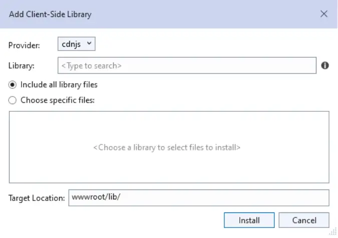

2.Select the **unpkg** in the provider dropdown to get the Blazor control themes.

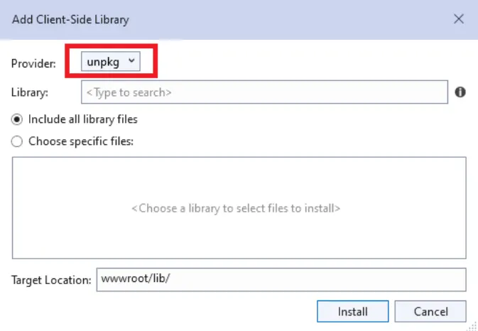

3.You can refer the combined component styles by using `@syncfusion/blazor-themes@{{ site.ej2version }}` in the library textbox.

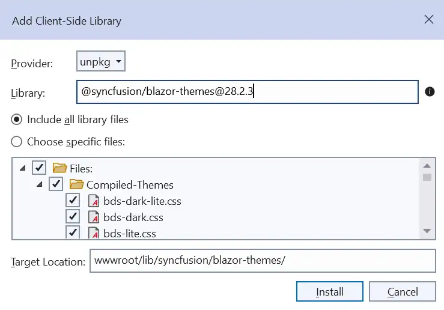

4.You can choose to select specific files or include all library files, as shown below.

For example, select specific files and choose the Bootstrap 5 theme in the dialog.

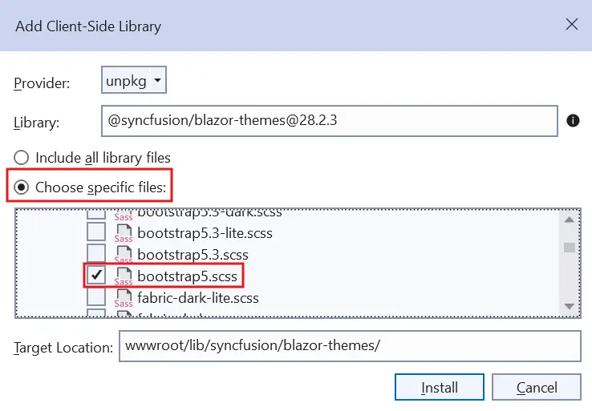

5.By using the target location textbox, you can specify the location of where files will be stored in the application.

For example, the default location `wwwroot/lib/syncfusion/blazor-themes/` has been modified to `wwwroot/themes/syncfusion/blazor-themes/`.

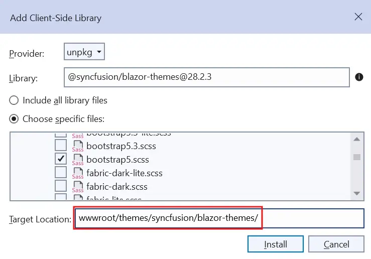

6.Click the install button then `libman.json` file is added to the root application with the following content.




{
  "version": "1.0",
  "defaultProvider": "unpkg",
  "libraries": [
    {
      "library": "@syncfusion/blazor-themes@{{ site.ej2version }}",
      "destination": "wwwroot/themes/syncfusion/blazor-themes/",
      "files": [
        "SCSS-Themes/bootstrap5.scss"
      ]
    }
  ]
}




N> If you use individual component styles, you should install the styles of their dependent components as well. Refer to [this](https://blazor.syncfusion.com/documentation/nuget-packages#available-nuget-packages) to find the dependent components.

7.You can add the `SCSS theme` for Blazor applications through LibMan and compile it by using the [Web Compiler 2022+](https://marketplace.visualstudio.com/items?itemName=Failwyn.WebCompiler64) by following steps.

* Open Visual Studio 2022 and click the Extensions in the toolbar.

    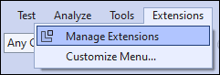

* Search the `Web Compiler 2022+` in search box and download the extension.

    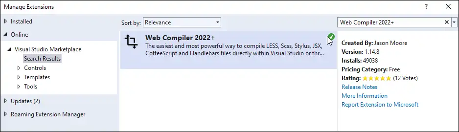

* Right-click the `SCSS` file and click the Web Compiler to compile the file.

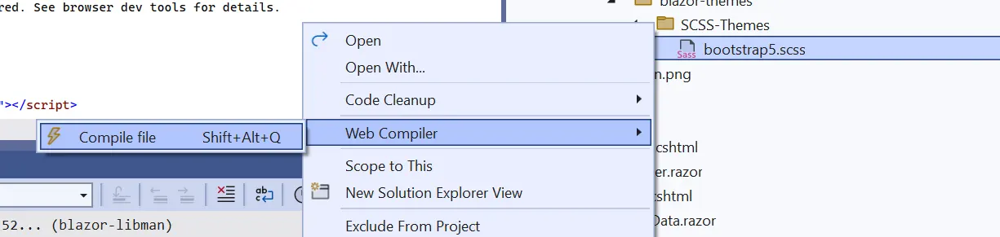

* The `compilerconfig.json` file is created by default as shown in the following code snippet.




[
  {
    "outputFile": "wwwroot/themes/syncfusion/blazor-themes/SCSS-Themes/bootstrap5.css",
    "inputFile": "wwwroot/themes/syncfusion/blazor-themes/SCSS-Themes/bootstrap5.scss"
  }
]




* The `SCSS` file has been compiled to the `CSS` file. Then, add the compiled CSS file to the `<head>` element of the Host page.




<head>
    ...
    <!-- Blazor components' styles -->
    <link href="~/themes/syncfusion/blazor-themes/scss-themes/bootstrap5.css" rel="stylesheet" />
</head>




8.Run the application and see the bootstrap5 themes downloaded from LibMan were applied.

N> [View sample in GitHub](https://github.com/SyncfusionExamples/blazor-libman)

## NPM package reference

The [Blazor Themes NPM package](https://www.npmjs.com/package/@syncfusion/blazor-themes) contains `SCSS` files for all themes supported by Blazor components. These SCSS files customize theme variables using a web compiler. The package includes component wise SCSS files and overall components SCSS files.

You can add the `SCSS theme` for Blazor applications through NPM package and compile it by using the [Web Compiler 2022+](https://marketplace.visualstudio.com/items?itemName=Failwyn.WebCompiler64) by following steps.

* Open Visual Studio 2022 and click the Extensions in the toolbar.

    

* Search the `Web Compiler 2022+` in search box and download the extension.

    

* Install the [Blazor Themes](https://www.npmjs.com/package/@syncfusion/blazor-themes) NPM package using the below command.

    ```
    npm install @syncfusion/blazor-themes
    ```

* Create a `SCSS` file in the Static Web Assets folder (e.g., ~/wwwroot/styles/custom.scss). Next, define the [theme variables](https://blazor.syncfusion.com/documentation/appearance/theme-studio#common-variables) to override and import the theme as shown in the following.

    In the following code, the primary theme variable color is changed. For all components:

    ```scss
    /* @use 'blazor-themes/SCSS-Themes/<Theme name>.scss'; */
    @use 'blazor-themes/SCSS-Themes/fluent.scss' with ( $primary: blue );
    ```

    **Output:**

    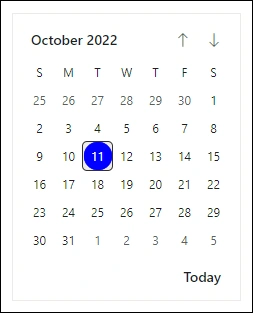

    For the Calendar (individual) component:

    ```scss
    /* @use 'blazor-themes/SCSS-Themes/<Package name>/<Control name>/<Theme name>.scss'; */
    @use 'blazor-themes/SCSS-Themes/calendars/calendar/fluent.scss' with ( $primary: #666699 );
    ```

    **Output:**

    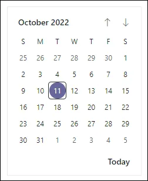

* Then, Right-click the created `SCSS` file and click the `Web Compiler` option to compile the file.

    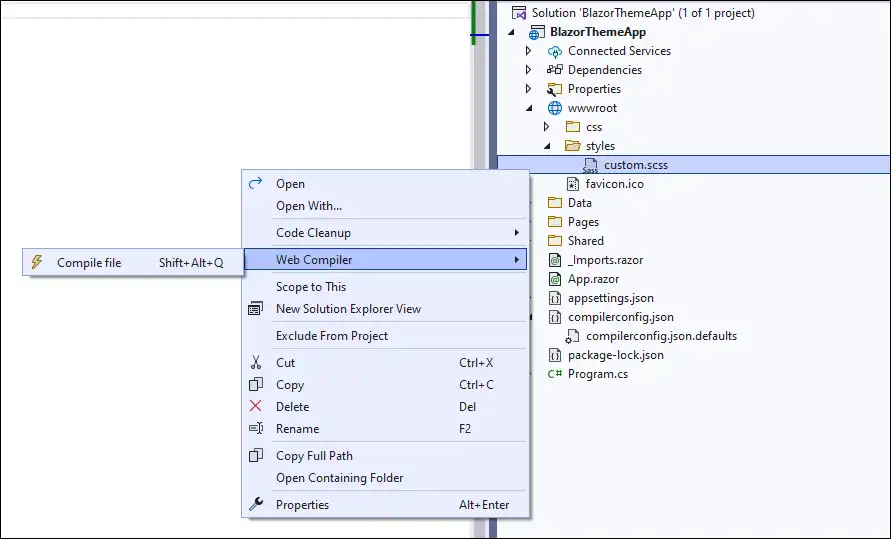

* The `compilerconfig.json` file is created by default. Then, provide the location of the compiled CSS file and include a path in `compilerconfig.json` as shown in the following code snippet.

    ```json
    [
      {
        "outputFile": "wwwroot/styles/custom.css",
        "inputFile": "wwwroot/styles/custom.scss",
        "options": {
          "loadPaths": "node_modules/@syncfusion"
        }
      }
    ]
    ```

* The `SCSS` file has been compiled to the `CSS` file. Then, add the compiled CSS file to the `<head>` element of the Host page.

    ```html
    <head>
      ...
      ...
      <link href="styles/custom.css" rel="stylesheet" />
    </head>
    ```

* Run the application to see the customized Fluent theme applied.

It is important to note that the Material 3 theme uses CSS variables. To override its variables, you should import the Material 3 theme's SCSS file and then customize the [Material 3 variables](https://blazor.syncfusion.com/documentation/appearance/theme-studio#material-3-theme) like this:

```scss
// Import the Material 3 theme
@use 'blazor-themes/SCSS-Themes/material3.scss';

// Override Material 3 variables
:root {
    // Customize the primary color
    --color-sf-primary: 26 26 192;
}
```

N> If you come across the **'Can't find stylesheet to import'** error, ensure that you have installed the [Blazor Themes](https://www.npmjs.com/package/@syncfusion/blazor-themes) NPM package in the project's directory rather than the solution's directory.

The following shows the importing theme path for the overall theme.

```css
@use 'blazor-themes/SCSS-Themes/{THEME-NAME}.scss' as *;
```

Below table lists the importing theme path for the individual components.

<table style="width:100%">
    <tr>
        <th style="width:25%">Component</th>
        <th style="width:75%">Importing theme path</th>
    </tr>
    <tr>
        <td>Accordion</td>
        <td>@use 'blazor-themes/SCSS-Themes/navigations/accordion/{THEME-NAME}.scss'</td>
    </tr>
    <tr>
        <td>AppBar</td>
        <td>@use 'blazor-themes/SCSS-Themes/navigations/appbar/{THEME-NAME}.scss'</td>
    </tr>
    <tr>
        <td>AutoComplete</td>
        <td>@use 'blazor-themes/SCSS-Themes/dropdowns/auto-complete/{THEME-NAME}.scss'</td>
    </tr>
    <tr>
        <td>Avatar</td>
        <td>@use 'blazor-themes/SCSS-Themes/layouts/avatar/{THEME-NAME}.scss'</td>
    </tr>
    <tr>
        <td>Badge</td>
        <td>@use 'blazor-themes/SCSS-Themes/notifications/badge/{THEME-NAME}.scss'</td>
    </tr>
    <tr>
        <td>Barcode</td>
        <td>@use 'blazor-themes/SCSS-Themes/barcode-generator/barcode/{THEME-NAME}.scss'</td>
    </tr>
    <tr>
        <td>Breadcrumb</td>
        <td>@use 'blazor-themes/SCSS-Themes/navigations/breadcrumb/{THEME-NAME}.scss'</td>
    </tr>
    <tr>
        <td>Button</td>
        <td>@use 'blazor-themes/SCSS-Themes/buttons/button/{THEME-NAME}.scss'</td>
    </tr>
    <tr>
        <td>ButtonGroup</td>
        <td>@use 'blazor-themes/SCSS-Themes/buttons/button/{THEME-NAME}.scss'</td>
    </tr>
    <tr>
        <td>Calendar</td>
        <td>@use 'blazor-themes/SCSS-Themes/calendars/calendar/{THEME-NAME}.scss'</td>
    </tr>
    <tr>
        <td>Card</td>
        <td>@use 'blazor-themes/SCSS-Themes/layouts/card/{THEME-NAME}.scss'</td>
    </tr>
    <tr>
        <td>Carousel</td>
        <td>@use 'blazor-themes/SCSS-Themes/navigations/carousel/{THEME-NAME}.scss'</td>
    </tr>
    <tr>
        <td>CheckBox</td>
        <td>@use 'blazor-themes/SCSS-Themes/buttons/check-box/{THEME-NAME}.scss'</td>
    </tr>
    <tr>
        <td>Chip</td>
        <td>@use 'blazor-themes/SCSS-Themes/buttons/chips/{THEME-NAME}.scss'</td>
    </tr>
    <tr>
        <td>Color Picker</td>
        <td>@use 'blazor-themes/SCSS-Themes/inputs/color-picker/{THEME-NAME}.scss'</td>
    </tr>
    <tr>
        <td>ComboBox</td>
        <td>@use 'blazor-themes/SCSS-Themes/dropdowns/combo-box/{THEME-NAME}.scss'</td>
    </tr>
    <tr>
        <td>ContextMenu</td>
        <td>@use 'blazor-themes/SCSS-Themes/navigations/context-menu/{THEME-NAME}.scss'</td>
    </tr>
    <tr>
        <td>Dashboard Layout</td>
        <td>@use 'blazor-themes/SCSS-Themes/layouts/dashboard-layout/{THEME-NAME}.scss'</td>
    </tr>
    <tr>
        <td>DataGrid</td>
        <td>@use 'blazor-themes/SCSS-Themes/grids/grid/{THEME-NAME}.scss'</td>
    </tr>
    <tr>
        <td>DatePicker</td>
        <td>@use 'blazor-themes/SCSS-Themes/calendars/datepicker/{THEME-NAME}.scss'</td>
    </tr>
    <tr>
        <td>DateRange Picker</td>
        <td>@use 'blazor-themes/SCSS-Themes/calendars/daterangepicker/{THEME-NAME}.scss'</td>
    </tr>
    <tr>
        <td>DateTime Picker</td>
        <td>@use 'blazor-themes/SCSS-Themes/calendars/datetimepicker/{THEME-NAME}.scss'</td>
    </tr>
    <tr>
        <td>Diagram</td>
        <td>@use 'blazor-themes/SCSS-Themes/diagrams/diagram/{THEME-NAME}.scss'</td>
    </tr>
    <tr>
        <td>Dialog</td>
        <td>@use 'blazor-themes/SCSS-Themes/popups/dialog/{THEME-NAME}.scss'</td>
    </tr>
    <tr>
        <td>Predefined Dialogs</td>
        <td>@use 'blazor-themes/SCSS-Themes/popups/dialog/{THEME-NAME}.scss'</td>
    </tr>
    <tr>
        <td>Dropdown Menu</td>
        <td>@use 'blazor-themes/SCSS-Themes/dropdowns/drop-down-list/{THEME-NAME}.scss'</td>
    </tr>
    <tr>
        <td>Dropdown List</td>
        <td>@use 'blazor-themes/SCSS-Themes/dropdowns/drop-down-list/{THEME-NAME}.scss'</td>
    </tr>
    <tr>
        <td>FileManager</td>
        <td>@use 'blazor-themes/SCSS-Themes/filemanager/file-manager/{THEME-NAME}.scss'</td>
    </tr>
    <tr>
        <td>File Upload</td>
        <td>@use 'blazor-themes/SCSS-Themes/inputs/uploader/{THEME-NAME}.scss'</td>
    </tr>
    <tr>
        <td>Floating Action Button</td>
        <td>@use 'blazor-themes/SCSS-Themes/buttons/floating-action-button/{THEME-NAME}.scss'</td>
    </tr>
    <tr>
        <td>Gantt Chart</td>
        <td>@use 'blazor-themes/SCSS-Themes/gantt/gantt/{THEME-NAME}.scss'</td>
    </tr>
    <tr>
        <td>In-place Editor</td>
        <td>@use 'blazor-themes/SCSS-Themes/inplace-editor/inplace-editor/{THEME-NAME}.scss'</td>
    </tr>
    <tr>
        <td>Input Mask</td>
        <td>@use 'blazor-themes/SCSS-Themes/inputs/input/{THEME-NAME}.scss'</td>
    </tr>
    <tr>
        <td>Kanban</td>
        <td>@use 'blazor-themes/SCSS-Themes/kanban/kanban/{THEME-NAME}.scss'</td>
    </tr>
    <tr>
        <td>ListBox</td>
        <td>@use 'blazor-themes/SCSS-Themes/dropdowns/list-box/{THEME-NAME}.scss'</td>
    </tr>
    <tr>
        <td>ListView</td>
        <td>@use 'blazor-themes/SCSS-Themes/lists/list-view/{THEME-NAME}.scss'</td>
    </tr>
    <tr>
        <td>Menu Bar</td>
        <td>@use 'blazor-themes/SCSS-Themes/navigations/menu/{THEME-NAME}.scss'</td>
    </tr>
    <tr>
        <td>Message</td>
        <td>@use 'blazor-themes/SCSS-Themes/notification/message/{THEME-NAME}.scss'</td>
    </tr>
    <tr>
        <td>MultiSelect Dropdown</td>
        <td>@use 'blazor-themes/SCSS-Themes/dropdowns/multi-select/{THEME-NAME}.scss'</td>
    </tr>
    <tr>
        <td>Numeric TextBox</td>
        <td>@use 'blazor-themes/SCSS-Themes/inputs/numerictextbox/{THEME-NAME}.scss'</td>
    </tr>
    <tr>
        <td>Pager</td>
        <td>@use 'blazor-themes/SCSS-Themes/navigations/pager/{THEME-NAME}.scss'</td>
    </tr>
    <tr>
        <td>ImageEditor</td>
        <td>@use 'blazor-themes/SCSS-Themes/image-editor/image-editor/{THEME-NAME}.scss'</td>
    </tr>
    <tr>
        <td>Pivot Table</td>
        <td>@use 'blazor-themes/SCSS-Themes/pivotview/pivotview/{THEME-NAME}.scss'</td>
    </tr>
    <tr>
        <td>ProgressButton</td>
        <td>@use 'blazor-themes/SCSS-Themes/splitbuttons/progress-button/{THEME-NAME}.scss'</td>
    </tr>
    <tr>
        <td>QueryBuilder</td>
        <td>@use 'blazor-themes/SCSS-Themes/querybuilder/query-builder/{THEME-NAME}.scss'</td>
    </tr>
    <tr>
        <td>RadioButton</td>
        <td>@use 'blazor-themes/SCSS-Themes/buttons/radio-button/{THEME-NAME}.scss'</td>
    </tr>
    <tr>
        <td>Range Slider</td>
        <td>@use 'blazor-themes/SCSS-Themes/inputs/slider/{THEME-NAME}.scss'</td>
    </tr>
    <tr>
        <td>RichTextEditor</td>
        <td>@use 'blazor-themes/SCSS-Themes/richtexteditor/rich-text-editor/{THEME-NAME}.scss'</td>
    </tr>
    <tr>
        <td>Scheduler</td>
        <td>@use 'blazor-themes/SCSS-Themes/schedule/schedule/{THEME-NAME}.scss'</td>
    </tr>
    <tr>
        <td>Sidebar</td>
        <td>@use 'blazor-themes/SCSS-Themes/navigations/sidebar/{THEME-NAME}.scss'</td>
    </tr>
    <tr>
        <td>Signature</td>
        <td>@use 'blazor-themes/SCSS-Themes/inputs/signature/{THEME-NAME}.scss'</td>
    </tr>
    <tr>
        <td>Skeleton</td>
        <td>@use 'blazor-themes/SCSS-Themes/notification/skeleton/{THEME-NAME}.scss'</td>
    </tr>
    <tr>
        <td>Speed Dial</td>
        <td>@use 'blazor-themes/SCSS-Themes/buttons/speed-dial/{THEME-NAME}.scss'</td>
    </tr>
    <tr>
        <td>Spinner</td>
        <td>@use 'blazor-themes/SCSS-Themes/popups/spinner/{THEME-NAME}.scss'</td>
    </tr>
    <tr>
        <td>Tabs</td>
        <td>@use 'blazor-themes/SCSS-Themes/navigations/tab/{THEME-NAME}.scss'</td>
    </tr>
    <tr>
        <td>TextBox</td>
        <td>@use 'blazor-themes/SCSS-Themes/inputs/textbox/{THEME-NAME}.scss'</td>
    </tr>
    <tr>
        <td>TimePicker</td>
        <td>@use 'blazor-themes/SCSS-Themes/calendars\timepicker/{THEME-NAME}.scss'</td>
    </tr>
    <tr>
        <td>Toast</td>
        <td>@use 'blazor-themes/SCSS-Themes/popups/toast/{THEME-NAME}.scss'</td>
    </tr>
    <tr>
        <td>Toggle Switch Button</td>
        <td>@use 'blazor-themes/SCSS-Themes/buttons/button/{THEME-NAME}.scss'</td>
    </tr>
    <tr>
        <td>Toolbar</td>
        <td>@use 'blazor-themes/SCSS-Themes/navigations/toolbar/{THEME-NAME}.scss'</td>
    </tr>
    <tr>
        <td>Tooltip</td>
        <td>@use 'blazor-themes/SCSS-Themes/popups/tooltip/{THEME-NAME}.scss'</td>
    </tr>
    <tr>
        <td>TreeGrid</td>
        <td>@use 'blazor-themes/SCSS-Themes/treegrid/treegrid/{THEME-NAME}.scss'</td>
    </tr>
    <tr>
        <td>TreeView</td>
        <td>@use 'blazor-themes/SCSS-Themes/navigations/treeview/{THEME-NAME}.scss'</td>
    </tr>
    <tr>
        <td>Diagram(Classic)</td>
        <td>@use 'blazor-themes/SCSS-Themes/diagrams/diagram/{THEME-NAME}.scss'</td>
    </tr>
</table>

## Change theme dynamically

In Blazor applications, you can switch themes dynamically by changing the stylesheet reference at runtime. The implementation approach varies depending on your Blazor application type.

### Prerequisites

Before implementing theme switching, ensure you have created your Blazor application.

* **Blazor Web App**: Follow the [Blazor getting started](https://blazor.syncfusion.com/documentation/getting-started/blazor-web-app) guide
* **Blazor WebAssembly Standalone App**: Follow the [Blazor getting started](https://blazor.syncfusion.com/documentation/getting-started/blazor-webassembly-app) guide

### Install the required NuGet packages

All theme switching implementations for both Blazor Web App and Blazor WebAssembly Standalone App require the following NuGet packages:

1. **[Syncfusion.Blazor.DropDowns](https://www.nuget.org/packages/Syncfusion.Blazor.DropDowns)** - For the theme switcher dropdown component
2. **[Syncfusion.Blazor.Grid](https://www.nuget.org/packages/Syncfusion.Blazor.Grid)** - For the sample DataGrid component to demonstrate theme changes
3. **[Syncfusion.Blazor.Themes](https://www.nuget.org/packages/Syncfusion.Blazor.Themes)** - For the theme stylesheet assets used by the sample

Install these packages using one of the following methods.




Install-Package Syncfusion.Blazor.DropDowns -Version {{ site.releaseversion }}
Install-Package Syncfusion.Blazor.Grid -Version {{ site.releaseversion }}
Install-Package Syncfusion.Blazor.Themes -Version {{ site.releaseversion }}




dotnet add package Syncfusion.Blazor.DropDowns --version {{ site.releaseversion }}
dotnet add package Syncfusion.Blazor.Grid --version {{ site.releaseversion }}
dotnet add package Syncfusion.Blazor.Themes --version {{ site.releaseversion }}




For the complete list of available packages, refer to the [Blazor NuGet packages](https://blazor.syncfusion.com/documentation/nuget-packages).

### Change theme dynamically in Blazor Web App

The following steps demonstrate how to dynamically switch themes in a Blazor Web App using Blazor themes with the [Blazor Dropdown List](https://www.syncfusion.com/blazor-components/blazor-dropdown-list) component.

#### 1. Configure theme loading

For a **Blazor Web App** using **Server**, **WebAssembly**, or **Auto** interactive render modes, update the `~/Components/App.razor` file to read the `theme` query string parameter and load the corresponding theme stylesheet.




@using Microsoft.AspNetCore.WebUtilities
@inject NavigationManager Navigation

@{
    var allowedThemes = new HashSet<string>(StringComparer.OrdinalIgnoreCase)
    {
        "bootstrap5.3",
        "bootstrap5.3-dark",
        "fluent2",
        "fluent2-dark",
        "material3",
        "material3-dark",
        "tailwind3",
        "tailwind3-dark",
        "highcontrast"
    };

    var uri = new Uri(Navigation.Uri);
    var query = QueryHelpers.ParseQuery(uri.Query);

    var themeName = query.TryGetValue("theme", out var theme) &&
                    allowedThemes.Contains(theme.FirstOrDefault() ?? string.Empty)
        ? theme.FirstOrDefault()!
        : "bootstrap5.3";
}

<!DOCTYPE html>
<html lang="en">

<head>
    ...
    <!-- Sets the selected theme name into styles -->
    <link href="@("_content/Syncfusion.Blazor.Themes/" + themeName + ".css")" rel="stylesheet" />
</head>

<body>
    ...  
    <!-- Blazor core script (required for UI components) -->
    <script src="_content/Syncfusion.Blazor.Core/scripts/syncfusion-blazor.min.js" type="text/javascript"></script>
</body>




#### 2. Create a dropdown component for theme selection

Create a new `ThemeSwitcher.razor` file in the `~/Components` folder with the following code. This component uses the [Blazor Dropdown List](https://www.syncfusion.com/blazor-components/blazor-dropdown-list) to enable users to select a theme, which updates the URL query string and triggers a page reload with the selected theme.




@rendermode InteractiveServer
@using Syncfusion.Blazor.DropDowns
@using Microsoft.AspNetCore.WebUtilities
@inject NavigationManager Navigation

<div class="theme-switcher-container">
    <SfDropDownList TItem="ThemeOption"
                    TValue="string"
                    DataSource="@Themes"
                    @bind-Value="CurrentTheme">
        <DropDownListFieldSettings Text="Text" Value="Id" />
        <DropDownListEvents TItem="ThemeOption"
                            TValue="string"
                            ValueChange="OnThemeChanged" />
    </SfDropDownList>
</div>

@code {
    private string CurrentTheme = "bootstrap5.3";

    // Restrict theme names to prevent arbitrary CSS path injection via query string.
    private static readonly HashSet<string> AllowedThemes = new(StringComparer.OrdinalIgnoreCase)
    {
        "bootstrap5.3", "bootstrap5.3-dark",
        "fluent2", "fluent2-dark",
        "material3", "material3-dark",
        "tailwind3", "tailwind3-dark",
        "highcontrast"
    };

    private static readonly List<ThemeOption> Themes =
    [
        new() { Id = "bootstrap5.3", Text = "Bootstrap 5.3" },
        new() { Id = "bootstrap5.3-dark", Text = "Bootstrap 5.3 Dark" },
        new() { Id = "fluent2", Text = "Fluent 2" },
        new() { Id = "fluent2-dark", Text = "Fluent 2 Dark" },
        new() { Id = "material3", Text = "Material 3" },
        new() { Id = "material3-dark", Text = "Material 3 Dark" },
        new() { Id = "tailwind3", Text = "Tailwind 3.4" },
        new() { Id = "tailwind3-dark", Text = "Tailwind 3.4 Dark" },
        new() { Id = "highcontrast", Text = "High Contrast" }
    ];

    protected override void OnInitialized()
    {
        var uri = Navigation.ToAbsoluteUri(Navigation.Uri);
        var query = QueryHelpers.ParseQuery(uri.Query);

        if (query.TryGetValue("theme", out var theme) &&
            AllowedThemes.Contains(theme.FirstOrDefault() ?? string.Empty))
        {
            CurrentTheme = theme.First()!;
        }
    }

    private void OnThemeChanged(ChangeEventArgs<string, ThemeOption> args)
    {
        if (string.IsNullOrWhiteSpace(args?.Value) || !AllowedThemes.Contains(args.Value))
        {
            return;
        }

        CurrentTheme = args.Value;

        Navigation.NavigateTo(
            Navigation.GetUriWithQueryParameter("theme", CurrentTheme),
            forceLoad: true);
    }

    private sealed class ThemeOption
    {
        public string Id { get; set; } = string.Empty;
        public string Text { get; set; } = string.Empty;
    }
}




N> Change the `@rendermode` directive to `InteractiveAuto` or `InteractiveWebAssembly` based on your application's render mode configuration.

#### 3. Add the theme switcher component

Include the `ThemeSwitcher` component in your `~/Components/Layout/MainLayout.razor` file to display the theme switcher in your application layout.




@inherits LayoutComponentBase

<div class="page">
    <div class="top-row px-4">
        <div class="theme-switcher">
            <ThemeSwitcher />
        </div>
        <a href="https://learn.microsoft.com/aspnet/core/" target="_blank">About</a>
    </div>

    <article class="content px-4">
        @Body
    </article>
</div>





N> [View sample in GitHub](https://github.com/SyncfusionExamples/theme-switching-in-blazor-server-app)

### Change theme dynamically in Blazor WebAssembly (WASM) standalone app

The following steps demonstrate how to dynamically switch themes in a Blazor WebAssembly (WASM) standalone application using Blazor themes with the [Blazor Dropdown List](https://www.syncfusion.com/blazor-components/blazor-dropdown-list) component. Unlike Blazor Web App, standalone WASM apps use JavaScript interop to dynamically change themes without requiring a full page reload, as they run entirely in the browser without server-side rendering capabilities.

#### 1. Configure theme switching with JavaScript

Add the following code to the `~/wwwroot/index.html` file. This script dynamically updates the theme stylesheet reference when the user selects a theme from the dropdown.




<head>
    ...
    <!-- Sets the selected theme name into styles -->
    <link id="theme" href="_content/Syncfusion.Blazor.Themes/bootstrap5.3.css" rel="stylesheet" />
</head>

<body>
    ...
    <!-- Blazor core script (required for UI components) -->
    <script src="_content/Syncfusion.Blazor.Core/scripts/syncfusion-blazor.min.js" type="text/javascript"></script>
    <!-- Updates the theme stylesheet at runtime -->
    <script>
        function setTheme(theme) {
            document.getElementsByTagName('body')[0].style.display = 'none';
            let synclink = document.getElementById('theme');
            synclink.href = '_content/Syncfusion.Blazor.Themes/' + theme + '.css';
            setTimeout(function () { document.getElementsByTagName('body')[0].style.display = 'block'; }, 300);
        }
    </script>
</body>




#### 2. Add the theme switcher dropdown

Modify your `~/Layout/MainLayout.razor` file to include the theme switcher dropdown using the [Blazor Dropdown List](https://www.syncfusion.com/blazor-components/blazor-dropdown-list). This dropdown calls the JavaScript `setTheme()` function when the user selects a different theme.




@inherits LayoutComponentBase
@inject IJSRuntime JSRuntime
@using Syncfusion.Blazor.DropDowns

<div class="page">
    <div class="sidebar">
        <NavMenu />
    </div>

    <main>
        <div class="top-row px-4">
            <div class="theme-switcher">
                <SfDropDownList TItem="ThemeDetails" TValue="string" @bind-Value="themeName" DataSource="@Themes">
                    <DropDownListFieldSettings Text="Text" Value="ID"></DropDownListFieldSettings>
                    <DropDownListEvents TItem="ThemeDetails" TValue="string" ValueChange="OnThemeChange"></DropDownListEvents>
                </SfDropDownList>
            </div>
            <a href="https://learn.microsoft.com/aspnet/" target="_blank">About</a>
        </div>

        <article class="content px-4">
            @Body
        </article>
    </main>
</div>

@code {
    private string themeName = "bootstrap5.3";

    public class ThemeDetails
    {
        public string ID { get; set; }
        public string Text { get; set; }
    }

    private List<ThemeDetails> Themes = new List<ThemeDetails>()
    {
        new ThemeDetails(){ ID = "bootstrap5.3", Text = "Bootstrap 5.3" },
        new ThemeDetails(){ ID = "bootstrap5.3-dark", Text = "Bootstrap 5.3 Dark" },
        new ThemeDetails(){ ID = "fluent2", Text = "Fluent 2" },
        new ThemeDetails(){ ID = "fluent2-dark", Text = "Fluent 2 Dark" },
        new ThemeDetails(){ ID = "material3", Text = "Material 3" },
        new ThemeDetails(){ ID = "material3-dark", Text = "Material 3 Dark" },
        new ThemeDetails(){ ID = "tailwind3", Text = "Tailwind 3.4" },
        new ThemeDetails(){ ID = "tailwind3-dark", Text = "Tailwind 3.4 Dark" },
        new ThemeDetails(){ ID = "highcontrast", Text = "High Contrast" }
    };

    public void OnThemeChange(Syncfusion.Blazor.DropDowns.ChangeEventArgs<string, ThemeDetails> args)
    {
        JSRuntime.InvokeAsync<object>("setTheme", args.ItemData.ID);
    }
}





N> [View sample in GitHub](https://github.com/SyncfusionExamples/theme-switching-in-blazor-WASM-app)

### Add a sample component to visualize theme changes

After implementing the theme switcher in either Blazor Web App or Blazor WebAssembly Standalone App, add a sample component to visualize the theme changes. The following example uses the [Blazor DataGrid](https://www.syncfusion.com/blazor-components/blazor-datagrid) component to demonstrate how themes are applied dynamically.

Create or update the appropriate page file based on your application type.

* For **Blazor Web App**: Update `~/Components/Pages/Home.razor`
* For **Blazor WebAssembly Standalone App**: Update `~/Pages/Home.razor`




@page "/"

@using Syncfusion.Blazor.Grids

<PageTitle>Home</PageTitle>

<h1>Dynamically Change Theme</h1>

<SfGrid DataSource="@Orders" AllowPaging="true">
    <GridPageSettings PageSizes="true" PageSize="10"></GridPageSettings>
    <GridColumns>
        <GridColumn Field="@nameof(Order.OrderID)" HeaderText="Order ID" TextAlign="TextAlign.Right" Width="120" />
        <GridColumn Field="@nameof(Order.CustomerID)" HeaderText="Customer" Width="150" />
        <GridColumn Field="@nameof(Order.OrderDate)" HeaderText="Order Date" Format="d" Type="ColumnType.Date" Width="140" />
        <GridColumn Field="@nameof(Order.Freight)" HeaderText="Freight" Format="C2" TextAlign="TextAlign.Right" Width="120" />
    </GridColumns>
</SfGrid>

@code {
    public List<Order> Orders { get; set; } = [];

    protected override void OnInitialized()
    {
        var customers = new[] { "ALFKI", "ANANTR", "ANTON", "BLONP", "BOLID" };

        Orders = Enumerable.Range(1, 75).Select(x => new Order
        {
            OrderID = 1000 + x,
            CustomerID = customers[x % customers.Length],
            Freight = 2.1 * x,
            OrderDate = DateTime.Today.AddDays(-x)
        }).ToList();
    }

    public class Order
    {
        public int OrderID { get; set; }
        public string? CustomerID { get; set; }
        public DateTime OrderDate { get; set; }
        public double Freight { get; set; }
    }
}




Now, run your application and use the theme switcher dropdown to change themes. The [Blazor DataGrid](https://www.syncfusion.com/blazor-components/blazor-datagrid) component will immediately reflect the selected theme, demonstrating the dynamic theme switching functionality.

## Render Blazor components offline using Material and Tailwind themes

Material and Tailwind themes use the online Roboto font by default. If your application needs to work offline or in a local network without internet access, follow these steps to use offline fonts.

### Download customized styles using Custom Resource Generator (CRG)

1. Download the minified styles for the required components from the [CRG](https://blazor.syncfusion.com/crg) site. Learn more about CRG in the [help documentation](https://blazor.syncfusion.com/documentation/common/custom-resource-generator).

2. Unzip the downloaded file. It contains the styles of the selected components and an `import.json` file that stores the current settings.
   
   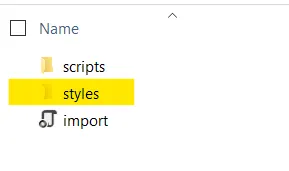

3. Navigate to the styles folder. For Material and Tailwind themes, you'll find CSS files and a **customized** folder. The CSS files in the **customized** folder don't contain online Google Font dependencies.
   
   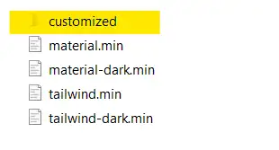

4. Open the **customized** folder, which contains CSS files without online dependencies.
   
   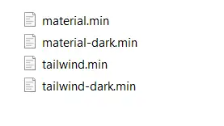

5. Copy the files from the **customized** folder to your Blazor application's `~/wwwroot` folder.

6. Reference the custom styles in your Blazor application to render components without internet access.

    * For **Blazor Web App** (using Server, WebAssembly, or Auto interactive render modes), add the reference in `~/Components/App.razor`.
    * For **Blazor WebAssembly Standalone App**, add the reference in `~/wwwroot/index.html`.

    ```html
        <head>
            ....
            <link href="material.min.css" rel="stylesheet" />
        </head>
    ```

### Use customized styles from the `Syncfusion.Blazor.Themes` package and CDN

Starting from version `v23.2.4`, customized `Material` and `Tailwind` themes are available in the [Syncfusion.Blazor.Themes](https://www.nuget.org/packages/Syncfusion.Blazor.Themes/) package and via CDN.

#### Static web asset reference

```html
<head>
    ....
    <link href="_content/Syncfusion.Blazor.Themes/customized/material.css" rel="stylesheet" />
</head>
```

#### CDN reference

```html
<head>
    ....
    <link href="https://cdn.syncfusion.com/blazor/{{ site.blazorversion }}/styles/customized/material.css" rel="stylesheet" />
</head>
```

## See also

[How to change background of browser based on Theme in Blazor?](https://www.syncfusion.com/forums/171882/problems-with-implementing-dark-themes)