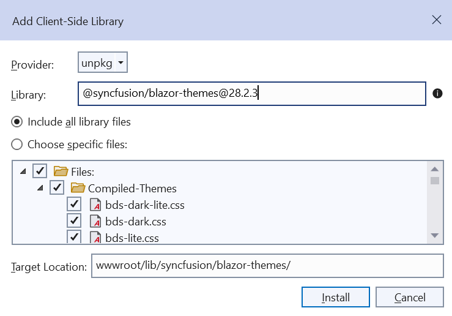
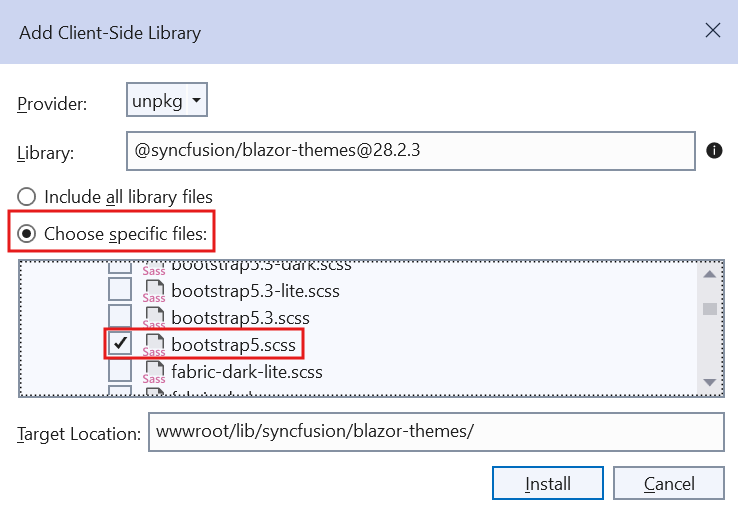
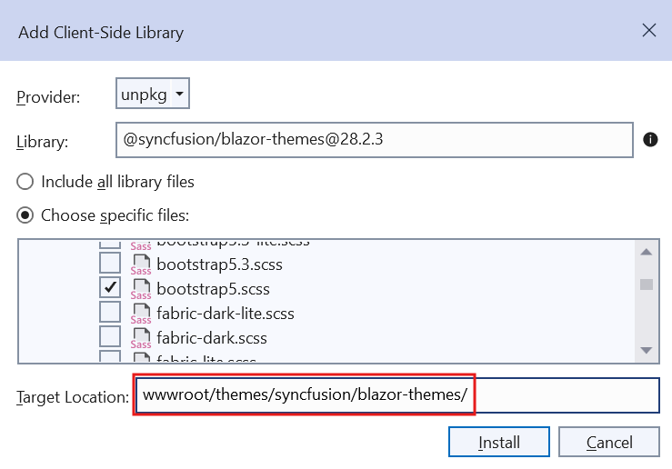

# Blazor Themes in Syncfusion® Components

The following list of themes are included in the Syncfusion<sup style="font-size:70%">&reg;</sup> Blazor components library.

|Theme	|Style Sheet Name|
|--------|--------|
|Tailwind 3.4 | tailwind3.css |
|Tailwind 3.4 Dark | tailwind3-dark.css |
|Bootstrap 5.3 | bootstrap5.3.css |
|Bootstrap 5.3 Dark | bootstrap5.3-dark.css |
|Fluent 2 | fluent2.css |
|Fluent 2 Dark | fluent2-dark.css |
|Material 3 | material3.css |
|Material 3 Dark | material3-dark.css |
|Bootstrap 5	| bootstrap5.css |
|Bootstrap 5 Dark	| bootstrap5-dark.css |
|Bootstrap 4	| bootstrap4.css |
|Bootstrap 3	| bootstrap.css |
|Bootstrap 3 Dark	| bootstrap-dark.css |
|Google’s Material | material.css |
|Google’s Material-Dark | material-dark.css |
|Tailwind CSS | tailwind.css |
|Tailwind CSS Dark | tailwind-dark.css |
|Fluent | fluent.css |
|Fluent Dark | fluent-dark.css |
|Microsoft Office Fabric | fabric.css |
|Microsoft Office Fabric Dark | fabric-dark.css |
|High Contrast | highcontrast.css |

The Syncfusion<sup style="font-size:70%">&reg;</sup> Blazor Bootstrap Theme is designed based on Bootstrap v3, whereas the Bootsrap4 theme is designed based on Bootstrap v4.

## Optimized CSS Themes

Syncfusion Blazor themes are available in two variants to help optimize application's performance:
 
**Standard Theme Files:**

* The default theme files (<theme_name>.css) include comprehensive styling for both normal and bigger size modes, ensuring full UI flexibility but with a larger file size.
 
**Lite Theme Files:**

For improved performance, we offer optimized lite theme files (<theme_name>-lite.css) that:

* Include styles exclusively for normal size mode
* Omit bigger size mode styles
* Reduce file size by approximately 30%, so improve application load times

**When to Use Lite Themes:**

* Choose the lite theme variant when your application doesn't require the bigger size mode. To implement a lite theme, simply reference the -lite.css version instead of the standard theme file in your application.

Comparison of the Syncfusion Blazor Button Component in **normal** and **bigger** size modes:


Refer to the comparison below for the default and optimized theme file sizes:

| Default Theme Name | Optimized Theme Name |
| -- | -- |
| Fluent 2 | Fluent 2 Lite |
| Fluent 2 Dark | Fluent2 Dark Lite |
| material 3 | material 3 Lite |
| material 3 Dark | material 3 Dark Lite |
| Bootstrap 5.3 | Bootstrap 5.3 Lite 2 |
| Bootstrap 5.3 Dark | Bootstrap 5.3 Dark Lite |
| Bootstrap 5 | Bootstrap 5 Lite 2 |
| Bootstrap 5 Dark | Bootstrap 5 Dark Lite |
| Bootstrap 4 | Bootstrap 4 Lite |
| Bootstrap | Bootstrap Lite |
| Bootstrap Dark | Bootstrap Dark Lite |
| Google’s Material | Google’s Material Lite |
| Google’s Material Dark | Google’s Material Dark Lite |
| Tailwind | Tailwind Lite |
| Tailwind Dark | Tailwind Dark Lite |
| Fluent | Fluent Lite |
| Fluent Dark | Fluent Dark Lite |
| Microsoft Office Fabric | Microsoft Office Fabric Lite |
| Microsoft Office Fabric Dark | Microsoft Office Fabric Dark Lite |
| High Contrast | High Contrast Lite |

## Reference themes in Blazor application

Syncfusion<sup style="font-size:70%">&reg;</sup> Blazor themes can be used in your Blazor application by referencing the style sheet.

*  For **Blazor Web App** or **Blazor Server App**, refer style sheet inside the `<head>` of **~/Components/App.razor** file for .NET 9 or .NET 8.
* For **Blazor WebAssembly App**, refer style sheet inside the `<head>` of **wwwroot/index.html** file.

Using the below approaches the themes can be referenced in the Blazor application,

1. [Static Web assets](#static-web-assets) - Used to reference complete css via static web assests.
2. [CDN](#cdn-reference) - Used to reference complete css via static web assests.
3. [CRG](https://blazor.syncfusion.com/documentation/common/custom-resource-generator) - Used to generate resources only for the selected (used) components.
4. [Theme Studio](https://blazor.syncfusion.com/documentation/appearance/theme-studio) - Used to customize and generate themes only for the selected (used) components.
5. [NPM packages](#npm-packages) - Used to customize the existing themes and bundle stylesheet's in an application.

Instead of using [Static Web assets](#static-web-assets) or a [CDN reference](#cdn-reference), you can reference the style sheet into your projects to customize the theme or bundle it with the other style sheets using [NPM packages](#npm-packages).

## Static Web Assets

### Enable static web assets usage

To use static web assets, ensure [UseStaticFiles](https://learn.microsoft.com/en-us/dotnet/api/microsoft.aspnetcore.builder.staticfileextensions.usestaticfiles?view=aspnetcore-8.0) method in the **~/Program.cs** file of your app.

N> For **Blazor Web App with interaction mode as  Auto & Blazor WASM App**, call `UseStaticFiles` method in **Server project**.

### Refer theme style sheet from static web assets

Syncfusion<sup style="font-size:70%">&reg;</sup> Blazor themes are available as static web assets in the [Syncfusion.Blazor.Themes](https://www.nuget.org/packages/Syncfusion.Blazor.Themes/) and [Syncfusion.Blazor](https://www.nuget.org/packages/Syncfusion.Blazor/) NuGet Packages.

*  For **Blazor Web App** or **Blazor Server App**,  refer style sheet inside the `<head>` of **~/Components/App.razor** file for .NET 9 or .NET 8.

* For **Blazor WebAssembly App**, refer style sheet inside the `<head>` element of **wwwroot/index.html** file.

When using individual NuGet packages in your application, add [Syncfusion.Blazor.Themes](https://www.nuget.org/packages/Syncfusion.Blazor.Themes/) NuGet Package and reference style sheet as below,

 ```html
<head>
    <link href="_content/Syncfusion.Blazor.Themes/bootstrap5.css" rel="stylesheet" />
</head>
```
To refer to optimized CSS files, use the following syntax: 

 ```html
<head>
    <link href="_content/Syncfusion.Blazor.Themes/bootstrap5-lite.css" rel="stylesheet" />
</head>
```

When using [Syncfusion.Blazor](https://www.nuget.org/packages/Syncfusion.Blazor/) NuGet package,

 ```html
<head>
    <link href="_content/Syncfusion.Blazor/styles/bootstrap5.css" rel="stylesheet" />
</head>
```
To reference optimized CSS files from [Syncfusion.Blazor](https://www.nuget.org/packages/Syncfusion.Blazor/) NuGet package, here's how to:

 ```html
<head>
    <link href="_content/Syncfusion.Blazor/styles/bootstrap5-lite.css" rel="stylesheet" />
</head>
```

## CDN reference

Instead of using a local resource on your server, you can use a cloud CDN to reference the theme style sheets. CDN Stands for "Content Delivery Network". A CDN is a group of servers distributed in different locations. While CDNs are often used to host websites, they are commonly used to provide other types of downloadable data as well. Examples include software programs, images, videos, and streaming media.

Syncfusion<sup style="font-size:70%">&reg;</sup> Blazor Themes are available in the CDN. Make sure that the version in the URLs matches the version of the Syncfusion<sup style="font-size:70%">&reg;</sup> Blazor Package you are using.

 ```html
<head>
    <link href="https://cdn.syncfusion.com/blazor/{{ site.blazorversion }}/styles/bootstrap5.css" rel="stylesheet"/>
</head>
```

To refer to optimized CSS files, use the following syntax:

```html
<head>
    <link href="https://cdn.syncfusion.com/blazor/{{ site.blazorversion }}/styles/<theme_name>-lite.css" rel="stylesheet"/>
</head>
```

<table style="width:100%">
<tr>
<th style="width:30%">Theme Name</th>
<th style="width:70%">CDN Reference</th>
</tr>
<tr>
<td>Tailwind 3.4</td>
<td>


https://cdn.syncfusion.com/blazor/{{ site.blazorversion }}/styles/tailwind3.css


</td>
</tr>
<tr>
<td>Tailwind 3.4 Dark</td>
<td>


https://cdn.syncfusion.com/blazor/{{ site.blazorversion }}/styles/tailwind3-dark.css


</td>
</tr>
<tr>
<td>Bootstrap 5.3</td>
<td>


https://cdn.syncfusion.com/blazor/{{ site.blazorversion }}/styles/bootstrap5.3.css


</td>
</tr>
<tr>
<td>Bootstrap 5.3 Dark</td>
<td>


https://cdn.syncfusion.com/blazor/{{ site.blazorversion }}/styles/bootstrap5.3-dark.css


</td>
</tr>
<tr>
<td>Fluent 2</td>
<td>


https://cdn.syncfusion.com/blazor/{{ site.blazorversion }}/styles/fluent2.css


</td>
</tr>
<tr>
<td>Fluent 2 Dark</td>
<td>


https://cdn.syncfusion.com/blazor/{{ site.blazorversion }}/styles/fluent2-dark.css


</td>
</tr>
<tr>
<td>Material 3</td>
<td>


https://cdn.syncfusion.com/blazor/{{ site.blazorversion }}/styles/material3.css


</td>
</tr>
<tr>
<td>Material 3 Lite</td>
<td>


https://cdn.syncfusion.com/blazor/{{ site.blazorversion }}/styles/material3-lite.css


</td>
</tr>
<tr>
<td>Material 3 Dark</td>
<td>


https://cdn.syncfusion.com/blazor/{{ site.blazorversion }}/styles/material3-dark.css


</td>
</tr>
<tr>
<td>Material 3 Dark Lite</td>
<td>


https://cdn.syncfusion.com/blazor/{{ site.blazorversion }}/styles/material3-dark-lite.css


</td>
</tr>
<tr>
<td>Bootstrap 5</td>
<td>


https://cdn.syncfusion.com/blazor/{{ site.blazorversion }}/styles/bootstrap5.css


</td>
</tr>
<tr>
<td>Bootstrap 5 Lite</td>
<td>


https://cdn.syncfusion.com/blazor/{{ site.blazorversion }}/styles/bootstrap5-lite.css


</td>
</tr>
<tr>
<td>Bootstrap 5 Dark</td>
<td>


https://cdn.syncfusion.com/blazor/{{ site.blazorversion }}/styles/bootstrap5-dark.css


</td>
</tr>
<tr>
<td>Bootstrap 5 Dark Lite</td>
<td>


https://cdn.syncfusion.com/blazor/{{ site.blazorversion }}/styles/bootstrap5-dark-lite.css


</td>
</tr>
<tr>
<td>Bootstrap 4</td>
<td>


https://cdn.syncfusion.com/blazor/{{ site.blazorversion }}/styles/bootstrap4.css


</td>
</tr>
<tr>
<td>Bootstrap 4 Lite</td>
<td>


https://cdn.syncfusion.com/blazor/{{ site.blazorversion }}/styles/bootstrap4-lite.css


</td>
</tr>
<tr>
<td>Bootstrap 3</td>
<td>


https://cdn.syncfusion.com/blazor/{{ site.blazorversion }}/styles/bootstrap.css


</td>
</tr>
<tr>
<td>Bootstrap 3 Lite</td>
<td>


https://cdn.syncfusion.com/blazor/{{ site.blazorversion }}/styles/bootstrap-lite.css


</td>
</tr>
<tr>
<td>Bootstrap 3 Dark</td>
<td>


https://cdn.syncfusion.com/blazor/{{ site.blazorversion }}/styles/bootstrap-dark.css


</td>
</tr>
<tr>
<td>Bootstrap 3 Dark Lite</td>
<td>


https://cdn.syncfusion.com/blazor/{{ site.blazorversion }}/styles/bootstrap-dark-lite.css


</td>
</tr>
<tr>
<td>Google's Material</td>
<td>


https://cdn.syncfusion.com/blazor/{{ site.blazorversion }}/styles/material.css


</td>
</tr>
<tr>
<td>Google's Material Lite</td>
<td>


https://cdn.syncfusion.com/blazor/{{ site.blazorversion }}/styles/material-lite.css


</td>
</tr>
<tr>
<td>Google’s Material Dark</td>
<td>


https://cdn.syncfusion.com/blazor/{{ site.blazorversion }}/styles/material-dark.css


</td>
</tr>
<tr>
<td>Google’s Material Dark Lite</td>
<td>


https://cdn.syncfusion.com/blazor/{{ site.blazorversion }}/styles/material-dark-lite.css


</td>
</tr>
<tr>
<td>Tailwind CSS</td>
<td>


https://cdn.syncfusion.com/blazor/{{ site.blazorversion }}/styles/tailwind.css


</td>
</tr>
<tr>
<td>Tailwind CSS Lite</td>
<td>


https://cdn.syncfusion.com/blazor/{{ site.blazorversion }}/styles/tailwind-lite.css


</td>
</tr>
<tr>
<td>Tailwind CSS Dark</td>
<td>


https://cdn.syncfusion.com/blazor/{{ site.blazorversion }}/styles/tailwind-dark.css


</td>
</tr>
<tr>
<td>Tailwind CSS Dark Lite</td>
<td>


https://cdn.syncfusion.com/blazor/{{ site.blazorversion }}/styles/tailwind-dark-lite.css


</td>
</tr>
<tr>
<td>Fluent</td>
<td>


https://cdn.syncfusion.com/blazor/{{ site.blazorversion }}/styles/fluent.css


</td>
</tr>
<tr>
<td>Fluent Lite</td>
<td>


https://cdn.syncfusion.com/blazor/{{ site.blazorversion }}/styles/fluent-lite.css


</td>
</tr>
<tr>
<td>Fluent Dark</td>
<td>


https://cdn.syncfusion.com/blazor/{{ site.blazorversion }}/styles/fluent-dark.css


</td>
</tr>
<tr>
<td>Fluent Dark Lite</td>
<td>


https://cdn.syncfusion.com/blazor/{{ site.blazorversion }}/styles/fluent-dark-lite.css


</td>
</tr>
<tr>
<td>Microsoft Office Fabric</td>
<td>


https://cdn.syncfusion.com/blazor/{{ site.blazorversion }}/styles/fabric.css


</td>
</tr>
<tr>
<td>Microsoft Office Fabric Lite</td>
<td>


https://cdn.syncfusion.com/blazor/{{ site.blazorversion }}/styles/fabric-lite.css


</td>
</tr>
<tr>
<td>Microsoft Office Fabric Dark</td>
<td>


https://cdn.syncfusion.com/blazor/{{ site.blazorversion }}/styles/fabric-dark.css


</td>
</tr>
<tr>
<td>Microsoft Office Fabric Dark Lite</td>
<td>


https://cdn.syncfusion.com/blazor/{{ site.blazorversion }}/styles/fabric-dark-lite.css


</td>
</tr>
<tr>
<td>High Contrast</td>
<td>


https://cdn.syncfusion.com/blazor/{{ site.blazorversion }}/styles/highcontrast.css


</td>
</tr>
<tr>
<td>High Contrast Lite</td>
<td>


https://cdn.syncfusion.com/blazor/{{ site.blazorversion }}/styles/highcontrast-lite.css


</td>
</tr>
</table>

## LibMan

Library Manager ([LibMan](https://learn.microsoft.com/en-us/aspnet/core/client-side/libman/libman-vs?view=aspnetcore-7.0)) is a client-side library acquisition tool that is simple to use. LibMan is a program that downloads popular libraries and frameworks from a file system or a content delivery network (CDN).

LibMan offers the following advantages,

1. Only the library files you need are downloaded.
2. Additional tooling, such as Node.js, npm, and WebPack, isn't necessary to acquire a subset of files in a library.
3. Files can be placed in a specific location without resorting to build tasks or manual file copying.

### Client-Side Library dialog

1.Right-click the project folder where the files should be added. Select **Add** -> **Client-Side Library**. Then Add Client-Side Library dialog appears like below.


2.Select the **unpkg** in the provider dropdown to get the Syncfusion<sup style="font-size:70%">&reg;</sup> control themes.


3.You can refer the combined component styles by using `@syncfusion/blazor-themes@{{ site.ej2version }}` in the library textbox.



4.You can choose to select specific files or include all library files, as shown below.

For example, select specific files and choose the Bootstrap 5 theme in the dialog.



5.By using the target location textbox, you can specify the location of where files will be stored in the application.

For example, the default location `wwwroot/lib/syncfusion/blazor-themes/` has been modified to `wwwroot/themes/syncfusion/blazor-themes/`.



6.Click the install button then `libman.json` file is added to the root application with the following content.




{
  "version": "1.0",
  "defaultProvider": "unpkg",
  "libraries": [
    {
      "library": "@syncfusion/blazor-themes@{{ site.ej2version }}",
      "destination": "wwwroot/themes/syncfusion/blazor-themes/",
      "files": [
        "SCSS-Themes/bootstrap5.scss"
      ]
    }
  ]
}




N> If you use individual component styles, you should install the styles of their dependent components as well. Refer to [this](https://blazor.syncfusion.com/documentation/nuget-packages#available-nuget-packages) to find the dependent components.

7.You can add the `SCSS theme` for Blazor applications through LibMan and compile it by using the [Web Compiler 2022+](https://marketplace.visualstudio.com/items?itemName=Failwyn.WebCompiler64) by following steps.

* Open Visual Studio 2022 and click the Extensions in the toolbar.

    

* Search the `Web Compiler 2022+` in search box and download the extension.

    

* Right-click the `SCSS` file and click the Web Compiler to compile the file.


* The `compilerconfig.json` file is created by default as shown in the following code snippet.




[
  {
    "outputFile": "wwwroot/themes/syncfusion/blazor-themes/SCSS-Themes/bootstrap5.css",
    "inputFile": "wwwroot/themes/syncfusion/blazor-themes/SCSS-Themes/bootstrap5.scss"
  }
]




* The `SCSS` file has been compiled to the `CSS` file. Then, add the compiled CSS file to the `<head>` element of the Host page.




<head>
    ...
    <!-- Syncfusion Blazor components' styles -->
    <link href="~/themes/syncfusion/blazor-themes/scss-themes/bootstrap5.css" rel="stylesheet" />
</head>




8.Run the application and see the bootstrap5 themes downloaded from LibMan were applied.

N> [View sample in GitHub](https://github.com/SyncfusionExamples/blazor-libman)

## NPM package reference

The [Blazor Themes NPM package](https://www.npmjs.com/package/@syncfusion/blazor-themes) contains `SCSS` files for all themes supported by Syncfusion<sup style="font-size:70%">&reg;</sup> Blazor components. These SCSS files customize theme variables using a web compiler. The package includes component wise SCSS files and overall components SCSS files.

You can add the `SCSS theme` for Blazor applications through NPM package and compile it by using the [Web Compiler 2022+](https://marketplace.visualstudio.com/items?itemName=Failwyn.WebCompiler64) by following steps.

* Open Visual Studio 2022 and click the Extensions in the toolbar.

    

* Search the `Web Compiler 2022+` in search box and download the extension.

    

* Install the [Syncfusion<sup style="font-size:70%">&reg;</sup> Blazor Themes](https://www.npmjs.com/package/@syncfusion/blazor-themes) NPM package using the below command.

    ```
    npm install @syncfusion/blazor-themes
    ```

* Create a `SCSS` file in the Static Web Assets folder (e.g., ~/wwwroot/styles/custom.scss). Next, define the [theme variables](https://blazor.syncfusion.com/documentation/appearance/theme-studio#common-variables) to override and import the theme as shown in the following.

    In the following code, the primary theme variable color is changed. For all components:

    ```scss
    $primary: blue !default;

    /* @import 'blazor-themes/SCSS-Themes/<Theme name>.scss'; */
    @import 'blazor-themes/SCSS-Themes/fluent.scss';
    ```

    **Output:**

    

    For the Calendar (individual) component:

    ```scss
    $primary: #666699 !default;

    /* @import 'blazor-themes/SCSS-Themes/<Package name>/<Control name>/<Theme name>.scss'; */
    @import 'blazor-themes/SCSS-Themes/calendars/calendar/fluent.scss';
    ```

    **Output:**

    

* Then, Right-click the created `SCSS` file and click the `Web Compiler` option to compile the file.

    

* The `compilerconfig.json` file is created by default. Then, provide the location of the compiled CSS file and include a path in `compilerconfig.json` as shown in the following code snippet.

    ```json
    [
      {
        "outputFile": "wwwroot/styles/custom.css",
        "inputFile": "wwwroot/styles/custom.scss",
        "options": {
          "loadPaths": "node_modules/@syncfusion"
        }
      }
    ]
    ```

* The `SCSS` file has been compiled to the `CSS` file. Then, add the compiled CSS file to the `<head>` element of the Host page.

    ```html
    <head>
      ...
      ...
      <link href="~/styles/custom.css" rel="stylesheet" />
    </head>
    ```

* Run the application to see the customized Fluent theme applied.

It is important to note that the Material 3 theme uses CSS variables. To override its variables, you should import the Material 3 theme's SCSS file and then customize the [Material 3 variables](https://blazor.syncfusion.com/documentation/appearance/theme-studio#material-3-theme) like this:

```scss
// Import the Material 3 theme
@import 'blazor-themes/SCSS-Themes/material3.scss';

// Override Material 3 variables
:root {
    // Customize the primary color
    --color-sf-primary: 26 26 192;
}
```

N> If you are using **Visual Studio 2019**, please use the `includePath` property instead of `loadPaths` as the latter does not support the Web Compiler for VS 2019. However, we highly recommend using the **Web Compiler 2022+** for **Visual Studio 2022**. For more information, please refer to the [discussion link here](https://github.com/failwyn/WebCompiler/issues/24).

N> If you come across the **'Can't find stylesheet to import'** error, ensure that you have installed the [Syncfusion<sup style="font-size:70%">&reg;</sup> Blazor Themes](https://www.npmjs.com/package/@syncfusion/blazor-themes) NPM package in the project's directory rather than the solution's directory.

The following shows the importing theme path for the overall theme.

```css
@import 'blazor-themes/SCSS-Themes/{THEME-NAME}.scss'
```

Below table lists the importing theme path for the individual components.

<table style="width:100%">
    <tr>
        <th style="width:25%">Component</th>
        <th style="width:75%">Importing theme path</th>
    </tr>
    <tr>
        <td>Accordion</td>
        <td>@import 'blazor-themes/SCSS-Themes/navigations/accordion/{THEME-NAME}.scss'</td>
    </tr>
    <tr>
        <td>AppBar</td>
        <td>@import 'blazor-themes/SCSS-Themes/navigations/appbar/{THEME-NAME}.scss'</td>
    </tr>
    <tr>
        <td>AutoComplete</td>
        <td>@import 'blazor-themes/SCSS-Themes/dropdowns/auto-complete/{THEME-NAME}.scss'</td>
    </tr>
    <tr>
        <td>Avatar</td>
        <td>@import 'blazor-themes/SCSS-Themes/layouts/avatar/{THEME-NAME}.scss'</td>
    </tr>
    <tr>
        <td>Badge</td>
        <td>@import 'blazor-themes/SCSS-Themes/notifications/badge/{THEME-NAME}.scss'</td>
    </tr>
    <tr>
        <td>Barcode</td>
        <td>@import 'blazor-themes/SCSS-Themes/barcode-generator/barcode/{THEME-NAME}.scss'</td>
    </tr>
    <tr>
        <td>Breadcrumb</td>
        <td>@import 'blazor-themes/SCSS-Themes/navigations/breadcrumb/{THEME-NAME}.scss'</td>
    </tr>
    <tr>
        <td>Button</td>
        <td>@import 'blazor-themes/SCSS-Themes/buttons/button/{THEME-NAME}.scss'</td>
    </tr>
    <tr>
        <td>ButtonGroup</td>
        <td>@import 'blazor-themes/SCSS-Themes/buttons/button/{THEME-NAME}.scss'</td>
    </tr>
    <tr>
        <td>Calendar</td>
        <td>@import 'blazor-themes/SCSS-Themes/calendars/calendar/{THEME-NAME}.scss'</td>
    </tr>
    <tr>
        <td>Card</td>
        <td>@import 'blazor-themes/SCSS-Themes/layouts/card/{THEME-NAME}.scss'</td>
    </tr>
    <tr>
        <td>Carousel</td>
        <td>@import 'blazor-themes/SCSS-Themes/navigations/carousel/{THEME-NAME}.scss'</td>
    </tr>
    <tr>
        <td>CheckBox</td>
        <td>@import 'blazor-themes/SCSS-Themes/buttons/check-box/{THEME-NAME}.scss'</td>
    </tr>
    <tr>
        <td>Chip</td>
        <td>@import 'blazor-themes/SCSS-Themes/buttons/chips/{THEME-NAME}.scss'</td>
    </tr>
    <tr>
        <td>Color Picker</td>
        <td>@import 'blazor-themes/SCSS-Themes/inputs/color-picker/{THEME-NAME}.scss'</td>
    </tr>
    <tr>
        <td>ComboBox</td>
        <td>@import 'blazor-themes/SCSS-Themes/dropdowns/combo-box/{THEME-NAME}.scss'</td>
    </tr>
    <tr>
        <td>ContextMenu</td>
        <td>@import 'blazor-themes/SCSS-Themes/navigations/context-menu/{THEME-NAME}.scss'</td>
    </tr>
    <tr>
        <td>Dashboard Layout</td>
        <td>@import 'blazor-themes/SCSS-Themes/layouts/dashboard-layout/{THEME-NAME}.scss'</td>
    </tr>
    <tr>
        <td>DataGrid</td>
        <td>@import 'blazor-themes/SCSS-Themes/grids/grid/{THEME-NAME}.scss'</td>
    </tr>
    <tr>
        <td>DatePicker</td>
        <td>@import 'blazor-themes/SCSS-Themes/calendars/datepicker/{THEME-NAME}.scss'</td>
    </tr>
    <tr>
        <td>DateRange Picker</td>
        <td>@import 'blazor-themes/SCSS-Themes/calendars/daterangepicker/{THEME-NAME}.scss'</td>
    </tr>
    <tr>
        <td>DateTime Picker</td>
        <td>@import 'blazor-themes/SCSS-Themes/calendars/datetimepicker/{THEME-NAME}.scss'</td>
    </tr>
    <tr>
        <td>Diagram</td>
        <td>@import 'blazor-themes/SCSS-Themes/diagrams/diagram/{THEME-NAME}.scss'</td>
    </tr>
    <tr>
        <td>Dialog</td>
        <td>@import 'blazor-themes/SCSS-Themes/popups/dialog/{THEME-NAME}.scss'</td>
    </tr>
    <tr>
        <td>Predefined Dialogs</td>
        <td>@import 'blazor-themes/SCSS-Themes/popups/dialog/{THEME-NAME}.scss'</td>
    </tr>
    <tr>
        <td>DocumentEditor</td>
        <td>@import 'blazor-themes/SCSS-Themes/documenteditor/document-editor/{THEME-NAME}.scss'</td>
    </tr>
    <tr>
        <td>Dropdown Menu</td>
        <td>@import 'blazor-themes/SCSS-Themes/dropdowns/drop-down-list/{THEME-NAME}.scss'</td>
    </tr>
    <tr>
        <td>Dropdown List</td>
        <td>@import 'blazor-themes/SCSS-Themes/dropdowns/drop-down-list/{THEME-NAME}.scss'</td>
    </tr>
    <tr>
        <td>FileManager</td>
        <td>@import 'blazor-themes/SCSS-Themes/filemanager/file-manager/{THEME-NAME}.scss'</td>
    </tr>
    <tr>
        <td>File Upload</td>
        <td>@import 'blazor-themes/SCSS-Themes/inputs/uploader/{THEME-NAME}.scss'</td>
    </tr>
    <tr>
        <td>Floating Action Button</td>
        <td>@import 'blazor-themes/SCSS-Themes/buttons/floating-action-button/{THEME-NAME}.scss'</td>
    </tr>
    <tr>
        <td>Gantt Chart</td>
        <td>@import 'blazor-themes/SCSS-Themes/gantt/gantt/{THEME-NAME}.scss'</td>
    </tr>
    <tr>
        <td>In-place Editor</td>
        <td>@import 'blazor-themes/SCSS-Themes/inplace-editor/inplace-editor/{THEME-NAME}.scss'</td>
    </tr>
    <tr>
        <td>Input Mask</td>
        <td>@import 'blazor-themes/SCSS-Themes/inputs/input/{THEME-NAME}.scss'</td>
    </tr>
    <tr>
        <td>Kanban</td>
        <td>@import 'blazor-themes/SCSS-Themes/kanban/kanban/{THEME-NAME}.scss'</td>
    </tr>
    <tr>
        <td>ListBox</td>
        <td>@import 'blazor-themes/SCSS-Themes/dropdowns/list-box/{THEME-NAME}.scss'</td>
    </tr>
    <tr>
        <td>ListView</td>
        <td>@import 'blazor-themes/SCSS-Themes/lists/list-view/{THEME-NAME}.scss'</td>
    </tr>
    <tr>
        <td>Menu Bar</td>
        <td>@import 'blazor-themes/SCSS-Themes/navigations/menu/{THEME-NAME}.scss'</td>
    </tr>
    <tr>
        <td>Message</td>
        <td>@import 'blazor-themes/SCSS-Themes/notification/message/{THEME-NAME}.scss'</td>
    </tr>
    <tr>
        <td>MultiSelect Dropdown</td>
        <td>@import 'blazor-themes/SCSS-Themes/dropdowns/multi-select/{THEME-NAME}.scss'</td>
    </tr>
    <tr>
        <td>Numeric TextBox</td>
        <td>@import 'blazor-themes/SCSS-Themes/inputs/numerictextbox/{THEME-NAME}.scss'</td>
    </tr>
    <tr>
        <td>Pager</td>
        <td>@import 'blazor-themes/SCSS-Themes/navigations/pager/{THEME-NAME}.scss'</td>
    </tr>
    <tr>
        <td>PDF Viewer</td>
        <td>@import 'blazor-themes/SCSS-Themes/pdfviewer/pdfviewer/{THEME-NAME}.scss'</td>
    </tr>
    <tr>
        <td>ImageEditor</td>
        <td>@import 'blazor-themes/SCSS-Themes/image-editor/image-editor/{THEME-NAME}.scss'</td>
    </tr>
    <tr>
        <td>Pivot Table</td>
        <td>@import 'blazor-themes/SCSS-Themes/pivotview/pivotview/{THEME-NAME}.scss'</td>
    </tr>
    <tr>
        <td>ProgressButton</td>
        <td>@import 'blazor-themes/SCSS-Themes/splitbuttons/progress-button/{THEME-NAME}.scss'</td>
    </tr>
    <tr>
        <td>QueryBuilder</td>
        <td>@import 'blazor-themes/SCSS-Themes/querybuilder/query-builder/{THEME-NAME}.scss'</td>
    </tr>
    <tr>
        <td>RadioButton</td>
        <td>@import 'blazor-themes/SCSS-Themes/buttons/radio-button/{THEME-NAME}.scss'</td>
    </tr>
    <tr>
        <td>Range Slider</td>
        <td>@import 'blazor-themes/SCSS-Themes/inputs/slider/{THEME-NAME}.scss'</td>
    </tr>
    <tr>
        <td>RichTextEditor</td>
        <td>@import 'blazor-themes/SCSS-Themes/richtexteditor/rich-text-editor/{THEME-NAME}.scss'</td>
    </tr>
    <tr>
        <td>Scheduler</td>
        <td>@import 'blazor-themes/SCSS-Themes/schedule/schedule/{THEME-NAME}.scss'</td>
    </tr>
    <tr>
        <td>Sidebar</td>
        <td>@import 'blazor-themes/SCSS-Themes/navigations/sidebar/{THEME-NAME}.scss'</td>
    </tr>
    <tr>
        <td>Signature</td>
        <td>@import 'blazor-themes/SCSS-Themes/inputs/signature/{THEME-NAME}.scss'</td>
    </tr>
    <tr>
        <td>Skeleton</td>
        <td>@import 'blazor-themes/SCSS-Themes/notification/skeleton/{THEME-NAME}.scss'</td>
    </tr>
    <tr>
        <td>Speed Dial</td>
        <td>@import 'blazor-themes/SCSS-Themes/buttons/speed-dial/{THEME-NAME}.scss'</td>
    </tr>
    <tr>
        <td>Spinner</td>
        <td>@import 'blazor-themes/SCSS-Themes/popups/spinner/{THEME-NAME}.scss'</td>
    </tr>
    <tr>
        <td>Tabs</td>
        <td>@import 'blazor-themes/SCSS-Themes/navigations/tab/{THEME-NAME}.scss'</td>
    </tr>
    <tr>
        <td>TextBox</td>
        <td>@import 'blazor-themes/SCSS-Themes/inputs/textbox/{THEME-NAME}.scss'</td>
    </tr>
    <tr>
        <td>TimePicker</td>
        <td>@import 'blazor-themes/SCSS-Themes/calendars\timepicker/{THEME-NAME}.scss'</td>
    </tr>
    <tr>
        <td>Toast</td>
        <td>@import 'blazor-themes/SCSS-Themes/popups/toast/{THEME-NAME}.scss'</td>
    </tr>
    <tr>
        <td>Toggle Switch Button</td>
        <td>@import 'blazor-themes/SCSS-Themes/buttons/button/{THEME-NAME}.scss'</td>
    </tr>
    <tr>
        <td>Toolbar</td>
        <td>@import 'blazor-themes/SCSS-Themes/navigations/toolbar/{THEME-NAME}.scss'</td>
    </tr>
    <tr>
        <td>Tooltip</td>
        <td>@import 'blazor-themes/SCSS-Themes/popups/tooltip/{THEME-NAME}.scss'</td>
    </tr>
    <tr>
        <td>TreeGrid</td>
        <td>@import 'blazor-themes/SCSS-Themes/treegrid/treegrid/{THEME-NAME}.scss'</td>
    </tr>
    <tr>
        <td>TreeView</td>
        <td>@import 'blazor-themes/SCSS-Themes/navigations/treeview/{THEME-NAME}.scss'</td>
    </tr>
    <tr>
        <td>Diagram(Classic)</td>
        <td>@import 'blazor-themes/SCSS-Themes/diagrams/diagram/{THEME-NAME}.scss'</td>
    </tr>
</table>

## Change theme dynamically

In the Blazor application, the application theme can be changed dynamically by changing its style sheet reference in code.

### Change theme dynamically in Blazor Web app

The following example demonstrates how to change a theme dynamically in Blazor application using Syncfusion<sup style="font-size:70%">&reg;</sup> Blazor themes using Syncfusion<sup style="font-size:70%">&reg;</sup> Dropdown component.

* For **Blazor Web App**, the theme is changed based on query string at the **~/Components/App.razor** file




@using Microsoft.AspNetCore.WebUtilities;
@inject NavigationManager UrlHelper;

@{

    var uri = UrlHelper.ToAbsoluteUri(UrlHelper.Uri);
    QueryHelpers.ParseQuery(uri.Query).TryGetValue("theme", out var themeName);
    themeName = themeName.Count > 0 ? themeName.First() : "bootstrap4";
}
...
<head>
...
    @*Sets the selected theme name into styles*@
    <link href=@("_content/Syncfusion.Blazor.Themes/" + themeName + ".css") rel="stylesheet" />
</head>
...




* Create a new `DropDownComponent.razor` page, and then add the provided code snippet to enable dynamic theming within the application using [Syncfusion<sup style="font-size:70%">&reg;</sup> DropDown List Component](https://blazor.syncfusion.com/documentation/dropdown-list/getting-started-with-web-app).

```cshtml
@rendermode InteractiveAuto
@using Syncfusion.Blazor.DropDowns;
@inject NavigationManager UrlHelper;
@using Microsoft.AspNetCore.WebUtilities

<SfDropDownList TItem="ThemeDetails" TValue="string" @bind-Value="themeName" DataSource="@Themes">
     <DropDownListFieldSettings Text="Text" Value="ID"></DropDownListFieldSettings>
     <DropDownListEvents TItem="ThemeDetails" TValue="string" ValueChange="OnThemeChange"></DropDownListEvents>
</SfDropDownList>

@code {
    private string themeName;

    public class ThemeDetails
    {
        public string ID { get; set; }
        public string Text { get; set; }
    }

    private List<ThemeDetails> Themes = new List<ThemeDetails>() {
        new ThemeDetails(){ ID = "material3", Text = "Material 3" },
        new ThemeDetails(){ ID = "material", Text = "Material" },
        new ThemeDetails(){ ID = "bootstrap", Text = "Bootstrap" },
        new ThemeDetails(){ ID = "fabric", Text = "Fabric" },
        new ThemeDetails(){ ID = "bootstrap4", Text = "Bootstrap 4" },
        new ThemeDetails(){ ID = "tailwind", Text = "TailWind"},
        new ThemeDetails(){ ID = "tailwind-dark", Text = "TailWind Dark" },
        new ThemeDetails(){ ID = "material3-dark", Text = "Material 3 Dark" },
        new ThemeDetails(){ ID = "material-dark", Text = "Material Dark" },
        new ThemeDetails(){ ID = "bootstrap-dark", Text = "Bootstrap Dark" },
        new ThemeDetails(){ ID = "fabric-dark", Text = "Fabric Dark" },
        new ThemeDetails(){ ID = "highcontrast", Text = "High Contrast" }
    };

    public void OnThemeChange ( ChangeEventArgs<string, ThemeDetails> args )
    {
        var theme = GetThemeName();
        if (theme != args.ItemData.ID)
        {
            UrlHelper.NavigateTo(GetUri(args.ItemData.ID), true);
        }
    }

    private string GetThemeName ()
    {
        var uri = UrlHelper.ToAbsoluteUri(UrlHelper.Uri);
        QueryHelpers.ParseQuery(uri.Query).TryGetValue("theme", out var theme);
        return theme.Count > 0 ? theme.First() : "bootstrap4";
    }

    private string GetUri ( string themeName )
    {
        var uri = UrlHelper.ToAbsoluteUri(UrlHelper.Uri);
        return uri.AbsolutePath + "?theme=" + themeName;
    }

    protected override void OnInitialized ()
    {
        var theme = GetThemeName();
        themeName = theme.Contains("bootstrap4") ? "bootstrap4" : theme;
    }
}

```

* To include `DropDownComponent` in the `~/MainLayout.razor` as shown below



....
    <main>
        <div class="top-row px-4">
            <div class="theme-switcher">
                @*Theme switcher*@
                <DropDownComponent></DropDownComponent>
            </div>
            <a href="https://learn.microsoft.com/aspnet/core/" target="_blank">About</a>
        </div>
     ....
    </main>
</div>




### Change theme dynamically in Blazor server app

The following example demonstrates how to change a theme dynamically in Blazor application using Syncfusion<sup style="font-size:70%">&reg;</sup> Blazor themes using Syncfusion<sup style="font-size:70%">&reg;</sup> Dropdown component.

1. For **Blazor Server application**, the theme is changed based on query string at the **~/Components/App.razor** file.




@page "/"
@namespace BlazorThemeSwitcher.Pages
@addTagHelper *, Microsoft.AspNetCore.Mvc.TagHelpers

@{
    var uri = UrlHelper.ToAbsoluteUri(UrlHelper.Uri);
    QueryHelpers.ParseQuery(uri.Query).TryGetValue("theme", out var themeName);
    themeName = themeName.Count > 0 ? themeName.First() : "bootstrap4";
}
...
<head>
...
    @*Sets the selected theme name into styles*@
    <link href=@("_content/Syncfusion.Blazor.Themes/" + themeName + ".css")rel="stylesheet" />
</head>
...




2.Create a new `DropDownComponent.razor` page, and then add the provided code snippet to enable dynamic theming within the application using [Syncfusion<sup style="font-size:70%">&reg;</sup> DropDown List Component](https://blazor.syncfusion.com/documentation/dropdown-list/getting-started-with-web-app).

```cshtml
@rendermode InteractiveServer
@inject NavigationManager UrlHelper;
@using Syncfusion.Blazor.DropDowns;
@using Syncfusion.Blazor.Buttons;
@using Microsoft.AspNetCore.WebUtilities

<SfDropDownList TItem="ThemeDetails" TValue="string" @bind-Value="themeName" DataSource="@Themes">
    <DropDownListFieldSettings Text="Text" Value="ID"></DropDownListFieldSettings>
    <DropDownListEvents TItem="ThemeDetails" TValue="string" ValueChange="OnThemeChange"></DropDownListEvents>
</SfDropDownList>

@code {
    private string themeName;
    public class ThemeDetails
    {
        public string ID { get; set; }
        public string Text { get; set; }
    }
    private List<ThemeDetails> Themes = new List<ThemeDetails>() {
        new ThemeDetails(){ ID = "material3", Text = "Material 3" },
        new ThemeDetails(){ ID = "material", Text = "Material" },
        new ThemeDetails(){ ID = "bootstrap", Text = "Bootstrap" },
        new ThemeDetails(){ ID = "fabric", Text = "Fabric" },
        new ThemeDetails(){ ID = "bootstrap4", Text = "Bootstrap 4" },
        new ThemeDetails(){ ID = "tailwind", Text = "TailWind"},
        new ThemeDetails(){ ID = "tailwind-dark", Text = "TailWind Dark" },
        new ThemeDetails(){ ID = "material3-dark", Text = "Material 3 Dark" },
        new ThemeDetails(){ ID = "material-dark", Text = "Material Dark" },
        new ThemeDetails(){ ID = "bootstrap-dark", Text = "Bootstrap Dark" },
        new ThemeDetails(){ ID = "fabric-dark", Text = "Fabric Dark" },
        new ThemeDetails(){ ID = "highcontrast", Text = "High Contrast" }
    };
    public void OnThemeChange(ChangeEventArgs<string, ThemeDetails> args)
    {
        var theme = GetThemeName();
        if (theme != args.ItemData.ID)
        {
            UrlHelper.NavigateTo(GetUri(args.ItemData.ID ), true);
        }
    }
    private string GetThemeName()
    {
        var uri = UrlHelper.ToAbsoluteUri(UrlHelper.Uri);
        QueryHelpers.ParseQuery(uri.Query).TryGetValue("theme", out var theme);
        return theme.Count > 0 ? theme.First() : "bootstrap4";
    }
    private string GetUri(string themeName)
    {
        var uri = UrlHelper.ToAbsoluteUri(UrlHelper.Uri);
        return uri.AbsolutePath + "?theme=" + themeName;
    }
    protected override void OnInitialized()
    {
        var theme = GetThemeName();
        themeName = theme.Contains("bootstrap4") ? "bootstrap4" : theme;
    }
}
```

* To include `DropDownComponent` in the `~/MainLayout.razor` as shown below



....
    <main>
        <div class="top-row px-4">
            <div class="theme-switcher">
                @*Theme switcher*@
                <DropDownComponent></DropDownComponent>
            </div>
            <a href="https://learn.microsoft.com/aspnet/core/" target="_blank">About</a>
        </div>
     ....
    </main>
</div>





N> [View sample in GitHub](https://github.com/SyncfusionExamples/theme-switching-in-blazor-server-app)

### Change theme dynamically in blazor WebAssembly (WASM) app

The following example demonstrates how to change a theme dynamically in Blazor WebAssembly using the application with the Syncfusion<sup style="font-size:70%">&reg;</sup> Blazor themes using Syncfusion<sup style="font-size:70%">&reg;</sup> Dropdown component.

1. Add the below function code in the  **index.html** file to set the theme as selected in dropdown by using its `id` value.

    ```html
    <head>
    ...
    <link id="theme" href="_content/Syncfusion.Blazor.Themes/bootstrap4.css" rel="stylesheet" />
    </head>
    ...
    <script>
        function setTheme(theme) {
            document.getElementsByTagName('body')[0].style.display = 'none';
            let synclink = document.getElementById('theme');
            synclink.href = '_content/Syncfusion.Blazor.Themes/' + theme + '.css';
            setTimeout(function () { document.getElementsByTagName('body')[0].style.display = 'block'; }, 300);
        }
    </script>
    ...
    ```

2. Modify the **MainLayout.razor** page with the below code to implement a theme change dynamically using the dropdown by its id value in javascript function in the application.

    ```cshtml
    @inherits LayoutComponentBase
    @inject NavigationManager UrlHelper;
    @inject IJSRuntime JSRuntime;
    @using Syncfusion.Blazor.DropDowns;
    @using Syncfusion.Blazor.Buttons;
    @using Microsoft.AspNetCore.WebUtilities;

    <div class="page">
        <div class="main">
            <div class="top-row px-4">
                <div class="theme-switcher">
                    @*Theme switcher*@
                    <SfDropDownList TItem="ThemeDetails" TValue="string" @bind-Value="themeName" DataSource="@Themes">
                        <DropDownListFieldSettings Text="Text" Value="ID"></DropDownListFieldSettings>
                        <DropDownListEvents TItem="ThemeDetails" TValue="string" ValueChange="OnThemeChange"></DropDownListEvents>
                    </SfDropDownList>
                </div>
                <a href="http://blazor.net" target="_blank" class="ml-md-auto">About</a>
            </div>

            <div class="content px-4">
                @Body
            </div>
        </div>
    </div>

    @code {
        private string themeName = "bootstrap4";

        public class ThemeDetails
        {
            public string ID { get; set; }
            public string Text { get; set; }
        }

        private List<ThemeDetails> Themes = new List<ThemeDetails>() {
            new ThemeDetails(){ ID = "material3", Text = "Material 3" },
            new ThemeDetails(){ ID = "material", Text = "Material" },
            new ThemeDetails(){ ID = "bootstrap", Text = "Bootstrap" },
            new ThemeDetails(){ ID = "fabric", Text = "Fabric" },
            new ThemeDetails(){ ID = "bootstrap4", Text = "Bootstrap 4" },
            new ThemeDetails(){ ID = "tailwind", Text = "TailWind"},
            new ThemeDetails(){ ID = "tailwind-dark", Text = "TailWind Dark" },
            new ThemeDetails(){ ID = "material3-dark", Text = "Material 3 Dark" },
            new ThemeDetails(){ ID = "material-dark", Text = "Material Dark" },
            new ThemeDetails(){ ID = "bootstrap-dark", Text = "Bootstrap Dark" },
            new ThemeDetails(){ ID = "fabric-dark", Text = "Fabric Dark" },
            new ThemeDetails(){ ID = "highcontrast", Text = "High Contrast" }
        };

        public void OnThemeChange(Syncfusion.Blazor.DropDowns.ChangeEventArgs<string, ThemeDetails> args)
        {
            JSRuntime.InvokeAsync<object>("setTheme", args.ItemData.ID);
        }

    }

    ```
    

    N> [View sample in GitHub](https://github.com/SyncfusionExamples/theme-switching-in-blazor-WASM-app)

## Render Syncfusion<sup style="font-size:70%">&reg;</sup> Components in offline with Material and Tailwind Themes

Material and Tailwind Themes uses online roboto font. If your app is designed to work in a local network without internet connection, follow the below steps to use offline fonts to work in offline scenarios.

1. Download the minified styles for the required components from [CRG](https://blazor.syncfusion.com/crg) site. Learn more about CRG in [help documentation](https://blazor.syncfusion.com/documentation/common/custom-resource-generator).
2. Unzip the file and it contains the styles of the selected components and an `import.json` file, which stores the current settings.
   
3. The styles folder of material and tailwind theme contains css files and a **customized** folder. The CSS files under **customized** folder doesn't contain the online google font dependencies.
   
4. Open the **customized** folder which contains CSS files without online dependencies of google fonts.
   
5. Copy the files under the **customized** folder to Blazor application `~/wwwroot` folder.
6. Now, manually add the custom styles in the Blazor App to render the components without any issues on the machines that contains no internet access.
    * For **Blazor Web App** or **Blazor Server App**, reference custom styles in `~/Components/App.razor` file
    * For **Blazor WASM App**, reference custom styles in `~/wwwroot/index.html` file.

```html
    <head>
        ....
        ....
        <link href="material.min.css" rel="stylesheet" />
    </head>
```

### Using Customized Styles from `Syncfusion.Blazor.Themes` Package and CDN (From `v23.2.4` and above)

Starting from `v23.2.4`, customized `Material` and `Tailwind` themes are available in the `Syncfusion.Blazor.Themes` package. Also it can be accessed via CDN for Blazor components.

#### Static Web Asset Reference:

```html
<head>
    ....
    ....
    <link href="_content/Syncfusion.Blazor.Themes/customized/material.css" rel="stylesheet" />
</head>
```

#### CDN Reference:

```html
<head>
    ....
    ....
    <link href="https://cdn.syncfusion.com/blazor/23.2.4/styles/customized/material.css" rel="stylesheet" />
</head>
```

## See also

[How to change background of browser based on Syncfusion<sup style="font-size:70%">&reg;</sup> Theme in Blazor?](https://www.syncfusion.com/forums/171882/problems-with-implementing-dark-themes)
