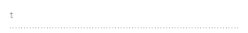

# Accessibility in Blazor AutoComplete Component

The [AutoComplete](https://help.syncfusion.com/cr/blazor/Syncfusion.Blazor.DropDowns.SfAutoComplete-2.html) component has been designed, keeping in mind the [WAI-ARIA](https://www.w3.org/WAI/ARIA/apg/) specifications, and applies the `WAI-ARIA` roles, states, and properties along with `keyboard support`. This component is characterized by complete keyboard interaction support and ARIA accessibility support that makes it easy for people who use assistive technologies (AT) or those who completely rely on keyboard navigation.

The AutoComplete component followed the accessibility guidelines and standards, including [ADA](https://www.ada.gov/), [Section 508](https://www.section508.gov/), [WCAG 2.2](https://www.w3.org/TR/WCAG22/) standards, and [WCAG roles](https://www.w3.org/TR/wai-aria/#roles) that are commonly used to evaluate accessibility.

The accessibility compliance for the AutoComplete component is outlined below.

| Accessibility Criteria | Compatibility |
| -- | -- |
| [WCAG 2.2 Support](../common/accessibility#accessibility-standards) |  |
| [Section 508 Support](../common/accessibility#accessibility-standards) |  |
| [Screen Reader Support](../common/accessibility#screen-reader-support) |  |
| [Right-To-Left Support](../common/accessibility#right-to-left-support) |  |
| [Color Contrast](../common/accessibility#color-contrast) |  |
| [Mobile Device Support](../common/accessibility#mobile-device-support) |  |
| [Keyboard Navigation Support](../common/accessibility#keyboard-navigation-support) |  |
| [Accessibility Checker Validation](../common/accessibility#ensuring-accessibility) |  |
| [Axe-core Accessibility Validation](../common/accessibility#ensuring-accessibility) |  |

<style>
    .post .post-content img {
        display: inline-block;
        margin: 0.5em 0;
    }
</style>
<div> - All features of the component meet the requirement.</div>

<div> - Some features of the component do not meet the requirement.</div>

<div> - The component does not meet the requirement.</div>


## WAI-ARIA attributes

The AutoComplete component uses the `combobox` role and each list item has an `option` role. The following `ARIA Attributes` denotes the AutoComplete state:

| **Property** | **Functionalities** |
| --- | --- |
| aria-haspopup | Indicates whether the AutoComplete input element has a suggestion list or not. |
| aria-expanded | Indicates whether the suggestion list has expanded or not. |
| aria-selected | Indicates the selected option from the list. |
| aria-readonly | Indicates the readonly state of the AutoComplete element. |
| aria-disabled | Indicates whether the AutoComplete component is in disabled state or not.|
| aria-activedescendent | This attribute holds the ID of the active list item to focus its descendant child element. |
| aria-owns | This attribute contains the ID of the suggestion list to indicate popup as a child element. |
| aria-autocomplete | This attribute contains the ‘both’ to a list of options shows and the currently selected suggestion also shows inline. |

## Keyboard interaction

You can use the following key shortcuts to access the AutoComplete without interruptions:

| **Keyboard shortcuts** | **Actions** |
| --- | --- |
| <kbd>Arrow Down</kbd> | In popup hidden state, opens the suggestion list. In popup open state, selects the first item when no item selected else selects the item next to the currently selected item. |
| <kbd>Arrow Up</kbd> | In popup hidden state, opens the suggestion list. In popup open state, selects the last item when no item selected else selects the item previous to the currently selected one. |
| <kbd>Page Down</kbd> | Scrolls down to the next page and selects the first item when popup list opens. |
| <kbd>Page Up</kbd> | Scrolls up to previous page and selects the first item when popup list opens. |
| <kbd>Enter</kbd> | Selects the focused item and set to AutoComplete component. |
| <kbd>Tab</kbd> | Focuses the next tab indexed element when the popup is closed. Otherwise, closes the popup list and remains the focus in component if it is in open state. |
| <kbd>Shift + tab </kbd> | Focuses the previous tab indexed element when the popup is closed.  Otherwise, closes the popup list and remains the focus in component if it is in open state. |
| <kbd>Alt + Down</kbd> | Opens the popup list. |
| <kbd>Alt + Up</kbd> | In popup hidden state, opens the popup list. In popup open state, closes the popup list. |
| <kbd>Esc(Escape)</kbd> | Closes the popup list when it is in open state then removes the selection. |
| <kbd>Home</kbd> | Moves the cursor before the first character in input. |
| <kbd>End</kbd> | Moves the cursor next to the last character in input. |

N> In the following sample, disable the AutoComplete component using <kbd>t</kbd> keys.

```cshtml
@using Syncfusion.Blazor.DropDowns

<SfAutoComplete TValue="string" TItem="Country" @ref="AutoObj" Placeholder="Select a country" Enabled="@enable" @onkeypress="@(e => KeyPressed(e))" DataSource="@LocalData">
    <AutoCompleteFieldSettings Value="Name"></AutoCompleteFieldSettings>
</SfAutoComplete>

@code {

    public SfAutoComplete<string, Country> AutoObj;

    public bool enable { get; set; } = true ;
    public class Country
    {
        public string Name { get; set; }
        public string Code { get; set; }
    }

    List<Country> LocalData = new List<Country> {
        new Country() { Name = "Australia", Code = "AU" },
        new Country() { Name = "Bermuda", Code = "BM" },
        new Country() { Name = "Canada", Code = "CA" },
        new Country() { Name = "Cameroon", Code = "CM" },
        new Country() { Name = "Denmark", Code = "DK" },
        new Country() { Name = "France", Code = "FR" },
        new Country() { Name = "Finland", Code = "FI" },
        new Country() { Name = "Germany", Code = "DE" },
        new Country() { Name = "Greenland", Code = "GL" },
        new Country() { Name = "Hong Kong", Code = "HK" },
    };

    public void KeyPressed(KeyboardEventArgs args)
    {
        if (args.Key == "t")
        {
            enable = false;
        }
    }
}
```




## Ensuring accessibility

The AutoComplete component's accessibility levels are ensured through an [accessibility-checker](https://www.npmjs.com/package/accessibility-checker) and [axe-core](https://www.npmjs.com/package/axe-core) software tools during automated testing.

The accessibility compliance of the AutoComplete component is shown in the following sample. Open the [sample](https://blazor.syncfusion.com/accessibility/autocomplete) in a new window to evaluate the accessibility of the AutoComplete component with accessibility tools.



## See also

* [Accessibility in Syncfusion components](../common/accessibility)