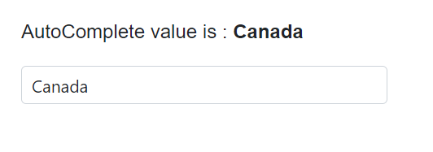

# Data Binding in AutoComplete

The AutoComplete loads data from local collections or remote services. Use the [DataSource](https://help.syncfusion.com/cr/blazor/Syncfusion.Blazor.DropDowns.SfDropDownBase-1.html#Syncfusion_Blazor_DropDowns_SfDropDownBase_1_DataSource) property to bind local data, or configure remote data using the [DataManager](https://help.syncfusion.com/cr/blazor/Syncfusion.Blazor.DataManager.html).

* TItem - Specifies the type of the AutoComplete data source.

## Binding local data

Load data from local sources using the [DataSource](https://help.syncfusion.com/cr/blazor/Syncfusion.Blazor.DropDowns.SfDropDownBase-1.html#Syncfusion_Blazor_DropDowns_SfDropDownBase_1_DataSource) property. Supported types include: Array or List of primitives, Array or List of objects, ObservableCollection, ExpandoObject, and DynamicObject.









### DataBound event

The [DataBound](https://help.syncfusion.com/cr/blazor/Syncfusion.Blazor.DropDowns.AutoCompleteEvents-2.html#Syncfusion_Blazor_DropDowns_AutoCompleteEvents_2_DataBound) event is triggered after the data source is populated in the popup list.







### Primitive type

Bind arrays or lists of primitive types such as `string`, `int`, `double`, and `bool`.

The following example binds an array of strings to the AutoComplete component.








The following example binds an array of integers to the AutoComplete component.








### Complex data type

Generate list items from an array of complex objects by mapping fields using the [Fields](https://help.syncfusion.com/cr/blazor/Syncfusion.Blazor.DropDowns.AutoCompleteFieldSettings.html) property.

In the following example, the `Country.CountryID` column is mapped to the [AutoCompleteFieldSettings.Value](https://help.syncfusion.com/cr/blazor/Syncfusion.Blazor.DropDowns.AutoCompleteFieldSettings.html#Syncfusion_Blazor_DropDowns_AutoCompleteFieldSettings_Value) field.









### Expando object binding

Bind [ExpandoObject](https://learn.microsoft.com/en-us/dotnet/api/system.dynamic.expandoobject?view=net-8.0) data to the AutoComplete. The following example binds a collection of vehicles.








### Observable collection binding

Bind an [ObservableCollection](https://blazor.syncfusion.com/documentation/common/data-binding/data-updates#observable-collection) so UI updates reflect collection changes automatically. The following example binds a collection of colors.









### Dynamic object binding

Bind [DynamicObject](https://learn.microsoft.com/en-us/dotnet/api/system.dynamic.dynamicobject?view=net-8.0) instances to the AutoComplete. The following example binds a collection of customers.








### Enum data binding

Bind enum values to the AutoComplete. The following example shows how to display the description value from enumeration data.








## Binding remote data 

Load data from remote services using the [DataManager](https://blazor.syncfusion.com/documentation/data/getting-started). Use the [Query](https://help.syncfusion.com/cr/blazor/Syncfusion.Blazor.DropDowns.SfDropDownBase-1.html#Syncfusion_Blazor_DropDowns_SfDropDownBase_1_Query) property to shape requests and bind results to the AutoComplete.

* [DataManager.Url](https://help.syncfusion.com/cr/blazor/Syncfusion.Blazor.DataManager.html#Syncfusion_Blazor_DataManager_Url) - Service endpoint to fetch data.
* [DataManager.Adaptor](https://help.syncfusion.com/cr/blazor/Syncfusion.Blazor.DataManager.html#Syncfusion_Blazor_DataManager_Adaptor) - Adaptor for the service. By default, [ODataAdaptor](https://blazor.syncfusion.com/documentation/data/adaptors#odata-adaptor) is used for remote binding.
* [Syncfusion.Blazor.Data](https://www.nuget.org/packages/Syncfusion.Blazor.Data/) provides predefined adaptors designed for common endpoints.

### OnActionBegin event

The [OnActionBegin](https://help.syncfusion.com/cr/blazor/Syncfusion.Blazor.DropDowns.AutoCompleteEvents-2.html#Syncfusion_Blazor_DropDowns_AutoCompleteEvents_2_OnActionBegin) event is triggered before fetching data from the remote server.









### OnActionComplete event

The [OnActionComplete](https://help.syncfusion.com/cr/blazor/Syncfusion.Blazor.DropDowns.AutoCompleteEvents-2.html#Syncfusion_Blazor_DropDowns_AutoCompleteEvents_2_OnActionComplete) event is triggered after data is fetched successfully.







### OnActionFailure event

The [OnActionFailure](https://help.syncfusion.com/cr/blazor/Syncfusion.Blazor.DropDowns.AutoCompleteEvents-2.html#Syncfusion_Blazor_DropDowns_AutoCompleteEvents_2_OnActionFailure) event is triggered when the data fetch request fails.







### OData v4 services

Use the [OData v4 Adaptor](https://blazor.syncfusion.com/documentation/data/adaptors#odatav4-adaptor) to consume data from OData v4 services. The following sample displays the first six customer records from the `Customers` table of the `Northwind` service.








### Web API adaptor

The [Web API Adaptor](https://blazor.syncfusion.com/documentation/data/adaptors#web-api-adaptor) interacts with Web API endpoints that understand OData-formatted queries. It extends the [ODataAdaptor](https://blazor.syncfusion.com/documentation/data/adaptors#odata-adaptor).








### Custom adaptor

The [SfDataManager](https://help.syncfusion.com/cr/aspnetcore-blazor/Syncfusion.Blazor.Data.SfDataManager.html) supports custom adaptors for manual data operations. Implement a custom adaptor by inheriting from `DataAdaptor` and overriding `Read` or `ReadAsync` to control data retrieval for the AutoComplete.

```csharp
public abstract class DataAdaptor
{
    /// <summary>
    /// Performs data Read operation synchronously.
    /// </summary>
    public virtual object Read(DataManagerRequest dataManagerRequest, string key = null)

    /// <summary>
    /// Performs data Read operation asynchronously.
    /// </summary>
    public virtual Task<object> ReadAsync(DataManagerRequest dataManagerRequest, string key = null)
}
```

The following example demonstrates custom data binding using a custom adaptor.







### Offline mode

To avoid a round trip for every action, load data once on initialization and process actions on the client by setting the DataManager’s `Offline` property to true.

The following example shows remote data binding with offline mode enabled.








### Entity Framework

Follow these steps to consume data from [Entity Framework](https://blazor.syncfusion.com/documentation/common/data-binding/bind-entity-framework) in the AutoComplete component.

#### Create DBContext class

Create a `DbContext` class (`OrderContext`) to connect to SQL Server.

```csharp
using Microsoft.EntityFrameworkCore;
using System;
using System.Collections.Generic;
using System.Linq;
using System.Threading.Tasks;
using EFDropDown.Shared.Models;

namespace EFDropDown.Shared.DataAccess
{
    public class OrderContext : DbContext
    {
        public virtual DbSet<Shared.Models.Order> Orders { get; set; }

        protected override void OnConfiguring(DbContextOptionsBuilder optionsBuilder)
        {
            if (!optionsBuilder.IsConfigured)
            {
                optionsBuilder.UseSqlServer(@"Data Source=(LocalDB)\MSSQLLocalDB;AttachDbFilename=D:\Blazor\DropDownList\EFDropDown\Shared\App_Data\NORTHWND.MDF;Integrated Security=True;Connect Timeout=30");
            }
        }
    }
}
```

#### Create data access layer to perform data operation

Create a data access class (`OrderDataAccessLayer`) to retrieve records from the database.

```csharp
using Microsoft.EntityFrameworkCore;
using System;
using System.Collections.Generic;
using System.Linq;
using System.Threading.Tasks;
using EFDropDown.Shared.Models;

namespace EFDropDown.Shared.DataAccess
{
    public class OrderDataAccessLayer
    {
        OrderContext db = new OrderContext();

        //To Get all Orders details
        public DbSet<Order> GetAllOrders()
        {
            try
            {
                return db.Orders;
            }
            catch
            {
                throw;
            }
        }
    }
}
```

#### Creating web API controller

Create a Web API controller that allows the AutoComplete to consume data directly from Entity Framework.

```csharp
using EFDropDown.Shared.DataAccess;
using EFDropDown.Shared.Models;
using Microsoft.AspNetCore.Mvc;
using Microsoft.Extensions.Primitives;
using System;
using System.Collections.Generic;
using System.Linq;
using System.Threading.Tasks;
using System.Web;
using Microsoft.AspNetCore.Http;

namespace EFDropDown.Controllers
{
    [Route("api/[controller]")]
    [ApiController]
    //TreeGrid
    public class DefaultController : ControllerBase
    {
        OrderDataAccessLayer db = new OrderDataAccessLayer();
        [HttpGet]
        public object Get()
        {
            IQueryable<Order> data = db.GetAllOrders().AsQueryable();
            var count = data.Count();
            var queryString = Request.Query;
            if (queryString.Keys.Contains("$inlinecount"))
            {
                StringValues Skip;
                StringValues Take;
                int skip = (queryString.TryGetValue("$skip", out Skip)) ? Convert.ToInt32(Skip[0]) : 0;
                int top = (queryString.TryGetValue("$top", out Take)) ? Convert.ToInt32(Take[0]) : data.Count();
                return new { Items = data.Skip(skip).Take(top), Count = count };
            }
            else
            {
                return data;
            }
        }
    }
}
```

### Configure AutoComplete component using Web API adaptor

Configure the AutoComplete with [SfDataManager](https://blazor.syncfusion.com/documentation/data/getting-started) to interact with the Web API using the [WebApiAdaptor](https://blazor.syncfusion.com/documentation/data/adaptors#web-api-adaptor).







## Adding new items

Add new items to the popup list using the [AddItemsAsync](https://help.syncfusion.com/cr/blazor/Syncfusion.Blazor.DropDowns.SfDropDownBase-1.html#Syncfusion_Blazor_DropDowns_SfDropDownBase_1_AddItemsAsync_System_Collections_Generic_IEnumerable__0__System_Nullable_System_Int32__) method. This adds items to the popup without modifying the underlying data source.





