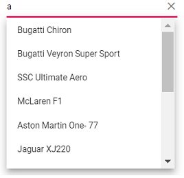
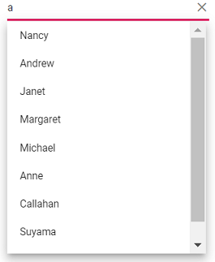
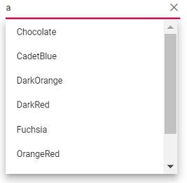

# Data Source in Blazor AutoComplete Component

The AutoComplete loads the data either from local data sources or remote data services using the [DataSource](https://help.syncfusion.com/cr/blazor/Syncfusion.Blazor.DropDowns.SfDropDownBase-1.html#Syncfusion_Blazor_DropDowns_SfDropDownBase_1_DataSource) property. It supports the data type of array or [DataManager](https://help.syncfusion.com/cr/blazor/Syncfusion.Blazor.DataManager.html).

The AutoComplete also supports different kinds of data services such as OData, OData V4, and Web API and data formats such as XML, JSON, JSONP with the help of DataManager Adaptors.

| Fields  | Type            | Description                                                                                  |
| ------- | --------------- | -------------------------------------------------------------------------------------------- |
| Value   | `int or string` | Specifies the hidden data value mapped to each list item that should contain a unique value. |
| GroupBy | `string`        | Specifies the category under which the list item has to be grouped.                          |
| IconCss | `string`        | Specifies the icon class of each list item.                                                  |

N> While binding complex data to AutoComplete, fields should be mapped correctly. Otherwise, the selected item remains undefined.

## Bind to local data

Local data can be represented in two ways as described below.

### Array of object

The AutoComplete can generate its list items through an array of complex data. For this, the appropriate columns should be mapped to the [Fields](https://help.syncfusion.com/cr/blazor/Syncfusion.Blazor.DropDowns.FieldSettingsModel.html) property.

In the following example, `Name` column from complex data have been mapped to the `Value` field.

```cshtml
@using Syncfusion.Blazor.DropDowns

<SfAutoComplete TValue="string" TItem="Country" Placeholder="e.g. Australia" DataSource="@Countries">
    <AutoCompleteFieldSettings Value="Name"></AutoCompleteFieldSettings>
</SfAutoComplete>

@code {

    public class Country
    {
        public string Name { get; set; }

        public string Code { get; set; }
    }

    List<Country> Countries = new List<Country>
    {
        new Country() { Name = "Australia", Code = "AU" },
        new Country() { Name = "Bermuda", Code = "BM" },
        new Country() { Name = "Canada", Code = "CA" },
        new Country() { Name = "Cameroon", Code = "CM" },
        new Country() { Name = "Denmark", Code = "DK" },
        new Country() { Name = "France", Code = "FR" },
        new Country() { Name = "Finland", Code = "FI" },
        new Country() { Name = "Germany", Code = "DE" },
        new Country() { Name = "Greenland", Code = "GL" },
        new Country() { Name = "Hong Kong", Code = "HK" },
        new Country() { Name = "India", Code = "IN" },
        new Country() { Name = "Italy", Code = "IT" },
        new Country() { Name = "Japan", Code = "JP" },
        new Country() { Name = "Mexico", Code = "MX" },
        new Country() { Name = "Norway", Code = "NO" },
        new Country() { Name = "Poland", Code = "PL" },
        new Country() { Name = "Switzerland", Code = "CH" },
        new Country() { Name = "United Kingdom", Code = "GB" },
        new Country() { Name = "United States", Code = "US" },
    };
}
```





### Array of complex object

The AutoComplete can generate its list items through an array of complex data. For this, the appropriate columns should be mapped to the [Fields](https://help.syncfusion.com/cr/blazor/Syncfusion.Blazor.DropDowns.FieldSettingsModel.html) property.

In the following example, `Country.CountryID` column from complex data have been mapped to the `Value` field.

```cshtml
@using Syncfusion.Blazor.DropDowns

<SfAutoComplete TValue="string" TItem="Complex" Placeholder="e.g. Select a country" DataSource="@LocalData">
<AutoCompleteFieldSettings Value="Country.CountryID" ></AutoCompleteFieldSettings>
</SfAutoComplete>

@code {

    public IEnumerable<Complex> LocalData { get; set; } = new Complex().GetData();

    public class Code
    {
        public string ID { get; set; }
    }

    public class Country
    {
        public string CountryID { get; set; }
    }

    public class Complex
    {
        public Country Country { get; set; }
        public Code Code { get; set; }
        public List<Complex> GetData()
        {
            List<Complex> Data = new List<Complex>();
            Data.Add(new Complex() { Country = new Country() { CountryID = "Australia" }, Code = new Code() { ID = "AU" } });
            Data.Add(new Complex() { Country = new Country() { CountryID = "Bermuda" }, Code = new Code() { ID = "BM" } });
            Data.Add(new Complex() { Country = new Country() { CountryID = "Canada" }, Code = new Code() { ID = "CA" } });
            Data.Add(new Complex() { Country = new Country() { CountryID = "Cameroon" }, Code = new Code() { ID = "CM" } });
            Data.Add(new Complex() { Country = new Country() { CountryID = "Denmark" }, Code = new Code() { ID = "DK" } });
            Data.Add(new Complex() { Country = new Country() { CountryID = "France" }, Code = new Code() { ID = "FR" } });
            return Data;
        }
    }
}
```




## Bind to remote data

The AutoComplete supports retrieval of data from remote data services with the help of [DataManager](https://help.syncfusion.com/cr/blazor/Syncfusion.Blazor.DropDowns.SfDropDownBase-1.html#Syncfusion_Blazor_DropDowns_SfDropDownBase_1_Query) property, which is used to fetch data from the database and bind it to the AutoComplete.

The following sample displays the first 6 contacts from the **Customers** table of the `Northwind` data service.

```cshtml
@using Syncfusion.Blazor
@using Syncfusion.Blazor.Data
@using Syncfusion.Blazor.DropDowns

        <SfAutoComplete TValue="string" TItem="OrderDetails" Placeholder="Select a name" Query="@RemoteDataQuery" Autofill="true">
            <SfDataManager Url="https://js.syncfusion.com/demos/ejServices/Wcf/Northwind.svc/Orders" CrossDomain="true" Adaptor="Syncfusion.Blazor.Adaptors.ODataAdaptor"></SfDataManager>
            <AutoCompleteFieldSettings Value="CustomerID"></AutoCompleteFieldSettings>
        </SfAutoComplete>

@code{

    public Query RemoteDataQuery = new Query().Select(new List<string> { "CustomerID" }).Take(6).RequiresCount();

    public Syncfusion.Blazor.Lists.SortOrder Sort { get; set; } = Syncfusion.Blazor.Lists.SortOrder.Ascending;

     public class OrderDetails
    {
        public int? OrderID { get; set; }
        public string CustomerID { get; set; }
        public int? EmployeeID { get; set; }
        public double? Freight { get; set; }
        public string ShipCity { get; set; }
        public bool Verified { get; set; }
        public DateTime? OrderDate { get; set; }
        public string ShipName { get; set; }
        public string ShipCountry { get; set; }
        public DateTime? ShippedDate { get; set; }
        public string ShipAddress { get; set; }
    }
}
```




### Web API Adaptor

Use the `WebApiAdaptor` to bind autocomplete with Web API created using OData.

```cshtml
@using Syncfusion.Blazor.Data
@using Syncfusion.Blazor.DropDowns

<SfAutoComplete TValue="string" TItem="OrderDetails" Placeholder="Select a name" Query="@Query">
    <SfDataManager Url="https://ej2services.syncfusion.com/production/web-services/api/Orders" Adaptor="Syncfusion.Blazor.Adaptors.WebApiAdaptor" CrossDomain=true></SfDataManager>
    <AutoCompleteFieldSettings Value="CustomerID"></AutoCompleteFieldSettings>
</SfAutoComplete>

@code {
    public Query Query = new Query().Select(new List<string> { "CustomerID" }).Take(6).RequiresCount();
    public class OrderDetails
    {
        public int? OrderID { get; set; }
        public string CustomerID { get; set; }
        public int? EmployeeID { get; set; }
        public double? Freight { get; set; }
        public string ShipCity { get; set; }
        public bool Verified { get; set; }
        public DateTime? OrderDate { get; set; }
        public string ShipName { get; set; }
        public string ShipCountry { get; set; }
        public DateTime? ShippedDate { get; set; }
        public string ShipAddress { get; set; }
    }
}
```



### Custom adaptor

The [SfDataManager](https://help.syncfusion.com/cr/blazor/Syncfusion.Blazor.Data.SfDataManager.html) has custom adaptor support which allows you to perform manual operations on the data. This can be utilized for implementing custom data binding and editing operations in the AutoComplete component.

For implementing custom data binding in AutoComplete, the `DataAdaptor` class is used. This abstract class acts as a base class for the custom adaptor.

The `DataAdaptor` abstract class has both synchronous and asynchronous method signatures which can be overridden in the custom adaptor. Following are the method signatures present in this class,

```c#
public abstract class DataAdaptor
{
    /// <summary>
    /// Performs data Read operation synchronously.
    /// </summary>
    public virtual object Read(DataManagerRequest dataManagerRequest, string key = null)

    /// <summary>
    /// Performs data Read operation asynchronously.
    /// </summary>
    public virtual Task<object> ReadAsync(DataManagerRequest dataManagerRequest, string key = null)
}
```

The custom data binding can be performed in the AutoComplete component by providing the custom adaptor class and overriding the Read or ReadAsync method of the DataAdaptor abstract class.

The following sample code demonstrates implementing custom data binding using custom adaptor,

```cshtml
<SfAutoComplete TValue="string" TItem="Orders">
    <SfDataManager AdaptorInstance="@typeof(CustomAdaptor)" Adaptor="Adaptors.CustomAdaptor"></SfDataManager>
    <AutoCompleteFieldSettings Value="CustomerID"></AutoCompleteFieldSettings>
</SfAutoComplete>

@code{

    public class Orders
    {
        public Orders() { }
        public Orders(int OrderID, string CustomerID)
        {
            this.OrderID = OrderID;
            this.CustomerID = CustomerID;
        }
        public int OrderID { get; set; }
        public string CustomerID { get; set; }
    }
    public class CustomAdaptor : DataAdaptor
    {
        static readonly HttpClient client = new HttpClient();
        public static List<OrdersDetails> order = OrdersDetails.GetAllRecords();
        public override object Read(DataManagerRequest dm, string key = null)
        {
            IEnumerable<OrdersDetails> DataSource = order;
            if (dm.Search != null && dm.Search.Count > 0)
            {
                DataSource = DataOperations.PerformSearching(DataSource, dm.Search);  //Search
            }
            if (dm.Sorted != null && dm.Sorted.Count > 0) //Sorting
            {
                DataSource = DataOperations.PerformSorting(DataSource, dm.Sorted);
            }
            if (dm.Where != null && dm.Where.Count > 0) //Filtering
            {
                DataSource = DataOperations.PerformFiltering(DataSource, dm.Where, dm.Where[0].Operator);
            }
            int count = DataSource.Cast<OrdersDetails>().Count();
            if (dm.Skip != 0)
            {
                DataSource = DataOperations.PerformSkip(DataSource, dm.Skip);         //Paging
            }
            if (dm.Take != 0)
            {
                DataSource = DataOperations.PerformTake(DataSource, dm.Take);
            }
            return dm.RequiresCounts ? new DataResult() { Result = DataSource, Count = count } : (object)DataSource;
       }
    }
}
```

### Offline mode

To avoid post back for every action, set the autocomplete to load all data on initialization and make the actions process in client-side. To enable this behavior, use the `Offline` property of `DataManager`.

Refer to the following example for remote data binding and enabled offline mode.

```cshtml
@using Syncfusion.Blazor.Data
@using Syncfusion.Blazor.DropDowns

<SfAutoComplete TValue="string" TItem="EmployeeData" Placeholder="Select a Employee" Query="@Query">
    <SfDataManager Url="https://ej2services.syncfusion.com/production/web-services/api/Employees" Offline=true Adaptor="Adaptors.WebApiAdaptor" CrossDomain=true></SfDataManager>
    <AutoCompleteFieldSettings Value="FirstName"></AutoCompleteFieldSettings>
</SfAutoComplete>

@code{
    public Query Query = new Query().Select(new List<string> { "FirstName" }).Take(6).RequiresCount();
    public class EmployeeData
    {
        public int EmployeeID { get; set; }
        public string FirstName { get; set; }
        public string Designation { get; set; }
        public string Country { get; set; }
    }
}
```



### ValueTuple data binding

You can bind [ValueTuple](https://learn.microsoft.com/en-us/dotnet/api/system.valuetuple-2?view=net-8.0) data to AutoComplete component. The following code helps you get a string value from the enumeration data by using [ValueTuple](https://learn.microsoft.com/en-us/dotnet/api/system.valuetuple-2?view=net-8.0).

```csharp

@using Syncfusion.Blazor.DropDowns;

<SfAutoComplete TItem="(DayOfWeek, string)" Width="250px" TValue="DayOfWeek"
                DataSource="@(Enum.GetValues<DayOfWeek>().Select(e => (e, e.ToString())))">
    <AutoCompleteFieldSettings Value="Item1" />
</SfAutoComplete>

```



## Binding ExpandoObject

You can bind [ExpandoObject](https://learn.microsoft.com/en-us/dotnet/api/system.dynamic.expandoobject?view=net-8.0) data to the AutoComplete component. The following example `ExpandoObject` is bound to the collection of vehicles data.

```csharp

@using Syncfusion.Blazor.DropDowns
@using System.Dynamic

<SfAutoComplete TItem="ExpandoObject" TValue="string" PopupHeight="230px" Placeholder="Select a vehicle" DataSource="@VehicleData">
    <AutoCompleteFieldSettings Value="Text"></AutoCompleteFieldSettings>
</SfAutoComplete>

@code{
    public List<ExpandoObject> VehicleData { get; set; } = new List<ExpandoObject>();
    protected override void OnInitialized()
    {
        VehicleData = Enumerable.Range(1, 15).Select((x) =>
        {
            dynamic d = new ExpandoObject();
            d.ID = (1000 + x).ToString();
            d.Text = (new string[] { "Hennessey Venom", "Bugatti Chiron", "Bugatti Veyron Super Sport", "SSC Ultimate Aero", "Koenigsegg CCR", "McLaren F1", "Aston Martin One- 77", "Jaguar XJ220", "McLaren P1", "Ferrari LaFerrari", "Mahindra Jaguar", "Hyundai Toyota", "Jeep Volkswagen", "Tata Maruti Suzuki", "Audi Mercedes Benz" }[x - 1]);
            return d;
        }).Cast<ExpandoObject>().ToList<ExpandoObject>();
    }
}

```




## Binding DynamicObject

You can bind [DynamicObject](https://learn.microsoft.com/en-us/dotnet/api/system.dynamic.dynamicobject?view=net-8.0) data to the AutoComplete component. The following example `DynamicObject` is bound to the collection of customers data.

```csharp

@using Syncfusion.Blazor.DropDowns
@using System.Dynamic

<SfAutoComplete TValue="string" TItem="DynamicDictionary" Placeholder="Select a name" DataSource="@Orders">
    <AutoCompleteFieldSettings Text="CustomerName" Value="CustomerName"></AutoCompleteFieldSettings>
</SfAutoComplete>

@code{
    public List<DynamicDictionary> Orders = new List<DynamicDictionary>() { };
    protected override void OnInitialized()
    {
        Orders = Enumerable.Range(1, 15).Select((x) =>
        {
            dynamic d = new DynamicDictionary();
            d.OrderID = 1000 + x;
            d.CustomerName = (new string[] { "Nancy", "Andrew", "Janet", "Margaret", "Steven", "Michael", "Robert", "Anne", "Nige", "Fuller", "Dodsworth", "Leverling", "Callahan", "Suyama", "Davolio" }[x - 1]);
            return d;
        }).Cast<DynamicDictionary>().ToList<DynamicDictionary>();
    }
    public class DynamicDictionary : System.Dynamic.DynamicObject
    {
        Dictionary<string, object> dictionary = new Dictionary<string, object>();
        public override bool TryGetMember(GetMemberBinder binder, out object result)
        {
            string name = binder.Name;
            return dictionary.TryGetValue(name, out result);
        }
        public override bool TrySetMember(SetMemberBinder binder, object value)
        {
            dictionary[binder.Name] = value;
            return true;
        }
        //The GetDynamicMemberNames method of DynamicObject class must be overridden and return the property names to perform data operation and editing while using DynamicObject.
        public override System.Collections.Generic.IEnumerable<string> GetDynamicMemberNames()
        {
            return this.dictionary?.Keys;
        }
    }
}

```




## Binding ObservableCollection

You can bind [ObservableCollection](https://learn.microsoft.com/en-us/dotnet/api/system.collections.objectmodel.observablecollection-1?view=net-8.0) data to the AutoComplete component. The following example `Observable Data` is bound to a collection of colors data.

```csharp

@using Syncfusion.Blazor.DropDowns
@using System.Collections.ObjectModel;

<SfAutoComplete TValue="string" TItem="Colors" PopupHeight="230px" Placeholder="Select a color" DataSource="@ColorsData">
    <AutoCompleteFieldSettings Value="Color"></AutoCompleteFieldSettings>
</SfAutoComplete>
@code {
    public class Colors
    {
        public string Code { get; set; }
        public string Color { get; set; }
    }
    private ObservableCollection<Colors> ColorsData = new ObservableCollection<Colors>()
    {
        new Colors() { Color = "Chocolate", Code = "#75523C" },
        new Colors() { Color = "CadetBlue", Code = "#3B8289" },
        new Colors() { Color = "DarkOrange", Code = "#FF843D" },
        new Colors() { Color = "DarkRed", Code = "#CA3832"},
        new Colors() { Color = "Fuchsia", Code = "#D44FA3" },
        new Colors() { Color = "HotPink", Code = "#F23F82" },
        new Colors() { Color = "Indigo", Code = "#2F5D81" },
        new Colors() { Color = "LimeGreen", Code = "#4CD242" },
        new Colors() { Color = "OrangeRed", Code = "#FE2A00" },
        new Colors() { Color = "Tomato", Code = "#FF745C" },
        new Colors() { Color = "Brown", Code = "#A52A2A" },
        new Colors() { Color = "Maroon", Code = "#800000" },
        new Colors() { Color = "Green", Code = "#008000" },
        new Colors() { Color = "Pink", Code = "#FFC0CB" },
        new Colors() { Color = "Purple", Code = "#800080" }
    };
}

```





## Entity Framework

You need to follow the below steps to consume data from the **Entity Framework** in the AutoComplete component.

### Create DBContext class

The first step is to create a DBContext class called **OrderContext** to connect to a Microsoft SQL Server database.

```c#
using Microsoft.EntityFrameworkCore;
using System;
using System.Collections.Generic;
using System.Linq;
using System.Threading.Tasks;
using EFDropDown.Shared.Models;

namespace EFDropDown.Shared.DataAccess
{
    public class OrderContext : DbContext
    {
        public virtual DbSet<Shared.Models.Order> Orders { get; set; }

        protected override void OnConfiguring(DbContextOptionsBuilder optionsBuilder)
        {
            if (!optionsBuilder.IsConfigured)
            {
                optionsBuilder.UseSqlServer(@"Data Source=(LocalDB)\MSSQLLocalDB;AttachDbFilename=D:\Blazor\DropDownList\EFDropDown\Shared\App_Data\NORTHWND.MDF;Integrated Security=True;Connect Timeout=30");
            }
        }
    }
}
```

### Create data access layer to perform data operation

Now you need to create a class named **OrderDataAccessLayer**, which act as data access layer for retrieving the records from the database table.

```c#
using Microsoft.EntityFrameworkCore;
using System;
using System.Collections.Generic;
using System.Linq;
using System.Threading.Tasks;
using EFDropDown.Shared.Models;

namespace EFDropDown.Shared.DataAccess
{
    public class OrderDataAccessLayer
    {
        OrderContext db = new OrderContext();

        //To Get all Orders details
        public DbSet<Order> GetAllOrders()
        {
            try
            {
                return db.Orders;
            }
            catch
            {
                throw;
            }
        }
    }
}
```

### Creating Web API Controller

A Web API Controller has to be created which allows AutoComplete directly to consume data from the Entity framework.

```c#
using EFDropDown.Shared.DataAccess;
using EFDropDown.Shared.Models;
using Microsoft.AspNetCore.Mvc;
using Microsoft.Extensions.Primitives;
using System;
using System.Collections.Generic;
using System.Linq;
using System.Threading.Tasks;
using System.Web;
using Microsoft.AspNetCore.Http;

namespace EFDropDown.Controllers
{
    [Route("api/[controller]")]
    [ApiController]
    //TreeGrid
    public class DefaultController : ControllerBase
    {
        OrderDataAccessLayer db = new OrderDataAccessLayer();
        [HttpGet]
        public object Get()
        {
            IQueryable<Order> data = db.GetAllOrders().AsQueryable();
            var count = data.Count();
            var queryString = Request.Query;
            if (queryString.Keys.Contains("$inlinecount"))
            {
                StringValues Skip;
                StringValues Take;
                int skip = (queryString.TryGetValue("$skip", out Skip)) ? Convert.ToInt32(Skip[0]) : 0;
                int top = (queryString.TryGetValue("$top", out Take)) ? Convert.ToInt32(Take[0]) : data.Count();
                return new { Items = data.Skip(skip).Take(top), Count = count };
            }
            else
            {
                return data;
            }
        }
    }
}
```

### Configure AutoComplete component using Web API adaptor

Now you can configure the AutoComplete using the **'SfDataManager'** to interact with the created Web API and consume the data appropriately. To interact with web api, you need to use WebApiAdaptor.

```cshtml
@using Syncfusion.Blazor.Data
@using Syncfusion.Blazor.DropDowns

<SfAutoComplete  TValue="string" TItem="Order" Placeholder="Select a Country">
    <SfDataManager Url="api/Default" Adaptor="Adaptors.WebApiAdaptor" CrossDomain="true"></SfDataManager>
    <AutoCompleteFieldSettings  Value="ShipCountry"></AutoCompleteFieldSettings>
</SfAutoComplete>

@code{
    public class Order
    {
        public string ShipCountry { get; set; }
    }
}
```