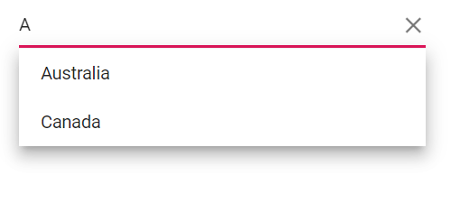
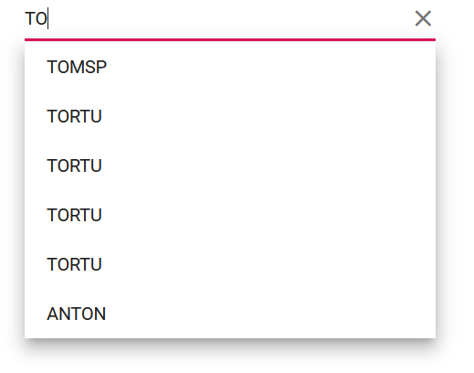
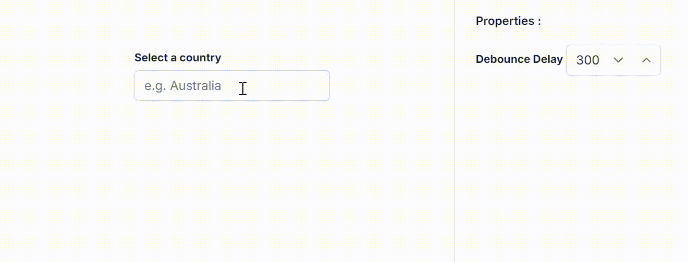
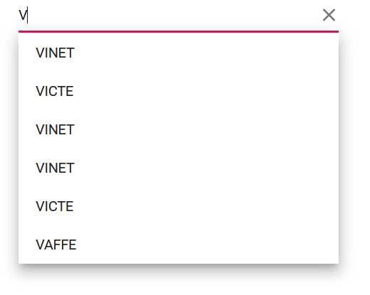
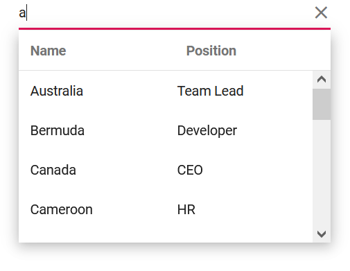
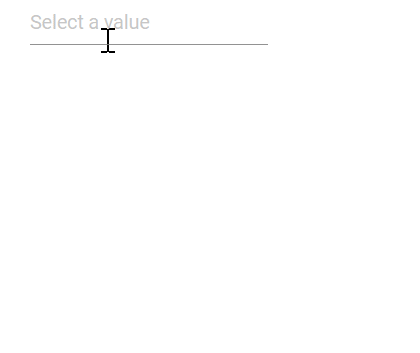
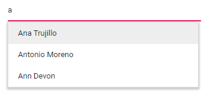
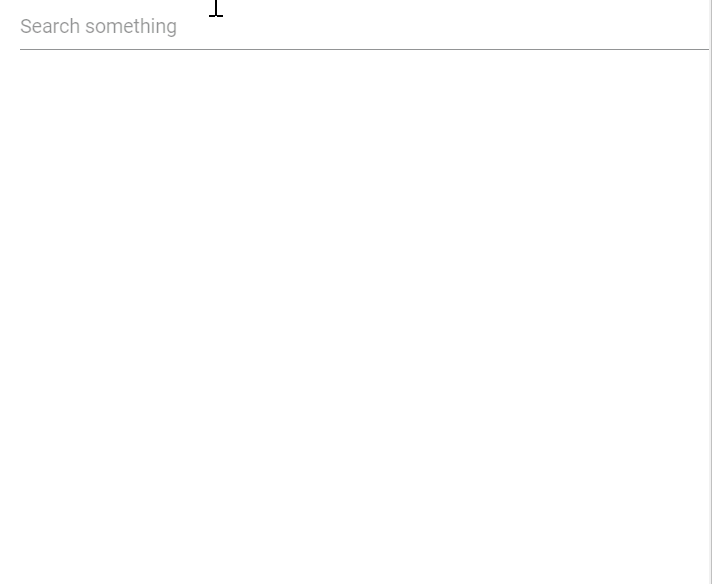
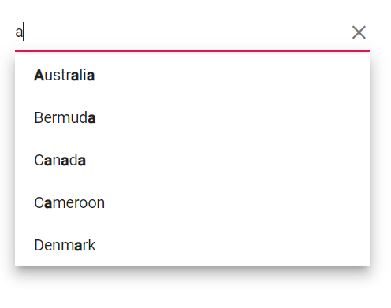

# Filtering in Blazor AutoComplete

The AutoComplete has built-in support to filter data items when [AllowFiltering](https://help.syncfusion.com/cr/blazor/Syncfusion.Blazor.DropDowns.SfDropDownList-2.html#Syncfusion_Blazor_DropDowns_SfDropDownList_2_AllowFiltering) is enabled. The filter operation starts as soon as you start typing characters in the search box.  Default value of AllowFiltering is `false`.

## Local data

The following code demonstrates the filtering functionality with local data in the AutoComplete component.







## Remote data

For Remote data, each key press, filter action request is made at the server end.

The below code demonstrates the filtering functionality with [ODataAdaptor](https://blazor.syncfusion.com/documentation/data/adaptors#odata-adaptor) in the AutoComplete component with help of [Query](https://help.syncfusion.com/cr/blazor/Syncfusion.Blazor.Data.Query.html) property.







## Debounce delay

You can use the [DebounceDelay](https://help.syncfusion.com/cr/blazor/Syncfusion.Blazor.DropDowns.SfAutoComplete-2.html#Syncfusion_Blazor_DropDowns_SfAutoComplete_2_DebounceDelay) property for filtering, enabling you to set a delay in milliseconds. This functionality helps reduce the frequency of filtering as you type, enhancing performance and responsiveness for a smoother user experience.By default, a DebounceDelay of 300ms is set. If you wish to disable this feature entirely, you can set it to 0ms.







## Filter type

You can use [FilterType](https://help.syncfusion.com/cr/blazor/Syncfusion.Blazor.DropDowns.SfAutoComplete-2.html#Syncfusion_Blazor_DropDowns_SfAutoComplete_2_FilterType) property to specify on which filter type needed to be considered on the search action of the component. The available `FilterType` and its supported data types are:

FilterType     | Description
------------ | -------------
  [StartsWith](https://help.syncfusion.com/cr/blazor/Syncfusion.Blazor.DropDowns.FilterType.html#Syncfusion_Blazor_DropDowns_FilterType_StartsWith)       | Checks whether a value begins with the specified value.
  [EndsWith](https://help.syncfusion.com/cr/blazor/Syncfusion.Blazor.DropDowns.FilterType.html#Syncfusion_Blazor_DropDowns_FilterType_EndsWith)     | Checks whether a value ends with specified value.
  [Contains](https://help.syncfusion.com/cr/blazor/Syncfusion.Blazor.DropDowns.FilterType.html#Syncfusion_Blazor_DropDowns_FilterType_Contains)      | Checks whether a value contained with specified value.

In the following example, `StartsWith` filter type has been mapped to the `FilterType` property.









## Minimum length

You can set the limit for the character count to filter the data on the AutoComplete. This can be done by setting the [MinLength](https://help.syncfusion.com/cr/blazor/Syncfusion.Blazor.DropDowns.SfAutoComplete-2.html#Syncfusion_Blazor_DropDowns_SfAutoComplete_2_MinLength) property to AutoComplete.

In the following example, the remote request does not fetch the search data until the search key contains three characters.









## Multi column filtering

In the built-in Syncfusion&reg; Blazor theme files, support for multi column can be enabled by adding `e-multi-column` class in the [CssClass](https://help.syncfusion.com/cr/blazor/Syncfusion.Blazor.DropDowns.DropDownListModel-2.html#Syncfusion_Blazor_DropDowns_DropDownListModel_2_CssClass) property.







You can achieve multiple column(field) filtering by passing the List of [predicates](https://help.syncfusion.com/cr/blazor/Syncfusion.Blazor.Data.WhereFilter.html#Syncfusion_Blazor_Data_WhereFilter_predicates) to the [And](https://help.syncfusion.com/cr/blazor/Syncfusion.Blazor.Data.WhereFilter.html#Syncfusion_Blazor_Data_WhereFilter_And_Syncfusion_Blazor_Data_WhereFilter_) or [Or](https://help.syncfusion.com/cr/blazor/Syncfusion.Blazor.Data.WhereFilter.html#Syncfusion_Blazor_Data_WhereFilter_Or_Syncfusion_Blazor_Data_WhereFilter_) methods of [WhereFilters](https://help.syncfusion.com/cr/blazor/Syncfusion.Blazor.Data.WhereFilter.html#Syncfusion_Blazor_Data_WhereFilter__ctor).







## Case sensitive filtering

The Data items can be filtered with or without case sensitivity using the [DataManager](https://help.syncfusion.com/cr/blazor/Syncfusion.Blazor.Data.SfDataManager.html). This can be done by passing the fourth optional parameter [IgnoreCase](https://help.syncfusion.com/cr/blazor/Syncfusion.Blazor.Data.WhereFilter.html#Syncfusion_Blazor_Data_WhereFilter_IgnoreCase) of the [Where clause](https://help.syncfusion.com/cr/blazor/Syncfusion.Blazor.Data.Query.html#Syncfusion_Blazor_Data_Query_Where_Syncfusion_Blazor_Data_WhereFilter_).

The following example shows how to perform case-sensitive filter.









## Custom filtering

The AutoComplete component filter queries can be customized using [Filtering](https://help.syncfusion.com/cr/blazor/Syncfusion.Blazor.DropDowns.AutoCompleteEvents-2.html#Syncfusion_Blazor_DropDowns_AutoCompleteEvents_2_Filtering) event. You can also filter the text in multiple columns in the data source.









## Suggestion item count

You can specify the filter suggestion item count using the [SuggestionCount](https://help.syncfusion.com/cr/blazor/Syncfusion.Blazor.DropDowns.SfAutoComplete-2.html#Syncfusion_Blazor_DropDowns_SfAutoComplete_2_SuggestionCount) property of AutoComplete.

Refer to the following example to restrict the suggestion list item counts as 3.









## AutoComplete with google search result

The Blazor AutoComplete component offers Google-like search suggestions. This functionality simulates the behavior of conducting a Google search with each keypress, displaying relevant results in the suggestion list.





 

### Highlighting Search character using property

You can highlight the search text in the suggested list items of the autocomplete component by using the `Highlight` property. When set to true, it will highlight the characters that match the search query in the list items.





 



### Highlighting Search character using method

You can highlight the search text in the suggested list items of the autocomplete component by using the `HighLightSearch` method. It accepts several arguments, including `textValue`, `ignoreCase`, `filtertype` and `highLighText`. When called, it will highlight the characters that match the search query in the list items."

* `textValue` - The text to be highlighted in the list item.
* `ignoreCase` - A boolean value which when set to true performs the search text based on casing.
* `filterType` - Determines on which filter type the highlight text is updated on the text.
* `highlightText` - The text to be highlighted. This is an optional argument. If not provided, it will use the filter value as the highlight text."





 


