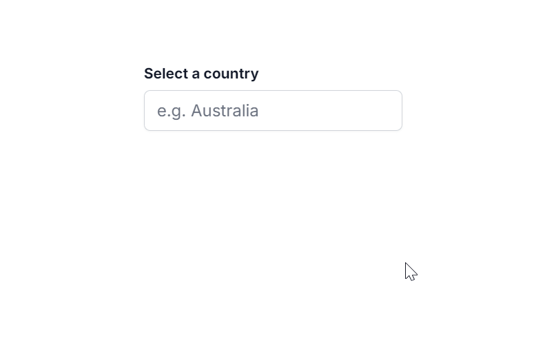

```markdown
---
layout: post
title: Filtering in Blazor AutoComplete Component | Syncfusion
description: Learn how to enable and configure data filtering in the Syncfusion Blazor AutoComplete component, including local/remote data, debounce delay, filter types, and custom filtering.
platform: Blazor
control: AutoComplete
documentation: ug
---

# Filtering in Blazor AutoComplete

The AutoComplete component provides built-in support for filtering data items when the [`AllowFiltering`](https://help.syncfusion.com/cr/blazor/Syncfusion.Blazor.DropDowns.SfAutoComplete-2.html#Syncfusion_Blazor_DropDowns_SfAutoComplete_2_AllowFiltering) property is enabled. Filtering begins as soon as you start typing characters in the search box. The default value for `AllowFiltering` is `false`.

## Local data

The following code demonstrates the filtering functionality with local data in the AutoComplete component.








## Remote data

For remote data, a filter action request is made to the server (via the [`DataManager`](https://help.syncfusion.com/cr/blazor/Syncfusion.Blazor.Data.SfDataManager.html) and its configured adaptor) with each key press, depending on the [`DebounceDelay`](#debounce-delay).

The code below demonstrates the filtering functionality with [`ODataAdaptor`](https://blazor.syncfusion.com/documentation/data/adaptors#odata-adaptor) in the AutoComplete component using the [`Query`](https://help.syncfusion.com/cr/blazor/Syncfusion.Blazor.Data.Query.html) property.








## Debounce delay

You can control the frequency of filtering operations by using the [`DebounceDelay`](https://help.syncfusion.com/cr/blazor/Syncfusion.Blazor.DropDowns.SfAutoComplete-2.html#Syncfusion_Blazor_DropDowns_SfAutoComplete_2_DebounceDelay) property, which sets a delay in milliseconds. This feature helps to reduce the number of filter requests as you type, improving performance and responsiveness for a smoother user experience, especially with remote data sources.

By default, the `DebounceDelay` is set to `300ms`. To disable this feature entirely (triggering a filter on every key stroke), you can set it to `0ms`.









## Filter type

You can specify the type of filter action to be used during the search operation using the [`FilterType`](https://help.syncfusion.com/cr/blazor/Syncfusion.Blazor.DropDowns.SfAutoComplete-2.html#Syncfusion_Blazor_DropDowns_SfAutoComplete_2_FilterType) property. These filter types are typically applied to string fields in your data.

| FilterType | Description |
| :--------- | :---------- |
| [`StartsWith`](https://help.syncfusion.com/cr/blazor/Syncfusion.Blazor.DropDowns.FilterType.html#Syncfusion_Blazor_DropDowns_FilterType_StartsWith) | Checks whether a value begins with the specified search string. |
| [`EndsWith`](https://help.syncfusion.com/cr/blazor/Syncfusion.Blazor.DropDowns.FilterType.html#Syncfusion_Blazor_DropDowns_FilterType_EndsWith) | Checks whether a value ends with the specified search string. |
| [`Contains`](https://help.syncfusion.com/cr/blazor/Syncfusion.Blazor.DropDowns.FilterType.html#Syncfusion_Blazor_DropDowns_FilterType_Contains) | Checks whether a value contains the specified search string. |

In the following example, `StartsWith` filter type has been mapped to the `FilterType` property.










## Minimum length

You can set a minimum character count required to trigger data filtering in the AutoComplete component by setting the [`MinLength`](https://help.syncfusion.com/cr/blazor/Syncfusion.Blazor.DropDowns.SfAutoComplete-2.html#Syncfusion_Blazor_DropDowns_SfAutoComplete_2_MinLength) property. This can reduce unnecessary filtering operations, especially with remote data.

In the following example, the search data will not be fetched (for either local or remote data) until the input contains at least three characters.










## Multi-column filtering

The AutoComplete component can visually present data across multiple columns. This layout support is enabled by adding the `e-multi-column` class to the [`CssClass`](https://help.syncfusion.com/cr/blazor/Syncfusion.Blazor.DropDowns.SfAutoComplete-2.html#Syncfusion_Blazor_DropDowns_SfAutoComplete_2_CssClass) property.








You can achieve filtering across multiple data fields by passing a list of [`predicates`](https://help.syncfusion.com/cr/blazor/Syncfusion.Blazor.Data.WhereFilter.html#Syncfusion_Blazor_Data_WhereFilter_predicates) to the [`And`](https://help.syncfusion.com/cr/blazor/Syncfusion.Blazor.Data.WhereFilter.html#Syncfusion_Blazor_Data_WhereFilter_And_Syncfusion_Blazor_Data_WhereFilter_) or [`Or`](https://help.syncfusion.com/cr/blazor/Syncfusion.Blazor.Data.WhereFilter.html#Syncfusion_Blazor_Data_WhereFilter_Or_Syncfusion_Blazor_Data_WhereFilter_) methods of [`WhereFilters`](https://help.syncfusion.com/cr/blazor/Syncfusion.Blazor.Data.WhereFilter.html).








## Case-sensitive filtering

Data items can be filtered with or without case sensitivity using the [`DataManager`](https://help.syncfusion.com/cr/blazor/Syncfusion.Blazor.Data.SfDataManager.html). This is done by setting the optional `IgnoreCase` parameter within a [`Where` clause](https://help.syncfusion.com/cr/blazor/Syncfusion.Blazor.Data.Query.html#Syncfusion_Blazor_Data_Query_Where_Syncfusion_Blazor_Data_WhereFilter_). Set `IgnoreCase` to `false` for case-sensitive filtering.

The following example shows how to perform case-sensitive filtering.









## Custom filtering

The AutoComplete component's filter queries can be customized using the [`Filtering`](https://help.syncfusion.com/cr/blazor/Syncfusion.Blazor.DropDowns.AutoCompleteEvents-2.html#Syncfusion_Blazor_DropDowns_AutoCompleteEvents_2_Filtering) event. This event allows you to implement custom logic, such as filtering text across multiple columns in the data source.









## Suggestion item count

You can specify the maximum number of filter suggestion items displayed in the dropdown list using the [`SuggestionCount`](https://help.syncfusion.com/cr/blazor/Syncfusion.Blazor.DropDowns.SfAutoComplete-2.html#Syncfusion_Blazor_DropDowns_SfAutoComplete_2_SuggestionCount) property of the AutoComplete.

Refer to the following example to restrict the suggestion list to 3 items.










## AutoComplete with Google search results

The Blazor AutoComplete component offers functionality for displaying Google-like search suggestions. This simulates the behavior of generating relevant results in the suggestion list with each keypress, often by querying an external service.





 


### Highlighting search characters using the Highlight property

You can highlight the search text within the suggested list items of the AutoComplete component by setting the [`Highlight`](https://help.syncfusion.com/cr/blazor/Syncfusion.Blazor.DropDowns.SfAutoComplete-2.html#Syncfusion_Blazor_DropDowns_SfAutoComplete_2_Highlight) property to `true`. When enabled, characters that match the search query in the list items will be visually emphasized.





 




### Highlighting search characters using a method

You can programmatically highlight the search text in the suggested list items of the AutoComplete component by using the `HighLightSearch` method. This method accepts several arguments, allowing for granular control over the highlighting process:

*   `textValue`: The text content of the list item where highlighting needs to occur.
*   `ignoreCase`: A boolean value which, when set to `true`, performs the search text comparison without considering casing.
*   `filterType`: Determines which filter type (`StartsWith`, `EndsWith`, `Contains`, etc.) dictates how the highlight text is matched within the `textValue`.
*   `highlightText`: (Optional) The specific text string to be highlighted. If not provided, the method typically uses the current filter value as the `highlightText`.





 



```