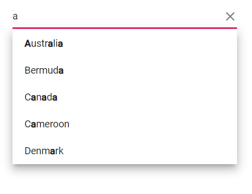

# Filtering in Blazor AutoComplete Component

The [AutoComplete](https://help.syncfusion.com/cr/blazor/Syncfusion.Blazor.DropDowns.SfAutoComplete-2.html) has built-in support to filter data items. The filter operation starts as soon as you start typing characters in the component.

## Change the filter type

Determines on which filter type the component needs to be considered on search action. The available [FilterType](https://help.syncfusion.com/cr/blazor/Syncfusion.Blazor.DropDowns.SfDropDownBase-1.html#Syncfusion_Blazor_DropDowns_SfDropDownBase_1_FilterType) and its supported data types are:

| **Filter Type** | **Description**                                         | **Supported Types** |
| --------------- | ------------------------------------------------------- | ------------------- |
| StartsWith      | Checks whether a value begins with the specified value. | String              |
| EndsWith        | Checks whether a value ends with specified value.       | String              |
| Contains        | Checks whether a value contains with specified value.   | String              |

The following examples shows data filtering is done with the `StartsWith` type.

```cshtml
@using Syncfusion.Blazor.Data
@using Syncfusion.Blazor.DropDowns

<SfAutoComplete TValue="string" TItem="OrderDetails"  Placeholder="Select a customerID" Query="@RemoteDataQuery" FilterType="Syncfusion.Blazor.DropDowns.FilterType.StartsWith">
    <SfDataManager Url="https://js.syncfusion.com/demos/ejServices/Wcf/Northwind.svc/Orders" Adaptor="Adaptors.ODataAdaptor" CrossDomain=true></SfDataManager>
    <AutoCompleteFieldSettings  Value="CustomerID"></AutoCompleteFieldSettings>
</SfAutoComplete>

@code {
    public Query RemoteDataQuery = new Query().Select(new List<string> { "CustomerID" }).Take(6).RequiresCount();
    public class OrderDetails
    {
        public int? OrderID { get; set; }
        public string CustomerID { get; set; }
        public int? EmployeeID { get; set; }
        public double? Freight { get; set; }
        public string ShipCity { get; set; }
        public bool Verified { get; set; }
        public DateTime? OrderDate { get; set; }
        public string ShipName { get; set; }
        public string ShipCountry { get; set; }
        public DateTime? ShippedDate { get; set; }
        public string ShipAddress { get; set; }
    }
}
```




## Filter item count

You can specify the filter suggestion item count using the [SuggestionCount](https://help.syncfusion.com/cr/blazor/Syncfusion.Blazor.DropDowns.SfAutoComplete-2.html#Syncfusion_Blazor_DropDowns_SfAutoComplete_2_SuggestionCount) property of AutoComplete.

Refer to the following example to restrict the suggestion list item counts as 3.

```cshtml
@using Syncfusion.Blazor.Data

<SfAutoComplete TValue="string" TItem="OrderDetails"  Placeholder="Select a customerID" SuggestionCount=3 Query="@RemoteDataQuery" FilterType="Syncfusion.Blazor.DropDowns.FilterType.StartsWith">
    <SfDataManager Url="https://js.syncfusion.com/demos/ejServices/Wcf/Northwind.svc/Orders" Adaptor="Adaptors.ODataAdaptor" CrossDomain=true></SfDataManager>
    <AutoCompleteFieldSettings  Value="CustomerID"></AutoCompleteFieldSettings>
</SfAutoComplete>

@code {

    public Query RemoteDataQuery = new Query().Select(new List<string> { "CustomerID" }).RequiresCount();
    public class OrderDetails
    {
        public int? OrderID { get; set; }
        public string CustomerID { get; set; }
        public int? EmployeeID { get; set; }
        public double? Freight { get; set; }
        public string ShipCity { get; set; }
        public bool Verified { get; set; }
        public DateTime? OrderDate { get; set; }
        public string ShipName { get; set; }
        public string ShipCountry { get; set; }
        public DateTime? ShippedDate { get; set; }
        public string ShipAddress { get; set; }
    }
}
```



## Limit the minimum filter character

You can set the limit for the character count to filter the data on the AutoComplete. This can be done by setting the [MinLength](https://help.syncfusion.com/cr/blazor/Syncfusion.Blazor.DropDowns.SfAutoComplete-2.html#Syncfusion_Blazor_DropDowns_SfAutoComplete_2_MinLength) property to AutoComplete.

In the following example, the remote request doesn't fetch the search data until the search key contains three characters.

```cshtml
@using Syncfusion.Blazor.Data
@using Syncfusion.Blazor.DropDowns

<SfAutoComplete TValue="string" TItem="OrderDetails"  Placeholder="Select a customerID" MinLength=3 Query="@RemoteDataQuery" FilterType="Syncfusion.Blazor.DropDowns.FilterType.StartsWith">
    <SfDataManager Url="https://js.syncfusion.com/demos/ejServices/Wcf/Northwind.svc/Orders" Adaptor="Adaptors.ODataAdaptor" CrossDomain=true></SfDataManager>
    <AutoCompleteFieldSettings Value="CustomerID"></AutoCompleteFieldSettings>
</SfAutoComplete>

@code {
    public Query RemoteDataQuery = new Query().Select(new List<string> { "CustomerID" }).RequiresCount();
    public class OrderDetails
    {
        public int? OrderID { get; set; }
        public string CustomerID { get; set; }
        public int? EmployeeID { get; set; }
        public double? Freight { get; set; }
        public string ShipCity { get; set; }
        public bool Verified { get; set; }
        public DateTime? OrderDate { get; set; }
        public string ShipName { get; set; }
        public string ShipCountry { get; set; }
        public DateTime? ShippedDate { get; set; }
        public string ShipAddress { get; set; }
    }
}
```



## Case sensitive filtering

Data items can be filtered either with or without case sensitivity using the DataManager. This can be done by setting the [IgnoreCase](https://help.syncfusion.com/cr/blazor/Syncfusion.Blazor.DropDowns.SfDropDownBase-1.html#Syncfusion_Blazor_DropDowns_SfDropDownBase_1_IgnoreCase) property of AutoComplete.

The following sample depicts how to filter the data with case-sensitive.

```cshtml
@using Syncfusion.Blazor.Data
@using Syncfusion.Blazor.DropDowns

<SfAutoComplete TValue="string" TItem="Country" Placeholder="Select a country" IgnoreCase=false DataSource="@LocalData">
    <AutoCompleteFieldSettings Value="Name"></AutoCompleteFieldSettings>
</SfAutoComplete>

@code {

    public class Country
    {
        public string Name { get; set; }
        public string Code { get; set; }
    }

    List<Country> LocalData = new List<Country> {
        new Country() { Name = "Australia", Code = "AU" },
        new Country() { Name = "Bermuda", Code = "BM" },
        new Country() { Name = "Canada", Code = "CA" },
        new Country() { Name = "Cameroon", Code = "CM" },
        new Country() { Name = "Denmark", Code = "DK" },
        new Country() { Name = "France", Code = "FR" },
        new Country() { Name = "Finland", Code = "FI" },
        new Country() { Name = "Germany", Code = "DE" },
        new Country() { Name = "Greenland", Code = "GL" },
        new Country() { Name = "Hong Kong", Code = "HK" },
    };
}
```


## Custom filtering

The AutoComplete component filter queries can be customized. You can also use your own filter libraries to filter data like Fuzzy search.

```cshtml
@using Syncfusion.Blazor.Data

<SfAutoComplete TValue="string" @ref="autoObj" TItem="Country" Placeholder="e.g. Australia" AllowFiltering="true">
    <AutoCompleteFieldSettings Text="Name" Value="Code"></AutoCompleteFieldSettings>
    <AutoCompleteEvents TValue="string" TItem="Country" Filtering="OnFilter"></AutoCompleteEvents>
</SfAutoComplete>

@code {

    SfAutoComplete<string, Country> autoObj { get; set; }

    public class Country
    {
        public string Name { get; set; }

        public string Code { get; set; }
    }

    List<Country> Country = new List<Country>
    {
        new Country() { Name = "Australia", Code = "AU" },
        new Country() { Name = "Bermuda", Code = "BM" },
        new Country() { Name = "Canada", Code = "CA" },
        new Country() { Name = "Cameroon", Code = "CM" },
        new Country() { Name = "Denmark", Code = "DK" }
    };

    private async Task OnFilter(FilteringEventArgs args)
    {
        args.PreventDefaultAction = true;
        var query = new Query().Where(new WhereFilter() { Field = "Name", Operator = "contains", value = args.Text, IgnoreCase = true });

        query = !string.IsNullOrEmpty(args.Text) ? query : new Query();

        await autoObj.FilterAsync(Country, query);
    }
}
```


## Highlighting Search character

### Highlighting Search character using property

You can highlight the search text in the suggested list items of the autocomplete component by using the `Highlight` property. When set to true, it will highlight the characters that match the search query in the list items.





 





### Highlighting Search character using method

You can highlight the search text in the suggested list items of the autocomplete component by using the `HighLightSearch` method. It accepts several arguments, including `textValue`, `ignoreCase`, `filtertype` and `highLighText`. When called, it will highlight the characters that match the search query in the list items."

* `textValue` - The text to be highlighted in the list item.
* `ignoreCase` - A boolean value which when set to true performs the search text based on casing.
* `filterType` - Determines on which filter type the highlight text is updated on the text.
* `highlightText` - The text to be highlighted. This is an optional argument. If not provided, it will use the filter value as the highlight text."





 



