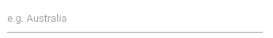

# Getting Started with Blazor AutoComplete in Blazor Web App

This topic explains how to add the [Blazor AutoComplete](https://www.syncfusion.com/blazor-components/blazor-autocomplete) component to a Blazor Web App using [Visual Studio](https://visualstudio.microsoft.com/vs/) or Visual Studio Code.





## Prerequisites

* [System requirements for Blazor components](https://blazor.syncfusion.com/documentation/system-requirements)
* .NET SDK 8.0 or later, Visual Studio 2022 (latest), and the ASP.NET and web development workload

## Create a new Blazor Web App in Visual Studio

Create a **Blazor Web App** using Visual Studio 2022 via [Microsoft templates](https://learn.microsoft.com/en-us/aspnet/core/blazor/tooling?view=aspnetcore-8.0&pivots=vs) or the [Syncfusion<sup style="font-size:70%">&reg;</sup> Blazor Extension](https://blazor.syncfusion.com/documentation/visual-studio-integration/template-studio).

Configure the appropriate [interactive render mode](https://learn.microsoft.com/en-us/aspnet/core/blazor/components/render-modes?view=aspnetcore-8.0#render-modes) and [interactivity location](https://learn.microsoft.com/en-us/aspnet/core/blazor/tooling?view=aspnetcore-8.0&pivots=vs) when creating the Blazor Web App.

## Install Syncfusion<sup style="font-size:70%">&reg;</sup> Blazor DropDowns and Themes NuGet in the App

To add the **Blazor AutoComplete** component, open the NuGet Package Manager in Visual Studio (Tools → NuGet Package Manager → Manage NuGet Packages for Solution), then search for and install [Syncfusion.Blazor.DropDowns](https://www.nuget.org/packages/Syncfusion.Blazor.DropDowns/) and [Syncfusion.Blazor.Themes](https://www.nuget.org/packages/Syncfusion.Blazor.Themes/).

If using `WebAssembly` or `Auto` render modes in a Blazor Web App, install Syncfusion<sup style="font-size:70%">&reg;</sup> Blazor component NuGet packages in the client project.

Alternatively, run the following Package Manager commands:




Install-Package Syncfusion.Blazor.DropDowns -Version {{ site.releaseversion }}
Install-Package Syncfusion.Blazor.Themes -Version {{ site.releaseversion }}




N> Syncfusion<sup style="font-size:70%">&reg;</sup> Blazor components are available on [nuget.org](https://www.nuget.org/packages?q=syncfusion.blazor). Refer to the [NuGet packages](https://blazor.syncfusion.com/documentation/nuget-packages) topic for the list of available packages and component details.





## Prerequisites

* [System requirements for Blazor components](https://blazor.syncfusion.com/documentation/system-requirements)
* .NET SDK 8.0 or later, Visual Studio Code (latest), and the C# Dev Kit extension

## Create a new Blazor Web App in Visual Studio Code

Create a **Blazor Web App** using Visual Studio Code via [Microsoft templates](https://learn.microsoft.com/en-us/aspnet/core/blazor/tooling?view=aspnetcore-8.0&pivots=vsc) or the [Syncfusion<sup style="font-size:70%">&reg;</sup> Blazor Extension](https://blazor.syncfusion.com/documentation/visual-studio-code-integration/create-project).

Configure the appropriate [interactive render mode](https://learn.microsoft.com/en-us/aspnet/core/blazor/components/render-modes?view=aspnetcore-8.0#render-modes) and [interactivity location](https://learn.microsoft.com/en-us/aspnet/core/blazor/tooling?view=aspnetcore-8.0&pivots=vsc) when creating the Blazor Web App.

For example, in a Blazor Web App with the `Auto` interactive render mode, use the following commands.




dotnet new blazor -o BlazorWebApp -int Auto
cd BlazorWebApp
cd BlazorWebApp.Client




N> For more information on creating a **Blazor Web App** with various interactive modes and locations, refer to this [link](https://blazor.syncfusion.com/documentation/getting-started/blazor-web-app?tabcontent=visual-studio-code#render-interactive-modes).

## Install Syncfusion<sup style="font-size:70%">&reg;</sup> Blazor DropDowns and Themes NuGet in the App

If using `WebAssembly` or `Auto` render modes in a Blazor Web App, install Syncfusion<sup style="font-size:70%">&reg;</sup> Blazor component NuGet packages in the client project.

* Press <kbd>Ctrl</kbd>+<kbd>`</kbd> to open the integrated terminal in Visual Studio Code.
* Ensure you are in the project directory where the `.csproj` file is located.
* Run the following commands to install [Syncfusion.Blazor.DropDowns](https://www.nuget.org/packages/Syncfusion.Blazor.DropDowns) and [Syncfusion.Blazor.Themes](https://www.nuget.org/packages/Syncfusion.Blazor.Themes/), and restore dependencies.





dotnet add package Syncfusion.Blazor.DropDowns -v {{ site.releaseversion }}
dotnet add package Syncfusion.Blazor.Themes -v {{ site.releaseversion }}
dotnet restore





N> Syncfusion<sup style="font-size:70%">&reg;</sup> Blazor components are available on [nuget.org](https://www.nuget.org/packages?q=syncfusion.blazor). Refer to the [NuGet packages](https://blazor.syncfusion.com/documentation/nuget-packages) topic for the list of available packages and component details.





## Register Syncfusion<sup style="font-size:70%">&reg;</sup> Blazor Service

| Interactive Render Mode | Description |
| -- | -- |
| WebAssembly or Auto | Open **~/_Imports.razor** from the client project.|
| Server | Open **~/_Imports.razor** in the `Components` folder.|

Import the `Syncfusion.Blazor` and `Syncfusion.Blazor.DropDowns` namespaces.




@using Syncfusion.Blazor
@using Syncfusion.Blazor.DropDowns




Register the Syncfusion<sup style="font-size:70%">&reg;</sup> Blazor service in the **~/Program.cs** file of the Blazor Web App.

If the **Interactive Render Mode** is `WebAssembly` or `Auto`, register the Syncfusion<sup style="font-size:70%">&reg;</sup> Blazor service in both **~/Program.cs** files (Server and Client) of the Blazor Web App.




...
...
using Syncfusion.Blazor;

var builder = WebApplication.CreateBuilder(args);

// Add services to the container.
builder.Services.AddRazorComponents()
    .AddInteractiveServerComponents()
    .AddInteractiveWebAssemblyComponents();
builder.Services.AddSyncfusionBlazor();

var app = builder.Build();
....




...
using Syncfusion.Blazor;

var builder = WebAssemblyHostBuilder.CreateDefault(args);
builder.Services.AddSyncfusionBlazor();

await builder.Build().RunAsync();




If the **Interactive Render Mode** is `Server`, the project contains a single **~/Program.cs** file. In this case, register the Syncfusion<sup style="font-size:70%">&reg;</sup> Blazor service only in that **~/Program.cs** file.




...
using Syncfusion.Blazor;

var builder = WebApplication.CreateBuilder(args);

// Add services to the container.
builder.Services.AddRazorComponents()
    .AddInteractiveServerComponents();
builder.Services.AddSyncfusionBlazor();

var app = builder.Build();
....




N> A valid Syncfusion license is required. For details on generating and registering a license, refer to the [License key registration](https://blazor.syncfusion.com/documentation/common/essential-studio/licensing/overview) documentation.

## Add stylesheet and script resources

The theme stylesheet and script are available via NuGet as [Static Web Assets](https://blazor.syncfusion.com/documentation/appearance/themes#static-web-assets). Add the stylesheet reference in the `<head>` section and the script reference at the end of the `<body>` in the **~/Components/App.razor** file:

```html
<head>
    ....
    <link href="_content/Syncfusion.Blazor.Themes/bootstrap5.css" rel="stylesheet" />
</head>
....
<body>
    ....
    <script src="_content/Syncfusion.Blazor.Core/scripts/syncfusion-blazor.min.js" type="text/javascript"></script>
</body>
```

N> Check out the [Blazor Themes](https://blazor.syncfusion.com/documentation/appearance/themes) topic to learn different methods ([Static Web Assets](https://blazor.syncfusion.com/documentation/appearance/themes#static-web-assets), [CDN](https://blazor.syncfusion.com/documentation/appearance/themes#cdn-reference), and [CRG](https://blazor.syncfusion.com/documentation/common/custom-resource-generator)) for referencing themes in a Blazor application. Also, see [Adding Script Reference](https://blazor.syncfusion.com/documentation/common/adding-script-references) for approaches to adding script references. If styles or interactivity are missing at runtime, ensure packages are restored and the correct project (Server or Client) is running for the selected render mode.

## Add Syncfusion<sup style="font-size:70%">&reg;</sup> Blazor AutoComplete component

Add the Syncfusion<sup style="font-size:70%">&reg;</sup> Blazor AutoComplete component in a Razor component under the **~/Pages** folder. If the interactivity location is `Per page/component`, define a render mode at the top of the `~Pages/.razor` component as follows:

| Interactivity location | RenderMode | Code |
| --- | --- | --- |
| Per page/component | Auto | @rendermode InteractiveAuto |
|  | WebAssembly | @rendermode InteractiveWebAssembly |
|  | Server | @rendermode InteractiveServer |
|  | None | --- |

N> If the **Interactivity Location** is `Global` and the **Render Mode** is `Auto`, `WebAssembly`, or `Server`, the render mode is configured in the `App.razor` file by default.




@* desired render mode define here *@
@rendermode InteractiveAuto







<SfAutoComplete TValue="string" TItem="Country" Placeholder="e.g. Australia" DataSource="@LocalData">
    <AutoCompleteFieldSettings Value="Name" />
</SfAutoComplete>

@code {

    public class Country
    {
        public string Name { get; set; }
        public string Code { get; set; }
    }

    List<Country> LocalData = new List<Country> {
        new Country() { Name = "Australia", Code = "AU" },
        new Country() { Name = "Bermuda", Code = "BM" },
        new Country() { Name = "Canada", Code = "CA" },
        new Country() { Name = "Cameroon", Code = "CM" },
        new Country() { Name = "Denmark", Code = "DK" }
    };
}




* Press <kbd>Ctrl</kbd>+<kbd>F5</kbd> (Windows) or <kbd>⌘</kbd>+<kbd>F5</kbd> (macOS) to run the application. This renders the Syncfusion<sup style="font-size:70%">&reg;</sup> Blazor AutoComplete component in the default web browser.



N> [View Sample in GitHub](https://github.com/SyncfusionExamples/Blazor-Getting-Started-Examples/tree/main/AutoComplete/BlazorWebApp)

## Binding data source

After initialization, populate the AutoComplete with data using the [DataSource](https://help.syncfusion.com/cr/blazor/Syncfusion.Blazor.DropDowns.SfDropDownBase-1.html#Syncfusion_Blazor_DropDowns_SfDropDownBase_1_DataSource) property.




<SfAutoComplete TValue="string" TItem="Country" Placeholder="Select a country" DataSource="@LocalData">
    <AutoCompleteFieldSettings Value="Name" />
</SfAutoComplete>

@code {

    public class Country
    {
        public string Name { get; set; }
        public string Code { get; set; }
    }

    List<Country> LocalData = new List<Country> {
        new Country() { Name = "Australia", Code = "AU" },
        new Country() { Name = "Bermuda", Code = "BM" },
        new Country() { Name = "Canada", Code = "CA" },
        new Country() { Name = "Cameroon", Code = "CM" },
        new Country() { Name = "Denmark", Code = "DK" },
        new Country() { Name = "France", Code = "FR" },
        new Country() { Name = "Finland", Code = "FI" },
        new Country() { Name = "Germany", Code = "DE" },
        new Country() { Name = "Greenland", Code = "GL" },
        new Country() { Name = "Hong Kong", Code = "HK" },
        new Country() { Name = "India", Code = "IN" },
        new Country() { Name = "Italy", Code = "IT" },
        new Country() { Name = "Japan", Code = "JP" },
        new Country() { Name = "Mexico", Code = "MX" },
        new Country() { Name = "Norway", Code = "NO" },
        new Country() { Name = "Poland", Code = "PL" },
        new Country() { Name = "Switzerland", Code = "CH" },
        new Country() { Name = "United Kingdom", Code = "GB" },
        new Country() { Name = "United States", Code = "US" },
    };
}






## Configure the suggestion list

By default, the suggestion list width automatically matches the AutoComplete input element, and the suggestion list height is `300px`. Customize the popup size using the [PopupHeight](https://help.syncfusion.com/cr/blazor/Syncfusion.Blazor.DropDowns.SfDropDownList-2.html#Syncfusion_Blazor_DropDowns_SfDropDownList_2_PopupHeight) and [PopupWidth](https://help.syncfusion.com/cr/blazor/Syncfusion.Blazor.DropDowns.SfDropDownList-2.html#Syncfusion_Blazor_DropDowns_SfDropDownList_2_PopupWidth) properties.




<SfAutoComplete TValue="string" TItem="Country" Placeholder="Select a country" DataSource="@LocalData" PopupHeight="300px" PopupWidth="300px">
    <AutoCompleteFieldSettings Value="Name" />
</SfAutoComplete>






## See also

* [Getting Started with Syncfusion<sup style="font-size:70%">&reg;</sup> Blazor WebAssembly App in Visual Studio or .NET CLI](../getting-started/blazor-webassembly-app)
* [Getting Started with Syncfusion<sup style="font-size:70%">&reg;</sup> Blazor Web App in Visual Studio or .NET CLI](../getting-started/blazor-web-app)