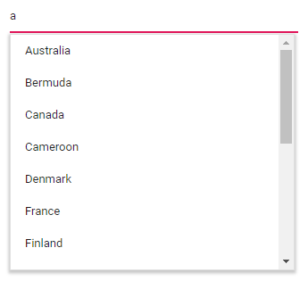

# Getting Started with Blazor AutoComplete Component

This section briefly explains how to include a [AutoComplete](https://help.syncfusion.com/cr/blazor/Syncfusion.Blazor.DropDowns.SfAutoComplete-2.html) Component in your Blazor client-side application. You can refer to the [Getting Started with Syncfusion Blazor for Client-side in Visual Studio 2019](../getting-started/blazor-webassembly-visual-studio-2019/) page for introduction and configure the common specifications.

To get start quickly with Blazor AutoComplete component, you can check on this video.



## Importing Syncfusion Blazor component in the application

* Install [Syncfusion.Blazor.DropDowns](https://www.nuget.org/packages/Syncfusion.Blazor.DropDowns/) NuGet package to the application by using the `NuGet Package Manager`.

* You can add the client-side resources through [CDN](https://blazor.syncfusion.com/documentation/appearance/themes#cdn-reference) or from [NuGet](https://blazor.syncfusion.com/documentation/appearance/themes#static-web-assets) package in the  **HEAD** element of the **~/Pages/_Host.cshtml** page.

    ```html
    <head>
        <link href="_content/Syncfusion.Blazor.Themes/bootstrap4.css" rel="stylesheet" />
        @*<link href="https://cdn.syncfusion.com/blazor/{{version}}/styles/{{theme}}.css" rel="stylesheet" />*@
    </head>
    ```

    > For Internet Explorer 11 kindly refer the polyfills. Refer the [documentation](https://blazor.syncfusion.com/documentation/common/how-to/render-blazor-server-app-in-ie/) for more information.

    ```html
    <head>
        <link href="_content/Syncfusion.Blazor.Themes/bootstrap4.css" rel="stylesheet" />
        <script src="https://github.com/Daddoon/Blazor.Polyfill/releases/download/3.0.1/blazor.polyfill.min.js"></script>
    </head>
    ```

## Adding component package to the application

Open `~/_Imports.razor` file and import the `Syncfusion.Blazor.DropDowns` package.

```cshtml
@using Syncfusion.Blazor.DropDowns
```

## Add SyncfusionBlazor service in Startup.cs

Open the **Startup.cs** file and add services required by Syncfusion components using  **services.AddSyncfusionBlazor()** method. Add this method in the **ConfigureServices** function as follows.

```c#
using Syncfusion.Blazor;

namespace BlazorApplication
{
    public class Startup
    {
        ....
        ....
        public void ConfigureServices(IServiceCollection services)
        {
            ....
            ....
            services.AddSyncfusionBlazor();
        }
    }
}
```

> To enable custom client side resource loading from CRG or CDN. You need to disable resource loading by `AddSyncfusionBlazor(true)` and load the scripts in the **HEAD** element of the **~/Pages/_Host.cshtml** page.

 ```html
<head>
    <script src="https://cdn.syncfusion.com/blazor/{{ site.blazorversion }}/syncfusion-blazor.min.js"></script>
</head>
```

## Adding AutoComplete component to the application

To initialize the AutoComplete component add the below code to your `Index.razor` view page which is present under `~/Pages` folder.

The following code shows a basic AutoComplete component.

```cshtml

<SfAutoComplete TValue="string" TItem="Countries" Placeholder="e.g. Australia" DataSource="@LocalData">
    <AutoCompleteFieldSettings Value="Name"></AutoCompleteFieldSettings>
</SfAutoComplete>

@code {

    public class Countries
    {
        public string Name { get; set; }
        public string Code { get; set; }
    }

    List<Countries> LocalData = new List<Countries> {
        new Countries() { Name = "Australia", Code = "AU" },
        new Countries() { Name = "Bermuda", Code = "BM" },
        new Countries() { Name = "Canada", Code = "CA" },
        new Countries() { Name = "Cameroon", Code = "CM" },
        new Countries() { Name = "Denmark", Code = "DK" }
    };
}
```

## Run the application

After successful compilation of your application, press `F5` to run the application.

The output will be as follows.


## Binding data source

After initialization, populate the AutoComplete with data using the [DataSource](https://help.syncfusion.com/cr/blazor/Syncfusion.Blazor.DropDowns.SfDropDownBase-1.html#Syncfusion_Blazor_DropDowns_SfDropDownBase_1_DataSource) property. Here, an array of string values is passed to the [AutoComplete](https://blazor.syncfusion.com/documentation/nuget-packages/#syncfusionblazordropdowns) component.

The following example illustrates the output in your browser.

```cshtml

<SfAutoComplete TValue="string" TItem="Countries" Placeholder="Select a country" DataSource="@LocalData">
    <AutoCompleteFieldSettings Value="Name"></AutoCompleteFieldSettings>
</SfAutoComplete>

@code {

    public class Countries
    {
        public string Name { get; set; }
        public string Code { get; set; }
    }

    List<Countries> LocalData = new List<Countries> {
        new Countries() { Name = "Australia", Code = "AU" },
        new Countries() { Name = "Bermuda", Code = "BM" },
        new Countries() { Name = "Canada", Code = "CA" },
        new Countries() { Name = "Cameroon", Code = "CM" },
        new Countries() { Name = "Denmark", Code = "DK" },
        new Countries() { Name = "France", Code = "FR" },
        new Countries() { Name = "Finland", Code = "FI" },
        new Countries() { Name = "Germany", Code = "DE" },
        new Countries() { Name = "Greenland", Code = "GL" },
        new Countries() { Name = "Hong Kong", Code = "HK" },
        new Countries() { Name = "India", Code = "IN" },
        new Countries() { Name = "Italy", Code = "IT" },
        new Countries() { Name = "Japan", Code = "JP" },
        new Countries() { Name = "Mexico", Code = "MX" },
        new Countries() { Name = "Norway", Code = "NO" },
        new Countries() { Name = "Poland", Code = "PL" },
        new Countries() { Name = "Switzerland", Code = "CH" },
        new Countries() { Name = "United Kingdom", Code = "GB" },
        new Countries() { Name = "United States", Code = "US" },
    };
}
```

The output will be as follows.



## Custom values

The AutoComplete allows the users to give input as custom value, which is not required to present in predefined set of values. By default, this support is enabled by the [AllowCustom](https://help.syncfusion.com/cr/blazor/Syncfusion.Blazor.DropDowns.SfAutoComplete-2.html#Syncfusion_Blazor_DropDowns_SfAutoComplete_2_AllowCustom) property. The custom value will be sent to post back handler when a form is about to be submitted.

```cshtml

<SfAutoComplete TValue="string" TItem="Countries" Placeholder="Select a country" AllowCustom=true DataSource="@LocalData">
    <AutoCompleteFieldSettings Value="Name"></AutoCompleteFieldSettings>
</SfAutoComplete>

@code {

    public class Countries
    {
        public string Name { get; set; }
        public string Code { get; set; }
    }

    List<Countries> LocalData = new List<Countries> {
        new Countries() { Name = "Australia", Code = "AU" },
        new Countries() { Name = "Bermuda", Code = "BM" },
        new Countries() { Name = "Canada", Code = "CA" },
        new Countries() { Name = "Cameroon", Code = "CM" },
        new Countries() { Name = "Denmark", Code = "DK" },
        new Countries() { Name = "France", Code = "FR" },
        new Countries() { Name = "Finland", Code = "FI" },
        new Countries() { Name = "Germany", Code = "DE" },
        new Countries() { Name = "Greenland", Code = "GL" },
        new Countries() { Name = "Hong Kong", Code = "HK" },
        new Countries() { Name = "India", Code = "IN" },
        new Countries() { Name = "Italy", Code = "IT" },
        new Countries() { Name = "Japan", Code = "JP" },
        new Countries() { Name = "Mexico", Code = "MX" },
        new Countries() { Name = "Norway", Code = "NO" },
        new Countries() { Name = "Poland", Code = "PL" },
        new Countries() { Name = "Switzerland", Code = "CH" },
        new Countries() { Name = "United Kingdom", Code = "GB" },
        new Countries() { Name = "United States", Code = "US" },
    };
}
```

## Configure the suggestion list

By default, suggestion list width automatically adjusts according to the AutoComplete input element's width, and the height of the suggestion list has `300px`. The height and width of the popup list can also be customized using the [PopupHeight](https://help.syncfusion.com/cr/blazor/Syncfusion.Blazor.DropDowns.SfDropDownList-2.html#Syncfusion_Blazor_DropDowns_SfDropDownList_2_PopupHeight) and [PopupWidth](https://help.syncfusion.com/cr/blazor/Syncfusion.Blazor.DropDowns.SfDropDownList-2.html#Syncfusion_Blazor_DropDowns_SfDropDownList_2_PopupWidth) property respectively.

In the following sample, suggestion list's width and height are configured.

```cshtml

<SfAutoComplete TValue="string" TItem="Countries" Placeholder="Select a country" DataSource="@LocalData" PopupHeight="300px" PopupWidth="300px">
    <AutoCompleteFieldSettings Value="Name"></AutoCompleteFieldSettings>
</SfAutoComplete>

@code {

    public class Countries
    {
        public string Name { get; set; }
        public string Code { get; set; }
    }

    List<Countries> LocalData = new List<Countries> {
        new Countries() { Name = "Australia", Code = "AU" },
        new Countries() { Name = "Bermuda", Code = "BM" },
        new Countries() { Name = "Canada", Code = "CA" },
        new Countries() { Name = "Cameroon", Code = "CM" },
        new Countries() { Name = "Denmark", Code = "DK" },
        new Countries() { Name = "France", Code = "FR" },
        new Countries() { Name = "Finland", Code = "FI" },
        new Countries() { Name = "Germany", Code = "DE" },
        new Countries() { Name = "Greenland", Code = "GL" },
        new Countries() { Name = "Hong Kong", Code = "HK" },
        new Countries() { Name = "India", Code = "IN" },
        new Countries() { Name = "Italy", Code = "IT" },
        new Countries() { Name = "Japan", Code = "JP" },
        new Countries() { Name = "Mexico", Code = "MX" },
        new Countries() { Name = "Norway", Code = "NO" },
        new Countries() { Name = "Poland", Code = "PL" },
        new Countries() { Name = "Switzerland", Code = "CH" },
        new Countries() { Name = "United Kingdom", Code = "GB" },
        new Countries() { Name = "United States", Code = "US" },
    };
}
```

The output will be as follows.


## See Also

* [Getting Started with Syncfusion Blazor for Client-Side in .NET Core CLI](../getting-started/blazor-webassembly-dotnet-cli/)
* [Getting Started with Syncfusion Blazor for Server-side in Visual Studio 2019](../getting-started/blazor-server-side-visual-studio-2019/)
* [Getting Started with Syncfusion Blazor for Server-Side in .NET Core CLI](../getting-started/blazor-server-side-dotnet-cli/)