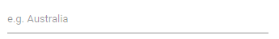

# Getting Started with Blazor AutoComplete Component

This section explains how to include the [Syncfusion<sup style="font-size:70%">&reg;</sup> Blazor AutoComplete](https://www.syncfusion.com/blazor-components/blazor-autocomplete) component in a Blazor WebAssembly app using [Visual Studio](https://visualstudio.microsoft.com/vs/), [Visual Studio Code](https://code.visualstudio.com/), and the [.NET CLI](https://learn.microsoft.com/en-us/dotnet/core/tools/).





## Prerequisites

* [System requirements for Blazor components](https://blazor.syncfusion.com/documentation/system-requirements)

## Create a new Blazor App in Visual Studio

Create a **Blazor WebAssembly App** using Visual Studio via [Microsoft Templates](https://learn.microsoft.com/en-us/aspnet/core/blazor/tooling?view=aspnetcore-10.0&pivots=vs) or the [Syncfusion<sup style="font-size:70%">&reg;</sup> Blazor Extension](https://blazor.syncfusion.com/documentation/visual-studio-integration/template-studio). For detailed instructions, refer to the [Blazor WASM App Getting Started](https://blazor.syncfusion.com/documentation/getting-started/blazor-webassembly-app) documentation.





## Prerequisites

* [System requirements for Blazor components](https://blazor.syncfusion.com/documentation/system-requirements)

## Create a new Blazor App in Visual Studio Code

Create a **Blazor WebAssembly App** using Visual Studio Code via [Microsoft Templates](https://learn.microsoft.com/en-us/aspnet/core/blazor/tooling?view=aspnetcore-10.0&pivots=vsc) or the [Syncfusion<sup style="font-size:70%">&reg;</sup> Blazor Extension](https://blazor.syncfusion.com/documentation/visual-studio-code-integration/create-project). For detailed instructions, refer to the [Blazor WASM App Getting Started](https://blazor.syncfusion.com/documentation/getting-started/blazor-webassembly-app?tabcontent=visual-studio-code) documentation.

Alternatively, create a WebAssembly application by using the following command in the integrated terminal (<kbd>Ctrl</kbd>+<kbd>`</kbd>).





dotnet new blazorwasm -o BlazorApp
cd BlazorApp









## Prerequisites

Install the latest version of [.NET SDK](https://dotnet.microsoft.com/en-us/download). If the .NET SDK is already installed, determine the installed version by running the following command in a command prompt (Windows), terminal (macOS), or command shell (Linux).




dotnet --version




## Create a Blazor WebAssembly App using .NET CLI

Run the following command to create a new Blazor WebAssembly App in a command prompt (Windows) or terminal (macOS) or command shell (Linux). For detailed instructions, refer to the [Blazor WASM App Getting Started](https://blazor.syncfusion.com/documentation/getting-started/blazor-webassembly-app?tabcontent=.net-cli) documentation.




dotnet new blazorwasm -o BlazorApp
cd BlazorApp








## Install Syncfusion<sup style="font-size:70%">&reg;</sup> Blazor packages

Install [Syncfusion.Blazor.DropDowns](https://www.nuget.org/packages/Syncfusion.Blazor.DropDowns/) and [Syncfusion.Blazor.Themes](https://www.nuget.org/packages/Syncfusion.Blazor.Themes/) NuGet packages in your project using the NuGet Package Manager in Visual Studio (*Tools → NuGet Package Manager → Manage NuGet Packages for Solution*), or the integrated terminal in Visual Studio Code (`dotnet add package`), or the .NET CLI.

Alternatively, run the following commands in the Package Manager Console to achieve the same.




Install-Package Syncfusion.Blazor.DropDowns -Version {{ site.releaseversion }}
Install-Package Syncfusion.Blazor.Themes -Version {{ site.releaseversion }}




N> All Syncfusion Blazor packages are available on [nuget.org](https://www.nuget.org/packages?q=syncfusion.blazor). See the [NuGet packages](https://blazor.syncfusion.com/documentation/nuget-packages) topic for details.

## Add import namespaces

After the packages are installed, open the **~/_Imports.razor** file and import the `Syncfusion.Blazor` and `Syncfusion.Blazor.DropDowns` namespaces.




@using Syncfusion.Blazor
@using Syncfusion.Blazor.DropDowns




## Register Syncfusion<sup style="font-size:70%">&reg;</sup> Blazor service

Register the Syncfusion<sup style="font-size:70%">&reg;</sup> Blazor service in the **Program.cs** file of your Blazor WebAssembly App.




....
using Syncfusion.Blazor;
....
builder.Services.AddSyncfusionBlazor();
....




## Add stylesheet and script resources

The theme stylesheet and script can be accessed from NuGet through [Static Web Assets](https://blazor.syncfusion.com/documentation/appearance/themes#static-web-assets). Include the stylesheet and script references in the **~/index.html** file.

```html

<link href="_content/Syncfusion.Blazor.Themes/fluent2.css" rel="stylesheet" />
<script src="_content/Syncfusion.Blazor.Core/scripts/syncfusion-blazor.min.js" type="text/javascript"></script>

```

N> Check out the [Blazor Themes](https://blazor.syncfusion.com/documentation/appearance/themes) topic to discover various methods ([Static Web Assets](https://blazor.syncfusion.com/documentation/appearance/themes#static-web-assets), [CDN](https://blazor.syncfusion.com/documentation/appearance/themes#cdn-reference), and [CRG](https://blazor.syncfusion.com/documentation/common/custom-resource-generator)) for referencing themes in the Blazor application. Also, check out the [Adding Script Reference](https://blazor.syncfusion.com/documentation/common/adding-script-references) topic to learn different approaches for adding script references in the Blazor application.

## Add Syncfusion<sup style="font-size:70%">&reg;</sup> Blazor Autocomplete component

Add the Syncfusion<sup style="font-size:70%">&reg;</sup> Blazor AutoComplete component in the **~/Pages/Index.razor** file.




@using Syncfusion.Blazor.DropDowns

<SfAutoComplete TValue="string" TItem="Country" Placeholder="e.g. Australia" DataSource="@LocalData">
    <AutoCompleteFieldSettings Value="Name" />
</SfAutoComplete>

@code {

    public class Country
    {
        public string Name { get; set; }
        public string Code { get; set; }
    }

    List<Country> LocalData = new List<Country> {
        new Country() { Name = "Australia", Code = "AU" },
        new Country() { Name = "Bermuda", Code = "BM" },
        new Country() { Name = "Canada", Code = "CA" },
        new Country() { Name = "Cameroon", Code = "CM" },
        new Country() { Name = "Denmark", Code = "DK" }
    };
}




* Press <kbd>Ctrl</kbd>+<kbd>F5</kbd> (Windows) or <kbd>⌘</kbd>+<kbd>F5</kbd> (macOS) to launch the application. This renders the Syncfusion<sup style="font-size:70%">&reg;</sup> Blazor AutoComplete component in default web browser.



## Binding data source

After initialization, populate the AutoComplete with data using the [DataSource](https://help.syncfusion.com/cr/blazor/Syncfusion.Blazor.DropDowns.SfDropDownBase-1.html#Syncfusion_Blazor_DropDowns_SfDropDownBase_1_DataSource) property.




@using Syncfusion.Blazor.DropDowns

<SfAutoComplete TValue="string" TItem="Country" Placeholder="Select a country" DataSource="@LocalData">
    <AutoCompleteFieldSettings Value="Name" />
</SfAutoComplete>

@code {

    public class Country
    {
        public string Name { get; set; }
        public string Code { get; set; }
    }

    List<Country> LocalData = new List<Country> {
        new Country() { Name = "Australia", Code = "AU" },
        new Country() { Name = "Bermuda", Code = "BM" },
        new Country() { Name = "Canada", Code = "CA" },
        new Country() { Name = "Cameroon", Code = "CM" },
        new Country() { Name = "Denmark", Code = "DK" },
        new Country() { Name = "France", Code = "FR" },
        new Country() { Name = "Finland", Code = "FI" },
        new Country() { Name = "Germany", Code = "DE" },
        new Country() { Name = "Greenland", Code = "GL" },
        new Country() { Name = "Hong Kong", Code = "HK" },
        new Country() { Name = "India", Code = "IN" },
        new Country() { Name = "Italy", Code = "IT" },
        new Country() { Name = "Japan", Code = "JP" },
        new Country() { Name = "Mexico", Code = "MX" },
        new Country() { Name = "Norway", Code = "NO" },
        new Country() { Name = "Poland", Code = "PL" },
        new Country() { Name = "Switzerland", Code = "CH" },
        new Country() { Name = "United Kingdom", Code = "GB" },
        new Country() { Name = "United States", Code = "US" },
    };
}






## Configure the suggestion list

By default, the suggestion list width automatically adjusts to the AutoComplete input element, and the suggestion list height is `300px`. Customize the popup size using the [PopupHeight](https://help.syncfusion.com/cr/blazor/Syncfusion.Blazor.DropDowns.SfDropDownList-2.html#Syncfusion_Blazor_DropDowns_SfDropDownList_2_PopupHeight) and [PopupWidth](https://help.syncfusion.com/cr/blazor/Syncfusion.Blazor.DropDowns.SfDropDownList-2.html#Syncfusion_Blazor_DropDowns_SfDropDownList_2_PopupWidth) properties.




@using Syncfusion.Blazor.DropDowns

<SfAutoComplete TValue="string" TItem="Country" Placeholder="Select a country" DataSource="@LocalData" PopupHeight="300px" PopupWidth="300px">
    <AutoCompleteFieldSettings Value="Name" />
</SfAutoComplete>






## See also

* [Getting Started with Syncfusion<sup style="font-size:70%">&reg;</sup> Blazor Web Assembly App in Visual Studio or .NET CLI](../getting-started/blazor-webassembly-app)
* [Getting Started with Syncfusion<sup style="font-size:70%">&reg;</sup> Blazor Web App in Visual Studio or .NET CLI](../getting-started/blazor-web-app)