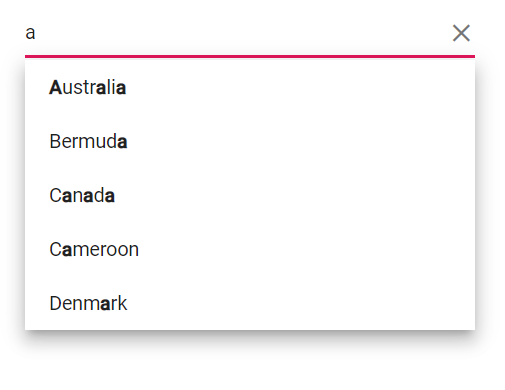
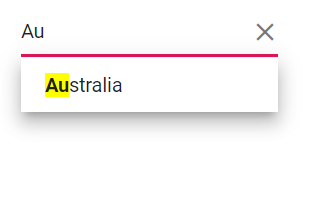

# Highlight Search Blazor AutoComplete Component

Highlight the search text in the suggested list items of the AutoComplete component by using the `Highlight` property. The default value is `false`. When set to `true`, the component highlights the characters that match the current search query in the suggestion list. The rendered markup uses the `e-highlight` CSS class for the matched segments.





 



## Highlight with template

Use the `HighLightSearch` method within an item template to highlight matched text in custom-rendered list items. It accepts the following arguments and highlights characters that match the search query based on the specified options.

* `textValue` - The display text from the current list item to evaluate and render with highlights.
* `ignoreCase` - When `true`, performs case-insensitive matching.
* `filterType` - Specifies how matches are determined (for example, starts with, contains, or ends with).
* `highlightText` - Optional. The text to highlight. If not provided, the method uses the current filter value.





 



## Change the highlight style

Customize the appearance of the highlighted text using the `.e-highlight` class. In the following example, the background color for matched text is styled to improve visibility.





 

