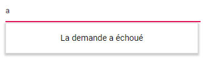

# Localization in Blazor AutoComplete Component

## Blazor server side

Add `UseRequestLocalization` middle-ware in Configure method in **Startup.cs** file to get browser Culture Info.

Refer the following code to add configuration in Startup.cs file

```csharp
using Microsoft.AspNetCore.Builder;
using Microsoft.AspNetCore.Localization;

namespace BlazorApplication
{
    public class Startup
    {
        ....
        ....

        public void Configure(IApplicationBuilder app, IWebHostEnvironment env)
        {
            app.UseRequestLocalization();
            ....
            ....
        }
    }
}
```

The **Localization** library allows you to localize default text content. The AutoComplete component has static text that can be changed to other cultures (Arabic, Deutsch, French, etc.).

The following examples demonstrate how to enable **Localization** for AutoComplete in server side Blazor samples. Here, Resource file is used to translate the static text.

The Resource file is an XML file which contains the strings(key and value pairs) that you want to translate into different language. You can also refer Localization [link](https://blazor.syncfusion.com/documentation/common/localization/) to know more about how to configure and use localization in the ASP.NET Core application framework.

* Open the **Startup.cs** file and add the below configuration in the **ConfigureServices** function as follows.

```csharp
using Syncfusion.Blazor;
using System.Globalization;
using Microsoft.AspNetCore.Localization;

namespace BlazorApplication
{
    public class Startup
    {
        ....
        ....
        public void ConfigureServices(IServiceCollection services)
        {
            ....
            ....
            services.AddSyncfusionBlazor();
            services.AddLocalization(options => options.ResourcesPath = "Resources");
            services.Configure<RequestLocalizationOptions>(options =>
            {
                // define the list of cultures your app will support
                var supportedCultures = new List<CultureInfo>()
                {
                    new CultureInfo("de")
                };
                // set the default culture
                options.DefaultRequestCulture = new RequestCulture("de");
                options.SupportedCultures = supportedCultures;
                options.SupportedUICultures = supportedCultures;
                options.RequestCultureProviders = new List<IRequestCultureProvider>() {
                 new QueryStringRequestCultureProvider() // Here, You can also use other localization provider
                };
            });
            services.AddSingleton(typeof(ISyncfusionStringLocalizer), typeof(SampleLocalizer));
        }
    }
}
```

* Then, write a **class** by inheriting **ISyncfusionStringLocalizer** interface and override the Manager property to get the resource file details from the application end.

```csharp
using Syncfusion.Blazor;

namespace blazorDropdowns
{
     public class SampleLocalizer : ISyncfusionStringLocalizer
    {

        public string Get(string key)
        {
            return this.Manager.GetString(key);
        }

        public System.Resources.ResourceManager Manager
        {
            get
            {
                return blazorDropdowns.Resources.SyncfusionBlazorLocale.ResourceManager;
            }
        }
    }
}
```

* Add **.resx** file to Resource folder and enter the key value (Locale Keywords) in the **Name** column and the translated string in the Value column as follows.

| **Name** | **Value (in Deutsch culture)** |
| --- | --- |
| AutoComplete_ActionFailureTemplate | Die Anfrage ist fehlgeschlagen |
| AutoComplete_NoRecordsTemplate | Keine Aufzeichnungen gefunden |

* Finally, specify the culture for AutoComplete using [locale](https://help.syncfusion.com/cr/blazor/Syncfusion.Blazor.DropDowns.SfDropDownBase-1.html#Syncfusion_Blazor_DropDowns_SfDropDownBase_1_Locale) property.

```cshtml
@using Syncfusion.Blazor.DropDowns

<SfAutoComplete TValue="string" TItem="Country" Placeholder="e.g. Australia" Locale="de" DataSource="@LocalData">
    <AutoCompleteFieldSettings Value="Name"></AutoCompleteFieldSettings>
</SfAutoComplete>

@code {

    public class Country
    {
        public string Name { get; set; }
        public string Code { get; set; }
    }

    List<Country> LocalData = new List<Country> {
        new Country() { Name = "Australia", Code = "AU" },
        new Country() { Name = "Bermuda", Code = "BM" },
        new Country() { Name = "Canada", Code = "CA" },
        new Country() { Name = "Cameroon", Code = "CM" },
        new Country() { Name = "Denmark", Code = "DK" }
    };
}
```

## Blazor WebAssembly

The Localization library allows you to localize static text content of the `NoRecordsTemplate` and `ActionFailureTemplate` properties according to the culture currently assigned to the AutoComplete.

| Locale key | en-US (default)
|------|------
| NoRecordsTemplate |  No Records Found
| ActionFailureTemplate | The Request Failed

The following steps explain how to render the AutoComplete in French culture (fr) in Blazor Web Assembly application.

* Open the **program.cs** file and add the below configuration in the **Builder ConfigureServices** function as follows.

```csharp
using Syncfusion.Blazor;
using Microsoft.AspNetCore.Builder;

namespace WebAssemblyLocale
{
    public class Program
    {
        public static async Task Main(string[] args)
        {
            ....
            ....
            builder.Services.Configure<RequestLocalizationOptions>(options =>
            {
                // Define the list of cultures your app will support
                var supportedCultures = new List<System.Globalization.CultureInfo>()
                {
                    new System.Globalization.CultureInfo("en-US"),
                    new System.Globalization.CultureInfo("fr"),
                };

                // Set the default culture
                options.DefaultRequestCulture = new Microsoft.AspNetCore.Localization.RequestCulture("fr");

                options.SupportedCultures = supportedCultures;
                options.SupportedUICultures = supportedCultures;
                options.RequestCultureProviders = new List<Microsoft.AspNetCore.Localization.IRequestCultureProvider>() {
                 new Microsoft.AspNetCore.Localization.QueryStringRequestCultureProvider()
                };
            });
            ....
            ....
        }
    }
}
```

* To download the locale definition of Blazor components, use this [link](https://github.com/syncfusion/ej2-locale).

* After downloading the `blazor-locale` package, copy the `blazor-locale` folder with required local definition file into `wwwroot` folder.

* By default, the `blazor-locale` package contains the localized text for static text present in components like button text, placeholder, tooltip, and more.

* Set the culture by using the `SetCulture` method.

In the following sample, French culture is set to the AutoComplete and no data is loaded. Hence, the [NoRecordsTemplate](https://help.syncfusion.com/cr/blazor/Syncfusion.Blazor.DropDowns.SfDropDownBase-1.html#Syncfusion_Blazor_DropDowns_SfDropDownBase_1_NoRecordsTemplate) property displays its text in French culture initially and if the sample is run offline, the [ActionFailureTemplate](https://help.syncfusion.com/cr/blazor/Syncfusion.Blazor.DropDowns.SfDropDownBase-1.html#Syncfusion_Blazor_DropDowns_SfDropDownBase_1_ActionFailureTemplate) property displays its text appropriately.

```cshtml
@using Syncfusion.Blazor.Data
@using Syncfusion.Blazor.DropDowns
@inject HttpClient Http;

 <SfAutoComplete TValue="string" TItem="EmployeeData" Query="@Query" Placeholder="Select a customer" Locale="fr">
    <SfDataManager Url="https://ej2services.syncfusion.com/production/web-services/api/Employees" Adaptor="Adaptors.WebApiAdaptor" CrossDomain=true></SfDataManager>
    <AutoCompleteFieldSettings Value="FirstName"></AutoCompleteFieldSettings>
</SfAutoComplete>

@code {
    [Inject]
    protected IJSRuntime JsRuntime { get; set; }
    protected override async Task OnInitializedAsync()
    {
        this.JsRuntime.Sf().LoadLocaleData(await Http.GetJsonAsync<object>("blazor-locale/src/fr.json")).SetCulture("fr");
    }
    public Query Query = new Query();
    public class EmployeeData
    {
        public int EmployeeID { get; set; }
        public string FirstName { get; set; }
        public string Designation { get; set; }
        public string Country { get; set; }
    }
}
```


