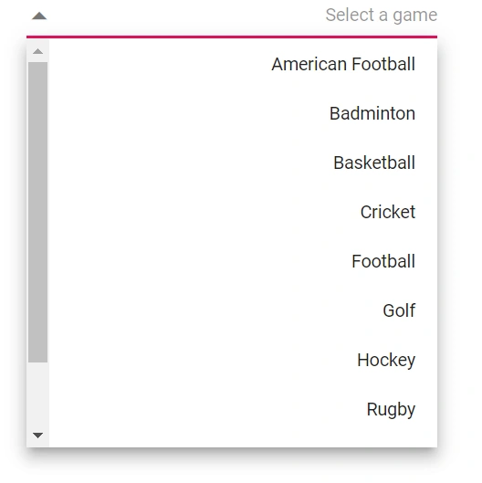

# Localization in Blazor AutoComplete

[Blazor AutoComplete](https://www.syncfusion.com/blazor-components/blazor-autocomplete) component supports localization. Refer to the [Blazor localization](https://blazor.syncfusion.com/documentation/common/localization) topic to configure resources and localize Blazor components. Localizable texts include built-in UI strings such as “No records found” and “Action failed.” Localization changes the displayed strings, while globalization options (such as RTL) affect layout and reading direction.

## Globalization

### Enable RTL mode

The direction can be switched to right-to-left by setting the [EnableRtl](https://help.syncfusion.com/cr/blazor/Syncfusion.Blazor.DropDowns.SfDropDownList-2.html#Syncfusion_Blazor_DropDowns_SfDropDownList_2_EnableRtl) property to `true`. The default value is `false`. Enable RTL for right-to-left languages such as Arabic and Hebrew; the component layout and icon alignment will mirror automatically based on Syncfusion styles.

Specifies the [EnableRtl](https://help.syncfusion.com/cr/blazor/Syncfusion.Blazor.DropDowns.SfDropDownList-2.html#Syncfusion_Blazor_DropDowns_SfDropDownList_2_EnableRtl) as a boolean value that enables or disables rendering the component in a right-to-left direction.







