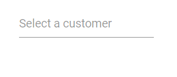
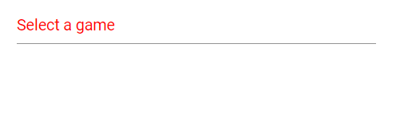
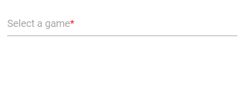
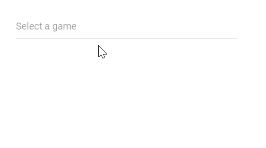
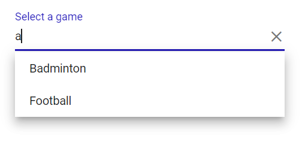

# Placeholder and Float Label in AutoComplete

This section describes how to configure the placeholder and float label behavior in the Blazor AutoComplete component and how to customize their styles.

## Placeholder

Use the [Placeholder](https://help.syncfusion.com/cr/blazor/Syncfusion.Blazor.DropDowns.SfAutoComplete-1.html#Syncfusion_Blazor_DropDowns_SfAutoComplete_1_Placeholder) property to display guidance text for the expected input value. In the following example, setting `Select a game` as the `Placeholder` value applies it to the input element’s placeholder attribute.







## Color of the placeholder text

Change the placeholder text color by targeting the `input.e-input::placeholder` selector and setting the desired CSS `color` value.







## Add mandatory indicator using placeholder

Apply a mandatory indicator (*) to the floating label by targeting the `.e-float-text::after` selector and setting the `content` style. Note that this customizes the floating label element rather than the native placeholder text.







## FloatLabel

Use the [FloatLabelType](https://help.syncfusion.com/cr/blazor/Syncfusion.Blazor.DropDowns.SfAutoComplete-1.html#Syncfusion_Blazor_DropDowns_SfAutoComplete_1_FloatLabelType) property to control how the `Placeholder` text floats above the AutoComplete. `FloatLabelType` applies only when `Placeholder` is set. The default value is `Never`.

The floating label supports the following modes:

Type     | Description
------------ | -------------
  [Auto](https://help.syncfusion.com/cr/blazor/Syncfusion.Blazor.Inputs.FloatLabelType.html#Syncfusion_Blazor_Inputs_FloatLabelType_Auto)       | The label floats above the input on focus or when a value is entered.
  [Always](https://help.syncfusion.com/cr/blazor/Syncfusion.Blazor.Inputs.FloatLabelType.html#Syncfusion_Blazor_Inputs_FloatLabelType_Always)     | The label always floats above the input.
  [Never](https://help.syncfusion.com/cr/blazor/Syncfusion.Blazor.Inputs.FloatLabelType.html#Syncfusion_Blazor_Inputs_FloatLabelType_Never)      | The label never floats above the input when a placeholder is available.

The `FloatLabelType` set to `Auto` is demonstrated in the following example.







## Customizing the float label element’s focusing color

Change the floating label text color when focused by targeting the `.e-input-focus .e-float-text.e-label-top` selector and applying the desired `color`.







