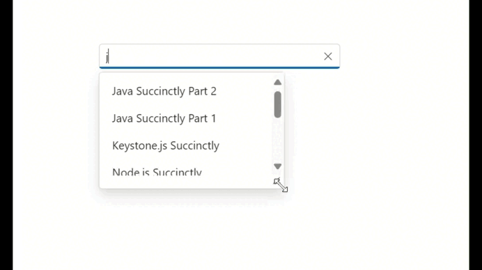
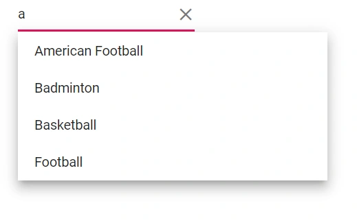
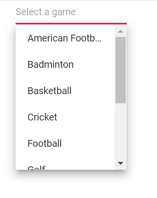
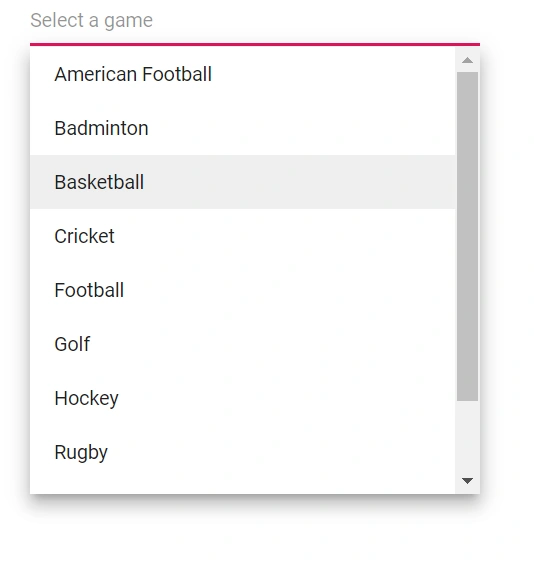
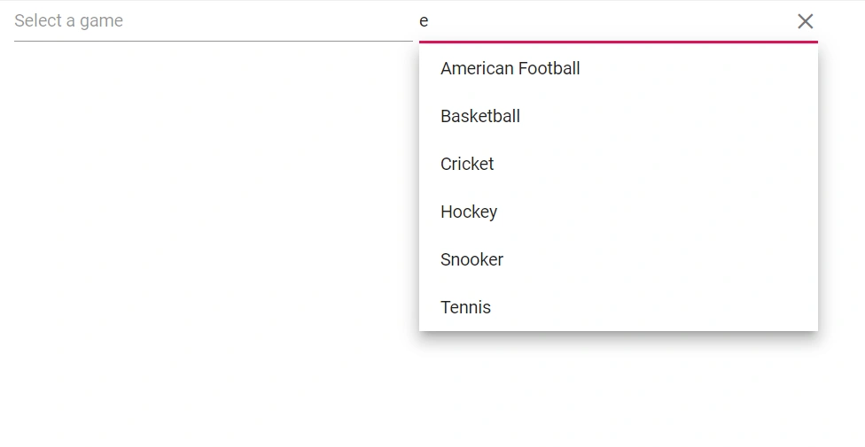
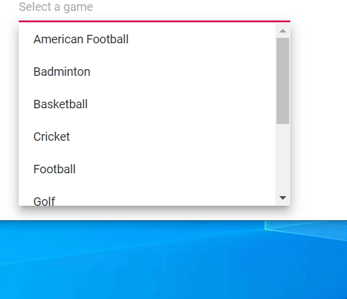

# Popup Setting in Blazor AutoComplete

## Popup resize 

Can dynamically adjust the size of the popup in the Blazor AutoComplete component by using the [AllowResize](https://help.syncfusion.com/cr/blazor/Syncfusion.Blazor.DropDowns.SfDropDownList-2.html#Syncfusion_Blazor_DropDowns_SfDropDownList_2_AllowResize) property. When enabled, users can resize the popup by dragging the resize handle to improve visibility and control.







## Change the popup width

Customize the width of the popup using the [PopupWidth](https://help.syncfusion.com/cr/blazor/Syncfusion.Blazor.DropDowns.SfDropDownList-2.html#Syncfusion_Blazor_DropDowns_SfDropDownList_2_PopupWidth) property. The default value of `PopupWidth` is `100%`. When unspecified, the popup width is based on the Blazor AutoComplete component’s width. This property accepts standard CSS units (for example, px, %, rem).

In the following sample, the `PopupWidth` is set as `300px`.







## Change the popup height

Customize the height of the popup using the [PopupHeight](https://help.syncfusion.com/cr/blazor/Syncfusion.Blazor.DropDowns.SfDropDownList-2.html#Syncfusion_Blazor_DropDowns_SfDropDownList_2_PopupHeight) property. The default value of `PopupHeight` is `300px`. This property accepts standard CSS units (for example, px, %, rem).

In the following sample, the `PopupHeight` is set as `200px`.







## Change the popup z-index

Customize the [z-index](https://help.syncfusion.com/cr/blazor/Syncfusion.Blazor.DropDowns.SfDropDownBase-1.html#Syncfusion_Blazor_DropDowns_SfDropDownBase_1_ZIndex) value of the component popup element.

Defaults to `1000`.

## Show popup on initial loading

Display the popup at initial load by calling [ShowPopupAsync()](https://help.syncfusion.com/cr/blazor/Syncfusion.Blazor.DropDowns.SfDropDownList-2.html#Syncfusion_Blazor_DropDowns_SfDropDownList_2_ShowPopupAsync) in the [Created](https://help.syncfusion.com/cr/blazor/Syncfusion.Blazor.DropDowns.AutoCompleteModel.html#Syncfusion_Blazor_DropDowns_AutoCompleteModel_Created) event.







## Preventing opening and closing

Prevent opening or closing the popup by setting [BeforeOpenEventArgs.cancel](https://help.syncfusion.com/cr/blazor/Syncfusion.Blazor.DropDowns.BeforeOpenEventArgs.html#Syncfusion_Blazor_DropDowns_BeforeOpenEventArgs_Cancel) or [PopupEventArgs.cancel](https://help.syncfusion.com/cr/blazor/Syncfusion.Blazor.DropDowns.PopupEventArgs.html#Syncfusion_Blazor_DropDowns_PopupEventArgs_Cancel) to `true` in the corresponding event handlers. This is achieved using the [OnOpen](https://help.syncfusion.com/cr/blazor/Syncfusion.Blazor.DropDowns.AutoCompleteEvents-2.html#Syncfusion_Blazor_DropDowns_AutoCompleteEvents_2_OnOpen) and [OnClose](https://help.syncfusion.com/cr/blazor/Syncfusion.Blazor.DropDowns.AutoCompleteEvents-2.html#Syncfusion_Blazor_DropDowns_AutoCompleteEvents_2_OnClose) events.







### OnOpen event

The [OnOpen](https://help.syncfusion.com/cr/blazor/Syncfusion.Blazor.DropDowns.AutoCompleteEvents-2.html#Syncfusion_Blazor_DropDowns_AutoCompleteEvents_2_OnOpen) event triggers before the popup is opened. Canceling this event keeps the popup closed.







### Opened event

The [Opened](https://help.syncfusion.com/cr/blazor/Syncfusion.Blazor.DropDowns.AutoCompleteEvents-2.html#Syncfusion_Blazor_DropDowns_AutoCompleteEvents_2_Opened) event triggers after the popup is opened.







### OnClose event

The [OnClose](https://help.syncfusion.com/cr/blazor/Syncfusion.Blazor.DropDowns.AutoCompleteEvents-2.html#Syncfusion_Blazor_DropDowns_AutoCompleteEvents_2_OnClose) event triggers before the popup is closed. Canceling this event keeps the popup open.







### Closed event

The [Closed](https://help.syncfusion.com/cr/blazor/Syncfusion.Blazor.DropDowns.AutoCompleteEvents-2.html#Syncfusion_Blazor_DropDowns_AutoCompleteEvents_2_Closed) event triggers after the popup has been closed.







## Popup height based on available space

Set the popup height based on the available viewport space by binding the window `resize` event and updating the popup height dynamically.













## Render popup in a custom container

Use the `AppendTo` property to render the AutoComplete popup inside a specific container instead of the default `document.body`. This is useful when the component is placed inside dialogs, side panels, containers with overflow restrictions, or custom stacking contexts.

Specify a valid CSS selector in the `AppendTo` property. When the selector matches an element, the popup is appended to that element. If the selector is null, empty, or no matching element is found, the popup is rendered in the default location.



@using Syncfusion.Blazor.DropDowns

    <SfAutoComplete TValue="string"
                    TItem="GameFields"
                    DataSource="@Games"
                    AppendTo="@AppendTarget"
                    Placeholder="Select a game">
        <AutoCompleteFieldSettings Value="Text"></AutoCompleteFieldSettings>
    </SfAutoComplete>

@code {
    private string AppendTarget = "#popupHost";

    public class GameFields
    {
        public string Id { get; set; }
        public string Text { get; set; }
    }

    private List<GameFields> Games = new()
    {
        new() { Id = "Game1", Text = "American Football" },
        new() { Id = "Game2", Text = "Badminton" },
        new() { Id = "Game3", Text = "Basketball" },
        new() { Id = "Game4", Text = "Cricket" }
    };
}



> The `AppendTo` property accepts a CSS selector such as `#elementId` or `.container`. If the specified element is not found, the popup element will be appended to `document.body`.