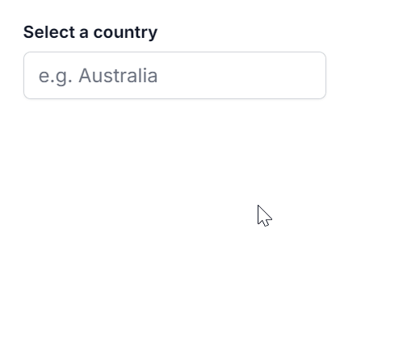

# Popup Setting in AutoComplete

## Popup resize 

You can dynamically adjust the size of the popup in the AutoComplete component by using the [AllowResize](https://help.syncfusion.com/cr/blazor/Syncfusion.Blazor.DropDowns.SfAutoComplete-1.html#Syncfusion_Blazor_DropDowns_SfAutoComplete_1_AllowResize) property. When enabled, users can resize the popup by dragging the resize handle to improve visibility and control.





 

## Change the popup width

Customize the width of the popup using the [PopupWidth](https://help.syncfusion.com/cr/blazor/Syncfusion.Blazor.DropDowns.SfAutoComplete-1.html#Syncfusion_Blazor_DropDowns_SfAutoComplete_1_PopupWidth) property. The default value of `PopupWidth` is `100%`. When unspecified, the popup width is based on the AutoComplete component’s width. This property accepts standard CSS units (for example, px, %, rem).

In the following sample, the `PopupWidth` is set as `300px`.







## Change the popup height

Customize the height of the popup using the [PopupHeight](https://help.syncfusion.com/cr/blazor/Syncfusion.Blazor.DropDowns.SfAutoComplete-1.html#Syncfusion_Blazor_DropDowns_SfAutoComplete_1_PopupHeight) property. The default value of `PopupHeight` is `300px`. This property accepts standard CSS units (for example, px, %, rem).

In the following sample, the `PopupHeight` is set as `200px`.







## Change the popup z-index

Customize the [z-index](https://help.syncfusion.com/cr/blazor/Syncfusion.Blazor.DropDowns.SfDropDownBase-1.html#Syncfusion_Blazor_DropDowns_SfDropDownBase_1_ZIndex) value of the component popup element.

## Show popup on initial loading

You can display the popup at initial load by calling [ShowPopupAsync()](https://help.syncfusion.com/cr/blazor/Syncfusion.Blazor.DropDowns.SfAutoComplete-1.html#Syncfusion_Blazor_DropDowns_SfAutoComplete_1_ShowPopupAsync) in the [Created](https://help.syncfusion.com/cr/blazor/Syncfusion.Blazor.DropDowns.AutoCompleteModel.html#Syncfusion_Blazor_DropDowns_AutoCompleteModel_Created) event.







## Preventing opening and closing

Prevent opening or closing the popup by setting [BeforeOpenEventArgs.cancel](https://help.syncfusion.com/cr/blazor/Syncfusion.Blazor.DropDowns.BeforeOpenEventArgs.html#Syncfusion_Blazor_DropDowns_BeforeOpenEventArgs_Cancel) or [PopupEventArgs.cancel](https://help.syncfusion.com/cr/blazor/Syncfusion.Blazor.DropDowns.PopupEventArgs.html#Syncfusion_Blazor_DropDowns_PopupEventArgs_Cancel) to `true` in the corresponding event handlers. This is achieved using the [OnOpen](https://help.syncfusion.com/cr/blazor/Syncfusion.Blazor.DropDowns.AutoCompleteEvents-2.html#Syncfusion_Blazor_DropDowns_AutoCompleteEvents_2_OnOpen) and [OnClose](https://help.syncfusion.com/cr/blazor/Syncfusion.Blazor.DropDowns.AutoCompleteEvents-2.html#Syncfusion_Blazor_DropDowns_AutoCompleteEvents_2_OnClose) events.







### OnOpen event

The [OnOpen](https://help.syncfusion.com/cr/blazor/Syncfusion.Blazor.DropDowns.AutoCompleteEvents-2.html#Syncfusion_Blazor_DropDowns_AutoCompleteEvents_2_OnOpen) event triggers before the popup is opened. Canceling this event keeps the popup closed.







### Opened event

The [Opened](https://help.syncfusion.com/cr/blazor/Syncfusion.Blazor.DropDowns.AutoCompleteEvents-2.html#Syncfusion_Blazor_DropDowns_AutoCompleteEvents_2_Opened) event triggers after the popup is opened.







### OnClose event

The [OnClose](https://help.syncfusion.com/cr/blazor/Syncfusion.Blazor.DropDowns.AutoCompleteEvents-2.html#Syncfusion_Blazor_DropDowns_AutoCompleteEvents_2_OnClose) event triggers before the popup is closed. Canceling this event keeps the popup open.







### Closed event

The [Closed](https://help.syncfusion.com/cr/blazor/Syncfusion.Blazor.DropDowns.AutoCompleteEvents-2.html#Syncfusion_Blazor_DropDowns_AutoCompleteEvents_2_Closed) event triggers after the popup has been closed.







## Popup height based on available space

You can set the popup height based on the available viewport space by binding the window `resize` event and updating the popup height dynamically.













