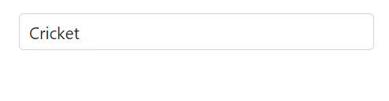
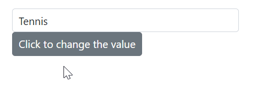
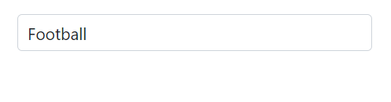
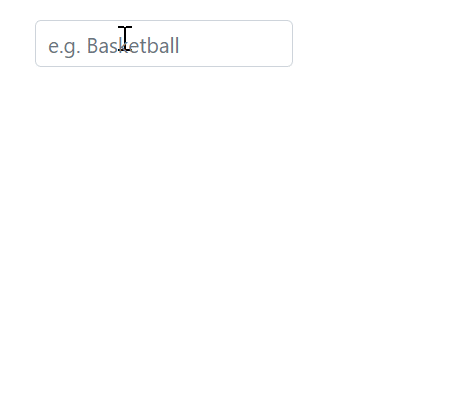
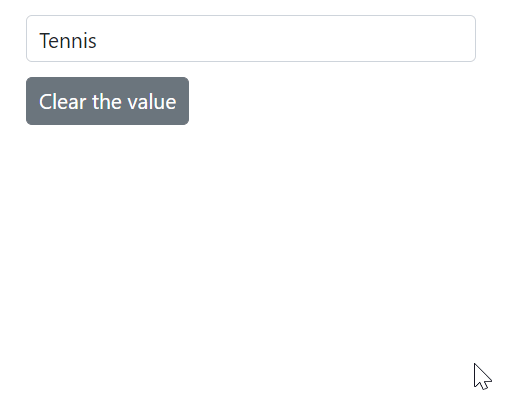

# Selection in AutoComplete

## Get selected value

Get the selected value of the AutoComplete component in the [ValueChange](https://help.syncfusion.com/cr/blazor/Syncfusion.Blazor.DropDowns.AutoCompleteEvents-2.html#Syncfusion_Blazor_DropDowns_AutoCompleteEvents_2_ValueChange) event using the [ChangeEventArgs.Value](https://help.syncfusion.com/cr/blazor/Syncfusion.Blazor.DropDowns.ChangeEventArgs-2.html#Syncfusion_Blazor_DropDowns_ChangeEventArgs_2_Value) property.







Get the complete object list of the selected value in the [ValueChange](https://help.syncfusion.com/cr/blazor/Syncfusion.Blazor.DropDowns.AutoCompleteEvents-2.html#Syncfusion_Blazor_DropDowns_AutoCompleteEvents_2_ValueChange) event using the [ChangeEventArgs.ItemData](https://help.syncfusion.com/cr/blazor/Syncfusion.Blazor.DropDowns.ChangeEventArgs-2.html#Syncfusion_Blazor_DropDowns_ChangeEventArgs_2_ItemData) property.







## Preselected value on OnInitializedAsync

Bind the pre-selected value to the AutoComplete component using the [@bind-Value](https://help.syncfusion.com/cr/blazor/Syncfusion.Blazor.DropDowns.SfDropDownList-2.html#Syncfusion_Blazor_DropDowns_SfDropDownList_2_Value) attribute. Assign the value property inside the [OnInitializedAsync](https://learn.microsoft.com/en-us/aspnet/core/blazor/components/lifecycle?view=aspnetcore-6.0#component-initialization-oninitializedasync) lifecycle. The following sample shows how to bind the value on the initial rendering of the component.







## Programmatically change the selected value

Change the component value programmatically or externally by the component instance using the [@ref](https://learn.microsoft.com/en-us/aspnet/core/mvc/views/razor?view=aspnetcore-7.0#ref) attribute of the component. The following sample shows how to change the value of the component using click event of the button component.







### ValueChange event

The [ValueChange](https://help.syncfusion.com/cr/blazor/Syncfusion.Blazor.DropDowns.AutoCompleteEvents-2.html#Syncfusion_Blazor_DropDowns_AutoCompleteEvents_2_ValueChange) event is triggered when the value of the AutoComplete component get changed or modified. Also, it will return the necessary arguments including the current and previously selected or changed value.







### OnValueSelect event

The [OnValueSelect](https://help.syncfusion.com/cr/blazor/Syncfusion.Blazor.DropDowns.AutoCompleteEvents-2.html#Syncfusion_Blazor_DropDowns_AutoCompleteEvents_2_OnValueSelect) event is triggered when you select any value in the AutoComplete component. Get the necessary arguments including the [ChangeEventArgs.ItemData](https://help.syncfusion.com/cr/blazor/Syncfusion.Blazor.DropDowns.ChangeEventArgs-2.html#Syncfusion_Blazor_DropDowns_ChangeEventArgs_2_ItemData). Also,  prevent the selection of items by setting the [ChangeEventArgs.Cancel](https://help.syncfusion.com/cr/blazor/Syncfusion.Blazor.DropDowns.ChangeEventArgs-2.html#Syncfusion_Blazor_DropDowns_ChangeEventArgs_2_Cancel) property as `true` provided by the event arguments. 







## Preselect value with index

Bind the pre-selected value to the component using the [@bind-Index](https://help.syncfusion.com/cr/blazor/Syncfusion.Blazor.DropDowns.SfDropDownList-2.html#Syncfusion_Blazor_DropDowns_SfDropDownList_2_Index) attribute. It binds the respective value present in the specified index position of the datasource.

N> It will be dependent on the [SortOrder](https://help.syncfusion.com/cr/blazor/Syncfusion.Blazor.DropDowns.SortOrder.html) type. It will bind the value to the component with the sorted data if the corresponding property is defined.

The following sample shows how to bind the index on the initial rendering.







## Autofill the selected value

The [Autofill](https://help.syncfusion.com/cr/blazor/Syncfusion.Blazor.DropDowns.AutoCompleteModel.html#Syncfusion_Blazor_DropDowns_AutoCompleteModel_Autofill) property specifies whether the input field of the component automatically suggests and fills in the first matched item as the user types, based on the items in the component's data source. If no matches are found, the input field will not be filled, and no action will occur. The default value of `Autofill` is `false`.





 

## Get selected item by value

Get the entire object belonging to the value selected in the component using the [GetDataByValue](https://help.syncfusion.com/cr/blazor/Syncfusion.Blazor.DropDowns.SfDropDownList-2.html#Syncfusion_Blazor_DropDowns_SfDropDownList_2_GetDataByValue__0_) method.







## Focus the next component on selection

Focus the component programmatically using the [FocusAsync](https://help.syncfusion.com/cr/blazor/Syncfusion.Blazor.DropDowns.SfDropDownList-2.html#Syncfusion_Blazor_DropDowns_SfDropDownList_2_FocusAsync) public method. It will set focus instantly to the AutoComplete component when invoking it. 







## Prevent reload on form submit

To prevent the page from reloading when using the AutoComplete component inside a form, you can specify the type of the button as "button" by utilizing the `HTMLAttributes` property. This will prevent the page from reloading when the button is clicked.







## Programmatically clear the selected value

To clear the Autocomplete value programmatically, use the [ClearAsync](https://help.syncfusion.com/cr/blazor/Syncfusion.Blazor.DropDowns.SfDropDownList-2.html#Syncfusion_Blazor_DropDowns_SfDropDownList_2_ClearAsync) method. This method clears out the selected values from the SfAutocomplete<TValue, TItem> component and sets the [Value](https://help.syncfusion.com/cr/blazor/Syncfusion.Blazor.DropDowns.SfDropDownList-2.html#Syncfusion_Blazor_DropDowns_SfDropDownList_2_Value) and [Index](https://help.syncfusion.com/cr/blazor/Syncfusion.Blazor.DropDowns.SfDropDownList-2.html#Syncfusion_Blazor_DropDowns_SfDropDownList_2_Index) properties to null.







## Programmatically trigger onChange event

Trigger the [ValueChange](https://help.syncfusion.com/cr/blazor/Syncfusion.Blazor.DropDowns.AutoCompleteEvents-2.html#Syncfusion_Blazor_DropDowns_AutoCompleteEvents_2_ValueChange) event manually by using the instance (taken from @ref attribute) of the [AutoCompleteEvents](https://help.syncfusion.com/cr/blazor/Syncfusion.Blazor.DropDowns.AutoCompleteEvents-2.html). In the following example, the `ValueChange` event is invoked inside the `Created` event handler. As per the following code, it will trigger once the component is created or rendered on the page.







## Programmatically focus in and focus out the component

In order to trigger the `FocusAsync()` and `FocusOutAsync()` methods using the instance of the autocomplete, you can use buttons. You can bind the click event of the button to the `FocusAsync()` and `FocusOutAsync()` methods. When the button is clicked, it triggers the corresponding method on the autocomplete.







While focusing and focus out the following event get triggered.

### Focus event

The [Focus](https://help.syncfusion.com/cr/blazor/Syncfusion.Blazor.DropDowns.AutoCompleteEvents-2.html#Syncfusion_Blazor_DropDowns_AutoCompleteEvents_2_Focus) event will trigger when the component gets focused. 







### Blur event

The [Blur](https://help.syncfusion.com/cr/blazor/Syncfusion.Blazor.DropDowns.AutoCompleteEvents-2.html#Syncfusion_Blazor_DropDowns_AutoCompleteEvents_2_Blur) event will trigger when focus moves out from the component. 





