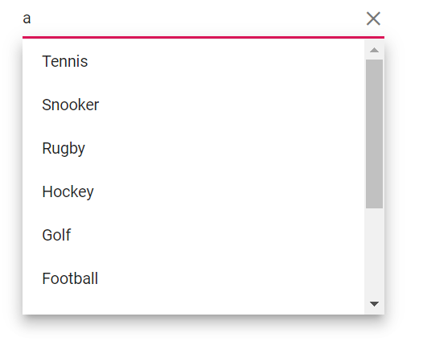

# Sorting in AutoComplete

Sorting orders the displayed items in the AutoComplete popup. The default sort order is `None`.

The Sorting enables you to sort data in the `Ascending` or `Descending` order. To enable sorting in the AutoComplete, set the [SortOrder](https://help.syncfusion.com/cr/blazor/Syncfusion.Blazor.DropDowns.SfDropDownBase-1.html#Syncfusion_Blazor_DropDowns_SfDropDownBase_1_SortOrder) property to the required value. 

The available type of sort orders are:

SortOrder     | Description
------------ | -------------
  [None](https://help.syncfusion.com/cr/blazor/Syncfusion.Blazor.DropDowns.SortOrder.html#Syncfusion_Blazor_DropDowns_SortOrder_None)       | The data source is not sorted.
  [Ascending](https://help.syncfusion.com/cr/blazor/Syncfusion.Blazor.DropDowns.SortOrder.html#Syncfusion_Blazor_DropDowns_SortOrder_Ascending)     | Sorts in ascending order.
  [Descending](https://help.syncfusion.com/cr/blazor/Syncfusion.Blazor.DropDowns.SortOrder.html#Syncfusion_Blazor_DropDowns_SortOrder_Descending)      | Sorts in descending order.

In the following demonstration sample, the items in the data source are intentionally shuffled; the `SortOrder` determines whether the items are listed in ascending or descending alphanumeric order in the popup. Sorting is applied to the field used for display (as configured in field settings), is client-side only, and does not modify the underlying data. Sorting behavior follows the current culture; combine with filtering as needed (filter reduces the list, then the result is shown in the specified sort order).







