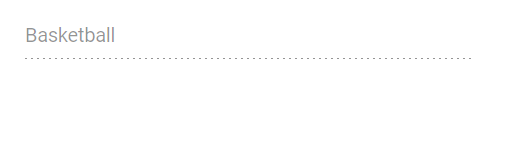
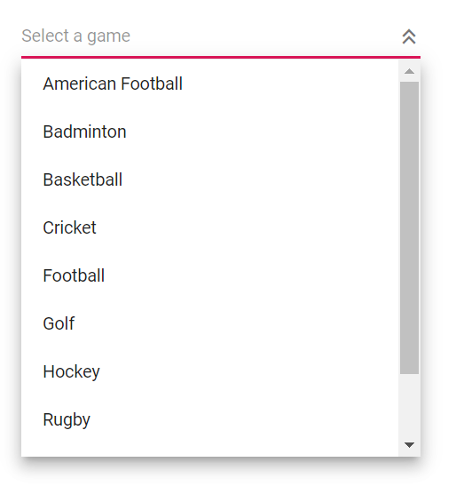
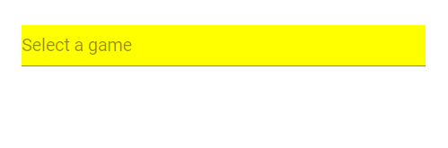
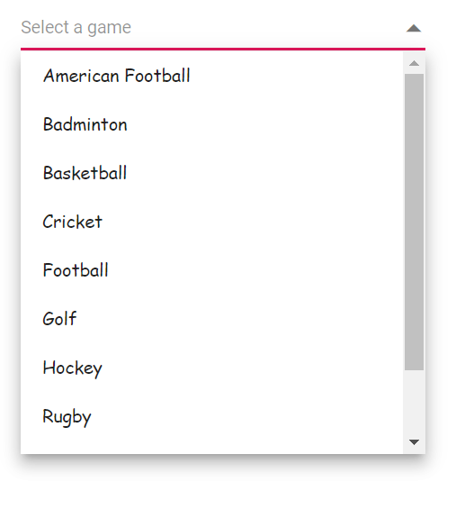
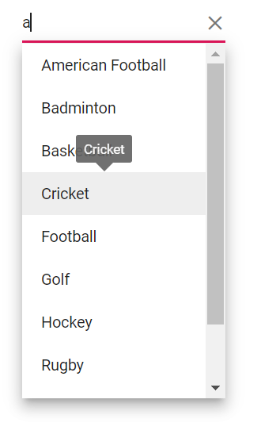
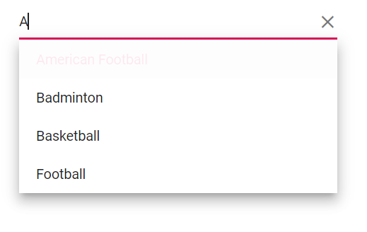
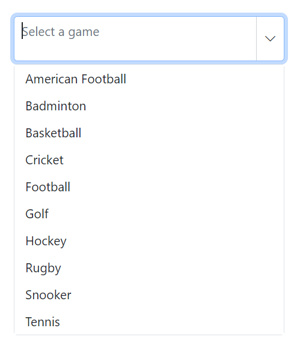
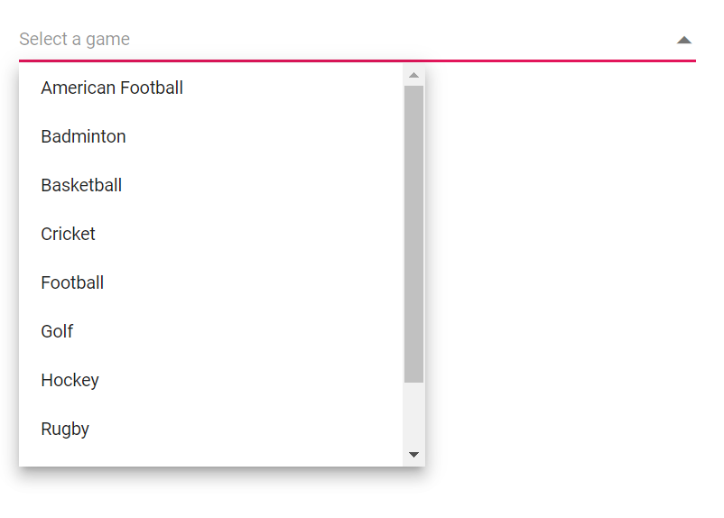
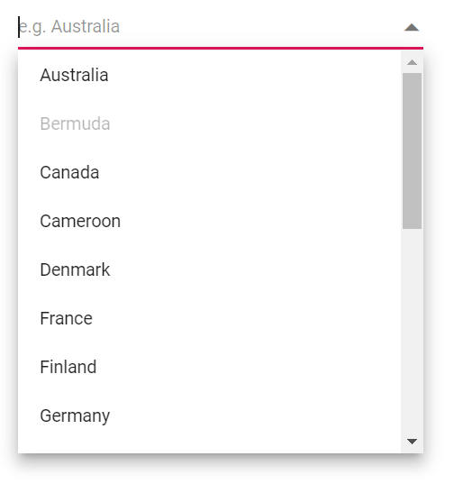

# Style and Appearance in Blazor AutoComplete Component

The following content explains the CSS structure and options that can be used to modify the component’s appearance based on user preferences and theming requirements.

## Read-only mode

Specify a boolean value for the [Readonly](https://help.syncfusion.com/cr/blazor/Syncfusion.Blazor.DropDowns.SfDropDownList-2.html#Syncfusion_Blazor_DropDowns_SfDropDownList_2_Readonly) property to control whether the AutoComplete allows the user to change the value.







## Disabled state

Specify a boolean value for the [Enabled](https://help.syncfusion.com/cr/blazor/Syncfusion.Blazor.DropDowns.SfDropDownBase-1.html#Syncfusion_Blazor_DropDowns_SfDropDownBase_1_Enabled) property to indicate whether the component is enabled.







### Customizing the disabled component’s text color

Customize the text color of a disabled component by targeting the `.e-input[disabled]` selector (the input element in a disabled state) and setting the desired color using the `-webkit-text-fill-color` property. For broader browser coverage, consider also setting the `color` property.









## Show the custom icon in dropdown icon

Customize the dropdown [icon](https://ej2.syncfusion.com/documentation/appearance/icons#material) by targeting the `.e-ddl-icon::before` selector (the icon element in the AutoComplete) and setting the desired glyph via the `content` property.







Customize the dropdown icon for a specific component instance using the [CssClass](https://help.syncfusion.com/cr/blazor/Syncfusion.Blazor.DropDowns.SfDropDownList-2.html#Syncfusion_Blazor_DropDowns_SfDropDownList_2_CssClass) property and apply styles to that custom class.







## Customizing the appearance of container element

Customize the container element within the AutoComplete by targeting the `.e-input` selector (the parent element of the input), and apply the desired styles to change the component’s appearance.









## Customizing the dropdown icon’s color

Customize the dropdown [icon](https://ej2.syncfusion.com/documentation/appearance/icons) color by targeting the `.e-ddl-icon.e-icons` selector and setting the desired value for the `color` property.









## Customizing the focus color

Customize the component’s color when focused by targeting the `.e-input-focus::after` selector (the input element when focused) and setting the desired `background` value.









## Customizing the outline theme's focus color

Customize the focus appearance when using an outline theme by targeting the `e-outline` variant selectors for the input. Adjust the relevant focus styles (such as border or outline color) to achieve the desired effect.









## Customizing the background color of focus, hover, and active items

Customize the background and text colors of list items when focused, active, or hovered by targeting `.e-list-item.e-item-focus`, `.e-list-item.e-active`, and `.e-list-item.e-hover`, and set the `background-color` and `color` properties as needed.









## Customizing the appearance of popup element

Customize the popup element within the AutoComplete by targeting the `.e-list-item.e-item-focus` selector (the list item when focused) and applying the desired styles to adjust the popup’s appearance.









## Change the HTML attributes

Add additional HTML attributes, such as styles and classes, to the root element using the [HTMLAttributes](https://help.syncfusion.com/cr/blazor/Syncfusion.Blazor.DropDowns.SfDropDownList-2.html#Syncfusion_Blazor_DropDowns_SfDropDownList_2_HtmlAttributes) property, which accepts any number of attributes in key–value pair format.







## Set the various font family for autocomplete elements

Change the font family by overriding the relevant selectors. To scope the override to a specific component instance, add a class via the [CssClass](https://help.syncfusion.com/cr/blazor/Syncfusion.Blazor.DropDowns.SfDropDownList-2.html#Syncfusion_Blazor_DropDowns_SfDropDownList_2_CssClass) property and target that class.

In the following sample, the font family of the AutoComplete input, list item text, and filter input text is changed.







## Show tooltip on list item

This behavior can be achieved by integrating the Tooltip component so that when the mouse hovers over an AutoComplete option, a tooltip displays information about the hovered list item. For details, see the Tooltip component documentation.

The following code demonstrates how to display a tooltip when hovering over an AutoComplete option.







## Customize selected item opacity

In the following code, CSS targets the `.e-list-item` elements within `.e-dropdownbase` when in an active or active-and-hovered state, setting the `opacity` property to adjust visual prominence. This changes the appearance of AutoComplete list items in those states.







## Customizing the height

### Height of AutoComplete

Use the [PopupHeight](https://help.syncfusion.com/cr/blazor/Syncfusion.Blazor.DropDowns.SfDropDownList-2.html#Syncfusion_Blazor_DropDowns_SfDropDownList_2_PopupHeight) property to change the height of the popup.







### Width of AutoComplete

To customize the width of the popup alone, use the [PopupWidth](https://help.syncfusion.com/cr/blazor/Syncfusion.Blazor.DropDowns.SfDropDownList-2.html#Syncfusion_Blazor_DropDowns_SfDropDownList_2_PopupWidth) property. By default, the popup width is set based on the component’s width. Use the [Width](https://help.syncfusion.com/cr/blazor/Syncfusion.Blazor.DropDowns.SfDropDownList-2.html#Syncfusion_Blazor_DropDownList_2_Width) property to change the width of the component.







## Disable specific items in AutoComplete

Prevent some items in the popup list from being selected by disabling specific items for a particular component instance. This can be achieved by adding a custom class to the popup element using the [CssClass](https://help.syncfusion.com/cr/blazor/Syncfusion.Blazor.DropDowns.SfDropDownList-2.html#Syncfusion_Blazor_DropDownList_2_CssClass) property and applying styles for that class.

In the following code, a single list item is disabled using JavaScript interop.












## Adding search icon in the Blazor AutoComplete component.

Add a search icon to the AutoComplete by overriding the content of the existing icon. The following code demonstrates how to add a search icon.









## Customizing the float label element's focusing color

Change the text color of the floating label on focus by targeting `.e-input-focus` and `.e-float-text.e-label-top` (the focused floating label text) and setting the desired `color`.









## Customizing the color of the placeholder text

Change the color of the placeholder by targeting `input.e-input::placeholder` (the placeholder text) and setting the desired `color`.









## Customizing the placeholder to add mandatory indicator(*)

Apply a mandatory indicator `*` to the placeholder by targeting `.e-float-text::after` and using the `content` style.









## Customizing the text selection color

Customize the text selection appearance within the AutoComplete input by targeting `input.e-input::selection` and setting the desired `background-color` and `color`. This customization applies when text is selected manually.








