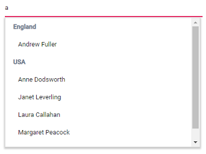
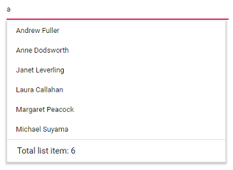
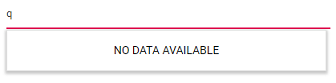

# Templates in Blazor AutoComplete Component

The AutoComplete has been provided with several options to customize each list items, group title, header, and footer elements.

## Item template

The content of each list item within the [AutoComplete](https://help.syncfusion.com/cr/blazor/Syncfusion.Blazor.DropDowns.SfAutoComplete-2.html) can be customized with the help of [ItemTemplate](https://help.syncfusion.com/cr/blazor/Syncfusion.Blazor.DropDowns.SfDropDownBase-1.html#Syncfusion_Blazor_DropDowns_SfDropDownBase_1_ItemTemplate) property.

In the following sample, each list item is split into two columns to display relevant data.









## Group template

The group header title under which appropriate sub-items are categorized can also be customized with the help of [GroupTemplate](https://help.syncfusion.com/cr/blazor/Syncfusion.Blazor.DropDowns.SfDropDownBase-1.html#Syncfusion_Blazor_DropDowns_SfDropDownBase_1_GroupTemplate) property. This template is common for both inline and floating group header templates.

In the following sample, employees are grouped according to their country.









## Header template

The header element is shown statically at the top of the suggestion list items within the AutoComplete, and any custom element can be placed as a header element using the [HeaderTemplate](https://help.syncfusion.com/cr/blazor/Syncfusion.Blazor.DropDowns.SfDropDownList-2.html#Syncfusion_Blazor_DropDowns_SfDropDownList_2_HeaderTemplate) property.

In the following sample, the list items and its headers are designed and displayed as two columns similar to multiple columns of the grid.









## Footer template

The AutoComplete has options to show a footer element at the bottom of the list items in the suggestion list. Here, you can place any custom element as a footer element using [FooterTemplate](https://help.syncfusion.com/cr/blazor/Syncfusion.Blazor.DropDowns.SfDropDownList-2.html#Syncfusion_Blazor_DropDowns_SfDropDownList_2_FooterTemplate) property.

In the following sample, footer element displays the total number of list items present in the AutoComplete.









## No records template

The AutoComplete is provided with support to custom design the suggestion list content when no data is found and no matches found on search with the help of the [NoRecordsTemplate](https://help.syncfusion.com/cr/blazor/Syncfusion.Blazor.DropDowns.SfDropDownBase-1.html#Syncfusion_Blazor_DropDowns_SfDropDownBase_1_NoRecordsTemplate) property.

In the following sample, suggestion list content displays the notification of no data available.









## Action failure template

There is also an option to custom design the suggestion list content when the data fetch request fails at the remote server. This can be achieved using the [ActionFailureTemplate](https://help.syncfusion.com/cr/blazor/Syncfusion.Blazor.DropDowns.SfDropDownBase-1.html#Syncfusion_Blazor_DropDowns_SfDropDownBase_1_ActionFailureTemplate) property.

In the following sample, when the data fetch request fails, the AutoComplete displays the notification.







