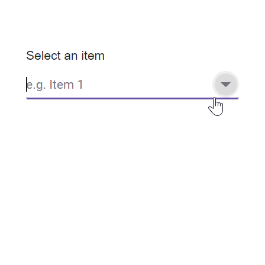

# Virtualization in Blazor AutoComplete Component

The AutoComplete component includes a virtual scrolling feature designed to enhance UI performance, particularly for handling large datasets. By enabling the [EnableVirtualization](https://help.syncfusion.com/cr/blazor/Syncfusion.Blazor.DropDowns.SfDropDownList-2.html#Syncfusion_Blazor_DropDowns_SfDropDownList_2_EnableVirtualization) option, the AutoComplete intelligently manages data rendering, ensuring only a subset of items is initially loaded when the component is rendered. As you interact with the dropdown, additional items are dynamically loaded as you scroll, creating a smooth and efficient user experience.

This feature is applicable to both local and remote data scenarios, providing flexibility in its implementation. For instance, consider a case where the AutoComplete is bound to a dataset containing 150 items. Upon opening the dropdown, only a few items are loaded initially, based on the height of the popup. As you scroll through the list, additional items are fetched and loaded on-demand, allowing you to effortlessly explore the complete dataset.


```cshtml

@using Syncfusion.Blazor.DropDowns
@using Syncfusion.Blazor.Data

<SfAutoComplete TValue="string" TItem="Record" Placeholder="Select an item" DataSource="@Records" Query="@LocalDataQuery" PopupHeight="130px" EnableVirtualization="true" ShowPopupButton="true">
    <AutoCompleteFieldSettings Value="Text"></AutoCompleteFieldSettings>
</SfAutoComplete>

@code{
    public Query LocalDataQuery = new Query().Take(6);
    public class Record
    {
        public string ID { get; set; }
        public string Text { get; set; }
    }
    public List<Record> Records { get; set; }
    protected override void OnInitialized()
    {
        this.Records = Enumerable.Range(1, 150).Select(i => new Record()
        {
            ID = i.ToString(),
            Text = "Item " + i,
        }).ToList();
    }
}
```





## Keyboard interaction

Users can navigate through the scrollable content using keyboard keys. This feature loads the next or next set of items based on the key inputs in the popup.

| Key | Action |
|-----|-----|
| `ArrowDown` | Loads the next virtual list item if the focus is present in last item of the current page. |
| `ArrowUp` | Loads the previous virtual list item if the focus is present in first item of the current page. |
| `PageDown` | Loads the next page and focus the last item in it. |
| `PageUp` | Loads the previous page and focus the first item in it. |

## Limitation of virtualization

* Virtualization is not supported in the grouping feature.
* Selected Value may or may not be present in the current view port.
* Long-pressing of navigation keys is not intended for item navigation in the AutoComplete component , It accepts single key action at a time.