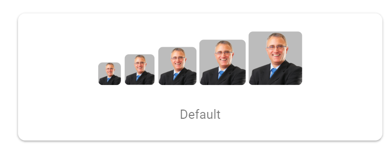

<!-- markdownlint-disable MD024 -->

# Getting Started with Blazor Avatar Component

This section briefly explains about how to include [Blazor Avatar](https://blazor.syncfusion.com/documentation/avatar/getting-started) component in a Blazor WebAssembly App using [Visual Studio](https://visualstudio.microsoft.com/vs/), [Visual Studio Code](https://code.visualstudio.com/), and the [.NET CLI](https://learn.microsoft.com/en-us/dotnet/core/tools/).





## Prerequisites

* [System requirements for Blazor components](https://blazor.syncfusion.com/documentation/system-requirements)

## Create a new Blazor App in Visual Studio

Create a **Blazor WebAssembly App** using Visual Studio via [Microsoft Templates](https://learn.microsoft.com/en-us/aspnet/core/blazor/tooling?view=aspnetcore-10.0&pivots=vs) or the [Syncfusion<sup style="font-size:70%">&reg;</sup> Blazor Extension](https://blazor.syncfusion.com/documentation/visual-studio-integration/template-studio). For detailed instructions, refer to the [Blazor WASM App Getting Started](https://blazor.syncfusion.com/documentation/getting-started/blazor-webassembly-app) documentation.





## Prerequisites

* [System requirements for Blazor components](https://blazor.syncfusion.com/documentation/system-requirements)

## Create a new Blazor App in Visual Studio Code

Create a **Blazor WebAssembly App** using Visual Studio Code via [Microsoft Templates](https://learn.microsoft.com/en-us/aspnet/core/blazor/tooling?view=aspnetcore-10.0&pivots=vsc) or the [Syncfusion<sup style="font-size:70%">&reg;</sup> Blazor Extension](https://blazor.syncfusion.com/documentation/visual-studio-code-integration/create-project). For detailed instructions, refer to the [Blazor WASM App Getting Started](https://blazor.syncfusion.com/documentation/getting-started/blazor-webassembly-app?tabcontent=visual-studio-code) documentation.

Alternatively, create a WebAssembly application by using the following command in the integrated terminal (<kbd>Ctrl</kbd>+<kbd>`</kbd>).





dotnet new blazorwasm -o BlazorApp
cd BlazorApp









## Prerequisites

Install the latest version of [.NET SDK](https://dotnet.microsoft.com/en-us/download). If the .NET SDK is already installed, determine the installed version by running the following command in a command prompt (Windows), terminal (macOS), or command shell (Linux).




dotnet --version




## Create a Blazor WebAssembly App using .NET CLI

Run the following command to create a new Blazor WebAssembly App in a command prompt (Windows) or terminal (macOS) or command shell (Linux). For detailed instructions, refer to [this Blazor WASM App Getting Started](https://blazor.syncfusion.com/documentation/getting-started/blazor-webassembly-app?tabcontent=.net-cli) documentation.




dotnet new blazorwasm -o BlazorApp
cd BlazorApp








## Add Stylesheet

The theme stylesheet can be accessed from NuGet through [Static Web Assets](https://blazor.syncfusion.com/documentation/appearance/themes#static-web-assets). Include the stylesheet reference in the **~/index.html** file.

```html
<link href="_content/Syncfusion.Blazor.Themes/bootstrap5.css" rel="stylesheet" />
```

N> Check out the [Blazor Themes](https://blazor.syncfusion.com/documentation/appearance/themes) topic to discover various methods ([Static Web Assets](https://blazor.syncfusion.com/documentation/appearance/themes#static-web-assets), [CDN](https://blazor.syncfusion.com/documentation/appearance/themes#cdn-reference), and [CRG](https://blazor.syncfusion.com/documentation/common/custom-resource-generator)) for referencing themes in Blazor application.

## Add Blazor Avatar component

Add the Syncfusion<sup style="font-size:70%">&reg;</sup> Blazor Avatar component in the **~/Pages/Index.razor** file.




<!-- xSmall Avatar-->
<div class="e-avatar e-avatar-xsmall image"></div>

<!-- Small Avatar-->
<div class="e-avatar e-avatar-small image"></div>

<!-- Avatar-->
<div class="e-avatar image"></div>

<!-- Large Avatar-->
<div class="e-avatar e-avatar-large image"></div>

<!-- xLarge Avatar-->
<div class="e-avatar e-avatar-xlarge image"></div>

<style>
    .e-avatar {
        background-image: url(https://ej2.syncfusion.com/demos/src/avatar/images/pic01.png);
    }
</style>




* Press <kbd>Ctrl</kbd>+<kbd>F5</kbd> (Windows) or <kbd>⌘</kbd>+<kbd>F5</kbd> (macOS) to launch the application. This will render the Syncfusion<sup style="font-size:70%">&reg;</sup> Blazor Avatar component in the default web browser.


