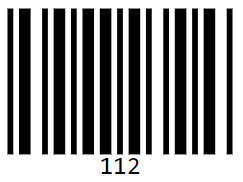
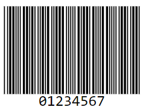
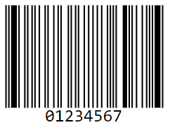
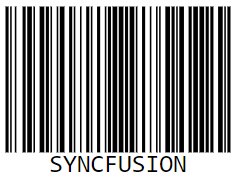
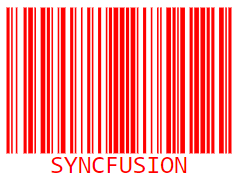
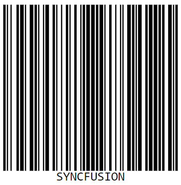
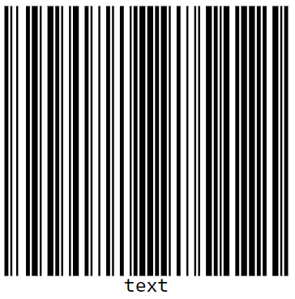

# Barcode Generator in Blazor Barcode Component

## Code39

The Code 39 character set includes digits 0-9, uppercase letters A–Z, and the symbols space, minus (-), plus (+), period (.), dollar ($), slash (/), and percent (%). A special start/stop character is placed at the beginning and end of each barcode. The barcode can be of any length; even more than 25 characters begin to push the bounds. Code 39 is the only type of barcode that does not require a checksum for common use.

```cshtml
@using Syncfusion.Blazor.BarcodeGenerator

<SfBarcodeGenerator Width="200px" Height="150px" Type="@BarcodeType.Code39" Value="SYNCFUSION"></SfBarcodeGenerator>

```



## Code39 Extended

Code 39 Extended is an enhanced version of Code 39 that supports ASCII character set. In Code 39 Extended, it can encode lowercase letters (a–z) and special keyboard characters by using combinations of standard Code 39 symbols.

```cshtml
@using Syncfusion.Blazor.BarcodeGenerator

<SfBarcodeGenerator Width="200px" Height="150px" Type="@BarcodeType.Code39Extension" Value="SYNCFUSION"></SfBarcodeGenerator>

```



## Code 11

Code 11 is used primarily for labeling telecommunications equipment. The character set includes digits 0 to 9, a dash (-), and start/stop codes.

```cshtml
@using Syncfusion.Blazor.BarcodeGenerator

<SfBarcodeGenerator Width="200px" Height="150px" Type="@BarcodeType.Code11" Value="112"></SfBarcodeGenerator>

```




## Codabar

Codabar is a variable-length symbol that encodes the following 20 characters:

0123456789-$:/.+ABCD

The characters A, B, C, and D serve as start and stop characters. Codabar is used in libraries, blood banks, the package delivery industry and a variety of other information processing applications.

```cshtml
@using Syncfusion.Blazor.BarcodeGenerator

<SfBarcodeGenerator Width="200px" Height="150px" Type="@BarcodeType.Codabar" Value="123456789"></SfBarcodeGenerator>

```



## Code 32

Code 32 is used mainly for coding pharmaceuticals, cosmetics, and dietetics. It is often to encode the Italian Pharmacode that has the following structure:

* ‘A’ character (ASCII 65), that is not really encoded.
* 8 digits for the Pharmacode (It generally begins with / and prefixed with 0).
* 1 digit for checksum module 10, that is automatically calculated by the barcode.

The value to be encoded must be 8 digits Pharmacode (prefix it with ‘0’ if necessary), and the 9th digit (the checksum) is automatically calculated by barcode.

```cshtml
@using Syncfusion.Blazor.BarcodeGenerator

<SfBarcodeGenerator Width="200px" Height="150px" Type="@BarcodeType.Code32" Value="01234567"></SfBarcodeGenerator>

```




## Code 93

Code 93 is designed to complement and improve Code 39. It represents the entire ASCII character set through combinations of two characters. Code 93 is a continuous, variable-length symbology and produces denser code. The Standard Mode (default implementation) can encode uppercase letters (A-Z), digits (0-9), and special characters like *, -, $, %, (Space), ., /, and +.

```cshtml
@using Syncfusion.Blazor.BarcodeGenerator

<SfBarcodeGenerator Width="200px" Height="150px" Type="@BarcodeType.Code93" Value="01234567"></SfBarcodeGenerator>

```




## Code 93 Extended

Code 93 Extended Barcode symbology is a continuous, variable length, self-checking. It is based on Code 93 Barcode. The Extended Version can encode all 128 ASCII characters.

## Code 128

Code 128 is a variable-length, high-density, alphanumeric, linear bar code symbology capable of encoding full 128-character ASCII character set and extended character sets. This symbology includes a checksum digit for verification and the barcode can be verified character-by-character by verifying the parity of each data byte.

### Code 128 Code Sets

* Code Set A (or Chars Set A) includes all of the standard upper case U.S. alphanumeric keyboard characters and punctuation characters along with the control characters, (namely, characters with ASCII values from 0 to 95 inclusive), and seven special characters.
* Code Set B (or Chars Set B) includes all of the standard upper case alphanumeric keyboard characters and punctuation characters along with the lower case alphabetic characters (namely, characters with ASCII values from 32 to 127 inclusive), and seven special characters.
* Code Set C (or Chars Set C) includes the set of 100 digit pairs from 00 to 99 inclusive along with three special characters. This allows numeric data to be   encoded as two data digits per symbol character, at effectively twice the density of standard data.

### Code 128 Special characters

The last seven characters of Code Sets A and B (character values 96-102) and the last three characters of Code Set C (character values 100-102) are special non-data characters with no ASCII character equivalents that have a particular significance to the Barcode reading device.

```cshtml
@using Syncfusion.Blazor.BarcodeGenerator

<SfBarcodeGenerator Width="200px" Height="150px" Type="@BarcodeType.Code128" Value="SYNCFUSION"></SfBarcodeGenerator>

```




## Customizing the Barcode color

A page or printed media with barcode often appears colorful in the background and surrounding region with other contents. In such cases, the barcode can also be customized to suit the needs. You can achieve this by using for [ForeColor](https://help.syncfusion.com/cr/blazor/Syncfusion.Blazor.BarcodeGenerator.SfBarcodeGenerator.html#Syncfusion_Blazor_BarcodeGenerator_SfBarcodeGenerator_ForeColor) property.

```cshtml
@using Syncfusion.Blazor.BarcodeGenerator

<SfBarcodeGenerator Width="200px" Height="150px" Type="@BarcodeType.Code128" ForeColor="red" Value="SYNCFUSION"></SfBarcodeGenerator>

```




## Customizing the Barcode dimension

The dimensions of the barcode can be adjusted using the [Height](https://help.syncfusion.com/cr/blazor/Syncfusion.Blazor.BarcodeGenerator.SfBarcodeGenerator.html#Syncfusion_Blazor_BarcodeGenerator_SfBarcodeGenerator_Height) and [Width](https://help.syncfusion.com/cr/blazor/Syncfusion.Blazor.BarcodeGenerator.SfBarcodeGenerator.html#Syncfusion_Blazor_BarcodeGenerator_SfBarcodeGenerator_Width) properties of the barcode generator.

```cshtml
@using Syncfusion.Blazor.BarcodeGenerator

<SfBarcodeGenerator Width="300px" Height="300px" Type="@BarcodeType.Code128" Value="SYNCFUSION"></SfBarcodeGenerator>

```




## Customizing the text

In barcode generators, Customize the barcode text by using display [Text](https://help.syncfusion.com/cr/blazor/Syncfusion.Blazor.BarcodeGenerator.BarcodeGeneratorDisplayText.html#Syncfusion_Blazor_BarcodeGenerator_BarcodeGeneratorDisplayText_Text) property.

```cshtml
@using Syncfusion.Blazor.BarcodeGenerator

<SfBarcodeGenerator Width="300px" Height="300px" Type="@BarcodeType.Code128" Value="SYNCFUSION">
     <BarcodeGeneratorDisplayText Text="Text"></BarcodeGeneratorDisplayText>
</SfBarcodeGenerator>

```




## Enable Check Sum

The [EnableCheckSum](https://help.syncfusion.com/cr/blazor/Syncfusion.Blazor.BarcodeGenerator.SfBarcodeGenerator.html#Syncfusion_Blazor_BarcodeGenerator_SfBarcodeGenerator_EnableCheckSum) property specifies an error detection in which some additional characters are added to a barcode to protect the integrity of the barcode data. The default value of this property is set as true for BarcodeType.Code39.

The below code explains how to set the EnableCheckSum property to hide the extra characters displayed at the end of the barcode.

```cshtml
<SfBarcodeGenerator EnableCheckSum=false
                    Width="200px"
                    Height="150px"
                    Type="@BarcodeType.Code39"
                    Value="SYNCFUSION">
</SfBarcodeGenerator>
```


## Event

[OnValidationFailed](https://help.syncfusion.com/cr/blazor/Syncfusion.Blazor.BarcodeGenerator.SfBarcodeGenerator.html#Syncfusion_Blazor_BarcodeGenerator_SfBarcodeGenerator_OnValidationFailed) event in the [SfBarcodeGenerator](https://help.syncfusion.com/cr/blazor/Syncfusion.Blazor.BarcodeGenerator.SfBarcodeGenerator.html) is used to trigger when the input is invalid string.

```cshtml
@using Syncfusion.Blazor.BarcodeGenerator
<SfBarcodeGenerator Width="200px" Height="150px" Type="@BarcodeType.Code128" Value="SYNCFUSION" OnValidationFailed="@OnValidationFailed"></SfBarcodeGenerator>

@code
{
    public void OnValidationFailed(ValidationFailedEventArgs args)
    {
    }
}
```
## See also

* [How to generate a QR Code in (2FA) Application in Blazor Diagram?](https://support.syncfusion.com/kb/article/16295/how-to-generate-a-qr-code-in-2fa-application-in-blazor-diagram)

* [How to create a simple BarcodeGenerator and QRCodeGenerator sample in a .NET 8 Blazor Web App using interactive render mode as a server?](https://support.syncfusion.com/kb/article/17284/how-to-create-a-simple-barcodegenerator-and-qrcodegenerator-sample-in-a-net-8-blazor-web-app-using-interactive-render-mode-as-a-server)