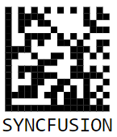
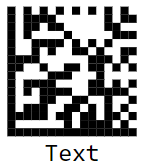

# Data Matrix Generator in Blazor Barcode Component

## Data Matrix

The [DataMatrix](https://help.syncfusion.com/cr/blazor/Syncfusion.Blazor.BarcodeGenerator.SfDataMatrixGenerator.html) barcode is a two-dimensional barcode that consists of a grid of dark and light dots or blocks forming square or rectangular symbol. The data encoded in the barcode can either be numbers or alphanumeric. They are widely used in printed media such as labels and letters. You can read it easily with the help of a barcode reader and mobile phones.

```cshtml
@using Syncfusion.Blazor.BarcodeGenerator

<SfDataMatrixGenerator Width="200" Height="150" Value="SYNCFUSION"></SfDataMatrixGenerator>

```




## Customizing the Barcode color

A page or printed media with barcode often appears colorful in the backgrounds and surrounding region with other contents. The barcode can be customized to suit the design by using the [ForeColor](https://help.syncfusion.com/cr/blazor/Syncfusion.Blazor.BarcodeGenerator.SfDataMatrixGenerator.html#Syncfusion_Blazor_BarcodeGenerator_SfDataMatrixGenerator_ForeColor) property.

```cshtml
@using Syncfusion.Blazor.BarcodeGenerator

<SfDataMatrixGenerator Width="200" ForeColor="red" Height="150" Value="SYNCFUSION"></SfDataMatrixGenerator>

```



## Customizing the Barcode dimension

The dimensions of the barcode can be adjusted by using the [Height](https://help.syncfusion.com/cr/blazor/Syncfusion.Blazor.BarcodeGenerator.SfDataMatrixGenerator.html#Syncfusion_Blazor_BarcodeGenerator_SfDataMatrixGenerator_Height) and [Width](https://help.syncfusion.com/cr/blazor/Syncfusion.Blazor.BarcodeGenerator.SfDataMatrixGenerator.html#Syncfusion_Blazor_BarcodeGenerator_SfDataMatrixGenerator_Width) properties of the barcode generator.

```cshtml
@using Syncfusion.Blazor.BarcodeGenerator

<SfDataMatrixGenerator Width="200" Height="150" Value="SYNCFUSION"></SfDataMatrixGenerator>

```


## Customizing the text

Customize the barcode text by using the display [Text](https://help.syncfusion.com/cr/blazor/Syncfusion.Blazor.BarcodeGenerator.DataMatrixGeneratorDisplayText.html#Syncfusion_Blazor_BarcodeGenerator_DataMatrixGeneratorDisplayText_Text) property.

```cshtml
@using Syncfusion.Blazor.BarcodeGenerator

<SfDataMatrixGenerator Width="200" Height="150" Value="SYNCFUSION">
    <DataMatrixGeneratorDisplayText Text="Text"></DataMatrixGeneratorDisplayText>
</SfDataMatrixGenerator>

```




## Event

[OnValidationFailed](https://help.syncfusion.com/cr/blazor/Syncfusion.Blazor.BarcodeGenerator.SfDataMatrixGenerator.html#Syncfusion_Blazor_BarcodeGenerator_SfDataMatrixGenerator_OnValidationFailed) event in the [SfDataMatrixGenerator](https://help.syncfusion.com/cr/blazor/Syncfusion.Blazor.BarcodeGenerator.SfDataMatrixGenerator.html) is used to trigger when the input is an invalid string.

```cshtml
@using Syncfusion.Blazor.BarcodeGenerator

<SfDataMatrixGenerator Width="200px" Height="150px" Value="SYNCFUSION" OnValidationFailed="@OnValidationFailed"></SfDataMatrixGenerator>

@code
{
    public void OnValidationFailed(ValidationFailedEventArgs args)
    {
    }
}

```
