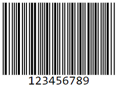
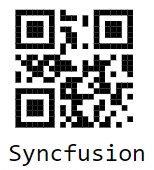
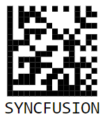

# Getting Started with Blazor Barcode Component

This section briefly explains about how to include [Blazor Barcode](https://www.syncfusion.com/blazor-components/blazor-barcode) component in your Blazor Server App and Blazor WebAssembly App using Visual Studio.

## Prerequisites

* [System requirements for Blazor components](https://blazor.syncfusion.com/documentation/system-requirements)

## Create a new Blazor App in Visual Studio

You can create a **Blazor Server App** or **Blazor WebAssembly App** using Visual Studio via [Microsoft Templates](https://learn.microsoft.com/en-us/aspnet/core/blazor/tooling?view=aspnetcore-7.0&pivots=windows) or the [Syncfusion Blazor Extension](https://blazor.syncfusion.com/documentation/visual-studio-integration/template-studio).

## Install Syncfusion Blazor BarcodeGenerator and Themes NuGet in the App

To add **Blazor Barcode** component in the app, open the NuGet package manager in Visual Studio (*Tools → NuGet Package Manager → Manage NuGet Packages for Solution*), search and install [Syncfusion.Blazor.BarcodeGenerator](https://www.nuget.org/packages/Syncfusion.Blazor.BarcodeGenerator/) and [Syncfusion.Blazor.Themes](https://www.nuget.org/packages/Syncfusion.Blazor.Themes/). Alternatively, you can utilize the following package manager command to achieve the same.




Install-Package Syncfusion.Blazor.BarcodeGenerator -Version {{ site.releaseversion }}
Install-Package Syncfusion.Blazor.Themes -Version {{ site.releaseversion }}




## Register Syncfusion Blazor Service

Open **~/_Imports.razor** file and import the Syncfusion.Blazor namespace.




@using Syncfusion.Blazor
@using Syncfusion.Blazor.BarcodeGenerator




Now, register the Syncfusion Blazor Service in the **~/Program.cs** file of your Blazor Server App or Blazor WebAssembly App.




using Microsoft.AspNetCore.Components;
using Microsoft.AspNetCore.Components.Web;
using Syncfusion.Blazor;

var builder = WebApplication.CreateBuilder(args);

// Add services to the container.
builder.Services.AddRazorPages();
builder.Services.AddServerSideBlazor();
builder.Services.AddSyncfusionBlazor();

var app = builder.Build();
....




using Microsoft.AspNetCore.Components.Web;
using Microsoft.AspNetCore.Components.WebAssembly.Hosting;
using Syncfusion.Blazor;

var builder = WebAssemblyHostBuilder.CreateDefault(args);
builder.RootComponents.Add<App>("#app");
builder.RootComponents.Add<HeadOutlet>("head::after");

builder.Services.AddScoped(serviceProvider => new HttpClient { BaseAddress = new Uri(builder.HostEnvironment.BaseAddress) });

builder.Services.AddSyncfusionBlazor();
await builder.Build().RunAsync();
....




## Add stylesheet and script resources

The theme stylesheet and script can be accessed from NuGet through [Static Web Assets](https://blazor.syncfusion.com/documentation/appearance/themes#static-web-assets). Reference the stylesheet and script in the `<head>` of the main page as follows:

* For **.NET 6** Blazor Server app, include it in **~/Pages/_Layout.cshtml** file.

* For **.NET 7** Blazor Server app, include it in the **~/Pages/_Host.cshtml** file.

* For Blazor WebAssembly app, include it in the **~/index.html** file.

```html
<head>
    ....
    <link href="_content/Syncfusion.Blazor.Themes/bootstrap5.css" rel="stylesheet" />
    <script src="_content/Syncfusion.Blazor.Core/scripts/syncfusion-blazor.min.js" type="text/javascript"></script>
</head>
```
N> Check out the [Blazor Themes](https://blazor.syncfusion.com/documentation/appearance/themes) topic to discover various methods ([Static Web Assets](https://blazor.syncfusion.com/documentation/appearance/themes#static-web-assets), [CDN](https://blazor.syncfusion.com/documentation/appearance/themes#cdn-reference), and [CRG](https://blazor.syncfusion.com/documentation/common/custom-resource-generator)) for referencing themes in your Blazor application. Also, check out the [Adding Script Reference](https://blazor.syncfusion.com/documentation/common/adding-script-references) topic to learn different approaches for adding script references in your Blazor application.

## Add Blazor Barcode component

Add the Syncfusion Blazor Barcode component in the **~/Pages/Index.razor** file.




<SfBarcodeGenerator Width="200px" Height="150px" Type="@BarcodeType.Codabar" Value="123456789"></SfBarcodeGenerator>




* Press <kbd>Ctrl</kbd>+<kbd>F5</kbd> (Windows) or <kbd>⌘</kbd>+<kbd>F5</kbd> (macOS) to launch the application. This will render the Syncfusion Blazor Barcode component in your default web browser.





N> [View Sample in GitHub](https://github.com/SyncfusionExamples/Blazor-Getting-Started-Examples/tree/main/Barcode).

## Adding QR Generator control

You can add the QR code in our barcode generator component.




<SfQRCodeGenerator Width="200px" Height="150px"  Value="Syncfusion"></SfQRCodeGenerator>








## Adding Data Matrix Generator control

You can add the Data Matrix code in our barcode generator component.




<SfDataMatrixGenerator Width="200" Height="150" Value="SYNCFUSION"></SfDataMatrixGenerator>








N> You can also explore our [Blazor Barcode Generator example](https://blazor.syncfusion.com/demos/barcodes/default-functionalities?theme=bootstrap5) that shows you how to render and configure the barcode.

## See also

* [Getting Started with Syncfusion Blazor for Client-Side in .NET Core CLI](https://blazor.syncfusion.com/documentation/getting-started/blazor-webassembly-dotnet-cli)
* [Getting Started with Syncfusion Blazor for Server-Side in Visual Studio](https://blazor.syncfusion.com/documentation/getting-started/blazor-server-side-visual-studio)
* [Getting Started with Syncfusion Blazor for Server-Side in .NET Core CLI](https://blazor.syncfusion.com/documentation/getting-started/blazor-server-side-dotnet-cli)
