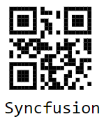
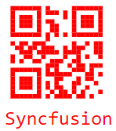
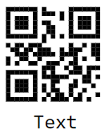
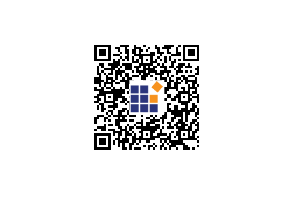

# QR Code Generator in Blazor Barcode Component

## QR Code

The [Blazor QR Code](https://www.syncfusion.com/blazor-components/blazor-barcode) is a two-dimensional barcode composed of a grid of dark and light dots or blocks that form a square. The data encoded in the barcode can be numeric, alphanumeric, or Shift Japanese Industrial Standards (JIS8) characters. The QR Code uses version from 1 to 40. Version 1 measures 21 modules x 21 modules, Version 2 measures 25 modules x 25 modules, and so on. The number of modules increases in steps of 4 modules per side up to Version 40, which measures 177 modules x 177 modules. Each version has its own capacity. By default, the barcode control automatically sets the version according to the length of the input text. The QR Barcodes are designed for industrial uses and are also commonly used in consumer advertising.

```cshtml
@using Syncfusion.Blazor.BarcodeGenerator

<SfQRCodeGenerator Width="200px" Height="150px" Value="Syncfusion"></SfQRCodeGenerator>

```




## Customizing the Barcode color

A page or printed media containing a barcode often appears colorful in the background and surrounding region with other contents. In such cases, the barcode can also be customized to meet the needs. Achieve this using [ForeColor](https://help.syncfusion.com/cr/blazor/Syncfusion.Blazor.BarcodeGenerator.SfQRCodeGenerator.html#Syncfusion_Blazor_BarcodeGenerator_SfQRCodeGenerator_ForeColor) property.

```cshtml
@using Syncfusion.Blazor.BarcodeGenerator

<SfQRCodeGenerator Width="200px" Height="150px" ForeColor="red" Value="Syncfusion"></SfQRCodeGenerator>

```




## Customizing the Barcode dimension

The dimensions of the barcode can be changed by using the [Height](https://help.syncfusion.com/cr/blazor/Syncfusion.Blazor.BarcodeGenerator.SfQRCodeGenerator.html#Syncfusion_Blazor_BarcodeGenerator_SfQRCodeGenerator_Height) and [Width](https://help.syncfusion.com/cr/blazor/Syncfusion.Blazor.BarcodeGenerator.SfQRCodeGenerator.html#Syncfusion_Blazor_BarcodeGenerator_SfQRCodeGenerator_Width) properties of the barcode generator.

```cshtml
@using Syncfusion.Blazor.BarcodeGenerator

<SfQRCodeGenerator Width="200px" Height="150px"  Value="Syncfusion"></SfQRCodeGenerator>

```


## Customizing the text

In barcode generators, customize the barcode text by using the display [Text](https://help.syncfusion.com/cr/blazor/Syncfusion.Blazor.BarcodeGenerator.QRCodeGeneratorDisplayText.html#Syncfusion_Blazor_BarcodeGenerator_QRCodeGeneratorDisplayText_Text) property.

```cshtml
@using Syncfusion.Blazor.BarcodeGenerator

<SfQRCodeGenerator Width="200px" Height="150px" Value="Syncfusion">
    <QRCodeGeneratorDisplayText Text="Text"></QRCodeGeneratorDisplayText>
</SfQRCodeGenerator>

```




## Error Correction Level

The QR Barcode employs error correction to generate a series of error correction codewords which are added to the data code word sequence in order to enable the symbol to withstand damage without data loss. There are four user–selectable levels of error correction, as shown in the table, that offer the capability of recovery from the following amounts of damage. By default, the [Error correction level](https://help.syncfusion.com/cr/blazor/Syncfusion.Blazor.BarcodeGenerator.ErrorCorrectionLevel.html) is Low.

Error Correction Level Table

|Error Correction Level|	Recovery Capacity % (approx.)|
|----------|--------------|
|L	|7|
|M	|15|
|Q	|25|
|H	|30|

```cshtml
<SfQRCodeGenerator Width="200px" Height="200px" ErrorCorrectionLevel="ErrorCorrectionLevel.Low" Value=https://help.syncfusion.com/cr/blazor/Syncfusion.Blazor.BarcodeGenerator.ErrorCorrectionLevel.html>
    <QRCodeGeneratorDisplayText Visibility="false"></QRCodeGeneratorDisplayText>
</SfQRCodeGenerator>
```


## QR code with logo

The QR Code component supports embedding a logo image using the [ImageSource](https://help.syncfusion.com/cr/blazor/Syncfusion.Blazor.BarcodeGenerator.QRCodeLogo.html#Syncfusion_Blazor_BarcodeGenerator_QRCodeLogo_ImageSource) property within the [QRCodeLogo](https://help.syncfusion.com/cr/blazor/Syncfusion.Blazor.BarcodeGenerator.QRCodeLogo.html) element. This property sets the logo image in the center of the QR code. By default, the logo image is positioned at one-third of the QR code's size. Therefore, adjusting the size of the QR code will proportionally scale the logo image.

Advantages of Image QR Codes

* Enhanced Brand Identity: A QR code with an image allows businesses to integrate their logos or brand elements directly into the QR code. This enhances brand consistency and recognition, making it more memorable for users when they interact with the QR code.

* Increased User Interaction: An image QR code can convey messages, showcase products, or provide information more effectively than plain text or URLs. This visual approach can significantly boost user engagement and make the content more compelling and memorable.

* Comprehensive Visual Content: An image QR code generator enables the sharing of high-resolution images, infographics, diagrams, or product photos. This is particularly beneficial in art-related contexts where visual content is crucial for effective communication.

These benefits illustrate how an image QR code converter can enhance the effectiveness and impact of QR codes in various domains, from marketing to education and beyond.

The following code example demonstrates how to generate a QR barcode with a logo positioned at the center of it.

```cshtml
@using Syncfusion.Blazor.BarcodeGenerator

<SfQRCodeGenerator Width="200px" Height="150px" Value="https://www.syncfusion.com/blazor-components/blazor-barcode">
    <QRCodeGeneratorDisplayText Visibility="false"></QRCodeGeneratorDisplayText>
    <QRCodeLogo ImageSource="images/barcode/syncfusion.png"></QRCodeLogo>
</SfQRCodeGenerator>
```




>**Note:** The [Error correction level](https://help.syncfusion.com/cr/blazor/Syncfusion.Blazor.BarcodeGenerator.ErrorCorrectionLevel.html) is not taken into account when rendering the logo image inside the QR code.

### Customizing the logo size

The size of the logo can be changed using the [Height](https://help.syncfusion.com/cr/blazor/Syncfusion.Blazor.BarcodeGenerator.QRCodeLogo.html#Syncfusion_Blazor_BarcodeGenerator_QRCodeLogo_Height) and [Width](https://help.syncfusion.com/cr/blazor/Syncfusion.Blazor.BarcodeGenerator.QRCodeLogo.html#Syncfusion_Blazor_BarcodeGenerator_QRCodeLogo_Width) properties of the QR code generator. The image size should be equal to or less than 30% of the QR code's size. If the specified size exceeds 30% of the QR code's size, the QR code may not be scanned properly. Therefore, the lesser value between 30% of the QR code's size and the specified size will be used for rendering.

```cshtml
@using Syncfusion.Blazor.BarcodeGenerator

<SfQRCodeGenerator Width="200px" Height="200px" Value="https://www.syncfusion.com/blazor-components/blazor-barcode">
    <QRCodeLogo Width="30" Height="30" ImageSource="images/barcode/syncfusion.png"></QRCodeLogo>
</SfQRCodeGenerator>
```


>**Note:** The default value is one-third of the QR code size.

## Event

[OnValidationFailed](https://help.syncfusion.com/cr/blazor/Syncfusion.Blazor.BarcodeGenerator.SfQRCodeGenerator.html#Syncfusion_Blazor_BarcodeGenerator_SfQRCodeGenerator_OnValidationFailed) event in the [SfQRCodeGenerator](https://help.syncfusion.com/cr/blazor/Syncfusion.Blazor.BarcodeGenerator.SfQRCodeGenerator.html) is triggered when the input is an invalid string.

```cshtml
@using Syncfusion.Blazor.BarcodeGenerator

<SfQRCodeGenerator Width="200px" Height="150px" Value="Syncfusion" OnValidationFailed="@OnValidationFailed"></SfQRCodeGenerator>

@code
{
    public void OnValidationFailed(ValidationFailedEventArgs args)
    {
    }
}

```


* [How can I adjust the margin of the QR code and handle text positioning when using the QRCodeGenerator in Syncfusion?](https://support.syncfusion.com/kb/article/18734/how-can-i-adjust-the-margin-of-the-qr-code-and-handle-text-positioning-when-using-the-qrcodegenerator-in-syncfusion)

* [How to export the QR code in a Blazor Server project to a desired location using a memory stream?](https://support.syncfusion.com/kb/article/17216/how-to-export-the-qr-code-in-a-blazor-server-project-to-a-desired-location-using-a-memory-stream)