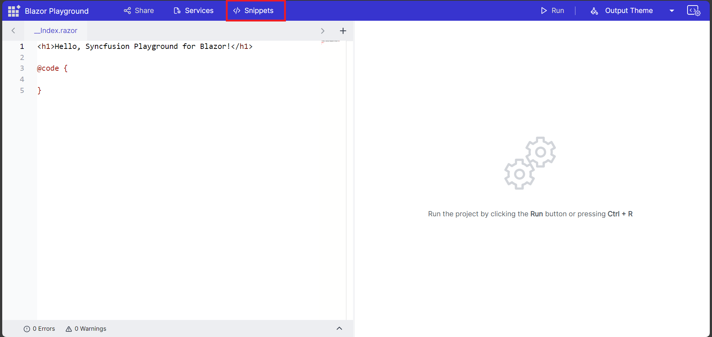
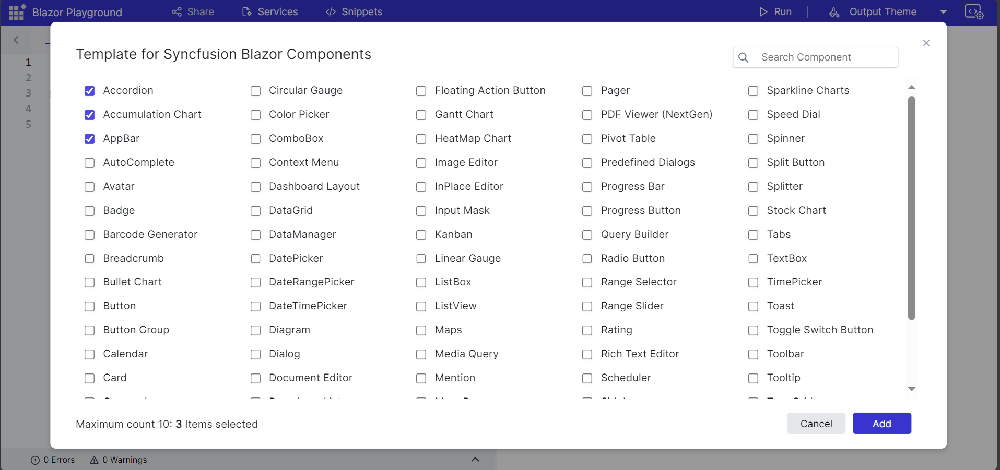
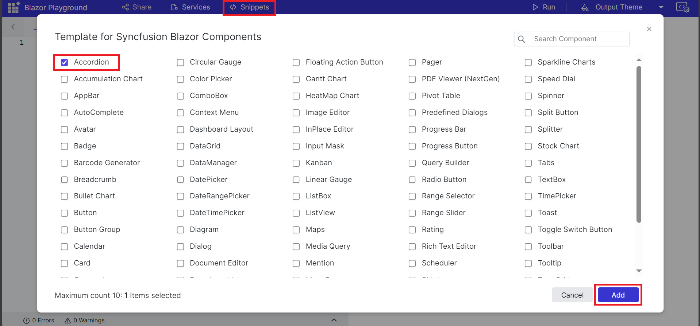
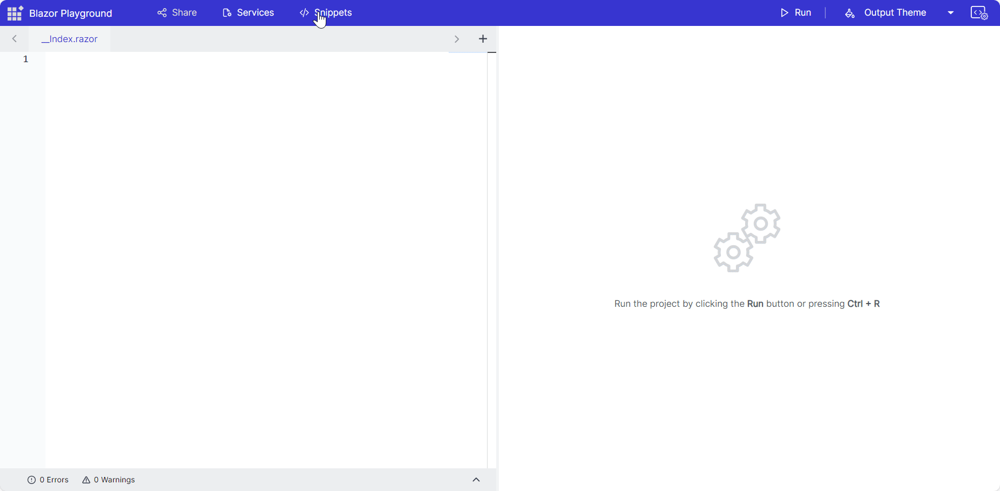

Blazor Playground simplifies the process of incorporating UI components by offering a collection of pre-defined code templates for various components. These snippets are conveniently displayed in a popup, making it easy for users to browse and select their preferred Syncfusion components. 

By choosing a component and clicking the "add" button, Playground significantly reduces the time needed to render the component in your project.

## Accessing Code Snippets

Click the "snippet" button to open a popup containing a list of predefined code templates for various UI components.

## Selecting a Component

Choose the specific component you want to render from the popup. This can be done by simply clicking on the desired snippet.

## Adding Multiple Components

For added efficiency, Blazor Playground allows you to select multiple components simultaneously.

N>Ensure that when adding components in Blazor Playground, you are aware that the selection is limited to a maximum of 10 components at a time.

Once you've selected the component, click the "add" button. The chosen snippet will be seamlessly added at the cursor point in the editor.

For every component you select, the corresponding individual NuGet latest package will be installed, and the overall `Syncfusion.Blazor` package will be removed.

