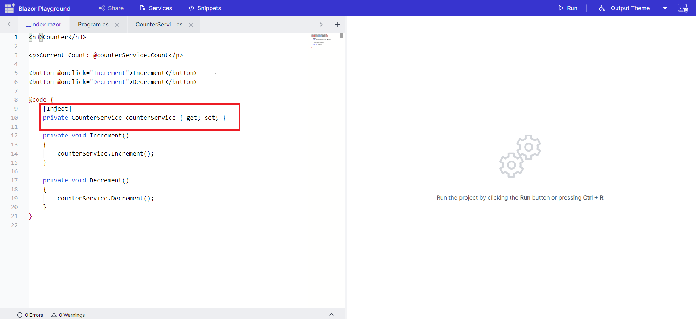

# Update configuration and add new services

To add new services or modify the existing ones in your program, you can access the Services button located in the app bar.
Then, go to the ConfigureServices method in the Program.cs file, where you can add new injectable services or override the existing service configuration to suit your requirements.

For example, you can add the [C# file](#how-to-addremove-classes) and then click the "Services" button to configure the created class in the program.cs file.

Then, register the services in ConfigureServices method.

In this example, dependency injection is applied within the index.razor. You have the flexibility to inject the required dependencies according to your specific needs.

