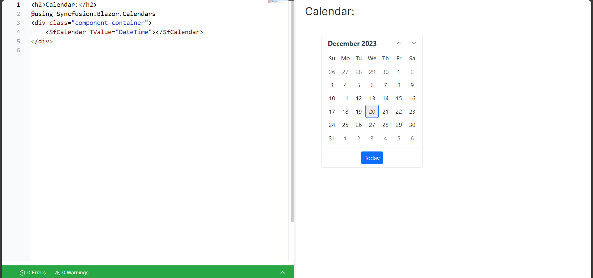
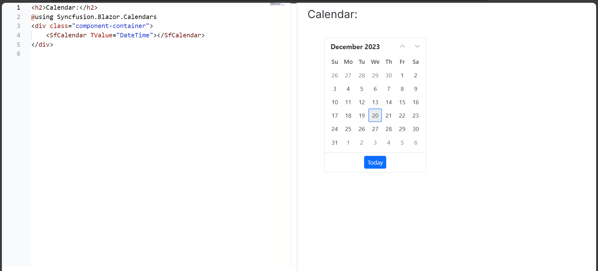

# End-user Capabilities

## Switching the themes

Blazor Playground offers the option to customize themes for Syncfusion Blazor components. Clicking the "Output Theme" button will display a dropdown containing all available Syncfusion Blazor themes. You can choose any desired theme for Syncfusion Blazor components to personalize their appearance.


## Explore the code editor 

The editor provides an environment for type, copy , cut, paste and edit. There is a default index.razor and also provides an option to add .razor and .cs files. Here are the key features and functionalities:

### Syntax Highlighting

The code editor supports syntax highlighting, making it easy to distinguish between different elements of your code. Keywords, variables, strings, and comments are color-coded for enhanced readability.

###  Code Folding

Simplify code navigation by collapsing or expanding sections of code. Code folding allows you to focus on specific parts of your code while hiding the details of others.

### Search and Replace

Easily locate specific code snippets using the search functionality. Additionally, streamline code modifications with the powerful find-and-replace feature.

## Compiling and Running Code

This section outlines the steps to compile and run your code using our platform. Follow these instructions to execute your code successfully.

### Run the Compiled Code
Press the `Run` button or <kbd>Ctrl</kbd>+<kbd>R</kbd>, the code undergoes compilation and execution. The outcome is then displayed, presenting the compiled code within the result view.

## Preview code output

Once you click the run button, the code within the code editor gets compiled. If there are no errors, the result view will show the output. Previewing code output allows you to visualize and assess the results of your code.

### Interactive Features

If your code involves interactive elements or user inputs, interact with the preview to simulate real-world scenarios. This allows you to observe how your code behaves under different conditions.

## Errors and warnings

During compile time, any errors and warnings in the code are displayed, along with their corresponding line numbers, helps you to identify and address issues effectively.


### Error Messages

* Description: Clearly describes the issue.
* Location: Specifies the file and line number where the error occurs.
* Suggestions: May include suggestions on how to fix the problem.

### Warning Messages

* Description: Highlights potential issues that might not prevent compilation but could lead to unexpected behavior.
* Location: Indicates the file and line number where the warning is triggered.
* Suggestions: Offers advice on addressing the warning for better code quality.


## Embedding and sharing code

In Blazor Playground, you can share your code snippets using unique URLs. Each snippet gets its own distinct URL, making it simple to showcase and discuss your code with others.

N> The Share button becomes active only once you've clicked the Run button to compile and run your code.

To access sharing options, click the "Share" button, triggering a popup that presents two distinct sections: "Shared Link" and "Embed Link."


### Shared Link

A shared link is useful if you want to allow others to customize the code snippet and package versions. You can share a unique URL that provides access to the code snippet and allows others to modify it according to their needs.

### Embed Link

An embed link is useful if you want to share the code snippet but don't want others to customize the installed packages. Based on that embed support, we can embed our work anywhere by providing the values in URL query params. 

You can customize the embed link through different options, such as
* Display Code Editor: Enables the code editor for the end user.
* Display Result View: Disables the code editor and shows the result only.
* Display Error Console: Shows the warnings and errors console. 
* Display App Bar: Enables the app bar which contains only run button.

When you enabled all the options, the code editor, result view, app bar and error console become visible. This setup allows the users to modify the code but not the installed packages. The app bar shows a `Run` button for code execution and compilation.


If you disable the app bar, the code editor section, result view, and error console will remain visible. Any code written in the code editor section will automatically compile when you share the embed share link.



When you disable the app bar and error console, the code editor and result view will still be visible. The code editor will automatically compile any code you write when you share the embed share link.



Provided the option to show the result alone by disabling all the options except result view.


## Configuring services 

This section provides guidance on updating the configuration and adding new services in our application.

1. To add new services or modify the existing ones in your program, you can access the Services button located in the app bar.

2. Then, go to the ConfigureServices method in the Program.cs file, where you can add new injectable services or override the existing service configuration to suit your requirements.

For example, create a class file and add the code.

```csharp

using System;
using System.Text;
using System.Linq;
using System.Threading.Tasks;
using System.Collections.Generic;

namespace Playground.User
{
    public class CounterService
    {
        private int _count = 0;

        public int Count => _count;

        public void Increment()
        {
            _count++;
        }

        public void Decrement()
        {
            _count--;
        }
    }
}

```
Click the "Services" button to configure the created class in the program.cs file. Then, register the services in ConfigureServices method.




using System;
using System.Text;
using System.Linq;
using System.Threading.Tasks;
using System.Collections.Generic;
using Microsoft.AspNetCore.Components.WebAssembly.Hosting;
using Microsoft.Extensions.DependencyInjection;

namespace Playground.User
{
    public class Program
    {
        /// <summary>
        /// Configure Services method to add and configure the <see href="https://docs.microsoft.com/en-us/dotnet/api/microsoft.extensions.dependencyinjection.iservicecollection">service collection</see>.
        /// </summary>
        /// <param name="WebAssemblyHostBuilder">A builder for configuring services and creating a WebAssemblyHost.</param>
        /// <returns>The collection of services.</returns>
        public static void ConfigureServices(WebAssemblyHostBuilder builder)
        {
            builder.Services.AddScoped<CounterService>();
            // Configure your service here.
            // For e.g., builder.Services.AddSingleton(new CustomClass());
        }
    }
}




Include the dependency injection in the __Index.razor file, and you can also incorporate the dependency injection in child components.




<h3>Counter</h3>

<p>Current Count: @counterService.Count</p>

<button @onclick="Increment">Increment</button>
<button @onclick="Decrement">Decrement</button>

@code {
    [Inject]
    private CounterService counterService { get; set; }

    private void Increment()
    {
        counterService.Increment();
    }

    private void Decrement()
    {
        counterService.Decrement();
    }
}





## Handling static assets

This section provides instructions on how to manage static assets within your application. Static assets includes stylesheets and scripts. Here is an example for adding the static assets in Blazor playground,

1. Open the sidebar by clicking the "Nuget Asset Manager" button in the appbar.
2. Navigate to the "Static Assets" tab.
3. Paste the CDN link into the provided input box and then click the "Add" icon.



https://cdn.jsdelivr.net/npm/tailwindcss@2.2.19/dist/tailwind.min.css



Add the code in __Index.razor file in the code editor.

```cshtml

<div class="container mx-auto mt-8">
    <div class="max-w-md mx-auto bg-white p-8 border rounded-md shadow-md">

      <h2 class="text-2xl font-semibold mb-4">Contact Us</h2>

        <!-- Name Field -->
        <div class="mb-4">
          <label for="name" class="block text-sm font-medium text-gray-600">Name</label>
          <input type="text" id="name" name="name" class="mt-1 p-2 w-full border rounded-md">
        </div>

        <!-- Email Field -->
        <div class="mb-4">
          <label for="email" class="block text-sm font-medium text-gray-600">Email</label>
          <input type="email" id="email" name="email" class="mt-1 p-2 w-full border rounded-md">
        </div>

        <!-- Submit Button -->
        <div class="mt-6">
          <button class="bg-blue-500 text-white p-2 rounded-md hover:bg-blue-600">Submit</button>
        </div>

    </div>
</div>

```

