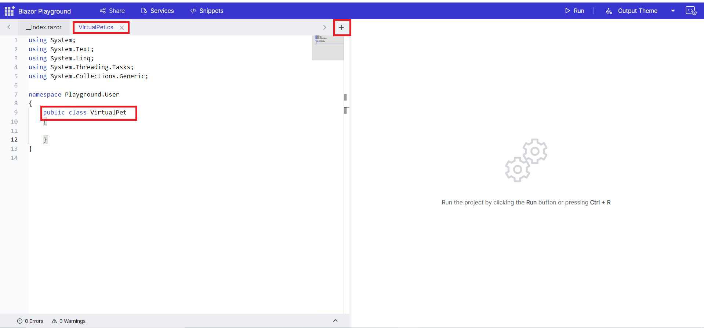
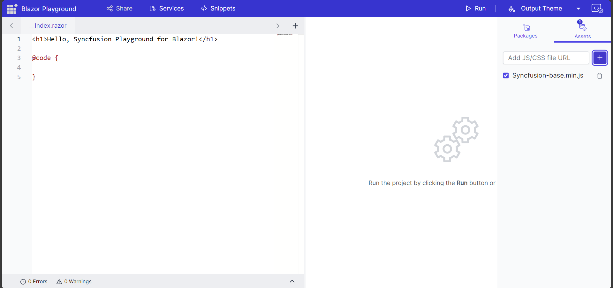

# Getting Started with Blazor playground

This section briefly explains about how to use the blazor playground.
Open the [Blazor Playground](https://blazorplayground.syncfusion.com/) in your browser. Use the code editor to create your desired  .razor format code. Once you are done writing your code, press the run button or <kbd>Ctrl</kbd>+<kbd>R</kbd> to execute the code. The output of the executed code will appear in the result view.

## How to add/remove child components

To create a child component, you can click the "+" button in the Blazor playground. This will add a new component to the project. You can then type the name for the child component in the input box.

To view the outcome of the child component, you can refer to it in the index.razor file.

The index.razor file is the main file for the Blazor playground app. In the index.razor file, you can add a line of code that refers to the child component.

To remove a child component, you can simply click the delete icon. This will remove the component from the Blazor playground.

N> After deleting a child component from the Blazor playground, the references to the component will not be removed from the index.razor file. This is because the index.razor file is a static file that is not updated when you delete a child component from the Blazor playground.

## How to add/remove classes

To generate a class file, click on the "+" icon and input the desired class name. The system will create the class file, setting up the required using statements, namespace, and class name according to your input. Then, reference this class as required within your codebase.

To remove a class file, click the delete icon corresponding to the specific component.

## How to add/remove Static Assets

Provided an option to enter the cdn link in Static Asset section for adding additional static files. After adding the desired asset, you can easily enable/disable it using the checkbox. 

You have the option to remove any additional static assets that have been included.

## Update configuration and add new services

To add new services or modify the existing ones in your program, you can access the Services button located in the app bar.
Then, go to the ConfigureServices method in the Program.cs file, where you can add new injectable services or override the existing service configuration to suit your requirements.

For example, you can add the [C# file](#how-to-addremove-classes) and then click the "Services" button to configure the created class in the program.cs file.

Then, register the services in ConfigureServices method.

In this example, dependency injection is applied within the index.razor. You have the flexibility to inject the required dependencies according to your specific needs.

