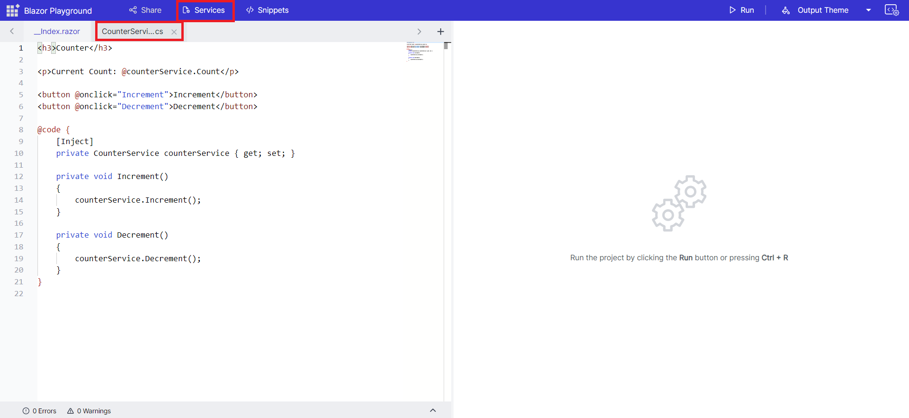

# Getting Started with Blazor playground

This section briefly explains about how to use the blazor playground.
Use the code editor to create your desired  .razor format code. Once the code is complete, press the run button to execute the code. The output of the executed code will appear in the result view.

## How to add/remove child components

Child component can be created by clicking the “+” button and type the name for the child component in the input box. To view the outcome, you can refer the child component in the index.razor and then click the “run” button. 

To remove a child component, click the delete icon corresponding to the specific component.

## Adding/Removing nuget packages

You can install third party nuget packages by clicking the packages section in the nuget asset manager. Search for the necessary nuget package and install based on the available versions. 

You can also downgrade or upgrade the installed package by searching the same package name. Also, you can delete the installed packages.

## How to add/remove Static Assets

Provided an option to enter the cdn link in Static Asset section for adding additional static files. After adding the desired asset, you can easily enable/disable it using the checkbox. 

You have the option to remove any additional static assets that have been included.

## Update configuration and add new services

To add new services or modify the existing ones in your program, you can access the Services button located in the app bar.
Then, go to the ConfigureServices method in the Program.cs file, where you can add new injectable services or override the existing service configuration to suit your requirements.

