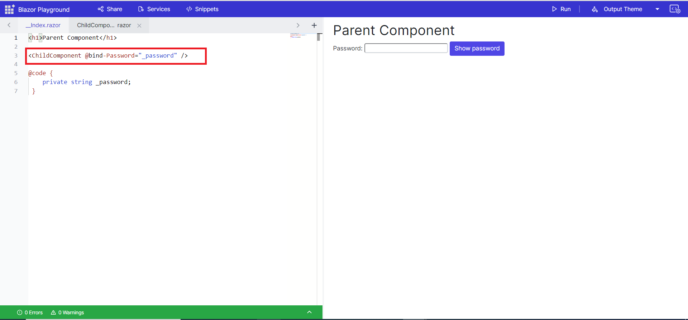
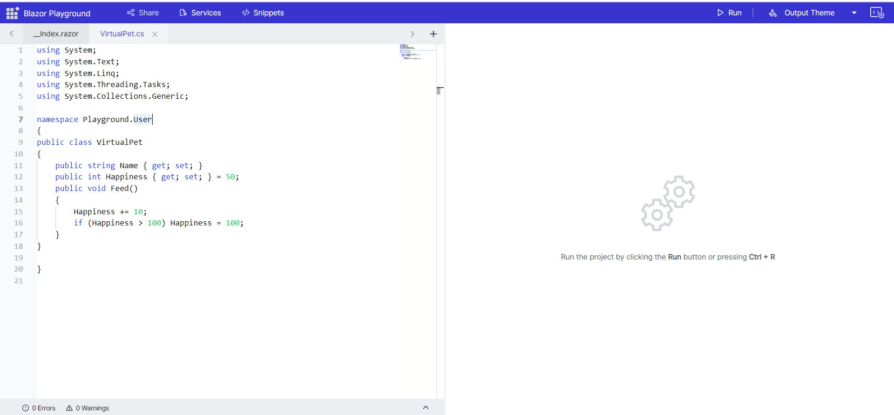
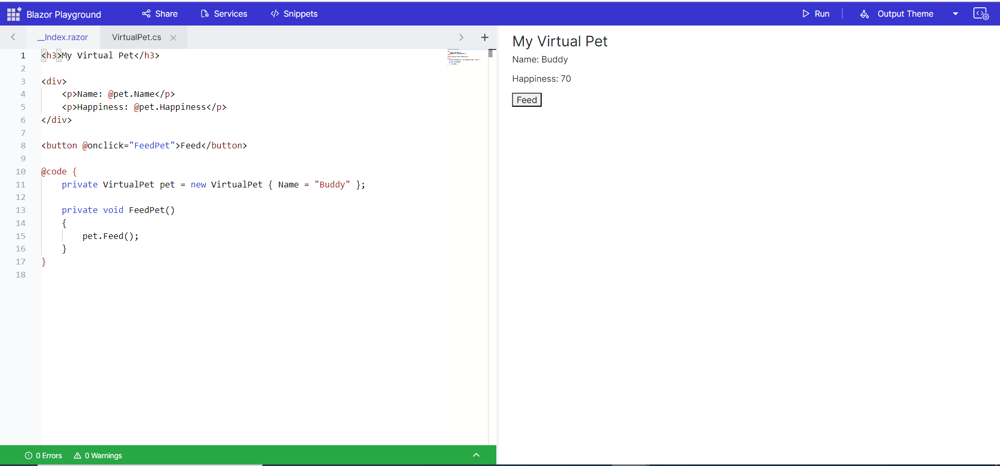

# Getting Started with Blazor playground

This section briefly explains about how to use the blazor playground.
1. Open the [Blazor Playground](https://blazorplayground.syncfusion.com/) in your browser. 
2. Use the code editor to create your desired  .razor format code. 
3. Once you are done writing your code, press the run button or <kbd>Ctrl</kbd>+<kbd>R</kbd> to execute the code. The output of the executed code will appear in the result view.

## How to add/remove child components

To create a child component, you can click the "+" button in the Blazor playground. This will add a new component to the project. You can then type the name for the child component in the input box.

The index.razor file is the main file for the Blazor playground app. To view the outcome of the child component, you can refer to it in the index.razor file and press run button to execute the code.

To remove a child component, you can simply click the delete icon. This will remove the component from the Blazor playground.

N> After deleting a child component from the Blazor playground, the references to the component will not be removed from the index.razor file. This is because the index.razor file is a static file that is not updated when you delete a child component from the Blazor playground.

## How to add/remove classes

To generate a class file, click on the "+" icon and input the desired class name. The system will create the class file, setting up the required using statements, namespace, and class name according to your input. Then, reference this class as required within your codebase.

To remove a class file, click the delete icon corresponding to the specific component.

N>Remember to include the ".cs" extension; otherwise, the file will be generated as a razor file.

