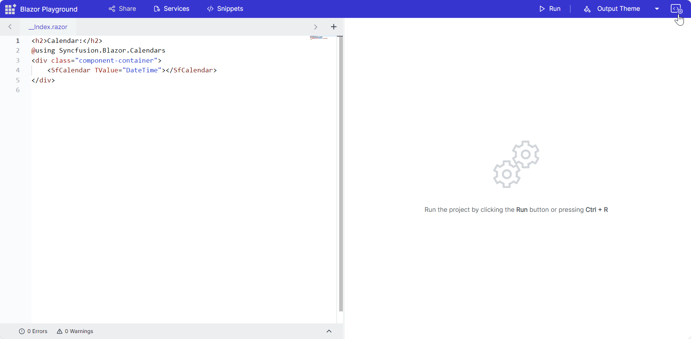

# Managing NuGet Packages

Syncfusion Blazor Playground pre-configures the `Syncfusion.Blazor` package for immediate component rendering. However, this loads the entire Syncfusion Blazor library, affecting initial page load time. You can optimize performance by using individual NuGet packages, loading only the specific components you need.

## Adding NuGet packages

1. Open the NuGet Asset Manager sidebar.
2. Search and select the desired package with its preferred version. Install it using the `Install NuGet` button.

N>Uninstall the `Syncfusion.Blazor` package before installing individual packages.

For example, Uninstall `Syncfusion.Blazor` and install the latest [Syncfusion.Blazor.Calendar](https://blazor.syncfusion.com/documentation/nuget-packages#syncfusionblazorcalendars).



3. Add the rendering code in the code editor.

```csharp
@using Syncfusion.Blazor
@using Syncfusion.Blazor.Calendars
<SfCalendar TValue="DateTime"></SfCalendar>
```
4. Execute the code with the `Run` button or <kbd>Ctrl</kbd>+<kbd>R</kbd> to execute the code. The output will appear in the result view.

### Removing packages

Click the `Remove` button next to the installed package details to uninstall it.


### Versioning

Upgrade or downgrade packages by searching for the desired package name and selecting the specific version. The Playground will handle installation or updates accordingly.

N>Maintain consistent versions across all Syncfusion Blazor packages to avoid compatibility issues.

