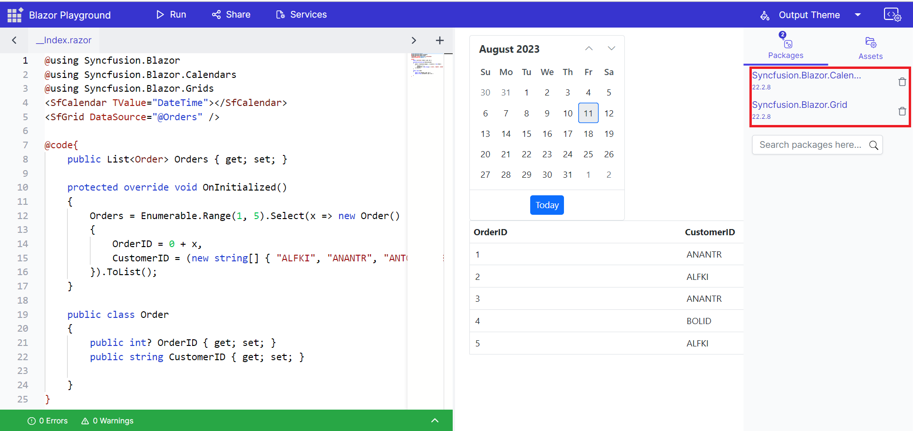

# Syncfusion.Blazor NuGet package 

The Syncfusion.Blazor NuGet package is installed in the Blazor Playground by default, so you do not need to install it separately. 

## Change version

You can also have the option to change the version of default syncfusion.Blazor package. 

 1. Click on the NuGet Asset Manager, which will open a side bar.
 2. Choose your preferred version of the syncfusion.Blazor package from the dropdown menu.
 3. Click the "Install NuGet" button to install the selected version.

 

 ## Delete Package

If you're not rendering the Syncfusion components in your project, you can remove the installed Syncfusion.Blazor package.

N>To install individual Syncfusion packages, you must first uninstall the Syncfusion.Blazor package.


# Individual NuGet packages 

You can install nuget packages by clicking the nuget asset manager. Search for the necessary nuget package and install based on the available versions. The selected package also install its necessary dependency packages. So there is no need for installing the dependency packages.

N>Blazor playground is a WASM application, so it can only install client-side packages. Server-side packages are cannot be installed.

## Adding and removing NuGet packages

Here is an example to install the Syncfusion.Blazor individual packages. 

Click the package section in the nuget asset manager. Search for Syncfusion.Blazor.Calendar and install the package based on available version. Add the necessary using statements. Here, the calendar component is added to Index.razor.

```csharp
@using Syncfusion.Blazor
@using Syncfusion.Blazor.Calendars
<SfCalendar TValue="DateTime"></SfCalendar>
```
 Press the run button or <kbd>Ctrl</kbd>+<kbd>R</kbd> to execute the code. The output of the executed code will appear in the result view.


 ## Upgrade/Downgrade the Installed packages

To modify the version of an installed package, you have the option to either upgrade to a newer version or downgrade to a specific version. Search for the desired package name and choose the target version for installation. Once selected, the package will be installed or updated accordingly. Also, provided the option to delete the installed packages.


## Adding Multiple nuget packages

You can also install multiple nuget packages. After installation, you can start using the added packages in your code. 



N>To avoid compatibility issues, make sure that all Syncfusion Blazor packages are installed in the same version.