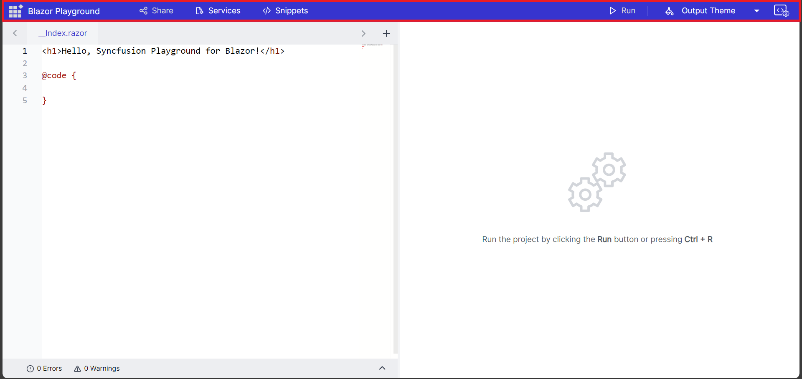
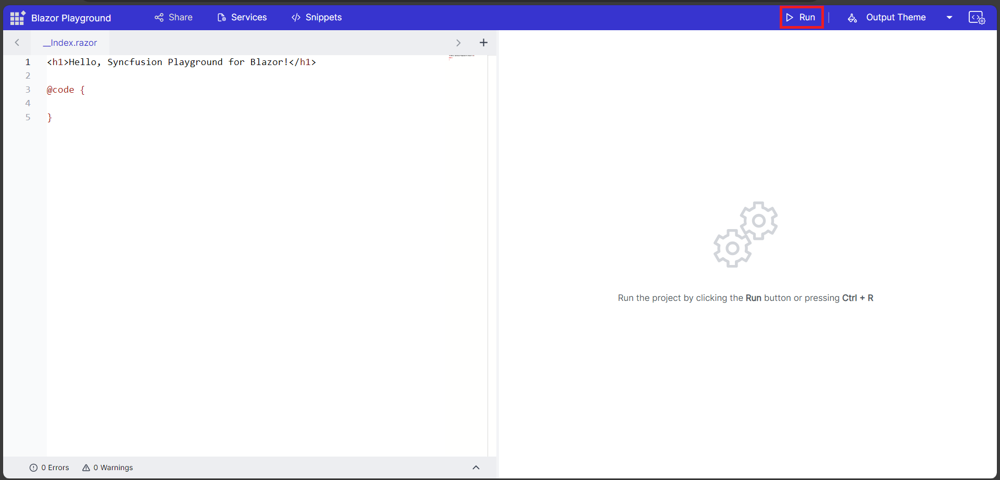
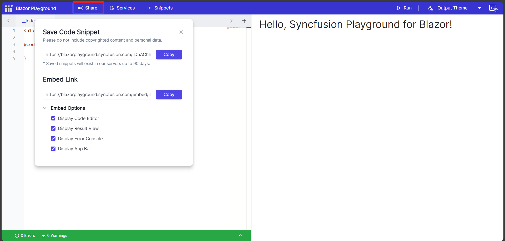
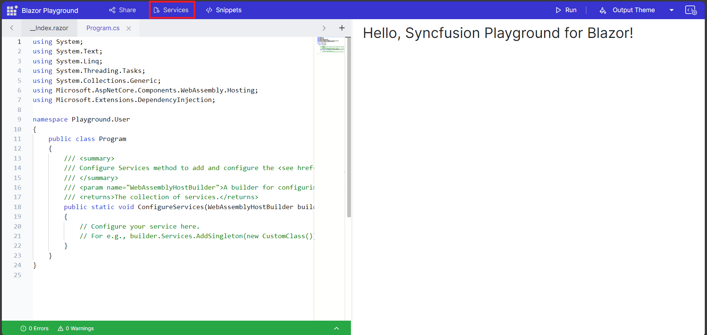
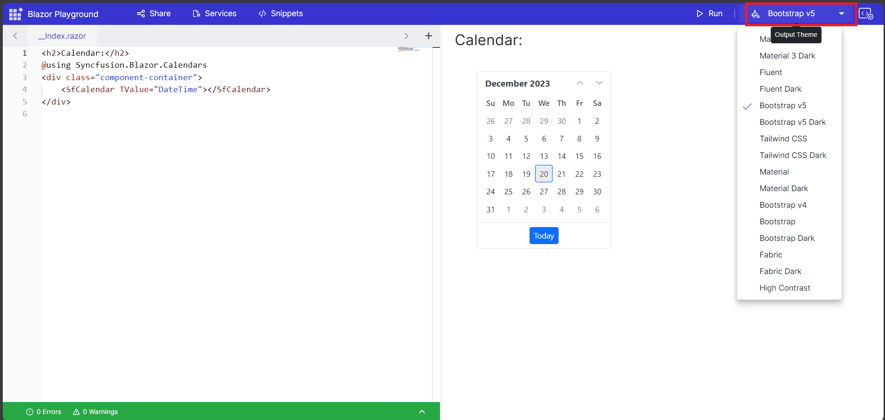
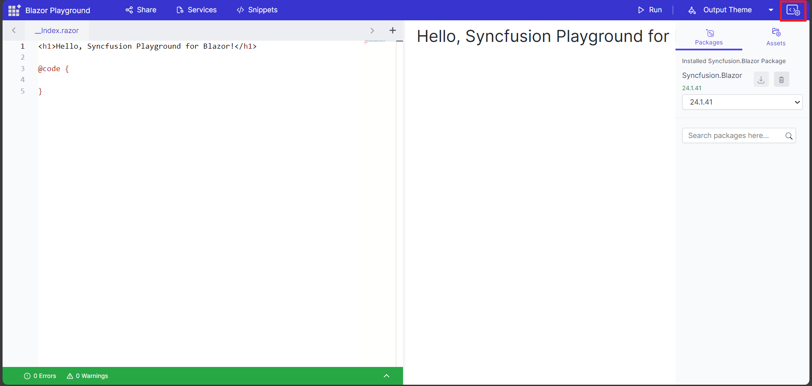
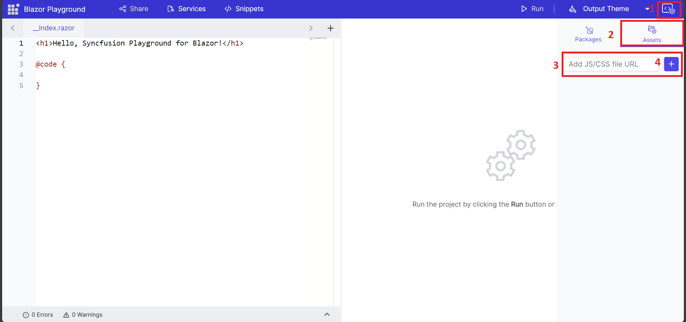
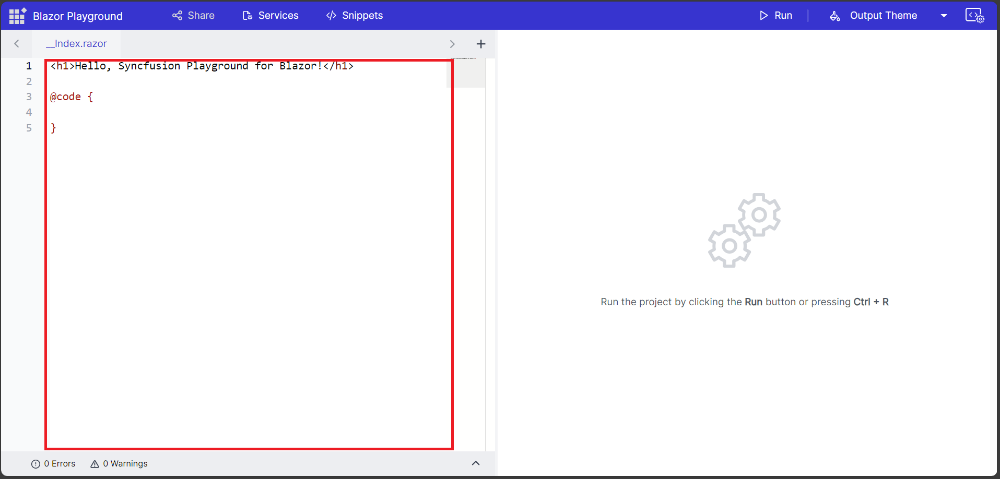
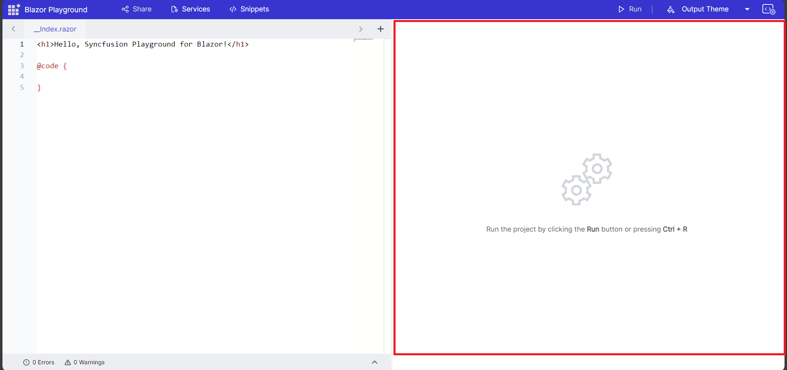

# Overview of Blazor Playground

[Blazor Playground](https://blazorplayground.syncfusion.com/) is a web-based application designed to compile and test Blazor components. It offers a platform where developers can write, visualize, and experiment with Blazor components using C# and Razor syntax. The Playground's functionality allows users to quickly iterate and validate their code without the need for a local development environment. It serves as an efficient tool for learning Blazor, prototyping ideas, and sharing code snippets with others. The code compilation utilizes WebAssembly technology which gives a performance that closely resembles native execution.

The Syncfusion Blazor Playground for Blazor application interface comprises the following sections:
* Appbar
* Sidebar
* Editor
* Result View
* Error List

## Appbar
The appbar of Syncfusion Blazor playground allows you to access the following functionalities: 

## Run
The code from the editor is compiled, and the output is displayed in the Result View.

## Share
You can obtain a URL link to exchange your code snippets.
There are two ways to share the code snippet.

### Shared Link
A shared link is useful if you want to allow others to customize the code snippet.

### Embed Link
Creates a hyperlink that allows you to integrate the code snippet into blog entries and various web pages. You can customize the embed link through different options, such as display code editor, display result view, display error console and display app bar.

## Services
You can add new injectable services or override the existing service configuration to suit your requirements.

## Snippets
The Code Snippet feature in Blazor Playground gives you more than 80 ready-made pieces of code. You can choose from these basic code templates to make your coding tasks easier and faster.

## Themes
In the output section, we offer the option to customize the themes for Syncfusion Blazor components. By clicking the "Output Theme" button, a dropdown will appear displaying all the available Syncfusion Blazor themes. You can select any desired theme for Syncfusion Blazor components to personalize their appearance.

## SideBar
Blazor Playground offers a user-friendly side bar that houses essential tools, such as the Package Manager and Static Assets Manager.

### Package Manager
It allows you to install and utilize various third-party packages from the nuget.org repository, enhancing the functionality of your projects. In case the published NuGet package necessitates accepting a license agreement, you will encounter a confirmation popup. Also provided the version update support for the installed to the any available versions. You can remove nuget packages that are installed by clicking the delete icon.

### Static Assets Manager
If you want to add additional scripts/styles to the application, you can click the Static Asset Manager option and add the scripts/styles as a CDN link. Automatically, references for the corresponding files will be added.  After adding the desired asset, you can easily enable/disable it using the checkbox. In some case, the installed packages also contains CSS or JS files will automatically included in the static asset section.

## Code Editor
The editor provides an environment for type, copy , cut, paste and edit. There is a default index.razor and also provides an option to add .razor and .cs files.

## Result View
Once you click the run button, the code within the code editor gets compiled. If there are no errors, the result view will show the output.

## Error Console
During compile time, any errors and warnings in the code are displayed, along with their corresponding line numbers, helps you to identify and address issues effectively.

