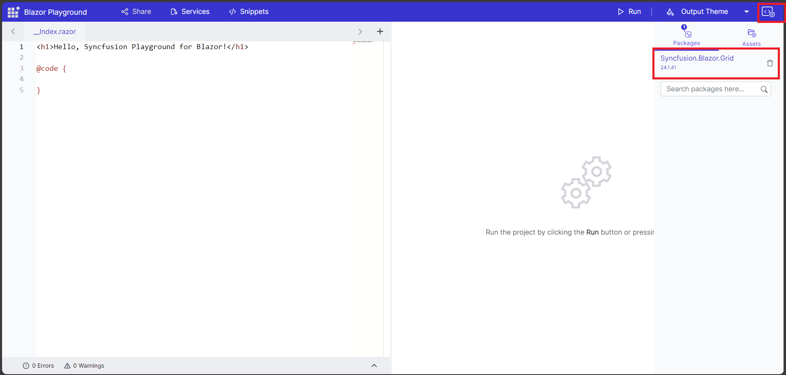

One of the great features of Blazor Playground is that you can easily install NuGet packages to add functionality to your Blazor apps.
## Adding/Removing nuget packages

You can install nuget packages by clicking the packages section in the nuget asset manager. Search for the necessary nuget package and install based on the available versions. The selected package also install its necessary dependency packages. So there is no need for installing the dependency packages.

N>Blazor playground is a WASM application, so it can only install client-side packages. Server-side packages are cannot be installed.

For example, Click the package section in the nuget asset manager. Search for Syncfusion.Blazor.Calendar and install the package based on available version. Added the necessary using statements. Here, the calendar component is added to Index.razor.

```csharp
@using Syncfusion.Blazor
@using Syncfusion.Blazor.Calendars
<SfCalendar TValue="DateTime"></SfCalendar>
```



 Press the run button or <kbd>Ctrl</kbd>+<kbd>R</kbd> to execute the code. The output of the executed code will appear in the result view.

 

You can also downgrade or upgrade the installed package by searching the same package name. Also, provided the option to delete the installed packages.


## Adding Multiple nuget packages

You can also install multiple nuget packages. After installation, you can start using the added packages in your code. 


N>To avoid compatibility issues, make sure that all Syncfusion Blazor packages are installed in the same version.

## How to change themes for Syncfusion Components

Press the output theme button to access the dropdown menu containing the available themes. You can chooee from the provided themes in the dropdown. Please note that these themes are only applicable for Syncfusion components.

