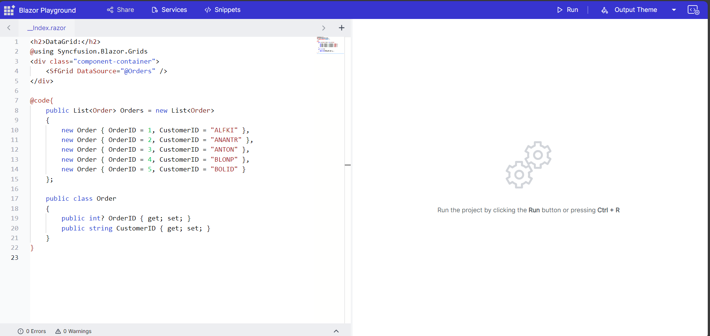
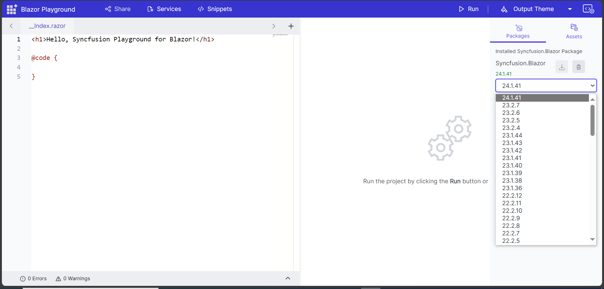
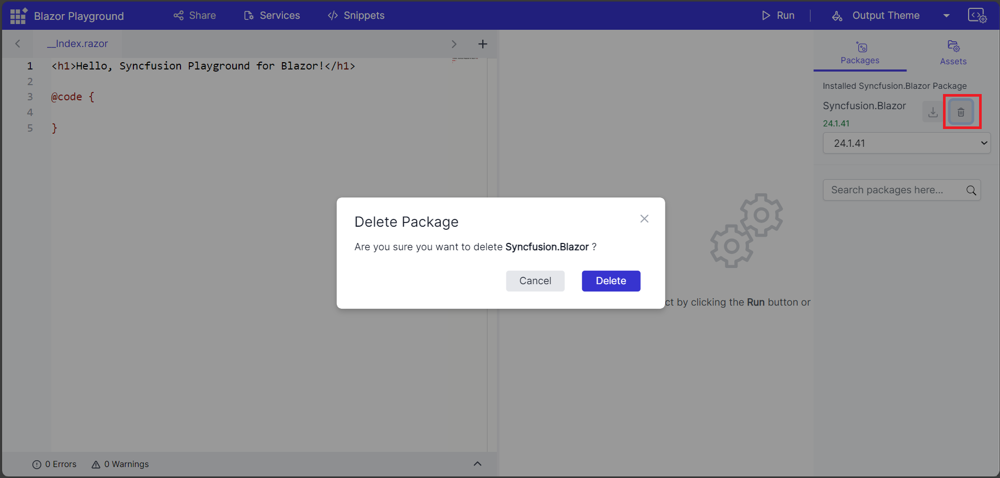
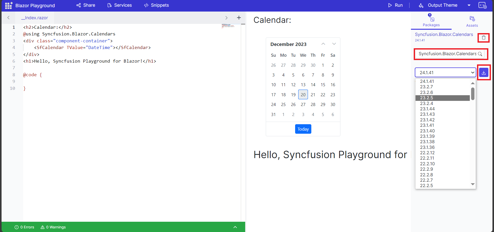
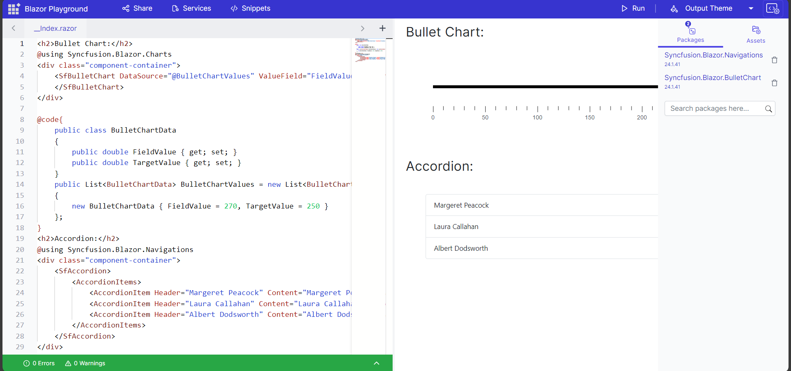
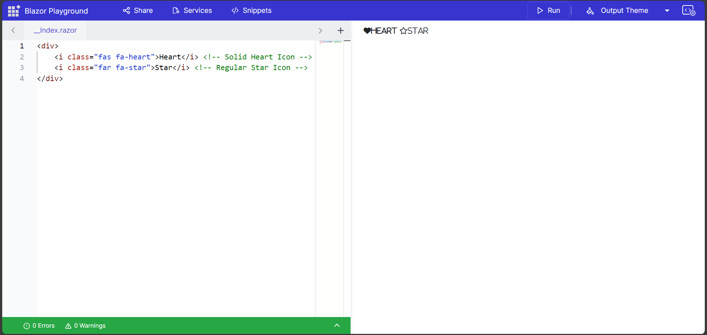
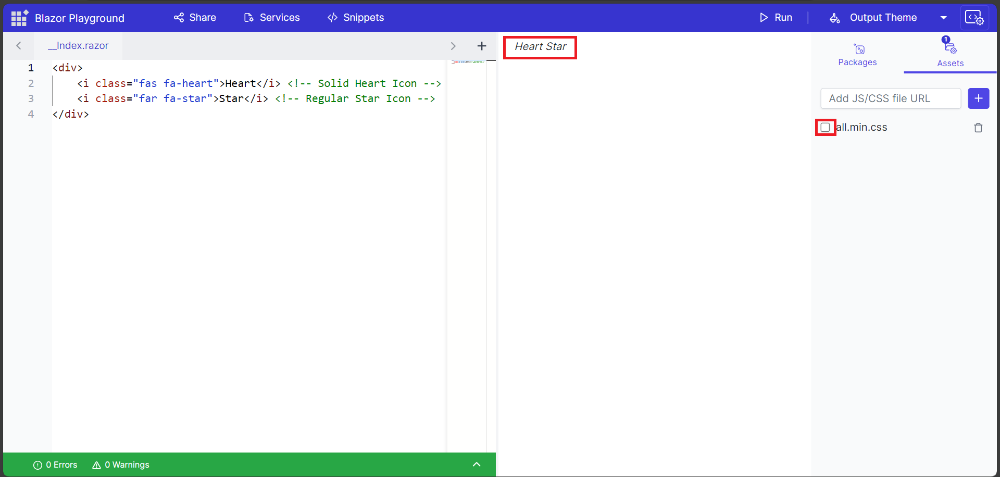

# Installing Nuget Packages in Blazor Playground

One of the great features of Blazor Playground is that you can easily install NuGet packages to add functionality to your Blazor apps. The Syncfusion.Blazor NuGet package is installed in the Blazor Playground by default, so you do not need to install it separately. 

For example, Here the code snippet for the grid component.
```csharp
<SfGrid DataSource="@Orders" />

@code{
    public List<Order> Orders { get; set; }

    protected override void OnInitialized()
    {
        Orders = Enumerable.Range(1, 5).Select(x => new Order()
        {
            OrderID = 0 + x,
            CustomerID = (new string[] { "ALFKI", "ANANTR", "ANTON", "BLONP", "BOLID" })[new Random().Next(5)],
        }).ToList();
    }

    public class Order
    {
        public int? OrderID { get; set; }
        public string CustomerID { get; set; }

    }
}
```


 Press the run button or <kbd>Ctrl</kbd>+<kbd>R</kbd> to execute the code. The output of the executed code will appear in the result view.

 

 Also provided the option to change the version of default syncfusion.Blazor package.

 1. Click on the NuGet Asset Manager, which will open a side bar.
 2. Choose your preferred version of the syncfusion.Blazor package from the dropdown menu.
 3. Click the "Install NuGet" button to install the selected version.
 
 

 You also have the option to remove the syncfusion.Blazor package.

 

 N>To install individual Syncfusion packages, you must first uninstall the Syncfusion.Blazor package.

## Adding/Removing nuget packages

You can install nuget packages by clicking the nuget asset manager. Search for the necessary nuget package and install based on the available versions. The selected package also install its necessary dependency packages. So there is no need for installing the dependency packages.

For example, Click the package section in the nuget asset manager. Search for Syncfusion.Blazor.Calendar and install the package based on available version. Add the necessary using statements. Here, the calendar component is added to Index.razor.

```csharp
@using Syncfusion.Blazor
@using Syncfusion.Blazor.Calendars
<SfCalendar TValue="DateTime"></SfCalendar>
```


 Press the run button or <kbd>Ctrl</kbd>+<kbd>R</kbd> to execute the code. The output of the executed code will appear in the result view.

 

You can also downgrade or upgrade the installed package by searching the same package name and select the desired version to install. Also, provided the option to delete the installed packages.



N>Blazor playground is a WASM application, so it can only install client-side packages. Server-side packages are cannot be installed.

## Adding Multiple nuget packages

You can also install multiple nuget packages. After installation, you can start using the added packages in your code. 



N>To avoid compatibility issues, make sure that all Syncfusion Blazor packages are installed in the same version.

## How to change themes for Syncfusion Components

Press the output theme button to access the dropdown menu containing the available themes. You can chooee from the provided themes in the dropdown. Please note that these themes are only applicable for Syncfusion components.


## How to Add/Remove Static Assets

Blazor playground provides an option to add external styles or javascript as CDN.


1. Open the sidebar by clicking the "Nuget Asset Manager" button in the appbar.
2. Navigate to the "Static Assets" tab.
3. Paste the CDN link into the provided input box and then click the "Add" icon.



You have the option to enable or disable the added static assets, and you can also delete them as required.

