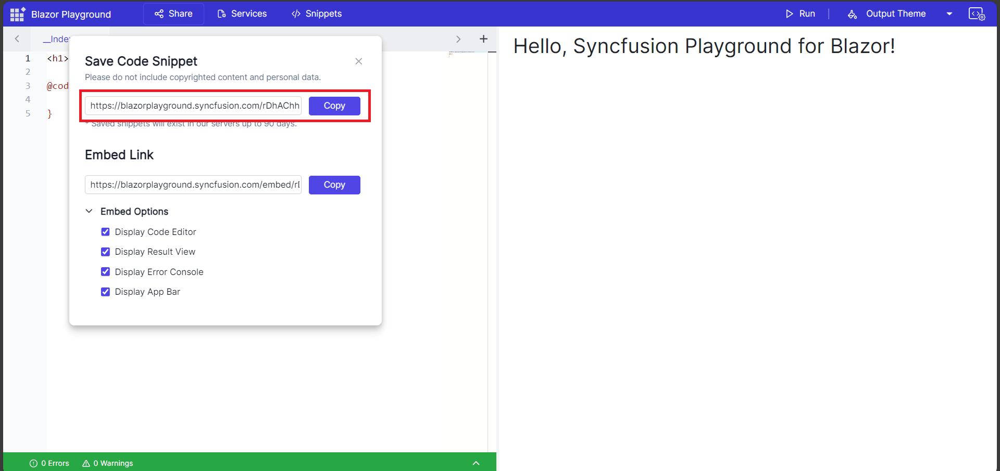
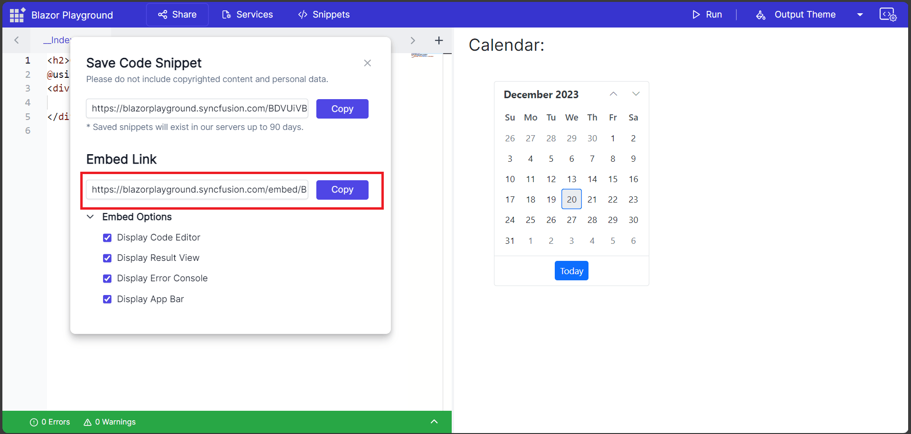

# Save Code Snippet and share

In Blazor Playground, you can share your code snippets using unique URLs. This feature is divided into two sections for ease of use. Each snippet gets its own distinct URL, making it simple to showcase and discuss your code with others.

N> The Share button becomes active only once you've clicked the Run button to compile and run your code.

## Shared Link

A shared link is useful if you want to allow others to customize the code snippet and package versions. You can share a unique URL that provides access to the code snippet and allows others to modify it according to their needs.

## Embed Link

An embed link is useful if you want to share the code snippet but don't want others to customize the installed packages. Based on that embed support, we can embed our work anywhere by providing the values in URL query params. 

You can customize the embed link through different options, such as
* Display Code Editor: Enables the code editor for the end user.
* Display Result View: Disables the code editor and shows the result only.
* Display Error Console: Shows the warnings and errors console. 
* Display App Bar: Enables the app bar which contains only run button.

When you activate all the options, the code editor, result view, app bar and error console become visible. This setup allows the  users to modify the code but not the installed packages. The app bar exclusively includes a run button for code execution and compilation.

If you disable the app bar, the code editor section, result view, and error console will remain visible. Any code written in the code editor section will automatically compile when you share the embed share link.

When you disable the app bar and error console, the code editor and result view will still be visible. The code editor will automatically compile any code you write when you share the embed share link.

Provided the option to show the result alone by disabling all the options except result view.

