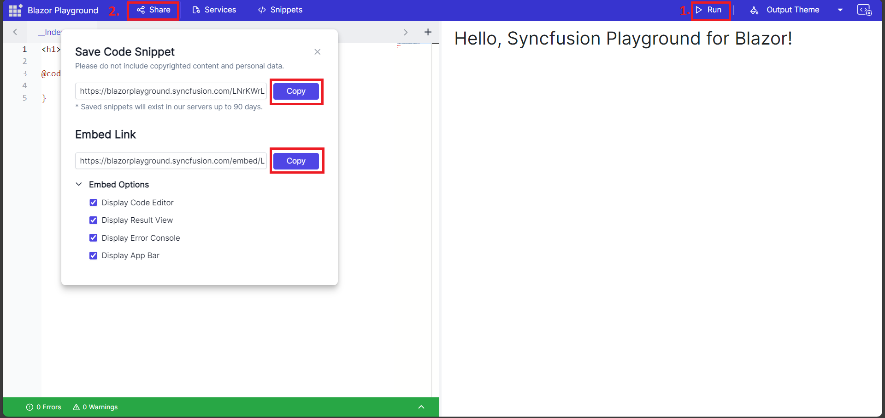

## Save Code Snippet and share

Blazor playground provides an option to share your code snippets using the different URL in Blazor Playground.. This is divided into two subparts.

### Shared Link

A shared link is useful if you want to allow others to customize the code snippet and package versions. You can share a unique URL that provides access to the code snippet and allows others to modify it according to their needs.

### Embed Link

An embed link is useful if you want to share the code snippet but don't want others to customize the installed packages. Based on that embed support, we can embed our work anywhere by providing the values in URL query params. 

You can customize the embed link through different options, such as
* Display Code Editor: Enables the code editor for the end user.
* Display Result View: Disables the code editor and shows the result only.
* Display Error Console: Shows the warnings and errors console. 
* Display App Bar: Enables the app bar which contains only run button.