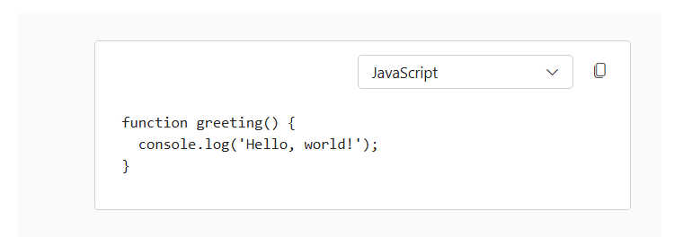

# Code Block in Blazor Block Editor component

The Syncfusion Block Editor allows you to render code snippets with syntax highlighting by setting the [BlockType](https://help.syncfusion.com/cr/blazor/Syncfusion.Blazor.BlockEditor.BlockType.html) property to [Code](https://help.syncfusion.com/cr/blazor/Syncfusion.Blazor.BlockEditor.BlockType.html#Syncfusion_Blazor_BlockEditor_BlockType_Code). You can set a default language using the [Properties](https://help.syncfusion.com/cr/blazor/Syncfusion.Blazor.BlockEditor.BlockModel.html#Syncfusion_Blazor_BlockEditor_BlockModel_Properties) property.

## Global code settings

You can configure global settings for code blocks using the [BlockEditorCodeBlock](https://help.syncfusion.com/cr/blazor/Syncfusion.Blazor.BlockEditor.BlockEditorCodeBlock.html) tag directive in the Block Editor root configuration. This ensures consistent behavior for syntax highlighting and language options across all code blocks.

The tag directive supports the following options:

| Property | Description | Default Value |
|----------|-------------|---------------|
| [Languages](https://help.syncfusion.com/cr/blazor/Syncfusion.Blazor.BlockEditor.BlockEditorCodeBlock.html#Syncfusion_Blazor_BlockEditor_BlockEditorCodeBlock_Languages) | Specifies the array of language options for syntax highlighting. | [] |
| [DefaultLanguage](https://help.syncfusion.com/cr/blazor/Syncfusion.Blazor.BlockEditor.BlockEditorCodeBlock.html#Syncfusion_Blazor_BlockEditor_BlockEditorCodeBlock_DefaultLanguage) | Defines the default language to use for syntax highlighting. | 'plaintext' |

## Configure code properties

For Code blocks, you can specify the language for syntax highlighting using the [Properties](https://help.syncfusion.com/cr/blazor/Syncfusion.Blazor.BlockEditor.BlockModel.html#Syncfusion_Blazor_BlockEditor_BlockModel_Properties) property. This property supports the following options:

- [Language](https://help.syncfusion.com/cr/blazor/Syncfusion.Blazor.BlockEditor.CodeBlockSettings.html#Syncfusion_Blazor_BlockEditor_CodeBlockSettings_Language): The language value used for syntax highlighting.

The following example demonstrates how to configure and render a Code block within the Block Editor.

```cshtml
@using Syncfusion.Blazor.BlockEditor

<SfBlockEditor Blocks="BlockData">
    <BlockEditorCodeBlock DefaultLanguage="javascript" Languages="codeLanguages"></BlockEditorCodeBlock>
</SfBlockEditor>

@code {

    private List<CodeLanguageModel> codeLanguages = new()
    {
        new CodeLanguageModel { Language = "javascript", Label = "JavaScript" },
        new CodeLanguageModel { Language = "typescript", Label = "TypeScript" },
        new CodeLanguageModel { Language = "html", Label = "HTML" },
        new CodeLanguageModel { Language = "css", Label = "CSS" }
    };

    private List<BlockModel> BlockData = new()
    {
        new BlockModel
        {
            BlockType = BlockType.Code,
            Content = new() {
                new ContentModel {
                    ContentType = ContentType.Text,
                    Content = "function greeting() {\n  console.log('Hello, world!');\n}"
                }
            }
        }
    };
}
```

