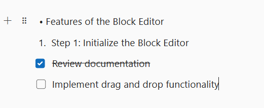

# Lists in Blazor Block Editor component

The Syncfusion Blazor Block Editor component uses list blocks to organize content into structured lists. To render a specific list type, set the [BlockType](https://help.syncfusion.com/cr/blazor/Syncfusion.Blazor.BlockEditor.BlockType.html) property of the [BlockModel](https://help.syncfusion.com/cr/blazor/Syncfusion.Blazor.BlockEditor.BlockModel.html) to [BulletList](https://help.syncfusion.com/cr/blazor/Syncfusion.Blazor.BlockEditor.BlockType.html#Syncfusion_Blazor_BlockEditor_BlockType_Bulletlist), [NumberedList](https://help.syncfusion.com/cr/blazor/Syncfusion.Blazor.BlockEditor.BlockType.html#Syncfusion_Blazor_BlockEditor_BlockType_Numberedlist), or [Checklist](https://help.syncfusion.com/cr/blazor/Syncfusion.Blazor.BlockEditor.BlockType.html#Syncfusion_Blazor_BlockEditor_BlockType_Checklist). Bullet lists are ideal for unordered items, numbered lists for ordered items, and checklists for interactive to-do lists.

## Configure bullet list 

You can render a Bullet List block by setting the [BlockType](https://help.syncfusion.com/cr/blazor/Syncfusion.Blazor.BlockEditor.BlockType.html) property to [BulletList](https://help.syncfusion.com/cr/blazor/Syncfusion.Blazor.BlockEditor.BlockType.html#Syncfusion_Blazor_BlockEditor_BlockType_Bulletlist). This block type is used to display unordered lists.

### BlockType

```cshtml
// Adding bulletlist block
    new BlockModel
    {
        BlockType = BlockType.BulletList,
        Content = {new ContentModel{ContentType = ContentType.Text, Content = "your content"}}
    }
```

### Configure placeholder

The [Placeholder](https://help.syncfusion.com/cr/blazor/Syncfusion.Blazor.BlockEditor.BulletListBlockSettings.html#Syncfusion_Blazor_BlockEditor_BulletListBlockSettings_Placeholder) property sets the text that appears when the block is empty. The default placeholder for a bullet list is `Add item`.

```cshtml
// Adding placeholder value
    new BlockModel
    {
        BlockType = BlockType.BulletList,
        Properties = new BulletListBlockSettings {Placeholder = "bullet"},
        Content = {new ContentModel{ContentType = ContentType.Text, Content = "your content"}}
    }
```

## Configure numbered list

You can render a Numbered List block by setting the [BlockType](https://help.syncfusion.com/cr/blazor/Syncfusion.Blazor.BlockEditor.BlockType.html) property to [NumberedList](https://help.syncfusion.com/cr/blazor/Syncfusion.Blazor.BlockEditor.BlockType.html#Syncfusion_Blazor_BlockEditor_BlockType_Numberedlist). This block type is used to display ordered lists.

```cshtml
// Adding numberedlist block
    new BlockModel
    {
        BlockType = BlockType.NumberedList,
        Content = {new ContentModel{ContentType = ContentType.Text, Content = "your content"}}
    }
```

### Configure placeholder

The [Placeholder](https://help.syncfusion.com/cr/blazor/Syncfusion.Blazor.BlockEditor.NumberedListBlockSettings.html#Syncfusion_Blazor_BlockEditor_NumberedListBlockSettings_Placeholder) property sets the text that appears when the block is empty. The default placeholder for a numbered list is `Add item`.

```cshtml
// Adding placeholder value
    new BlockModel
    {
        BlockType = BlockType.BulletList,
        Properties = new NumberedListBlockSettings {Placeholder = "number"},
        Content = {new ContentModel{ContentType = ContentType.Text, Content = "your content"}}
    }
```

## Configure checklist

You can render a Checklist block by setting the [BlockType](https://help.syncfusion.com/cr/blazor/Syncfusion.Blazor.BlockEditor.BlockType.html) property to [Checklist](https://help.syncfusion.com/cr/blazor/Syncfusion.Blazor.BlockEditor.BlockType.html#Syncfusion_Blazor_BlockEditor_BlockType_Checklist). This block type is used for creating interactive to-do lists.

```cshtml
// Adding checklist block 
    new BlockModel
    {
        BlockType = BlockType.Checklist,
        Content = {new ContentModel{ContentType = ContentType.Text, Content = "your content"}}
    }
```

### Configure checked state

For blocks that support selection states, such as a [Checklist](https://help.syncfusion.com/cr/blazor/Syncfusion.Blazor.BlockEditor.BlockType.html#Syncfusion_Blazor_BlockEditor_BlockType_Checklist), you can configure the checked state using the [Properties](https://help.syncfusion.com/cr/blazor/Syncfusion.Blazor.BlockEditor.BlockModel.html#Syncfusion_Blazor_BlockEditor_BlockModel_Properties) property with [IsChecked](https://help.syncfusion.com/cr/blazor/Syncfusion.Blazor.BlockEditor.ChecklistBlockSettings.html#Syncfusion_Blazor_BlockEditor_ChecklistBlockSettings_IsChecked).

By default, the [IsChecked](https://help.syncfusion.com/cr/blazor/Syncfusion.Blazor.BlockEditor.ChecklistBlockSettings.html#Syncfusion_Blazor_BlockEditor_ChecklistBlockSettings_IsChecked) property is set to `false`.

```cshtml
@using Syncfusion.Blazor.BlockEditor

<div id="container">
    <SfBlockEditor Blocks="BlockData"></SfBlockEditor>
</div>

@code {
    private List<BlockModel> BlockData = new()
    {
        new BlockModel
        {
            BlockType = BlockType.Paragraph,
            Content = new() {new ContentModel{ContentType = ContentType.Text, Content = "Task List:"}}
        },
        new BlockModel
        {
            BlockType = BlockType.Checklist,
            Content = new() {new ContentModel{ContentType = ContentType.Text, Content = "Completed task (checked)"}},
            Properties = new ChecklistBlockSettings {IsChecked = true}
        },
        new BlockModel
        {
            BlockType = BlockType.Checklist,
            Content = new() {new ContentModel{ContentType = ContentType.Text, Content = "Pending task (unchecked)"}},
            Properties = new ChecklistBlockSettings {IsChecked = false}
        },
        new BlockModel
        {
            BlockType = BlockType.Checklist,
            Content = new() {new ContentModel{ContentType = ContentType.Text, Content = "High priority task"}},
            Properties = new ChecklistBlockSettings {IsChecked = true}
        },
        new BlockModel
        {
            BlockType = BlockType.Checklist,
            Content = new() {new ContentModel{ContentType = ContentType.Text, Content = "Low priority task"}},
            Properties = new ChecklistBlockSettings {IsChecked = false}
        }
    };
}

```


### Configure placeholder

The [Placeholder](https://help.syncfusion.com/cr/blazor/Syncfusion.Blazor.BlockEditor.CheckListBlockSettings.html#Syncfusion_Blazor_BlockEditor_CheckListBlockSettings_Placeholder) property sets the text that appears when the block is empty. The default placeholder for a checklist is `Todo`.

```cshtml
// Adding placeholder value
    new BlockModel
    {
        BlockType = BlockType.Checklist,
        Properties = new ChecklistBlockSettings {Placeholder = "check"},
        Content = {new ContentModel{ContentType = ContentType.Text, Content = "your content"}}
    }
```

## Configure list blocks

The following example demonstrates how to render the different types of list blocks in the Block Editor.

```cshtml

@using Syncfusion.Blazor.BlockEditor

<div id="container">
    <SfBlockEditor Blocks="BlockData"></SfBlockEditor>
</div>

@code {
    private List<BlockModel> BlockData = new()
    {
        new BlockModel
        {
            BlockType = BlockType.BulletList,
            Content = new() {new ContentModel{ContentType = ContentType.Text, Content = "Features of the Block Editor"}}
        },
        new BlockModel
        {
            BlockType = BlockType.NumberedList,
            Content = new() {new ContentModel{ContentType = ContentType.Text, Content = "Step 1: Initialize the Block Editor"}}
        },
        new BlockModel
        {
            BlockType = BlockType.Checklist,
            Content = new() {new ContentModel{ContentType = ContentType.Text, Content = "Review documentation"}},
            Properties = new ChecklistBlockSettings {IsChecked = true}
        },
        new BlockModel
        {
            BlockType = BlockType.Checklist,
            Content = new() {new ContentModel{ContentType = ContentType.Text, Content = "Implement drag and drop functionality"}},
            Properties = new ChecklistBlockSettings {IsChecked = false}
        }
    };
}

```


