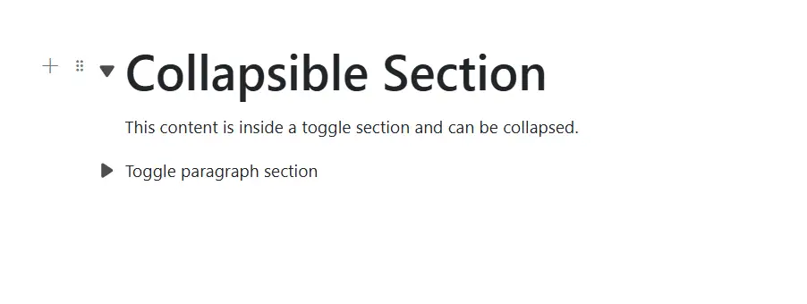
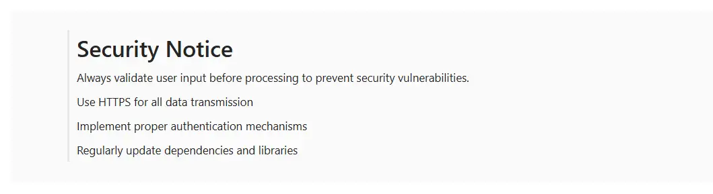
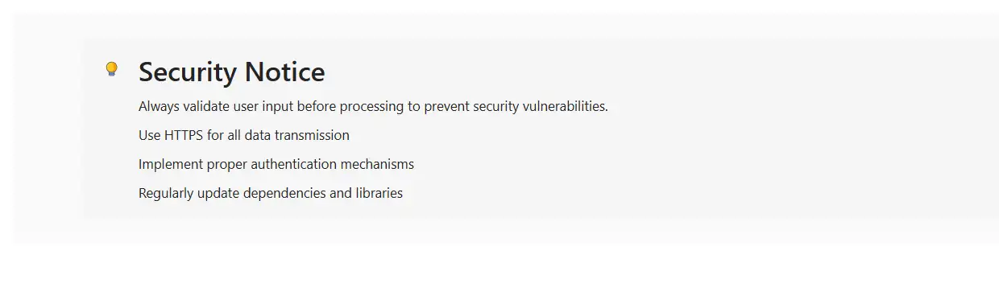

# Nested blocks in Blazor Block Editor component

## Configure children

The Block Editor supports hierarchical content structures through the `Children` property. This property can be achieved through [Properties](https://help.syncfusion.com/cr/blazor/Syncfusion.Blazor.BlockEditor.BlockModel.html#Syncfusion_Blazor_BlockEditor_BlockModel_Properties) property that allows you to create nested blocks, which is applicable only for Callout and Collapsible blocks.

Child blocks can be configured with all the same properties as top-level blocks.

## Configure parent id
To establish a clear parent-child relationship, the [ParentID](https://help.syncfusion.com/cr/blazor/Syncfusion.Blazor.BlockEditor.BlockModel.html#Syncfusion_Blazor_BlockEditor_BlockModel_ParentID) of each child block must match the [ID](https://help.syncfusion.com/cr/blazor/Syncfusion.Blazor.BlockEditor.BlockModel.html#Syncfusion_Blazor_BlockEditor_BlockModel_ID) of its parent block.

This structure is essential for maintaining nested relationships within the editor.

## Configure collapsible blocks

You can render Collapsible blocks by setting the [BlockType](https://help.syncfusion.com/cr/blazor/Syncfusion.Blazor.BlockEditor.BlockType.html) property as [CollapsibleParagraph](https://help.syncfusion.com/cr/blazor/Syncfusion.Blazor.BlockEditor.BlockType.html#Syncfusion_Blazor_BlockEditor_BlockType_CollapsibleParagraph) or [CollapsibleHeading](https://help.syncfusion.com/cr/blazor/Syncfusion.Blazor.BlockEditor.BlockType.html#Syncfusion_Blazor_BlockEditor_BlockType_CollapsibleHeading). Collapsible blocks allow users to expand or collapse sections, providing a way to hide or show content as needed.

### Configure levels

You can configure the CollapsibleHeading using the property [Level](https://help.syncfusion.com/cr/blazor/Syncfusion.Blazor.BlockEditor.CollapsibleHeadingBlockSettings.html#Syncfusion_Blazor_BlockEditor_CollapsibleHeadingBlockSettings_Level) inside the [Properties](https://help.syncfusion.com/cr/blazor/Syncfusion.Blazor.BlockEditor.BlockModel.html#Syncfusion_Blazor_BlockEditor_BlockModel_Properties) property . The levels can be varied from `Level: 1` to `Level: 4`.

### Configure expanded state

You can control whether a block is expanded or collapsed using the [IsExpanded](https://help.syncfusion.com/cr/blazor/Syncfusion.Blazor.BlockEditor.CollapsibleHeadingBlockSettings.html#Syncfusion_Blazor_BlockEditor_CollapsibleHeadingBlockSettings_IsExpanded) property. By default, this property is set to `false`, meaning the block will be collapsed initially. This setting is only applicable to Collapsible blocks.

### BlockType and Properties

```cshtml
//Configure collapsibleHeading block
    new BlockModel
    {
        BlockType = BlockType.CollapsibleHeading,
        Properties = new CollapsibleHeadingBlockSettings { Level = 1, IsExpanded = true, Children = new List<BlockModel> { //Your content to be here.. } }
    }
// Configuring CollapsibleParagraph block
    new BlockModel
    {
        BlockType = BlockType.CollapsibleParagraph,
        Properties = new CollapsibleParagraphBlockSettings { Children = new List<BlockModel> { //Your content to be here.. } }
    }
```

This example shows how to configure [CollapsibleHeading](https://help.syncfusion.com/cr/blazor/Syncfusion.Blazor.BlockEditor.BlockType.html#Syncfusion_Blazor_BlockEditor_BlockType_CollapsibleHeading) and [CollapsibleParagraph](https://help.syncfusion.com/cr/blazor/Syncfusion.Blazor.BlockEditor.BlockType.html#Syncfusion_Blazor_BlockEditor_BlockType_CollapsibleParagraph) blocks.

```cshtml
@using Syncfusion.Blazor.BlockEditor

<SfBlockEditor Blocks="@BlockData"></SfBlockEditor>

@code {
    private List<BlockModel> BlockData = new()
    {
        new BlockModel
        {
            BlockType = BlockType.CollapsibleHeading,
            Content = new() {new ContentModel{ContentType = ContentType.Text, Content = "Collapsible Section"}},
            Properties = new CollapsibleHeadingBlockSettings { Level = 1, IsExpanded = true, Children = new()
            {
                new BlockModel
                {
                    BlockType = BlockType.Paragraph,
                    Content = new() {new ContentModel{ContentType = ContentType.Text, Content = "This content is inside a toggle section and can be collapsed."}}
                }
            } }
        },
        new BlockModel
        {
            BlockType = BlockType.CollapsibleParagraph,
            Content = new() {new ContentModel{ContentType = ContentType.Text, Content = "Toggle paragraph section"}},
            Properties = new CollapsibleParagraphBlockSettings { IsExpanded = false, Children = new()
            {
                new BlockModel
                {
                    BlockType = BlockType.Paragraph,
                    Content = new() {new ContentModel{ContentType = ContentType.Text, Content = "This content is initially hidden because isExpanded is set to false."}}
                }
            } }
        }
    };
}
```



### Configure placeholder

You can configure placeholder text for block using the [CollapsibleHeading Placeholder][https://help.syncfusion.com/cr/blazor/Syncfusion.Blazor.BlockEditor.CollapsibleHeadingBlockSettings.html#Syncfusion_Blazor_BlockEditor_CollapsibleHeadingBlockSettings_Placeholder] and [CollapsibleParagraph Placeholder][https://help.syncfusion.com/cr/blazor/Syncfusion.Blazor.BlockEditor.CollapsibleParagraphBlockSettings.html#Syncfusion_Blazor_BlockEditor_CollapsibleParagraphBlockSettings_Placeholder] property. This text appears when the block is empty. The default placeholder for collapsible heading and collapsible paragraph is `Collapsible Heading{level}` and `Collapsible Paragraph` respectively.

```cshtml
// Adding placeholder value to collapsible heading
new BlockModel
{
    BlockType = BlockType.CollapsibleHeading,
    Properties = new CollapsibleParagraphBlockSettings { Level = 2, Placeholder = "Heading block" }
}
//Adding placeholder value for collapsible paragraph
new BlockModel
{
    BlockType = BlockType.CollapsibleParagraph,
    Properties = new CollapsibleParagraphBlockSettings { Placeholder = "Collapsible Paragraph" }
}
```

## Configure quote block

Quote blocks are styled for displaying quotations or excerpts. Render a Quote block by setting the [BlockType](https://help.syncfusion.com/cr/blazor/Syncfusion.Blazor.BlockEditor.BlockType.html) to [Quote](https://help.syncfusion.com/cr/blazor/Syncfusion.Blazor.BlockEditor.BlockType.html#Syncfusion_Blazor_BlockEditor_BlockType_Quote).

The following sample adds a quote block to the editor.

```cshtml
@using Syncfusion.Blazor.BlockEditor

<SfBlockEditor Blocks="@BlockData"></SfBlockEditor>

@code {
    private List<BlockModel> BlockData = new()
    {
        new BlockModel
        {
            ID = "security-quote",
            BlockType = BlockType.Quote,
            Properties = new QuoteBlockSettings { 
                Children = new()
                {
                    new BlockModel
                    {
                        ID = "security-title",
                        ParentID = "security-quote",
                        BlockType = BlockType.Heading,
                        Properties = new HeadingBlockSettings { Level = 3},
                        Content = new() { new ContentModel{ ContentType = ContentType.Text, Content = "Security Notice" }}
                    },
                    new BlockModel
                    {
                        ID = "security-warning",
                        ParentID = "security-quote",
                        BlockType = BlockType.Paragraph,
                        Content = new() { new ContentModel{ ContentType = ContentType.Text, Content = "Always validate user input before processing to prevent security vulnerabilities." }}
                    },
                    new BlockModel
                    {
                        ID = "security-tips",
                        ParentID = "security-quote",
                        BlockType = BlockType.Paragraph,
                        Content = new() { new ContentModel{ ContentType = ContentType.Text, Content = "Use HTTPS for all data transmission" }}
                    },
                    new BlockModel
                    {
                        ID = "security-tips-2",
                        ParentID = "security-quote",
                        BlockType = BlockType.Paragraph,
                        Content = new() { new ContentModel{ ContentType = ContentType.Text, Content = "Implement proper authentication mechanisms" }}
                    },
                    new BlockModel
                    {
                        ID = "security-tips-3",
                        ParentID = "security-quote",
                        BlockType = BlockType.Paragraph,
                        Content = new() { new ContentModel{ ContentType = ContentType.Text, Content = "Regularly update dependencies and libraries" }}
                    },
                }
                
            }
        }
    };
}
```



## Configure callout block

Callout blocks highlight important information such as notes, warnings, or tips. Render one by setting the [BlockType](https://help.syncfusion.com/cr/blazor/Syncfusion.Blazor.BlockEditor.BlockType.html) to [Callout](https://help.syncfusion.com/cr/blazor/Syncfusion.Blazor.BlockEditor.BlockType.html#Syncfusion_Blazor_BlockEditor_BlockType_Callout).

The following sample adds a callout block to the editor.

```cshtml
@using Syncfusion.Blazor.BlockEditor

<SfBlockEditor Blocks="@BlockData"></SfBlockEditor>

@code {
    private List<BlockModel> BlockData = new()
    {
        new BlockModel
        {
            ID = "security-callout",
            BlockType = BlockType.Callout,
            Properties = new CalloutBlockSettings { 
                Children = new()
                {
                    new BlockModel
                    {
                        ID = "security-title",
                        ParentID = "security-callout",
                        BlockType = BlockType.Heading,
                        Properties = new HeadingBlockSettings { Level = 3},
                        Content = new() { new ContentModel{ ContentType = ContentType.Text, Content = "Security Notice" }}
                    },
                    new BlockModel
                    {
                        ID = "security-warning",
                        ParentID = "security-callout",
                        BlockType = BlockType.Paragraph,
                        Content = new() { new ContentModel{ ContentType = ContentType.Text, Content = "Always validate user input before processing to prevent security vulnerabilities." }}
                    },
                    new BlockModel
                    {
                        ID = "security-tips",
                        ParentID = "security-callout",
                        BlockType = BlockType.Paragraph,
                        Content = new() { new ContentModel{ ContentType = ContentType.Text, Content = "Use HTTPS for all data transmission" }}
                    },
                    new BlockModel
                    {
                        ID = "security-tips-2",
                        ParentID = "security-callout",
                        BlockType = BlockType.Paragraph,
                        Content = new() { new ContentModel{ ContentType = ContentType.Text, Content = "Implement proper authentication mechanisms" }}
                    },
                    new BlockModel
                    {
                        ID = "security-tips-3",
                        ParentID = "security-callout",
                        BlockType = BlockType.Paragraph,
                        Content = new() { new ContentModel{ ContentType = ContentType.Text, Content = "Regularly update dependencies and libraries" }}
                    },
                }
                
            }
        }
    };
}
```

