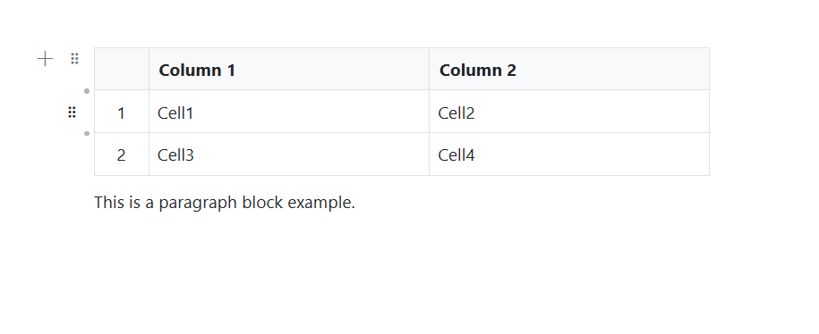
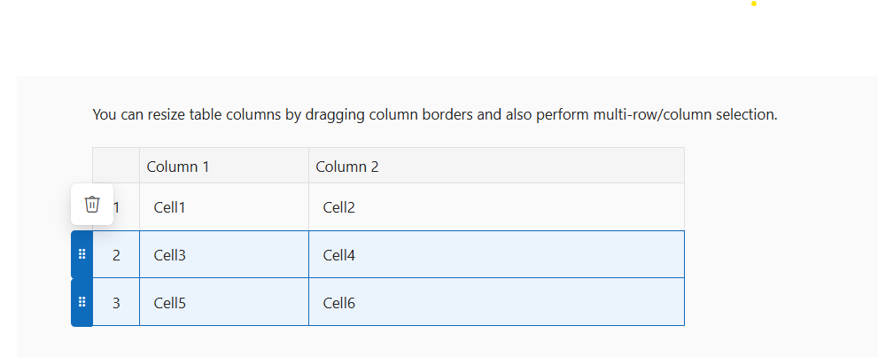

# Table Blocks in Blazor Block Editor Component

The Syncfusion Block Editor allows you to render structured data in rows and columns by setting the block's [BlockType](https://help.syncfusion.com/cr/blazor/Syncfusion.Blazor.BlockEditor.BlockType.html) property to [Table](https://help.syncfusion.com/cr/blazor/Syncfusion.Blazor.BlockEditor.BlockType.html#Syncfusion_Blazor_BlockEditor_BlockType_Table). You can customize the table layout, header, row numbers, and define columns and rows using the [Properties](https://help.syncfusion.com/cr/blazor/Syncfusion.Blazor.BlockEditor.BlockModel.html#Syncfusion_Blazor_BlockEditor_BlockModel_Properties) property. In addition, you can format cells with keyboard shortcuts, use slash commands inside cells to add blocks, and manage rows and columns quickly with dot and plus buttons.

### Configure table block

For Table blocks, you can configure layout and structure using the [Properties](https://help.syncfusion.com/cr/blazor/Syncfusion.Blazor.BlockEditor.BlockModel.html#Syncfusion_Blazor_BlockEditor_BlockModel_Properties) property. This property supports the following options:

| Property | Description | Default Value |
|----------|-------------|---------------|
| Width | Specifies the display width of the table. | `100%` |
| EnableHeader | Specifies whether to enable header for the table. | `true` |
| EnableRowNumbers | Specifies whether to enable row numbers for the table. | `true` |
| ReadOnly | Specifies whether to render the table in read-only mode, disabling edits. | `false` |
| Columns | Defines the columns of the table, including their types and headers. | `[]` |
| Rows | Defines the rows of the table, each containing cells tied to columns. | `[]` |

The following example demonstrates how to pre-configure a [Table](https://help.syncfusion.com/cr/blazor/Syncfusion.Blazor.BlockEditor.BlockType.html#Syncfusion_Blazor_BlockEditor_BlockType_Table) block in the editor.

```cshtml
@using Syncfusion.Blazor.BlockEditor

<SfBlockEditor Blocks="@BlockData"></SfBlockEditor>

@code {
    private List<BlockModel> BlockData = new()
    {
        new BlockModel
        {
            BlockType = BlockType.Table,
            Properties = new TableBlockSettings
            {
                Columns =
                {
                    new TableColumnModel
                    {
                        ID = "col1"
                    },
                    new TableColumnModel
                    {
                        ID = "col2"
                    }
                },
                Rows =
                {
                    new TableRowModel
                    {
                        ID = "row1",
                        Cells =
                        {
                            new TableCellModel
                            {
                                ColumnId = "col1",
                                Blocks =
                                {
                                    new BlockModel
                                    {
                                        ID = "c1_p",
                                        BlockType = BlockType.Paragraph,
                                        Content = new() {new ContentModel{ContentType = ContentType.Text, Content = "Cell1"}}
                                    }
                                }
                            },
                            new TableCellModel
                            {
                                ColumnId = "col2",
                                Blocks =
                                {
                                    new BlockModel
                                    {
                                        ID = "c2_p",
                                        BlockType = BlockType.Paragraph,
                                        Content = new() {new ContentModel{ContentType = ContentType.Text, Content = "Cell2"}}
                                    }
                                }
                            }
                        }
                    },
                    new TableRowModel
                    {
                        ID = "row2",
                        Cells =
                        {
                            new TableCellModel
                            {
                                ColumnId = "col1",
                                Blocks =
                                {
                                    new BlockModel
                                    {
                                        ID = "c3_p",
                                        BlockType = BlockType.Paragraph,
                                        Content = new() {new ContentModel{ContentType = ContentType.Text, Content = "Cell3"}}
                                    }
                                }
                            },
                            new TableCellModel
                            {
                                ColumnId = "col2",
                                Blocks =
                                {
                                    new BlockModel
                                    {
                                        ID = "c4_p",
                                        BlockType = BlockType.Paragraph,
                                        Content = new() {new ContentModel{ContentType = ContentType.Text, Content = "Cell4"}}
                                    }
                                }
                            }
                        }
                    }
                }
            }
        },
        new BlockModel
        {
            BlockType = BlockType.Paragraph,
            Content = new() {new ContentModel{ContentType = ContentType.Text, Content = "This is a paragraph block example."}}
        }
    };
}
```



### Table resizing

The Block Editor supports table column resizing. You can drag column borders to adjust column width dynamically, or auto‑fit based on content. Only columns can be resized, and if resizing exceeds the layout width, a scrollbar will appear to maintain structure and layout integrity.

### Table multiple row column selection and deletion

The Block Editor supports selecting full rows, single or multiple using the mouse or with `Shift + arrow key` actions, which activate grippers for easy control. Shift based multiple selection is also supported: select a row, hold Shift, and click a non adjacent row (e.g., the third), and all rows in between are included. Selected rows or columns can then be deleted through the Delete popup, and full table deletion is also supported for complete removal.

This sample demonstrates the `Table` block's both resize scenario and multi row/column selection in the Block Editor.

```cshtml
@using Syncfusion.Blazor.BlockEditor

<SfBlockEditor Blocks="@BlockData"></SfBlockEditor>

@code {
    private List<BlockModel> BlockData = new()
    {
        new BlockModel
        {
            BlockType = BlockType.Paragraph,
            Content = new() {new ContentModel{ContentType = ContentType.Text, Content = "You can resize table columns by dragging column borders and also perform multi-row/column selection."}}
        },
        new BlockModel
        {
            BlockType = BlockType.Table,
            Properties = new TableBlockSettings
            {
                Columns =
                {
                    new TableColumnModel
                    {
                        ID = "col1"
                    },
                    new TableColumnModel
                    {
                        ID = "col2"
                    }
                },
                Rows =
                {
                    new TableRowModel
                    {
                        ID = "row1",
                        Cells =
                        {
                            new TableCellModel
                            {
                                ColumnId = "col1",
                                Blocks =
                                {
                                    new BlockModel
                                    {
                                        ID = "c1_p",
                                        BlockType = BlockType.Paragraph,
                                        Content = new() {new ContentModel{ContentType = ContentType.Text, Content = "Cell1"}}
                                    }
                                }
                            },
                            new TableCellModel
                            {
                                ColumnId = "col2",
                                Blocks =
                                {
                                    new BlockModel
                                    {
                                        ID = "c2_p",
                                        BlockType = BlockType.Paragraph,
                                        Content = new() {new ContentModel{ContentType = ContentType.Text, Content = "Cell2"}}
                                    }
                                }
                            }
                        }
                    },
                    new TableRowModel
                    {
                        ID = "row2",
                        Cells =
                        {
                            new TableCellModel
                            {
                                ColumnId = "col1",
                                Blocks =
                                {
                                    new BlockModel
                                    {
                                        ID = "c3_p",
                                        BlockType = BlockType.Paragraph,
                                        Content = new() {new ContentModel{ContentType = ContentType.Text, Content = "Cell3"}}
                                    }
                                }
                            },
                            new TableCellModel
                            {
                                ColumnId = "col2",
                                Blocks =
                                {
                                    new BlockModel
                                    {
                                        ID = "c4_p",
                                        BlockType = BlockType.Paragraph,
                                        Content = new() {new ContentModel{ContentType = ContentType.Text, Content = "Cell4"}}
                                    }
                                }
                            }
                        }
                    },
                    new TableRowModel
                    {
                        ID = "row3",
                        Cells =
                        {
                            new TableCellModel
                            {
                                ColumnId = "col1",
                                Blocks =
                                {
                                    new BlockModel
                                    {
                                        BlockType = BlockType.Paragraph,
                                        Content = new() {new ContentModel{ContentType = ContentType.Text, Content = "Cell5"}}
                                    }
                                }
                            },
                            new TableCellModel
                            {
                                ColumnId = "col2",
                                Blocks =
                                {
                                    new BlockModel
                                    {
                                        BlockType = BlockType.Paragraph,
                                        Content = new() {new ContentModel{ContentType = ContentType.Text, Content = "Cell6"}}
                                    }
                                }
                            }
                        }
                    }
                }
            }
        }
    };
}
```

