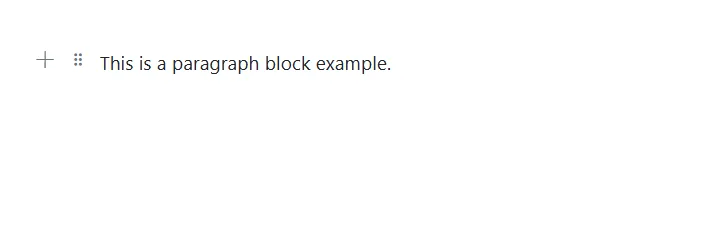
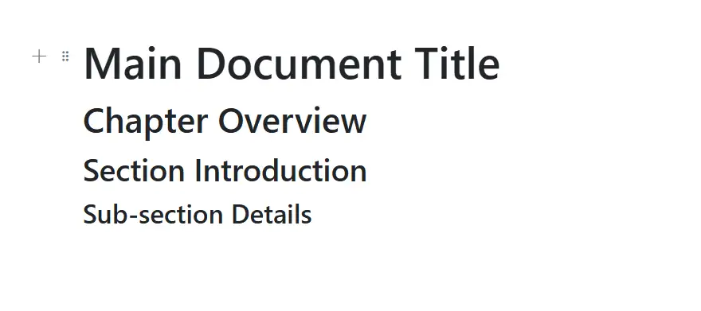
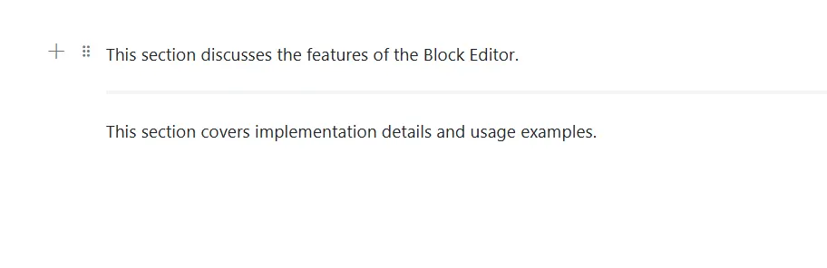

# Typography Blocks in Blazor Block Editor Component

Typography blocks are essential for organizing and presenting text-based content. The Block Editor component supports various structural blocks—such as Paragraph, Heading, Collapsible (CollapsibleParagraph and CollapsibleHeading), Divider, Quote, and Callout—to help you format and structure content effectively.

## Configure paragraph block

Paragraph blocks are the most common type, used for standard text content. They serve as the default block type and provide basic text formatting options. To render a Paragraph block, set the [BlockType](https://help.syncfusion.com/cr/blazor/Syncfusion.Blazor.BlockEditor.BlockType.html) property to [Paragraph](https://help.syncfusion.com/cr/blazor/Syncfusion.Blazor.BlockEditor.BlockType.html#Syncfusion_Blazor_BlockEditor_BlockType_Paragraph).

### BlockType

```cshtml
// Adding paragraph block
    new BlockModel
    {
        BlockType = BlockType.Paragraph,
        Content = {new ContentModel{ContentType = ContentType.Text, Content = "This is a paragraph block example."}}
    }
```

The below sample demonstrates the configuration of paragraph block in the Block Editor.

```cshtml
@using Syncfusion.Blazor.BlockEditor

<SfBlockEditor Blocks="BlockData"></SfBlockEditor>

@code {
    private List<BlockModel> BlockData = new()
    {
        new BlockModel
        {
            BlockType = BlockType.Paragraph,
            Content = new() {new ContentModel{ContentType = ContentType.Text, Content = "This is a paragraph block example."}}
        }
    };
}
```




### Configure placeholder

You can configure placeholder text for block using the [Placeholder](https://help.syncfusion.com/cr/blazor/Syncfusion.Blazor.BlockEditor.ParagraphBlockSettings.html#Syncfusion_Blazor_BlockEditor_ParagraphBlockSettings_Placeholder) property. This text appears when the block is empty. The default placeholder for the paragraph block is `Write something or ‘/’ for commands.`.

### BlockType and Properties

```cshtml
// Adding placeholder
    new BlockModel
    {
        BlockType = BlockType.Paragraph,
        Properties = new ParagraphBlockSettings {Placeholder = "Start typing..."}
    }
```

The below sample demonstrates the configuration of placeholder in the Block Editor for the paragraph block.

```cshtml
@using Syncfusion.Blazor.BlockEditor

<SfBlockEditor Blocks="@BlockData"></SfBlockEditor>

@code {
    private List<BlockModel> BlockData = new()
    {
        new BlockModel
        {
            BlockType = BlockType.Paragraph,
            Content = new() {new ContentModel{ContentType = ContentType.Text, Content = "This is a sample paragraph block."}}
        },
        new BlockModel
        {
            BlockType = BlockType.Paragraph,
            Properties = new ParagraphBlockSettings { Placeholder = "Start typing your notes or press \" /\" for commands..." }
        },
    };
}
```


## Configure heading block

Heading blocks create document titles and section headers. These blocks help structure content hierarchically, making it easier to read and navigate. Render a Heading block by setting the [BlockType](https://help.syncfusion.com/cr/blazor/Syncfusion.Blazor.BlockEditor.BlockType.html) property to [Heading](https://help.syncfusion.com/cr/blazor/Syncfusion.Blazor.BlockEditor.BlockType.html#Syncfusion_Blazor_BlockEditor_BlockType_Heading).

### Configuring levels

Set the heading level using the [Level](https://help.syncfusion.com/cr/blazor/Syncfusion.Blazor.BlockEditor.HeadingBlockSettings.html#Syncfusion_Blazor_BlockEditor_HeadingBlockSettings_Level) property, with `1` being the highest level (title) and `4` being the lowest (subsection).

### BlockType and Properties

```cshtml
//Adding Heading block
    new BlockModel
    {
        BlockType = BlockType.Heading,
        Properties = new HeadingBlockSettings { Level = 1}
    }
```

The following sample demonstrates the configuration of a heading block in the Block Editor.

```cshtml
@using Syncfusion.Blazor.BlockEditor

<SfBlockEditor Blocks="@BlockData"></SfBlockEditor>

@code {
    private List<BlockModel> BlockData = new()
    {
        new BlockModel
        {
            BlockType = BlockType.Heading,
            Properties = new HeadingBlockSettings { Level = 1},
            Content = new() {new ContentModel{ContentType = ContentType.Text, Content = "Main Document Title"}}
        },
        new BlockModel
        {
            BlockType = BlockType.Heading,
            Properties = new HeadingBlockSettings { Level = 2},
            Content = new() {new ContentModel{ContentType = ContentType.Text, Content = "Chapter Overview"}}
        },
        new BlockModel
        {
            BlockType = BlockType.Heading,
            Properties = new HeadingBlockSettings { Level = 3},
            Content = new() {new ContentModel{ContentType = ContentType.Text, Content = "Section Introduction"}}
        },
        new BlockModel
        {
            BlockType = BlockType.Heading,
            Properties = new HeadingBlockSettings { Level = 4},
            Content = new() {new ContentModel{ContentType = ContentType.Text, Content = "Sub-section Details"}}
        },
    };
}
```



### Configure placeholder

You can configure placeholder text for block using the [Placeholder](https://help.syncfusion.com/cr/blazor/Syncfusion.Blazor.BlockEditor.HeadingBlockSettings.html#Syncfusion_Blazor_BlockEditor_HeadingBlockSettings_Placeholder) property. This text appears when the block is empty. The default placeholder for heading block is `Heading{level}`.

```cshtml
//Adding Placeholder value to blocktype
    new BlockModel
    {
        BlockType = BlockType.Heading,
        Properties = new HeadingBlockSettings { Level = 1, Placeholder = "Heading1" }
    }
```


## Configure divider block

A Divider block inserts a horizontal line to separate content. Render it by setting the [BlockType](https://help.syncfusion.com/cr/blazor/Syncfusion.Blazor.BlockEditor.BlockType.html) to [Divider](https://help.syncfusion.com/cr/blazor/Syncfusion.Blazor.BlockEditor.BlockType.html#Syncfusion_Blazor_BlockEditor_BlockType_Divider).

This sample shows how to place a divider between two blocks.

```cshtml
@using Syncfusion.Blazor.BlockEditor

<SfBlockEditor Blocks="@BlockData"></SfBlockEditor>

@code {
    private List<BlockModel> BlockData = new()
    {
        new BlockModel
        {
            BlockType = BlockType.Paragraph,
            Content = new() {new ContentModel{ContentType = ContentType.Text, Content = "This section discusses the features of the Block Editor."}}
        },
        new BlockModel
        {
          BlockType = BlockType.Divider  
        },
        new BlockModel
        {
            BlockType = BlockType.Paragraph,
            Content = new() {new ContentModel{ContentType = ContentType.Text, Content = "This section covers implementation details and usage examples."}}
        }
    };
}
```


