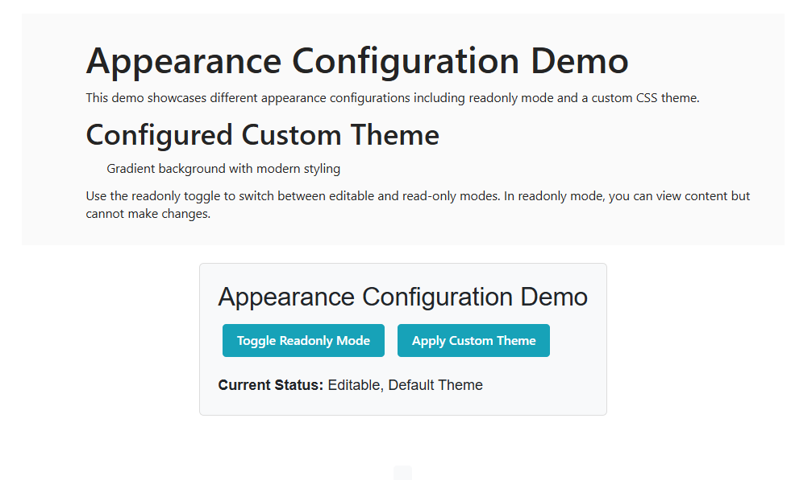
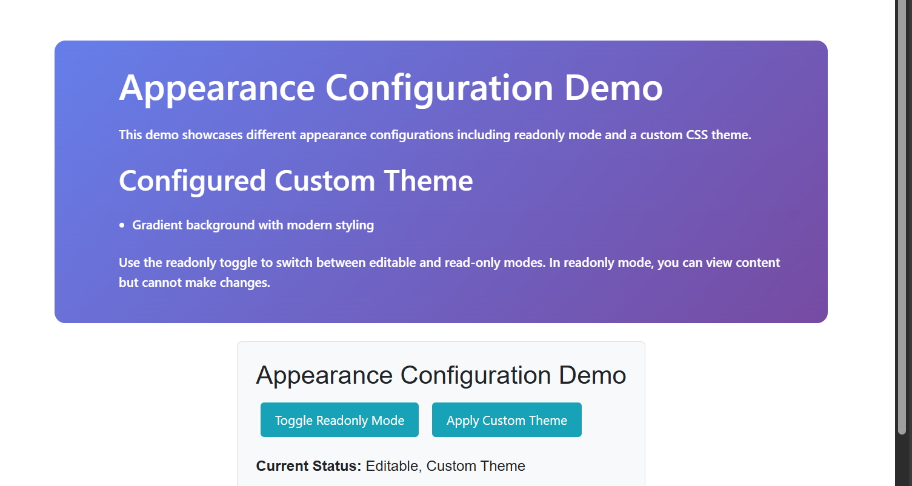

# Appearance in Blazor Block Editor component

The Block Editor component provides several properties to customize its visual appearance, allowing you to control its dimensions, styling, and behavior.

## Setting width and height

You can specify the width and height for the Block Editor component using the `Width` and `Height` properties.

```cshtml

@using Syncfusion.Blazor.BlockEditor;

<SfBlock Editor ID="blockeditor" Width="100%" Height="80vh"></SfBlock Editor>

// Or with specific pixel values
<SfBlock Editor ID="blockeditor" Width="800px" Height="500px"></SfBlock Editor>

```

## Setting readonly mode

You can utilize the `ReadOnly` property to control whether the editor is in read-only mode. When set to `true`, users cannot edit the content but can still view it.

```cshtml

@using Syncfusion.Blazor.BlockEditor;

<SfBlock Editor ID="blockeditor" ReadOnly=true></SfBlock Editor>

```

## Customization using CSS Class

You can use the `CssClass` property to customize the appearance of the Block Editor component.

```cshtml

@using Syncfusion.Blazor.BlockEditor;

<SfBlock Editor ID="blockeditor" Width="600px" Height="400px" CssClass="custom-editor-theme"></SfBlock Editor>

```

The following example demonstrates the usage of `Readonly` and `CssClass` properties of the Block Editor.

```cshtml

@using Syncfusion.Blazor.BlockEditor
@using Syncfusion.Blazor.Buttons

<div id="container">
    <SfBlockEditor @ref="BlockEditorRef"
                   ID="blockeditor"
                   CssClass="@CssClasses"
                   ReadOnly="@IsReadonly"
                   Blocks="@Blocks"
                   Focus="OnEditorFocus"
                   Blur="OnEditorBlur">
    </SfBlockEditor>

    <div id="controls">
        <h3>Appearance Configuration Demo</h3>
        <div class="button-group">
            <SfButton @onclick="ToggleReadonly">Toggle Readonly Mode</SfButton>
            <SfButton @onclick="ApplyCustomTheme">Apply Custom Theme</SfButton>
        </div>

        <div id="statusText" style="margin-top: 10px;">
            <strong>Current Status: </strong>@StatusMessage
        </div>
    </div>

    <div id="output">@OutputMessage</div>
</div>

@code {
    private SfBlockEditor? BlockEditorRef;

    private bool IsReadonly { get; set; } = false;
    private string CurrentTheme { get; set; } = "default";
    private string StatusMessage { get; set; } = "Editable, Default Theme";
    private string OutputMessage { get; set; } = "";
    private string CssClasses => $"{CurrentTheme} {(IsReadonly ? "readonly-mode" : "")}".Trim();
    private List<BlockModel> Blocks => new List<BlockModel>
    {
        new BlockModel
        {
            ID = "title-block",
            BlockType = BlockType.Heading,
            Properties = new HeadingBlockSettings { Level = 1 },
            Content = new List<ContentModel>
            {
                new ContentModel { ContentType = ContentType.Text, Content = "Appearance Configuration Demo" }
            }
        },
        new BlockModel
        {
            ID = "intro-block",
            BlockType = BlockType.Paragraph,
            Content = new List<ContentModel>
            {
                new ContentModel { ContentType = ContentType.Text, Content = "This demo showcases different appearance configurations including readonly mode and a custom CSS theme." }
            }
        },
        new BlockModel
        {
            ID = "features-heading",
            BlockType = BlockType.Heading,
            Properties = new HeadingBlockSettings { Level = 2 },
            Content = new List<ContentModel>
            {
                new ContentModel { ContentType = ContentType.Text, Content = "Configured Custom Theme" }
            }
        },
        new BlockModel
        {
            ID = "theme-list-1",
            BlockType = BlockType.BulletList,
            Content = new List<ContentModel>
            {
                new ContentModel { ContentType = ContentType.Text, Content = "Gradient background with modern styling" }
            }
        },
        new BlockModel
        {
            ID = "readonly-info",
            BlockType = BlockType.Paragraph,
            Content = new List<ContentModel>
            {
                new ContentModel
                {
                    ContentType = ContentType.Text,
                    Content = "Use the readonly toggle to switch between editable and read-only modes. In readonly mode, you can view content but cannot make changes."
                }
            }
        }
    };

    private void ToggleReadonly()
    {
        IsReadonly = !IsReadonly;

        UpdateStatus();
        DisplayOutput($"Readonly mode {(IsReadonly ? "enabled" : "disabled")}. {(IsReadonly ? "Content is now view-only." : "Content is now editable.")}");
    }

    private void ApplyCustomTheme()
    {
        CurrentTheme = "custom-theme";
        UpdateStatus();
        DisplayOutput("Custom theme applied. The editor now features a gradient background with modern styling and hover effects.");
    }

    private void OnEditorFocus()
    {
        DisplayOutput("Editor focused. You can now type or edit content.");
    }

    private void OnEditorBlur()
    {
        DisplayOutput("Editor lost focus.");
    }

    protected override void OnInitialized()
    {
        UpdateStatus();
    }

    private void UpdateStatus()
    {
        string mode = IsReadonly ? "Readonly" : "Editable";
        string theme = CurrentTheme == "default" ? "Default" : "Custom";
        StatusMessage = $"{mode}, {theme} Theme";
    }

    private void DisplayOutput(string msg)
    {
        OutputMessage = msg;
        StateHasChanged();
    }
}

<style>
    #container {
        margin: 50px;
        gap: 20px;
        display: flex;
        flex-direction: column;
        align-items: center;
    }

    #controls {
        margin-bottom: 20px;
        padding: 20px;
        border: 1px solid #ddd;
        border-radius: 5px;
        background-color: #f8f9fa;
    }

    .button-group {
        margin-bottom: 15px;
    }

    .button-group button {
        margin: 5px;
        padding: 8px 16px;
        background-color: #17a2b8;
        color: white;
        border: none;
        border-radius: 4px;
        cursor: pointer;
    }

    .button-group button:hover {
        background-color: #138496;
    }

    .status-info {
        padding: 10px;
        background-color: #d1ecf1;
        border-left: 4px solid #17a2b8;
        border-radius: 4px;
    }

    .status-info p {
        margin: 0;
        color: #0c5460;
    }

    #output {
        margin-top: 15px;
        padding: 10px;
        background-color: #f8f9fa;
        border-radius: 4px;
        min-height: 50px;
        font-family: monospace;
        white-space: pre-wrap;
    }

    /* Custom Theme CSS Class */
    .custom-theme {
        background: linear-gradient(135deg, #667eea 0%, #764ba2 100%);
        border-radius: 12px;
    }

    .custom-theme .e-block {
        border-radius: 8px;
        margin-bottom: 10px;
        backdrop-filter: blur(10px);
    }

    .custom-theme .e-block:hover {
        transform: translateY(-2px);
        transition: all 0.3s ease;
    }

    .custom-theme .e-block-content {
        color: #2d3748;
        font-weight: 500;
    }

    /* Readonly Mode Styling */
    .readonly-mode {
        opacity: 0.8;
        cursor: not-allowed;
    }

    .readonly-mode .e-block-content {
        color: #6c757d;
    }

    .custom-theme.readonly-mode .e-block-content {
        color: #101111;
    }
</style>

```



