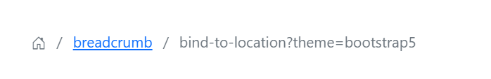

# Getting Started with Blazor Breadcrumb Component

This section explains how to include [Blazor Breadcrumb](https://www.syncfusion.com/blazor-components/blazor-breadcrumb) component in your Blazor WebAssembly App using Visual Studio and Visual Studio Code.

To get started quickly with Blazor Breadcrumb component, check on the following video:







## Prerequisites

* [System requirements for Blazor components](https://blazor.syncfusion.com/documentation/system-requirements)

## Create a new Blazor App in Visual Studio

Create a **Blazor WebAssembly App** using Visual Studio via [Microsoft Templates](https://learn.microsoft.com/en-us/aspnet/core/blazor/tooling?view=aspnetcore-7.0&pivots=vs) or the [Syncfusion<sup style="font-size:70%">&reg;</sup> Blazor Extension](https://blazor.syncfusion.com/documentation/visual-studio-integration/template-studio).

## Install Syncfusion<sup style="font-size:70%">&reg;</sup> Blazor Navigations and Themes NuGet in the App

To add **Blazor Breadcrumb** component in the app, open the NuGet package manager in Visual Studio (*Tools → NuGet Package Manager → Manage NuGet Packages for Solution*), search and install [Syncfusion.Blazor.Navigations](https://www.nuget.org/packages/Syncfusion.Blazor.Navigations/) and [Syncfusion.Blazor.Themes](https://www.nuget.org/packages/Syncfusion.Blazor.Themes/). Alternatively, you can utilize the following package manager command to achieve the same.




Install-Package Syncfusion.Blazor.Navigations -Version {{ site.releaseversion }}
Install-Package Syncfusion.Blazor.Themes -Version {{ site.releaseversion }}




N> Syncfusion<sup style="font-size:70%">&reg;</sup> Blazor components are available in [nuget.org](https://www.nuget.org/packages?q=syncfusion.blazor). Refer to [NuGet packages](https://blazor.syncfusion.com/documentation/nuget-packages) for a detailed list of available packages.





## Prerequisites

* [System requirements for Blazor components](https://blazor.syncfusion.com/documentation/system-requirements)

## Create a new Blazor App in Visual Studio Code

Create a **Blazor WebAssembly App** using Visual Studio Code via [Microsoft Templates](https://learn.microsoft.com/en-us/aspnet/core/blazor/tooling?view=aspnetcore-7.0&pivots=vsc) or the [Syncfusion<sup style="font-size:70%">&reg;</sup> Blazor Extension](https://blazor.syncfusion.com/documentation/visual-studio-code-integration/create-project).

Alternatively, create a WebAssembly application using the following command in the terminal(<kbd>Ctrl</kbd>+<kbd>`</kbd>).





dotnet new blazorwasm -o BlazorApp
cd BlazorApp





## Install Syncfusion<sup style="font-size:70%">&reg;</sup> Blazor Navigations and Themes NuGet in the App

* Press <kbd>Ctrl</kbd>+<kbd>`</kbd> to open the integrated terminal in Visual Studio Code.
* Ensure you’re in the project root directory where your `.csproj` file is located.
* Run the following command to install a [Syncfusion.Blazor.Navigations](https://www.nuget.org/packages/Syncfusion.Blazor.Navigations) and [Syncfusion.Blazor.Themes](https://www.nuget.org/packages/Syncfusion.Blazor.Themes/) NuGet package and ensure all dependencies are installed.





dotnet add package Syncfusion.Blazor.Navigations -v {{ site.releaseversion }}
dotnet add package Syncfusion.Blazor.Themes -v {{ site.releaseversion }}
dotnet restore





N> Syncfusion<sup style="font-size:70%">&reg;</sup> Blazor components are available in [nuget.org](https://www.nuget.org/packages?q=syncfusion.blazor). Refer to [NuGet packages](https://blazor.syncfusion.com/documentation/nuget-packages) for a detailed list of available packages.





## Register Syncfusion<sup style="font-size:70%">&reg;</sup> Blazor Service

Open **~/_Imports.razor** file and import the `Syncfusion.Blazor` and `Syncfusion.Blazor.Navigations` namespace.




@using Syncfusion.Blazor
@using Syncfusion.Blazor.Navigations




Now, register the Syncfusion<sup style="font-size:70%">&reg;</sup> Blazor Service in the **~/Program.cs** file of your Blazor WebAssembly App.




using Microsoft.AspNetCore.Components.Web;
using Microsoft.AspNetCore.Components.WebAssembly.Hosting;
using Syncfusion.Blazor;

var builder = WebAssemblyHostBuilder.CreateDefault(args);
builder.RootComponents.Add<App>("#app");
builder.RootComponents.Add<HeadOutlet>("head::after");

builder.Services.AddScoped(serviceProvider => new HttpClient { BaseAddress = new Uri(builder.HostEnvironment.BaseAddress) });

builder.Services.AddSyncfusionBlazor();
await builder.Build().RunAsync();
....




## Add stylesheet and script resources

The theme stylesheet and script can be accessed from NuGet through [Static Web Assets](https://blazor.syncfusion.com/documentation/appearance/themes#static-web-assets). Include the stylesheet and script references within the `<head>` section of the **~/index.html** file.

```html
<head>
    ....
    <link href="_content/Syncfusion.Blazor.Themes/bootstrap5.css" rel="stylesheet" />
    <script src="_content/Syncfusion.Blazor.Core/scripts/syncfusion-blazor.min.js" type="text/javascript"></script>
</head>
```
N> Check out the [Blazor Themes](https://blazor.syncfusion.com/documentation/appearance/themes) topic to discover various methods ([Static Web Assets](https://blazor.syncfusion.com/documentation/appearance/themes#static-web-assets), [CDN](https://blazor.syncfusion.com/documentation/appearance/themes#cdn-reference), and [CRG](https://blazor.syncfusion.com/documentation/common/custom-resource-generator)) for referencing themes in your Blazor application. Also, check out the [Adding Script Reference](https://blazor.syncfusion.com/documentation/common/adding-script-references) topic to learn different approaches for adding script references in your Blazor application.

## Add Syncfusion<sup style="font-size:70%">&reg;</sup> Blazor Breadcrumb component


Add the Syncfusion<sup style="font-size:70%">&reg;</sup> Blazor Breadcrumb component in the **~/Pages/Index.razor** file.




<SfBreadcrumb></SfBreadcrumb>




* Press F5 to run the application. Then, the Syncfusion<sup style="font-size:70%">&reg;</sup> Blazor Breadcrumb component will be rendered in the default web browser.





N> The Breadcrumb component will render based on the current URL, when the Breadcrumb items are not specified.

## Add items to the Blazor Breadcrumb component

To render Breadcrumb component with items use [BreadcrumbItem](https://help.syncfusion.com/cr/blazor/Syncfusion.Blazor.Navigations.BreadcrumbItem.html) tag directive as like below code example.




@using Syncfusion.Blazor.Navigations

<SfBreadcrumb>
    <BreadcrumbItems>
        <BreadcrumbItem IconCss="e-icons e-home" Url="https://blazor.syncfusion.com/demos/"/>
        <BreadcrumbItem Text="Components" Url="https://blazor.syncfusion.com/demos/datagrid/overview"/>
        <BreadcrumbItem Text="Navigations" Url="https://blazor.syncfusion.com/demos/menu-bar/default-functionalities"/>
        <BreadcrumbItem Text="Breadcrumb" Url="./breadcrumb/default-functionalities"/>
    </BreadcrumbItems>
</SfBreadcrumb>



N> Place list of [BreadcrumbItem](https://help.syncfusion.com/cr/blazor/Syncfusion.Blazor.Navigations.BreadcrumbItem.html) within [BreadcrumbItems](https://help.syncfusion.com/cr/blazor/Syncfusion.Blazor.Navigations.BreadcrumbItems.html) tag directive.



## Enable or disable navigation

Breadcrumb component enables or disables built-in URL navigation based on the [EnableNavigation](https://help.syncfusion.com/cr/blazor/Syncfusion.Blazor.Navigations.SfBreadcrumb.html#Syncfusion_Blazor_Navigations_SfBreadcrumb_EnableNavigation) property. By default, the navigation will be enabled when setting the [Url](https://help.syncfusion.com/cr/blazor/Syncfusion.Blazor.Navigations.SfBreadcrumb.html#Syncfusion_Blazor_Navigations_SfBreadcrumb_Url) property. To prevent Breadcrumb item navigation, set the [EnableNavigation](https://help.syncfusion.com/cr/blazor/Syncfusion.Blazor.Navigations.SfBreadcrumb.html#Syncfusion_Blazor_Navigations_SfBreadcrumb_EnableNavigation) property as `false` in Breadcrumb.

N> [View Sample in GitHub](https://github.com/SyncfusionExamples/Blazor-Getting-Started-Examples/tree/main/Breadcrumb)

## See also

* [Getting Started with Syncfusion<sup style="font-size:70%">&reg;</sup> Blazor for client side in .NET Core CLI](https://blazor.syncfusion.com/documentation/getting-started/blazor-webassembly-app)
* [Getting Started with Syncfusion<sup style="font-size:70%">&reg;</sup> Blazor for server side in Visual Studio](https://blazor.syncfusion.com/documentation/getting-started/blazor-server-side-visual-studio)
* [Getting Started with Syncfusion<sup style="font-size:70%">&reg;</sup> Blazor for server side in .NET Core CLI](https://blazor.syncfusion.com/documentation/getting-started/blazor-web-app)

N> Explore our [Blazor Breadcrumb example](https://blazor.syncfusion.com/demos/breadcrumb/default-functionalities?theme=bootstrap5) that shows you how to render and configure the breadcrumb.
