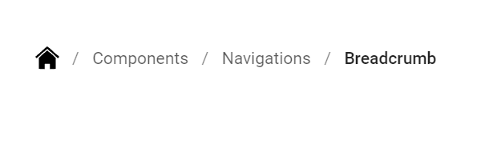

# Icons in Blazor Breadcrumb Component

The [Blazor Breadcrumb](https://www.syncfusion.com/blazor-components/blazor-breadcrumb) component contains an icon, image, and SVG to provide a visual representation of an item.

## Breadcrumb with font icon

To place the font icon on the Breadcrumb item, set the [IconCss](https://help.syncfusion.com/cr/blazor/Syncfusion.Blazor.Navigations.BreadcrumbItem.html#Syncfusion_Blazor_Navigations_BreadcrumbItem_IconCss) property to `e-icons` with the required icon's class name.

```cshtml
@using Syncfusion.Blazor.Navigations

<SfBreadcrumb>
    <BreadcrumbItems>
        <BreadcrumbItem IconCss="e-icons e-home" Url="https://blazor.syncfusion.com/demos/"></BreadcrumbItem>
        <BreadcrumbItem Text="Components" Url="https://blazor.syncfusion.com/demos/datagrid/overview"></BreadcrumbItem>
        <BreadcrumbItem Text="Navigations" Url="https://blazor.syncfusion.com/demos/menu-bar/default-functionalities"></BreadcrumbItem>
        <BreadcrumbItem Text="Breadcrumb" Url="./breadcrumb/default-functionalities"></BreadcrumbItem>
    </BreadcrumbItems>
</SfBreadcrumb>
```



N> By default, the icon is positioned to the left side of the item.

## Breadcrumb with image

In the Breadcrumb component, you can add images to the items using [IconCss](https://help.syncfusion.com/cr/blazor/Syncfusion.Blazor.Navigations.BreadcrumbItem.html#Syncfusion_Blazor_Navigations_BreadcrumbItem_IconCss) property. In the following example, an image is added to the Breadcrumb item with height and width by using `e-image-home` class.

```cshtml
@using Syncfusion.Blazor.Navigations

<SfBreadcrumb>
    <BreadcrumbItems>
        <BreadcrumbItem IconCss="e-image-home" Url="https://blazor.syncfusion.com/demos/"></BreadcrumbItem>
        <BreadcrumbItem Text="Components" Url="https://blazor.syncfusion.com/demos/datagrid/overview"></BreadcrumbItem>
        <BreadcrumbItem Text="Navigations" Url="https://blazor.syncfusion.com/demos/menu-bar/default-functionalities"></BreadcrumbItem>
        <BreadcrumbItem Text="Breadcrumb" Url="./breadcrumb/default-functionalities"></BreadcrumbItem>
    </BreadcrumbItems>
</SfBreadcrumb>

<style>
    .e-image-home {
        background-image: url(/home.png);
        height: 20px;
        width: 20px;
    }
</style>
```



## Breadcrumb with SVG image

In the Breadcrumb component, SVG image can be added for the items using the [IconCss](https://help.syncfusion.com/cr/blazor/Syncfusion.Blazor.Navigations.BreadcrumbItem.html#Syncfusion_Blazor_Navigations_BreadcrumbItem_IconCss) property. In the following example, SVG image is added to the Breadcrumb item with height and width by using `e-svg-home` class.

```cshtml
@using Syncfusion.Blazor.Navigations

<SfBreadcrumb>
    <BreadcrumbItems>
        <BreadcrumbItem IconCss="e-svg-home" Url="https://blazor.syncfusion.com/demos/"></BreadcrumbItem>
        <BreadcrumbItem Text="Components" Url="https://blazor.syncfusion.com/demos/datagrid/overview"></BreadcrumbItem>
        <BreadcrumbItem Text="Navigations" Url="https://blazor.syncfusion.com/demos/menu-bar/default-functionalities"></BreadcrumbItem>
        <BreadcrumbItem Text="Breadcrumb" Url="./breadcrumb/default-functionalities"></BreadcrumbItem>
    </BreadcrumbItems>
</SfBreadcrumb>

<style>
    .e-svg-home {
        background-image: url('/home.svg');
        height: 20px;
        width: 20px;
    }
</style>
```




## Icon only

Use [IconCss](https://help.syncfusion.com/cr/blazor/Syncfusion.Blazor.Navigations.BreadcrumbItem.html#Syncfusion_Blazor_Navigations_BreadcrumbItem_IconCss) property to display icon for an item. 

In the following example, Breadcrumb items are demonstrated with only icons by providing the [IconCss](https://help.syncfusion.com/cr/blazor/Syncfusion.Blazor.Navigations.BreadcrumbItem.html#Syncfusion_Blazor_Navigations_BreadcrumbItem_IconCss) property.

```cshtml
@using Syncfusion.Blazor.Navigations

<SfBreadcrumb>
    <BreadcrumbItems>
        <BreadcrumbItem IconCss="e-icons e-home"></BreadcrumbItem>
        <BreadcrumbItem IconCss="e-icons e-folder-open"></BreadcrumbItem>
        <BreadcrumbItem IconCss="e-icons e-file-new"></BreadcrumbItem>
    </BreadcrumbItems>
</SfBreadcrumb>
```



## Show icon only for first item

To show icon only for the first item in the Breadcrumb component, add icons to the first item using the [IconCss](https://help.syncfusion.com/cr/blazor/Syncfusion.Blazor.Navigations.BreadcrumbItem.html#Syncfusion_Blazor_Navigations_BreadcrumbItem_IconCss) property. In the following example, the icon is provided only for the first item by setting the [IconCss](https://help.syncfusion.com/cr/blazor/Syncfusion.Blazor.Navigations.BreadcrumbItem.html#Syncfusion_Blazor_Navigations_BreadcrumbItem_IconCss) property.

```cshtml
@using Syncfusion.Blazor.Navigations

<SfBreadcrumb>
    <BreadcrumbItems>
        <BreadcrumbItem IconCss="e-icons e-home" Url="https://blazor.syncfusion.com/demos/"></BreadcrumbItem>
        <BreadcrumbItem Text="Components" Url="https://blazor.syncfusion.com/demos/datagrid/overview"></BreadcrumbItem>
        <BreadcrumbItem Text="Navigations" Url="https://blazor.syncfusion.com/demos/menu-bar/default-functionalities"></BreadcrumbItem>
        <BreadcrumbItem Text="Breadcrumb" Url="./breadcrumb/default-functionalities"></BreadcrumbItem>
    </BreadcrumbItems>
</SfBreadcrumb>
```


