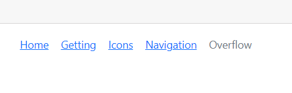

# Overflow Mode in Blazor Breadcrumb Component

In the Breadcrumb component, [MaxItems](https://help.syncfusion.com/cr/blazor/Syncfusion.Blazor.Navigations.SfBreadcrumb.html#Syncfusion_Blazor_Navigations_SfBreadcrumb_MaxItems) and [OverflowMode](https://help.syncfusion.com/cr/blazor/Syncfusion.Blazor.Navigations.SfBreadcrumb.html#Syncfusion_Blazor_Navigations_SfBreadcrumb_OverflowMode) properties were used to limit the number of Breadcrumb items to be displayed.

In the following example, the [MaxItems](https://help.syncfusion.com/cr/blazor/Syncfusion.Blazor.Navigations.SfBreadcrumb.html#Syncfusion_Blazor_Navigations_SfBreadcrumb_MaxItems) is set as 3 with [OverflowMode](https://help.syncfusion.com/cr/blazor/Syncfusion.Blazor.Navigations.SfBreadcrumb.html#Syncfusion_Blazor_Navigations_SfBreadcrumb_OverflowMode) as [Default](https://help.syncfusion.com/cr/blazor/Syncfusion.Blazor.Navigations.BreadcrumbOverflowMode.html#Syncfusion_Blazor_Navigations_BreadcrumbOverflowMode_Default). To prevent Breadcrumb item navigation, the [EnableNavigation](https://help.syncfusion.com/cr/blazor/Syncfusion.Blazor.Navigations.SfBreadcrumb.html#Syncfusion_Blazor_Navigations_SfBreadcrumb_EnableNavigation) property is set as `false`.

```cshtml
@using Syncfusion.Blazor.Navigations

<SfBreadcrumb MaxItems="3" EnableNavigation="false">
    <BreadcrumbItems>
        <BreadcrumbItem Text="Home" Url="https://blazor.syncfusion.com/documentation/breadcrumb/introduction"></BreadcrumbItem>
        <BreadcrumbItem Text="Getting" Url="https://blazor.syncfusion.com/documentation/breadcrumb/getting-started"></BreadcrumbItem>
        <BreadcrumbItem Text="Icons" Url="https://blazor.syncfusion.com/documentation/breadcrumb/icons"></BreadcrumbItem>
        <BreadcrumbItem Text="Navigation" Url="https://blazor.syncfusion.com/documentation/breadcrumb/navigation"></BreadcrumbItem>
        <BreadcrumbItem Text="Overflow" Url="https://blazor.syncfusion.com/documentation/breadcrumb/overflow"></BreadcrumbItem>
    </BreadcrumbItems>
    <BreadcrumbTemplates>
        <SeparatorTemplate>
            <span class="e-icons e-arrow"></span>
        </SeparatorTemplate>
    </BreadcrumbTemplates>
</SfBreadcrumb>

<style>
    @@font-face {
        font-family: 'e-bicons';
        src: url(data:application/x-font-ttf;charset=utf-8;base64,AAEAAAAKAIAAAwAgT1MvMj1wSfkAAAEoAAAAVmNtYXDnHOdpAAABmAAAAD5nbHlmSRvkRAAAAegAAANoaGVhZB2Xb78AAADQAAAANmhoZWEIUQQHAAAArAAAACRobXR4GAAAAAAAAYAAAAAYbG9jYQSCAv4AAAHYAAAADm1heHABFwEfAAABCAAAACBuYW1lXj/4/wAABVAAAAIlcG9zdE4LDloAAAd4AAAAegABAAAEAAAAAFwEAAAAAAAD9AABAAAAAAAAAAAAAAAAAAAABgABAAAAAQAA6q1k4F8PPPUACwQAAAAAAN1ClWcAAAAA3UKVZwAAAAAD9AP0AAAACAACAAAAAAAAAAEAAAAGARMABwAAAAAAAgAAAAoACgAAAP8AAAAAAAAAAQQAAZAABQAAAokCzAAAAI8CiQLMAAAB6wAyAQgAAAIABQMAAAAAAAAAAAAAAAAAAAAAAAAAAAAAUGZFZABA5wPnBwQAAAAAXAQAAAAAAAABAAAAAAAABAAAAAQAAAAEAAAABAAAAAQAAAAEAAAAAAAAAgAAAAMAAAAUAAMAAQAAABQABAAqAAAABAAEAAEAAOcH//8AAOcD//8AAAABAAQAAAABAAIABQADAAQAAAAAAAABTgFqAYABlAG0AAAABwAAAAADdwP0AB8AXwCfAOMA5gDsARIAAAEVDwUrAS8FPQE/BTsBHwUHFR8OPw8vDisBDw0XDw8jLw4/Dx8OJxUPAycHFw8EJwcfBAcXNx8EBxc3HwE/Ahc3Jz8DFzcnPwUnBy8DNycHLwQ1JyM/ASERIREzJREVHwgzITM/CDURNS8IIyECGAICAwQEBAUFBQQDAwMBAQMDAwQFBQUEBAQDAgJvAgIDAwUFBQcGBwgICAkJCQgJCAcHBwYGBQQEAwIBAQEBAgMEBAUGBgcHBwgJCAkJCQgICAcGBwUFBQMDAgLeAQIDBQUHCAkJCwsMDA0NDg4ODQwMCwoKCQgGBgUDAgEBAgMFBgYICQoKCwwMDQ4ODg0NDAwLCwkJCAcFBQMCohYTEhIiKyIOBQoIBDQJNAEDBQYvHDANDg8IDBQ0FBQUDw8IFDQTEg8NEDAcLwUFBAEBNAo0BwgKECIqIg0RERMLuHFxPgGW/ZDa/ucBAgUGCQoLBgYHAnAHBgYLCgkGBQIBAQIFBgkKCwYGB/4+AaIFBAQEAwICAgIDBAQEBQUFBAMDAwEBAwMDBAUFCQgJCAcHBwYGBQQEAwIBAQEBAgMEBAUGBgcHBwgJCAkJCQgICAcGBwUFBQMDAgICAgMDBQUFBwYHCAgICQkODQ0MDAsLCQkIBwYEAwIBAwMEBgcICAoLCwwMDQ0ODg0NDQwLCgoJBwcGBAQCAQECAwUGBwcJCgoLDA0NDew2BQUICikkKRIIERILCTcKGBQTEhwwHA8MDAUGOBM4AwEBAQI4EzcLCwwRHTEcDRETEw0JOAkUEBAUKSQpBwgGBQI2fHEt/JQCkC39QwYGBgsKCQYFAgEBAgUGCQoLBgYGA2wGBgYLCgkGBQIBAAACAAAAAAPzA0wAAwALAAA3IRMhAzMTITUhJyFSAuq4/QPrDrgCaf4uOv7dtAG9/kMB8Sh/AAAAAAEAAAAAAxcD9AAFAAATCQEXCQHpAcn+NzMB+/4FA8H+P/4/MwH0AfQAAAAAAQAAAAAD9AOAAAUAAAEnBwkBJwFZ52YBTQKbZwFM52b+sgKbZwAAAAIAAAAAA/QDngAIAA4AABMRMzUhFTMRJQUVCQE1AYzuAQnx/pL+BgH6Ae7+EgHT/o/09AFx84NwAVv+rnEBUQAAABIA3gABAAAAAAAAAAEAAAABAAAAAAABAAcAAQABAAAAAAACAAcACAABAAAAAAADAAcADwABAAAAAAAEAAcAFgABAAAAAAAFAAsAHQABAAAAAAAGAAcAKAABAAAAAAAKACwALwABAAAAAAALABIAWwADAAEECQAAAAIAbQADAAEECQABAA4AbwADAAEECQACAA4AfQADAAEECQADAA4AiwADAAEECQAEAA4AmQADAAEECQAFABYApwADAAEECQAGAA4AvQADAAEECQAKAFgAywADAAEECQALACQBIyBlLWJjb25zUmVndWxhcmUtYmNvbnNlLWJjb25zVmVyc2lvbiAxLjBlLWJjb25zRm9udCBnZW5lcmF0ZWQgdXNpbmcgU3luY2Z1c2lvbiBNZXRybyBTdHVkaW93d3cuc3luY2Z1c2lvbi5jb20AIABlAC0AYgBjAG8AbgBzAFIAZQBnAHUAbABhAHIAZQAtAGIAYwBvAG4AcwBlAC0AYgBjAG8AbgBzAFYAZQByAHMAaQBvAG4AIAAxAC4AMABlAC0AYgBjAG8AbgBzAEYAbwBuAHQAIABnAGUAbgBlAHIAYQB0AGUAZAAgAHUAcwBpAG4AZwAgAFMAeQBuAGMAZgB1AHMAaQBvAG4AIABNAGUAdAByAG8AIABTAHQAdQBkAGkAbwB3AHcAdwAuAHMAeQBuAGMAZgB1AHMAaQBvAG4ALgBjAG8AbQAAAAACAAAAAAAAAAoAAAAAAAAAAAAAAAAAAAAAAAAAAAAAAAYBAgEDAQQBBQEGAQcAE2RvY3VtZW50LXNldHRpbmctd2YOZm9sZGVyLW9wZW4tMDERY2hldnJvbi1yaWdodF8wMy0KY2hlY2stbWFyawhob3VzZS0wNAAAAAA=) format('truetype');
        font-weight: normal;
        font-style: normal;
    }

    .e-bicons {
        font-family: 'e-bicons' !important;
        font-size: 14px;
    }

    .e-breadcrumb .e-breadcrumb-separator + .e-breadcrumb-separator {
        padding-left: 0;
        margin-left: -8px;
    }

    .e-bicons.e-arrow {
        margin-top: -2px;
    }

    .e-arrow:before {
        content: "\e706";
        font-weight: 800;
        font-size: 9px;
    }
</style>
```


The following overflow modes are available in the Breadcrumb component.

* Collapsed
* Menu
* Wrap
* Scroll
* Hidden
* None

## Collapsed

Collapsed mode shows the first and last Breadcrumb items and hides the remaining items with a collapsed icon. When the collapsed icon is clicked, all items become visible and navigable.

```cshtml
@using Syncfusion.Blazor.Navigations

<SfBreadcrumb MaxItems="3" EnableNavigation="false" OverflowMode="BreadcrumbOverflowMode.Collapsed">
    <BreadcrumbItems>
        <BreadcrumbItem Text="Home" Url="https://blazor.syncfusion.com/documentation/breadcrumb/introduction"></BreadcrumbItem>
        <BreadcrumbItem Text="Getting" Url="https://blazor.syncfusion.com/documentation/breadcrumb/getting-started"></BreadcrumbItem>
        <BreadcrumbItem Text="Icons" Url="https://blazor.syncfusion.com/documentation/breadcrumb/icons"></BreadcrumbItem>
        <BreadcrumbItem Text="Navigation" Url="https://blazor.syncfusion.com/documentation/breadcrumb/navigation"></BreadcrumbItem>
        <BreadcrumbItem Text="Overflow" Url="https://blazor.syncfusion.com/documentation/breadcrumb/overflow"></BreadcrumbItem>
    </BreadcrumbItems>
    <BreadcrumbTemplates>
        <SeparatorTemplate>
            <span class="e-icons e-arrow"></span>
        </SeparatorTemplate>
    </BreadcrumbTemplates>
</SfBreadcrumb>
```


## Menu

Menu mode shows the number of Breadcrumb items that can be accommodated within the container space and creates a submenu with the remaining items.

```cshtml
@using Syncfusion.Blazor.Navigations

<SfBreadcrumb MaxItems="3" EnableNavigation="false" OverflowMode="BreadcrumbOverflowMode.Menu">
    <BreadcrumbItems>
        <BreadcrumbItem Text="Home" Url="https://blazor.syncfusion.com/documentation/breadcrumb/introduction"></BreadcrumbItem>
        <BreadcrumbItem Text="Getting" Url="https://blazor.syncfusion.com/documentation/breadcrumb/getting-started"></BreadcrumbItem>
        <BreadcrumbItem Text="Icons" Url="https://blazor.syncfusion.com/documentation/breadcrumb/icons"></BreadcrumbItem>
        <BreadcrumbItem Text="Navigation" Url="https://blazor.syncfusion.com/documentation/breadcrumb/navigation"></BreadcrumbItem>
        <BreadcrumbItem Text="Overflow" Url="https://blazor.syncfusion.com/documentation/breadcrumb/overflow"></BreadcrumbItem>
    </BreadcrumbItems>
    <BreadcrumbTemplates>
        <SeparatorTemplate>
            <span class="e-icons e-arrow"></span>
        </SeparatorTemplate>
    </BreadcrumbTemplates>
</SfBreadcrumb>
```


## Wrap

Wrap mode wraps the items to multiple lines when the Breadcrumb’s width exceeds the container space.

```cshtml
@using Syncfusion.Blazor.Navigations

<SfBreadcrumb MaxItems="3" EnableNavigation="false" OverflowMode="BreadcrumbOverflowMode.Wrap">
    <BreadcrumbItems>
        <BreadcrumbItem Text="Home" Url="https://blazor.syncfusion.com/documentation/breadcrumb/introduction"></BreadcrumbItem>
        <BreadcrumbItem Text="Getting" Url="https://blazor.syncfusion.com/documentation/breadcrumb/getting-started"></BreadcrumbItem>
        <BreadcrumbItem Text="Icons" Url="https://blazor.syncfusion.com/documentation/breadcrumb/icons"></BreadcrumbItem>
        <BreadcrumbItem Text="Navigation" Url="https://blazor.syncfusion.com/documentation/breadcrumb/navigation"></BreadcrumbItem>
        <BreadcrumbItem Text="Overflow" Url="https://blazor.syncfusion.com/documentation/breadcrumb/overflow"></BreadcrumbItem>
    </BreadcrumbItems>
    <BreadcrumbTemplates>
        <SeparatorTemplate>
            <span class="e-icons e-arrow"></span>
        </SeparatorTemplate>
    </BreadcrumbTemplates>
</SfBreadcrumb>
```


## Scroll

Scroll mode shows an HTML scroll bar when the Breadcrumb’s width exceeds the container space.

```cshtml
@using Syncfusion.Blazor.Navigations

<SfBreadcrumb MaxItems="3" EnableNavigation="false" OverflowMode="BreadcrumbOverflowMode.Scroll">
    <BreadcrumbItems>
        <BreadcrumbItem Text="Home" Url="https://blazor.syncfusion.com/documentation/breadcrumb/introduction"></BreadcrumbItem>
        <BreadcrumbItem Text="Getting" Url="https://blazor.syncfusion.com/documentation/breadcrumb/getting-started"></BreadcrumbItem>
        <BreadcrumbItem Text="Icons" Url="https://blazor.syncfusion.com/documentation/breadcrumb/icons"></BreadcrumbItem>
        <BreadcrumbItem Text="Navigation" Url="https://blazor.syncfusion.com/documentation/breadcrumb/navigation"></BreadcrumbItem>
        <BreadcrumbItem Text="Overflow" Url="https://blazor.syncfusion.com/documentation/breadcrumb/overflow"></BreadcrumbItem>
        <BreadcrumbItem Text="Overflow1" Url="https://blazor.syncfusion.com/documentation/breadcrumb/overflow"></BreadcrumbItem>
        <BreadcrumbItem Text="Overflow2" Url="https://blazor.syncfusion.com/documentation/breadcrumb/overflow"></BreadcrumbItem>
    </BreadcrumbItems>
    <BreadcrumbTemplates>
        <SeparatorTemplate>
            <span class="e-icons e-arrow"></span>
        </SeparatorTemplate>
    </BreadcrumbTemplates>
</SfBreadcrumb>
```


## Hidden

Hidden mode shows the maximum number of items possible in the container space and hides the remaining items. Clicking on a previous item will make the hidden item visible.

```cshtml
@using Syncfusion.Blazor.Navigations

<SfBreadcrumb MaxItems="3" EnableNavigation="false" OverflowMode="BreadcrumbOverflowMode.Hidden">
    <BreadcrumbItems>
        <BreadcrumbItem Text="Home" Url="https://blazor.syncfusion.com/documentation/breadcrumb/introduction"></BreadcrumbItem>
        <BreadcrumbItem Text="Getting" Url="https://blazor.syncfusion.com/documentation/breadcrumb/getting-started"></BreadcrumbItem>
        <BreadcrumbItem Text="Icons" Url="https://blazor.syncfusion.com/documentation/breadcrumb/icons"></BreadcrumbItem>
        <BreadcrumbItem Text="Navigation" Url="https://blazor.syncfusion.com/documentation/breadcrumb/navigation"></BreadcrumbItem>
        <BreadcrumbItem Text="Overflow" Url="https://blazor.syncfusion.com/documentation/breadcrumb/overflow"></BreadcrumbItem>
    </BreadcrumbItems>
    <BreadcrumbTemplates>
        <SeparatorTemplate>
            <span class="e-icons e-arrow"></span>
        </SeparatorTemplate>
    </BreadcrumbTemplates>
</SfBreadcrumb>
```



## None

None mode shows all the items on a single line.